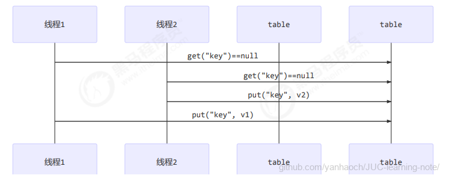
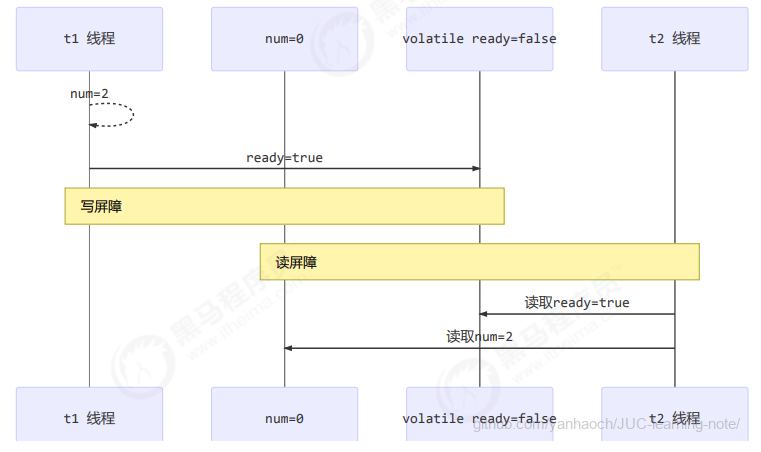
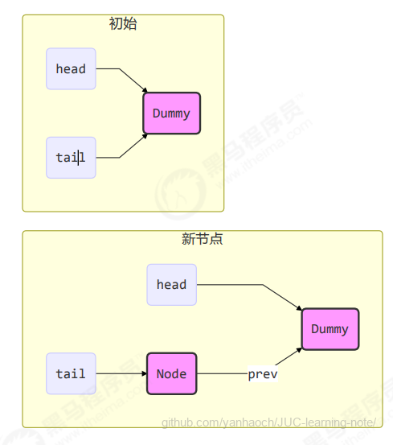
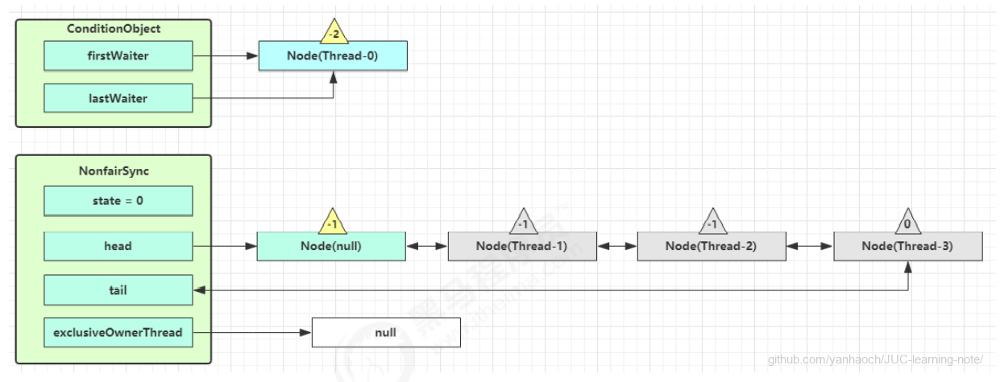
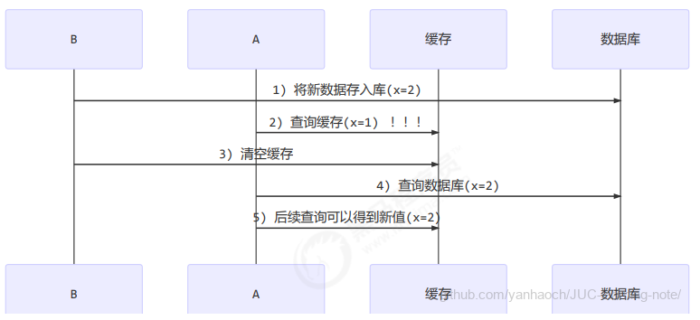
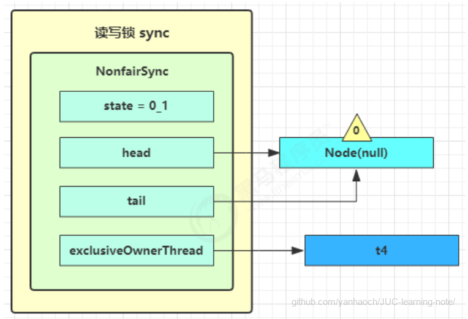

1.准备

pom.xml 依赖如下：

```xml
<properties>
    <project.build.sourceEncoding>UTF-8</project.build.sourceEncoding>
      <maven.compiler.source>1.8</maven.compiler.source>
      <maven.compiler.target>1.8</maven.compiler.target>
  </properties>

  <dependencies>
    <dependency>
      <groupId>junit</groupId>
      <artifactId>junit</artifactId>
      <version>4.11</version>
      <scope>test</scope>
    </dependency>
    <!-- https://mvnrepository.com/artifact/org.projectlombok/lombok -->
    <dependency>
      <groupId>org.projectlombok</groupId>
      <artifactId>lombok</artifactId>
      <version>1.18.22</version>
      <scope>provided</scope>
    </dependency>
    <dependency>
      <groupId>org.slf4j</groupId>
      <artifactId>slf4j-api</artifactId>
      <version>1.7.22</version>
    </dependency>
    <dependency>
      <groupId>ch.qos.logback</groupId>
      <artifactId>logback-classic</artifactId>
      <version>1.2.3</version>
    </dependency>
    <dependency>
      <groupId>org.junit.jupiter</groupId>
      <artifactId>junit-jupiter</artifactId>
      <version>RELEASE</version>
      <scope>compile</scope>
    </dependency>
  </dependencies>
```

logback.xml 配置如下：

```xml
<?xml version="1.0" encoding="UTF-8"?>
<configuration scan="true">
    <appender name="STDOUT" class="ch.qos.logback.core.ConsoleAppender">
        <encoder>
            <pattern>%date{HH:mm:ss} [%t] %logger - %m%n</pattern>
        </encoder>
    </appender>
    <logger name="c" level="debug" additivity="false">
        <appender-ref ref="STDOUT"/>
    </logger>
    <root level="ERROR">
        <appender-ref ref="STDOUT"/>
    </root>
</configuration>
```

# 2.进程与线程

## 2.1 进程与线程

### 进程 

- 程序由指令和数据组成，但这些指令要运行，数据要读写，就必须将指令加载至 CPU，数据加载至内存。在 指令运行过程中还需要用到磁盘、网络等设备。进程就是用来加载指令、管理内存、管理 IO 的 。
- 当一个程序被运行，从磁盘加载这个程序的代码至内存，这时就开启了一个进程。 
- 进程就可以视为程序的一个实例。大部分程序可以同时运行多个实例进程（例如记事本、画图、浏览器 等），也有的程序只能启动一个实例进程（例如网易云音乐、360 安全卫士等）

### 线程 

- 一个进程之内可以分为一到多个线程。 


- 一个线程就是一个指令流，将指令流中的一条条指令以一定的顺序交给 CPU 执行 


- Java 中，线程作为最小调度单位，进程作为资源分配的最小单位。 在 windows 中进程是不活动的，只是作 为线程的容器


### 二者对比 

- 进程基本上相互独立的，而线程存在于进程内，是进程的一个子集 


- 进程拥有共享的资源，如内存空间等，供其内部的线程共享 


- 进程间通信较为复杂 
  - 同一台计算机的进程通信称为 IPC（Inter-process communication） 
  - 不同计算机之间的进程通信，需要通过网络，并遵守共同的协议，例如 HTTP 

- 线程通信相对简单，因为它们共享进程内的内存，一个例子是多个线程可以访问同一个共享变量 


- 线程更轻量，线程上下文切换成本一般上要比进程上下文切换低


## 2.2 并行与并发

单核cpu下，线程实际还是**串行执行**的。操作系统中有一个组件叫做任务调度器，将 cpu 的时间片（windows 下时间片最小约为 15 毫秒）分给不同的程序使用，只是由于 cpu 在线程间（时间片很短）的切换非常快，人类感觉是同时运行的 。总结为一句话就是： **微观串行，宏观并行** 。 

一般会将这种线程轮流使用 CPU 的做法称为并发， concurrent

| CPU  | 时间片 1 | 时间片 2 | 时间片 3 | 时间片 4 |
| :--: | :------: | :------: | :------: | :------: |
| core |  线程 1  |  线程 2  |  线程 3  |  线程 4  |

多核 cpu下，每个 核（core） 都可以调度运行线程，这时候线程可以是并行的。

|  CPU  | 时间片 1 | 时间片 2 | 时间片 3 | 时间片 4 |
| :---: | :------: | :------: | :------: | :------: |
| core1 |  线程 1  |  线程 2  |  线程 3  |  线程 4  |
| core2 |  线程 4  |  线程 4  |  线程 2  |  线程 2  |

引用 Rob Pike 的一段描述： 

​	并发（concurrent）是同一时间应对（dealing with）多件事情的能力 。

​	并行（parallel）是同一时间动手做（doing）多件事情的能力。


## 2.3 应用 

### $\textcolor{Green}{*应用之异步调用（案例1）} $

#### 需要等待结果 

这时既可以使用同步处理，也可以使用异步来处理

join 实现（同步）

```java
static int result = 0;
private static void test1() throws InterruptedException {
    log.debug("开始");
    Thread t1 = new Thread(() -> {
        log.debug("开始");
        sleep(1);
        log.debug("结束");
        result = 10;
    }, "t1");
    t1.start();
    t1.join();
    log.debug("结果为:{}", result);
}
```

输出

```sh
20:30:40.453 [main] c.TestJoin - 开始
20:30:40.541 [Thread-0] c.TestJoin - 开始
20:30:41.543 [Thread-0] c.TestJoin - 结束
20:30:41.551 [main] c.TestJoin - 结果为:10
```

评价 

- 需要外部共享变量，不符合面向对象封装的思想 
- 必须等待线程结束，不能配合线程池使用


##### Future 实现（同步）

```java
private static void test2() throws InterruptedException, ExecutionException {
    log.debug("开始");
    FutureTask<Integer> result = new FutureTask<>(() -> {
        log.debug("开始");
        sleep(1);
        log.debug("结束");
        return 10;
    });
    new Thread(result, "t1").start();
    log.debug("结果为:{}", result.get());
}
```

输出

```sh
10:11:57.880 c.TestSync [main] - 开始
10:11:57.942 c.TestSync [t1] - 开始
10:11:58.943 c.TestSync [t1] - 结束
10:11:58.943 c.TestSync [main] - 结果为:10
```

评价 

- 规避了使用 join 之前的缺点 
- 可以方便配合线程池使用

```java
private static void test3() throws InterruptedException, ExecutionException {
    ExecutorService service = Executors.newFixedThreadPool(1);
    log.debug("开始");
    Future<Integer> result = service.submit(() -> {
        log.debug("开始");
        sleep(1);
        log.debug("结束");
        return 10;
    });
    log.debug("结果为:{}, result 的类型:{}", result.get(), result.getClass());
    service.shutdown();
}
```

输出

```sh
10:17:40.090 c.TestSync [main] - 开始
10:17:40.150 c.TestSync [pool-1-thread-1] - 开始
10:17:41.151 c.TestSync [pool-1-thread-1] - 结束
10:17:41.151 c.TestSync [main] - 结果为:10, result 的类型:class java.util.concurrent.FutureTask
```

评价 

- 仍然是 main 线程接收结果 
- get 方法是让调用线程同步等待


##### 自定义实现（同步） 

见模式篇：保护性暂停模式


##### CompletableFuture 实现（异步）

```java
private static void test4() {
    // 进行计算的线程池
    ExecutorService computeService = Executors.newFixedThreadPool(1);
    // 接收结果的线程池
    ExecutorService resultService = Executors.newFixedThreadPool(1);
    log.debug("开始");
    CompletableFuture.supplyAsync(() -> {
        log.debug("开始");
        sleep(1);
        log.debug("结束");
        return 10;
    }, computeService).thenAcceptAsync((result) -> {
        log.debug("结果为:{}", result);
    }, resultService);
}
```

输出

```sh
10:36:28.114 c.TestSync [main] - 开始
10:36:28.164 c.TestSync [pool-1-thread-1] - 开始
10:36:29.165 c.TestSync [pool-1-thread-1] - 结束
10:36:29.165 c.TestSync [pool-2-thread-1] - 结果为:10
```

评价 

- 可以让调用线程异步处理结果，实际是其他线程去同步等待 
- 可以方便地分离不同职责的线程池 
- 以任务为中心，而不是以线程为中心


##### BlockingQueue 实现（异步）

```java
private static void test6() {
    ExecutorService consumer = Executors.newFixedThreadPool(1);
    ExecutorService producer = Executors.newFixedThreadPool(1);
    BlockingQueue<Integer> queue = new SynchronousQueue<>();
    log.debug("开始");
    producer.submit(() -> {
        log.debug("开始");
        sleep(1);
        log.debug("结束");
        try {
            queue.put(10);
        } catch (InterruptedException e) {
            e.printStackTrace();
        }
    });
    consumer.submit(() -> {
        try {
            Integer result = queue.take();
            log.debug("结果为:{}", result);
        } catch (InterruptedException e) {
            e.printStackTrace();
        }
    });
}
```

#### 不需等待结果

这时最好是使用异步来处理

##### 普通线程实现

```java
@Slf4j(topic = "c.FileReader")
public class FileReader {
    public static void read(String filename) {
        int idx = filename.lastIndexOf(File.separator);
        String shortName = filename.substring(idx + 1);
        try (FileInputStream in = new FileInputStream(filename)) {
            long start = System.currentTimeMillis();
            log.debug("read [{}] start ...", shortName);
            byte[] buf = new byte[1024];
            int n = -1;
            do {
                n = in.read(buf);
            } while (n != -1);
            long end = System.currentTimeMillis();
            log.debug("read [{}] end ... cost: {} ms", shortName, end - start);
        } catch (IOException e) {
            e.printStackTrace();
        }
    }
}
```

没有用线程时，方法的调用是同步的：

```java
@Slf4j(topic = "c.Sync")
public class Sync {
    public static void main(String[] args) {
        String fullPath = "E:\\1.mp4";
        FileReader.read(fullPath);
        log.debug("do other things ...");
    }
}
```

输出

```sh
18:39:15 [main] c.FileReader - read [1.mp4] start ...
18:39:19 [main] c.FileReader - read [1.mp4] end ... cost: 4090 ms
18:39:19 [main] c.Sync - do other things ...
```

使用了线程后，方法的调用时异步的：

```java
private static void test1() {
    new Thread(() -> FileReader.read(Constants.MP4_FULL_PATH)).start();
    log.debug("do other things ...");
}
```

输出

```sh
18:41:53 [main] c.Async - do other things ...
18:41:53 [Thread-0] c.FileReader - read [1.mp4] start ...
18:41:57 [Thread-0] c.FileReader - read [1.mp4] end ... cost: 4197 ms
```

##### 线程池实现

```java
private static void test2() {
    ExecutorService service = Executors.newFixedThreadPool(1);
    service.execute(() -> FileReader.read(Constants.MP4_FULL_PATH));
    log.debug("do other things ...");
    service.shutdown();
}
```

输出

```sh
11:03:31.245 c.TestAsyc [main] - do other things ... 
11:03:31.245 c.FileReader [pool-1-thread-1] - read [1.mp4] start ... 
11:03:33.479 c.FileReader [pool-1-thread-1] - read [1.mp4] end ... cost: 2235 ms
```

##### CompletableFuture 实现

```java
private static void test3() throws IOException {
    CompletableFuture.runAsync(() -> FileReader.read(Constants.MP4_FULL_PATH));
    log.debug("do other things ...");
    System.in.read();
}
```

输出

```sh
11:09:38.145 c.TestAsyc [main] - do other things ... 
11:09:38.145 c.FileReader [ForkJoinPool.commonPool-worker-1] - read [1.mp4] start ... 
11:09:40.514 c.FileReader [ForkJoinPool.commonPool-worker-1] - read [1.mp4] end ... cost: 2369 ms 
```


以调用方角度来讲，

* 如果 需要等待结果返回，才能继续运行就是同步 
* 不需要等待结果返回，就能继续运行就是异步 

**1.设计** 

多线程可以让方法执行变为异步的（即不要巴巴干等着）、比如说读取磁盘文件时，假设读取操作花费了 5 秒钟，如果没有线程调度机制，这 5 秒 cpu 什么都做不了，其它代码都得暂停... 

**2.结论** 

- 比如在项目中，视频文件需要转换格式等操作比较费时，这时开一个新线程处理视频转换，避免阻塞主线程
-  tomcat 的异步 servlet 也是类似的目的，让用户线程处理耗时较长的操作，避免阻塞 tomcat 的工作线程
- ui 程序中，开线程进行其他操作，避免阻塞 ui 线程

###  $\textcolor{Green}{*应用之提高效率（案例1） }$

充分利用多核 cpu 的优势，提高运行效率。想象下面的场景，执行 3 个计算，最后将计算结果汇总。

```
计算 1 花费 10 ms
计算 2 花费 11 ms
计算 3 花费 9 ms
汇总需要 1 ms
```

- 如果是串行执行，那么总共花费的时间是 10 + 11 + 9 + 1 = 31ms 

- 但如果是四核 cpu，各个核心分别使用线程 1 执行计算 1，线程 2 执行计算 2，线程 3 执行计算 3，那么 3 个 线程是并行的，花费时间只取决于最长的那个线程运行的时间，即 11ms 最后加上汇总时间只会花费 12ms

> **注意：**
>
> 需要在多核 cpu 才能提高效率，单核仍然时是轮流执行

##### 1.设计 

>代码见【应用之效率-案例1】

##### 2.结论

1. 单核 cpu 下，多线程不能实际提高程序运行效率，只是为了能够在不同的任务之间切换，不同线程轮流使用 cpu ，不至于一个线程总占用 cpu，别的线程没法干活
2. 多核 cpu 可以并行跑多个线程，但能否提高程序运行效率还是要分情况的
   - 有些任务，经过精心设计，将任务拆分，并行执行，当然可以提高程序的运行效率。但不是所有计算任 务都能拆分（参考后文的【阿姆达尔定律】）
   - 也不是所有任务都需要拆分，任务的目的如果不同，谈拆分和效率没啥意义
3. IO 操作不占用 cpu，只是我们一般拷贝文件使用的是【阻塞 IO】，这时相当于线程虽然不用 cpu，但需要一 直等待 IO 结束，没能充分利用线程。所以才有后面的【非阻塞 IO】和【异步 IO】优化。


# 3.Java 线程

## 3.1 创建和运行线程 

### 方法一，直接使用 Thread

```java
// 创建线程对象
Thread t = new Thread() {
    public void run() {
        // 要执行的任务
    }
};
// 启动线程
t.start();
```

例如：

```java
// 构造方法的参数是给线程指定名字，推荐
Thread t1 = new Thread("t1") {
    @Override
    // run 方法内实现了要执行的任务
    public void run() {
        log.debug("hello");
    }
};
t1.start();
```

输出：

```
19:19:00 [t1] c.ThreadStarter - hello
```

### 方法二，使用 Runnable 配合 Thread

把【线程】和【任务】（要执行的代码）分开

- Thread 代表线程
- Runnable 可运行的任务（线程要执行的代码）

```java
Runnable runnable = new Runnable() {
    public void run(){
        // 要执行的任务
    }
};
// 创建线程对象
Thread t = new Thread( runnable );
// 启动线程
t.start(); 
```

例如：

```java
// 创建任务对象
Runnable task2 = new Runnable() {
    @Override
    public void run() {
        log.debug("hello");
    }
};
// 参数1 是任务对象; 参数2 是线程名字，推荐
Thread t2 = new Thread(task2, "t2");
t2.start();
```

输出：

```
9:19:00 [t2] c.ThreadStarter - hello
```

Java 8 以后可以使用 lambda 精简代码

```java
// 创建任务对象
Runnable task2 = () -> log.debug("hello");
// 参数1 是任务对象; 参数2 是线程名字，推荐
Thread t2 = new Thread(task2, "t2");
t2.start();
```

##### Thread 与 Runnable 的关系 

分析 Thread 的源码，理清它与 Runnable 的关系

```java
//Runnable源码
public interface Runnable {
    public abstract void run();
}
```

```java
//Thread源码（部分）
public class Thread implements Runnable {
    /* What will be run. */
    private Runnable target;
    
    public Thread(Runnable target) {
        init(null, target, "Thread-" + nextThreadNum(), 0);
    }
    
    private void init(ThreadGroup g, Runnable target, String name,
                      long stackSize, AccessControlContext acc,
                      boolean inheritThreadLocals) {
        //...
        this.target = target;
       //...
    }
    @Override
    public void run() {
        if (target != null) {
            target.run();
        }
    }
```

##### 小结 

- 方法1 是把线程和任务合并在了一起，方法2 是把线程和任务分开了 
- 用 Runnable 更容易与线程池等高级API 配合 
- 用 Runnable 让任务类脱离了 Thread 继承体系，更灵活

### 方法三，FutureTask 配合 Thread

FutureTask 能够接收 Callable 类型的参数，用来处理有返回结果的情况

```java
// 创建任务对象
FutureTask<Integer> task3 = new FutureTask<>(() -> {
 log.debug("hello");
 return 100;
});
// 参数1 是任务对象; 参数2 是线程名字，推荐
new Thread(task3, "t3").start();
// 主线程阻塞，同步等待 task 执行完毕的结果
Integer result = task3.get();
log.debug("结果是:{}", result);
```

输出

```
19:22:27 [t3] c.ThreadStarter - hello
19:22:27 [main] c.ThreadStarter - 结果是:100
```

源码分析

```java
//FutureTask源码（部分）
public class FutureTask<V> implements RunnableFuture<V> {
    /** The underlying callable; nulled out after running */
    private Callable<V> callable;
    
    /** The result to return or exception to throw from get() */
    private Object outcome; // non-volatile, protected by state reads/writes
    
    public FutureTask(Callable<V> callable) {
        if (callable == null)
            throw new NullPointerException();
        this.callable = callable;
        this.state = NEW;       // ensure visibility of callable
    }
    
    public void run() {
       //...
        try {
            Callable<V> c = callable;
            if (c != null && state == NEW) {
                V result;
                boolean ran;
                try {
                    result = c.call();
                    ran = true;
                } catch (Throwable ex) {
                    result = null;
                    ran = false;
                    setException(ex);
                }
                if (ran)
                    set(result);
            }
        }
        //...
    }
    
    protected void set(V v) {
        if (UNSAFE.compareAndSwapInt(this, stateOffset, NEW, COMPLETING)) {
            outcome = v;
            UNSAFE.putOrderedInt(this, stateOffset, NORMAL); // final state
            finishCompletion();
        }
    }
    
    public V get() throws InterruptedException, ExecutionException {
        int s = state;
        if (s <= COMPLETING)
            s = awaitDone(false, 0L);
        return report(s);
    }
    
    private V report(int s) throws ExecutionException {
        Object x = outcome;
        if (s == NORMAL)
            return (V)x;
        if (s >= CANCELLED)
            throw new CancellationException();
        throw new ExecutionException((Throwable)x);
    }
}    
```

```java
//Callable源码
@FunctionalInterface
public interface Callable<V> {
    /**
     * Computes a result, or throws an exception if unable to do so.
     *
     * @return computed result
     * @throws Exception if unable to compute a result
     */
    V call() throws Exception;
}
```

说明：

- FutureTask内置了一个Callable对象，初始化方法将指定的Callable赋给这个对象。
- FutureTask实现了Runnable接口，并重写了Run方法，在Run方法中调用了Callable中的call方法，并将返回值赋值给outcome变量
- get方法就是取出outcome的值。


## 3.2 观察多个线程同时运行 

主要是理解 

- 交替执行 
- 谁先谁后，不由我们控制

示例代码

```java
@Slf4j(topic = "c.TestMultiThread")
public class TestMultiThread {

    public static void main(String[] args) {
        new Thread(() -> {
            while(true) {
                log.debug("running");
            }
        },"t1").start();
        new Thread(() -> {
            while(true) {
                log.debug("running");
            }
        },"t2").start();
    }
}
```

运行结果：

```sh
23:45:26.254 c.TestMultiThread [t2] - running
23:45:26.254 c.TestMultiThread [t2] - running
23:45:26.254 c.TestMultiThread [t2] - running
23:45:26.254 c.TestMultiThread [t2] - running
23:45:26.254 c.TestMultiThread [t1] - running
23:45:26.254 c.TestMultiThread [t1] - running
23:45:26.254 c.TestMultiThread [t1] - running
23:45:26.254 c.TestMultiThread [t1] - running
23:45:26.254 c.TestMultiThread [t1] - running
23:45:26.254 c.TestMultiThread [t1] - running
```


## 3.3 查看进程线程的方法 

### windows 

- 任务管理器可以查看进程和线程数，也可以用来杀死进程 
- tasklist 查看进程 
  - `tasklist` | `findstr` (查找关键字)
- taskkill 杀死进程
  - taskkill /F(彻底杀死）/PID(进程PID)


### Linux

- ps -fe 查看所有进程 
- ps -fT -p  查看某个进程（PID）的所有线程 
- kill 杀死进程 top 按大写 H 切换是否显示线程 
- top -H -p  查看某个进程（PID）的所有线程


### Java 

- jps 命令查看所有 Java 进程 
- jstack  查看某个 Java 进程（PID）的所有线程状态 
- jconsole 来查看某个 Java 进程中线程的运行情况（图形界面）


jconsole 远程监控配置 

- 需要以如下方式运行你的 java 类

  ```sh
  java -Djava.rmi.server.hostname=`ip地址` -Dcom.sun.management.jmxremote -
  Dcom.sun.management.jmxremote.port=`连接端口` -Dcom.sun.management.jmxremote.ssl=是否安全连接 -
  Dcom.sun.management.jmxremote.authenticate=是否认证 java类
  ```

- 关闭防火墙，允许端口

- 修改 /etc/hosts 文件将 127.0.0.1 映射至主机名 

如果要认证访问，还需要做如下步骤 

- 复制 jmxremote.password 文件 
- 修改 jmxremote.password 和 jmxremote.access 文件的权限为 600 即文件所有者可读写 
- 连接时填入 controlRole（用户名），R&D（密码）


## $\textcolor{Blue}{3.4 * 原理之线程运行} $

### 栈与栈帧 

Java Virtual Machine Stacks （Java 虚拟机栈） 

我们都知道 JVM 中由堆、栈、方法区所组成，其中栈内存是给谁用的呢？其实就是线程，每个线程启动后，虚拟 机就会为其分配一块栈内存。 

- 每个栈由多个栈帧（Frame）组成，对应着每次方法调用时所占用的内存 
- 每个线程只能有一个活动栈帧，对应着当前正在执行的那个方法


### 线程上下文切换（Thread Context Switch） 

因为以下一些原因导致 cpu 不再执行当前的线程，转而执行另一个线程的代码 

- 线程的 cpu 时间片用完 
- 垃圾回收 
- 有更高优先级的线程需要运行 
- 线程自己调用了 sleep、yield、wait、join、park、synchronized、lock 等方法 

当 Context Switch 发生时，需要由操作系统保存当前线程的状态，并恢复另一个线程的状态，Java 中对应的概念 就是程序计数器（Program Counter Register），它的作用是记住下一条 jvm 指令的执行地址，是线程私有的 

- 状态包括程序计数器、虚拟机栈中每个栈帧的信息，如局部变量、操作数栈、返回地址等 
- Context Switch 频繁发生会影响性能


## 3.5常见方法


| 方法                                            | 功能                                                         | 说明                                                         |
| ----------------------------------------------- | ------------------------------------------------------------ | ------------------------------------------------------------ |
| **public void start()**                         | 启动一个新线程；Java虚拟机调用此线程的run方法                | start 方法只是让线程进入就绪，里面代码不一定立刻 运行（CPU 的时间片还没分给它）。每个线程对象的 start方法只能调用一次，如果调用了多次会出现 IllegalThreadStateException |
| **public void run()**                           | 线程启动后调用该方法                                         | 如果在构造 Thread 对象时传递了 Runnable 参数，则 线程启动后会调用 Runnable 中的 run 方法，否则默 认不执行任何操作。但可以创建 Thread 的子类对象， 来覆盖默认行为 |
| **public void setName(String name)**            | 给当前线程取名字                                             |                                                              |
| **public void getName()**                       | 获取当前线程的名字。线程存在默认名称：子线程是Thread-索引，主线程是main |                                                              |
| **public static Thread currentThread()**        | 获取当前线程对象，代码在哪个线程中执行                       |                                                              |
| **public static void sleep(long time)**         | 让当前线程休眠多少毫秒再继续执行。**Thread.sleep(0)** : 让操作系统立刻重新进行一次cpu竞争 |                                                              |
| **public static native void yield()**           | 提示线程调度器让出当前线程对CPU的使用                        | 主要是为了测试和调试                                         |
| **public final int getPriority()**              | 返回此线程的优先级                                           |                                                              |
| **public final void setPriority(int priority)** | 更改此线程的优先级，常用1 5 10                               | java中规定线程优先级是1~10 的整数，较大的优先级 能提高该线程被 CPU 调度的机率 |
| **public void interrupt()**                     | 中断这个线程，异常处理机制                                   |                                                              |
| **public static boolean interrupted()**         | 判断当前线程是否被打断，清除打断标记                         |                                                              |
| **public boolean isInterrupted()**              | 判断当前线程是否被打断，不清除打断标记                       |                                                              |
| **public final void join()**                    | 等待这个线程结束                                             |                                                              |
| **public final void join(long millis)**         | 等待这个线程死亡millis毫秒，0意味着永远等待                  |                                                              |
| **public final native boolean isAlive()**       | 线程是否存活（还没有运行完毕）                               |                                                              |
| **public final void setDaemon(boolean on)**     | 将此线程标记为守护线程或用户线程                             |                                                              |
| **public long getId()**                         | 获取线程长整型 的 id                                         | id 唯一                                                      |
| **public state getState()**                     | 获取线程状态                                                 | Java 中线程状态是用 6 个 enum 表示，分别为： NEW, RUNNABLE, BLOCKED, WAITING,  TIMED_WAITING, TERMINATED |
| **public boolean isInterrupted()**              | 判断是否被打 断                                              | 不会清除 打断标记                                            |


## 3.6 start 与 run 

### 调用 run

```java
public static void main(String[] args) {
    Thread t1 = new Thread("t1") {
        @Override
        public void run() {
            log.debug(Thread.currentThread().getName());
            FileReader.read(Constants.MP4_FULL_PATH);
        }
    };
    t1.run();
    log.debug("do other things ...");
}
```

输出

```sh
19:39:14 [main] c.TestStart - main
19:39:14 [main] c.FileReader - read [1.mp4] start ...
19:39:18 [main] c.FileReader - read [1.mp4] end ... cost: 4227 ms
19:39:18 [main] c.TestStart - do other things ...
```

程序仍在 main 线程运行， FileReader.read() 方法调用还是同步的


### 调用start

将上述代码的 t1.run() 改为

```java
t1.start();
```

输出

```sh
19:41:30 [main] c.TestStart - do other things ...
19:41:30 [t1] c.TestStart - t1
19:41:30 [t1] c.FileReader - read [1.mp4] start ...
19:41:35 [t1] c.FileReader - read [1.mp4] end ... cost: 4542 ms
```

程序在 t1 线程运行， FileReader.read() 方法调用是异步的


### 小结 

- 直接调用 run 是在主线程中执行了 run，没有启动新的线程 

- 使用 start 是启动新的线程，通过新的线程间接执行 run 中的代码

  ```java
  public static void main(String[] args) {
      Thread t1 = new Thread("t1") {
          @Override
          public void run() {
              log.debug("running...");
          }
      };
      System.out.println(t1.getState());
      t1.start();
      System.out.println(t1.getState());
  }
  ```

  可以看见，start方法创建了一个新线程，将线程从就绪状态切换为Runnable

  ```sh
  NEW
  RUNNABLE
  03:45:12.255 c.Test5 [t1] - running...
  ```

  

## 3.7 sleep 与 yield 

### sleep 

1. 调用 sleep 会让当前线程从 Running 进入 Timed Waiting 状态（阻塞） 

2.  其它线程可以使用 interrupt 方法打断正在睡眠的线程，这时 sleep 方法会抛出 InterruptedException 

   ```java
   public static void main(String[] args) throws InterruptedException {
       Thread t1 = new Thread("t1") {
           @Override
           public void run() {
               log.debug("enter sleep...");
               try {
                   Thread.sleep(2000);
               } catch (InterruptedException e) {
                   log.debug("wake up...");
                   e.printStackTrace();
               }
           }
       };
       t1.start();
   
       Thread.sleep(1000);
       log.debug("interrupt...");
       t1.interrupt();
   }
   ```

   输出结果：

   ```sh
   03:47:18.141 c.Test7 [t1] - enter sleep...
   03:47:19.132 c.Test7 [main] - interrupt...
   03:47:19.132 c.Test7 [t1] - wake up...
   java.lang.InterruptedException: sleep interrupted
   	at java.lang.Thread.sleep(Native Method)
   	at cn.itcast.test.Test7$1.run(Test7.java:14)
   ```

3.  睡眠结束后的线程未必会立刻得到执行

4.  建议用 TimeUnit 的 sleep 代替 Thread 的 sleep 来获得更好的可读性 。其底层还是sleep方法。

   ```java
   @Slf4j(topic = "c.Test8")
   public class Test8 {
   
       public static void main(String[] args) throws InterruptedException {
           log.debug("enter");
           TimeUnit.SECONDS.sleep(1);
           log.debug("end");
   //        Thread.sleep(1000);
       }
   }
   ```

5. 在循环访问锁的过程中，可以加入sleep让线程阻塞时间，防止大量占用cpu资源。

### yield 

1. 调用 yield 会让当前线程从 Running 进入 Runnable 就绪状态，然后调度执行其它线程 
1. 具体的实现依赖于操作系统的任务调度器


### 线程优先级 

- 线程优先级会提示（hint）调度器优先调度该线程，但它仅仅是一个提示，调度器可以忽略它 
- 如果 cpu 比较忙，那么优先级高的线程会获得更多的时间片，但 cpu 闲时，优先级几乎没作用


### 测试优先级和yield

```java
@Slf4j(topic = "c.TestYield")
public class TestYield {
    public static void main(String[] args) {
        Runnable task1 = () -> {
            int count = 0;
            for (;;) {
                System.out.println("---->1 " + count++);
            }
        };
        Runnable task2 = () -> {
            int count = 0;
            for (;;) {
//                Thread.yield();
                System.out.println("              ---->2 " + count++);
            }
        };
        Thread t1 = new Thread(task1, "t1");
        Thread t2 = new Thread(task2, "t2");
        t1.setPriority(Thread.MIN_PRIORITY);
        t2.setPriority(Thread.MAX_PRIORITY);
        t1.start();
        t2.start();
    }
}
```

测试结果：

```sh
#优先级
---->1 283500
---->2 374389
#yield
---->1 119199
---->2 101074
```

可以看出，线程优先级和yield会对线程获取cpu时间片产生一定影响，但不会影响太大。


###  $\textcolor{Green}{* 应用之限制（案例1） } $

#### sleep 实现 

在没有利用 cpu 来计算时，不要让 while(true) 空转浪费 cpu，这时可以使用 yield 或 sleep 来让出 cpu 的使用权 给其他程序

```java
while(true) {
    try {
        Thread.sleep(50);
    } catch (InterruptedException e) {
        e.printStackTrace();
    }
}
```

- 可以用 wait 或 条件变量达到类似的效果 
- 不同的是，后两种都需要加锁，并且需要相应的唤醒操作，一般适用于要进行同步的场景 
- sleep 适用于无需锁同步的场景


#### wait 实现

```java
synchronized(锁对象) {
    while(条件不满足) { 
        try {
            锁对象.wait();
        } catch(InterruptedException e) {
            e.printStackTrace();
        }
    }
    // do sth...
}
```


#### 条件变量实现

```java
lock.lock();
try {
    while(条件不满足) {
        try {
            条件变量.await();
        } catch (InterruptedException e) {
            e.printStackTrace();
        }
    }
    // do sth...
} finally {
    lock.unlock();
}
```


## 3.8 join 方法详解 

### 为什么需要 join 

下面的代码执行，打印 r 是什么？

```java
static int r = 0;
public static void main(String[] args) throws InterruptedException {
    test1();
}
private static void test1() throws InterruptedException {
    log.debug("开始");
    Thread t1 = new Thread(() -> {
        log.debug("开始");
        sleep(1);
        log.debug("结束");
        r = 10;
    });
    t1.start();
    log.debug("结果为:{}", r);
    log.debug("结束");
}
```

分析 

- 因为主线程和线程 t1 是并行执行的，t1 线程需要 1 秒之后才能算出 r=10 
- 而主线程一开始就要打印 r 的结果，所以只能打印出 r=0 

解决方法

- 用 sleep 行不行？为什么？ 
- 用 join，加在 t1.start() 之后即可


### $\textcolor{green}{* 应用之同步（案例1）}$

以调用方角度来讲，如果

- 需要等待结果返回，才能继续运行就是同步 
- 不需要等待结果返回，就能继续运行就是异步


**等待多个结果** 

问，下面代码 cost 大约多少秒？

```java
static int r1 = 0;
static int r2 = 0;
public static void main(String[] args) throws InterruptedException {
    test2();
}
private static void test2() throws InterruptedException {
    Thread t1 = new Thread(() -> {
        sleep(1);
        r1 = 10;
    });
    Thread t2 = new Thread(() -> {
        sleep(2);
        r2 = 20;
    });
    long start = System.currentTimeMillis();
    t1.start();
    t2.start();
    t1.join();
    t2.join();
    long end = System.currentTimeMillis();
    log.debug("r1: {} r2: {} cost: {}", r1, r2, end - start);
}  
```

分析如下 

- 第一个 join：等待 t1 时, t2 并没有停止, 而在运行 
- 第二个 join：1s 后, 执行到此, t2 也运行了 1s, 因此也只需再等待 1s 

如果颠倒两个 join 呢？ 

最终都是输出

```sh
20:45:43.239 [main] c.TestJoin - r1: 10 r2: 20 cost: 2005
```


### 有时效的join

当线程执行时间没有超过join设定时间

```java
static int r1 = 0;
static int r2 = 0;
public static void main(String[] args) throws InterruptedException {
    test3();
}
public static void test3() throws InterruptedException {
    Thread t1 = new Thread(() -> {
        sleep(1);
        r1 = 10;
    });
    long start = System.currentTimeMillis();
    t1.start();
    // 线程执行结束会导致 join 结束
    t1.join(1500);
    long end = System.currentTimeMillis();
    log.debug("r1: {} r2: {} cost: {}", r1, r2, end - start);
}
```

输出

```sh
20:48:01.320 [main] c.TestJoin - r1: 10 r2: 0 cost: 1010
```

当执行时间超时

```java
static int r1 = 0;
static int r2 = 0;
public static void main(String[] args) throws InterruptedException {
    test3();
}
public static void test3() throws InterruptedException {
    Thread t1 = new Thread(() -> {
        sleep(2);
        r1 = 10;
    });
    long start = System.currentTimeMillis();
    t1.start();
    // 线程执行结束会导致 join 结束
    t1.join(1500);
    long end = System.currentTimeMillis();
    log.debug("r1: {} r2: {} cost: {}", r1, r2, end - start);
}
```

输出

```sh
20:52:15.623 [main] c.TestJoin - r1: 0 r2: 0 cost: 1502
```


## 3.9 interrupt方法详解

### `Interrupt`说明

`interrupt`的本质是将线程的打断标记设为true，并调用线程的三个parker对象（C++实现级别）unpark该线程。

基于以上本质，有如下说明：

- 打断线程不等于中断线程，有以下两种情况：
  - 打断正在运行中的线程并不会影响线程的运行，但如果线程监测到了打断标记为true，可以自行决定后续处理。
  - 打断阻塞中的线程会让此线程产生一个`InterruptedException`异常，结束线程的运行。但如果该异常被线程捕获住，该线程依然可以自行决定后续处理（终止运行，继续运行，做一些善后工作等等）


### 打断 sleep，wait，join 的线程

这几个方法都会让线程进入阻塞状态 

打断 sleep 的线程, 会清空打断状态，以 sleep 为例

```java
private static void test1() throws InterruptedException {
    Thread t1 = new Thread(()->{
        sleep(1);
    }, "t1");
    t1.start();
    sleep(0.5);
    t1.interrupt();
    log.debug(" 打断状态: {}", t1.isInterrupted());
}
```

输出

```sh
java.lang.InterruptedException: sleep interrupted
 at java.lang.Thread.sleep(Native Method)
 at java.lang.Thread.sleep(Thread.java:340)
 at java.util.concurrent.TimeUnit.sleep(TimeUnit.java:386)
 at cn.itcast.n2.util.Sleeper.sleep(Sleeper.java:8)
 at cn.itcast.n4.TestInterrupt.lambda$test1$3(TestInterrupt.java:59)
 at java.lang.Thread.run(Thread.java:745)
21:18:10.374 [main] c.TestInterrupt - 打断状态: false
```


### 打断正常运行的线程

打断正常运行的线程, 不会清空打断状态

```java
private static void test2() throws InterruptedException {
    Thread t2 = new Thread(()->{
        while(true) {
            Thread current = Thread.currentThread();
            boolean interrupted = current.isInterrupted();
            if(interrupted) {
                log.debug(" 打断状态: {}", interrupted);
                break;
            }
        }
    }, "t2");
    t2.start();
    sleep(0.5);
    t2.interrupt();
}
```

输出

```sh
20:57:37.964 [t2] c.TestInterrupt - 打断状态: true
```


### <font color="orange">\* 模式之两阶段终止</font>

Two Phase Termination 在一个线程 T1 中如何“优雅”终止线程 T2？这里的【优雅】指的是给 T2 一个料理后事的机会。

#### 错误思路

- 使用线程对象的 stop() 方法停止线程 
  - stop 方法会真正杀死线程，如果这时线程锁住了共享资源，那么当它被杀死后就再也没有机会释放锁， 其它线程将永远无法获取锁 
- 使用 System.exit(int) 方法停止线程 
  - 目的仅是停止一个线程，但这种做法会让整个程序都停止


#### 两阶段终止模式


##### 利用 isInterrupted

interrupt 可以打断正在执行的线程，无论这个线程是在 sleep，wait，还是正常运行

```java
class TPTInterrupt {
    private Thread thread;
    public void start(){
        thread = new Thread(() -> {
            while(true) {
                Thread current = Thread.currentThread();
                if(current.isInterrupted()) {
                    log.debug("料理后事");
                    break;
                }
                try {
                    Thread.sleep(1000);
                    log.debug("将结果保存");
                } catch (InterruptedException e) {
                    current.interrupt();
                }
                // 执行监控操作 
            }
        },"监控线程");
        thread.start();
    }
    public void stop() {
        thread.interrupt();
    }
}
```

调用

```java
TPTInterrupt t = new TPTInterrupt();
t.start();
Thread.sleep(3500);
log.debug("stop");
t.stop();
```

结果

```sh
11:49:42.915 c.TwoPhaseTermination [监控线程] - 将结果保存
11:49:43.919 c.TwoPhaseTermination [监控线程] - 将结果保存
11:49:44.919 c.TwoPhaseTermination [监控线程] - 将结果保存
11:49:45.413 c.TestTwoPhaseTermination [main] - stop 
11:49:45.413 c.TwoPhaseTermination [监控线程] - 料理后事
```


##### 利用停止标记

```java
// 停止标记用 volatile 是为了保证该变量在多个线程之间的可见性
// 我们的例子中，即主线程把它修改为 true 对 t1 线程可见
class TPTVolatile {
    private Thread thread;
    private volatile boolean stop = false;
    public void start(){
        thread = new Thread(() -> {
            while(true) {
                Thread current = Thread.currentThread();
                if(stop) {
                    log.debug("料理后事");
                    break;
                }
                try {
                    Thread.sleep(1000);
                    log.debug("将结果保存");
                } catch (InterruptedException e) {
                }
                // 执行监控操作
            }
        },"监控线程");
        thread.start();
    }
    public void stop() {
        stop = true;
        thread.interrupt();
    }
}
```

调用

```java
TPTVolatile t = new TPTVolatile();
t.start();
Thread.sleep(3500);
log.debug("stop");
t.stop();
```

结果

```sh
11:54:52.003 c.TPTVolatile [监控线程] - 将结果保存
11:54:53.006 c.TPTVolatile [监控线程] - 将结果保存
11:54:54.007 c.TPTVolatile [监控线程] - 将结果保存
11:54:54.502 c.TestTwoPhaseTermination [main] - stop 
11:54:54.502 c.TPTVolatile [监控线程] - 料理后事
```


### 打断 park 线程

打断 park 线程, 不会清空打断状态

```java
private static void test3() throws InterruptedException {
    Thread t1 = new Thread(() -> {
        log.debug("park...");
        LockSupport.park();
        log.debug("unpark...");
        log.debug("打断状态：{}", Thread.currentThread().isInterrupted());
    }, "t1");
    t1.start();
    sleep(0.5);
    t1.interrupt();
}
```

输出

```sh
21:11:52.795 [t1] c.TestInterrupt - park... 
21:11:53.295 [t1] c.TestInterrupt - unpark... 
21:11:53.295 [t1] c.TestInterrupt - 打断状态：true 
```

如果打断标记已经是 true, 则 park 会失效

```java
private static void test4() {
    Thread t1 = new Thread(() -> {
        for (int i = 0; i < 5; i++) {
            log.debug("park...");
            LockSupport.park();
            log.debug("打断状态：{}", Thread.currentThread().isInterrupted());
        }
    });
    t1.start();
    sleep(1);
    t1.interrupt();
}
```

输出

```sh
21:13:48.783 [Thread-0] c.TestInterrupt - park... 
21:13:49.809 [Thread-0] c.TestInterrupt - 打断状态：true 
21:13:49.812 [Thread-0] c.TestInterrupt - park... 
21:13:49.813 [Thread-0] c.TestInterrupt - 打断状态：true 
21:13:49.813 [Thread-0] c.TestInterrupt - park... 
21:13:49.813 [Thread-0] c.TestInterrupt - 打断状态：true 
21:13:49.813 [Thread-0] c.TestInterrupt - park... 
21:13:49.813 [Thread-0] c.TestInterrupt - 打断状态：true 
21:13:49.813 [Thread-0] c.TestInterrupt - park... 
21:13:49.813 [Thread-0] c.TestInterrupt - 打断状态：true 
```

> 提示 
>
> 可以使用 Thread.interrupted() 清除打断状态


## 3.10 不推荐的方法

还有一些不推荐使用的方法，这些方法已过时，容易破坏同步代码块，造成线程死锁

|  方法名   | static |       功能说明       |
| :-------: | :----: | :------------------: |
|  stop()   |        |     停止线程运行     |
| suspend() |        | 挂起（暂停）线程运行 |
| resume()  |        |     恢复线程运行     |


## 3.11 主线程与守护线程

默认情况下，Java 进程需要等待所有线程都运行结束，才会结束。有一种特殊的线程叫做守护线程，只要其它非守护线程运行结束了，即使守护线程的代码没有执行完，也会强制结束。

例:

```java
log.debug("开始运行...");
Thread t1 = new Thread(() -> {
     log.debug("开始运行...");
     sleep(2);
     log.debug("运行结束...");
}, "daemon");
// 设置该线程为守护线程
t1.setDaemon(true);
t1.start();
sleep(1);
log.debug("运行结束...");
```

输出：

```sh
08:26:38.123 [main] c.TestDaemon - 开始运行... 
08:26:38.213 [daemon] c.TestDaemon - 开始运行... 
08:26:39.215 [main] c.TestDaemon - 运行结束... 
```

> 注意 
>
> - 垃圾回收器线程就是一种守护线程 
> - Tomcat 中的 Acceptor 和 Poller 线程都是守护线程，所以 Tomcat 接收到 shutdown 命令后，不会等待它们处理完当前请求


## 3.12 五种状态

这是从 **操作系统** 层面来描述的


- 【初始状态】仅是在语言层面创建了线程对象，还未与操作系统线程关联 
- 【可运行状态】（就绪状态）指该线程已经被创建（与操作系统线程关联），可以由 CPU 调度执行 
- 【运行状态】指获取了 CPU 时间片运行中的状态
  - 当 CPU 时间片用完，会从【运行状态】转换至【可运行状态】，会导致线程的上下文切换
- 【阻塞状态】
  - 如果调用了阻塞 API，如 BIO 读写文件，这时该线程实际不会用到 CPU，会导致线程上下文切换，进入 【阻塞状态】 
  - 等 BIO 操作完毕，会由操作系统唤醒阻塞的线程，转换至【可运行状态】 
  - 与【可运行状态】的区别是，对【阻塞状态】的线程来说只要它们一直不唤醒，调度器就一直不会考虑 调度它们
- 【终止状态】表示线程已经执行完毕，生命周期已经结束，不会再转换为其它状态


## 3.13 六种状态

这是从 **Java API** 层面来描述的 

根据 Thread.State 枚举，分为六种状态


- NEW 线程刚被创建，但是还没有调用 start() 方法 
- RUNNABLE 当调用了 start() 方法之后，注意，Java API 层面的 RUNNABLE 状态涵盖了 操作系统 层面的 【可运行状态】、【运行状态】和【阻塞状态】（由于 BIO 导致的线程阻塞，在 Java 里无法区分，仍然认为 是可运行） 
- BLOCKED ， WAITING ， TIMED_WAITING 都是 Java API 层面对【阻塞状态】的细分，后面会在状态转换一节 详述 
- TERMINATED 当线程代码运行结束


## 3.14 习题

阅读华罗庚《统筹方法》，给出烧水泡茶的多线程解决方案，提示 

- 参考图二，用两个线程（两个人协作）模拟烧水泡茶过程 
  - 文中办法乙、丙都相当于任务串行 
  - 而图一相当于启动了 4 个线程，有点浪费 
- 用 sleep(n) 模拟洗茶壶、洗水壶等耗费的时间

### $\textcolor{green}{* 应用之统筹（烧水泡茶）}$

#### 解法1：join

```java
Thread t1 = new Thread(() -> {
    log.debug("洗水壶");
    sleep(1);
    log.debug("烧开水");
    sleep(15);
}, "老王");
Thread t2 = new Thread(() -> {
    log.debug("洗茶壶");
    sleep(1);
    log.debug("洗茶杯");
    sleep(2);
    log.debug("拿茶叶");
    sleep(1);
    try {
        t1.join();
    } catch (InterruptedException e) {
        e.printStackTrace();
    }
    log.debug("泡茶");
}, "小王");
t1.start();
t2.start();
```

输出

```sh
19:19:37.547 [小王] c.TestMakeTea - 洗茶壶
19:19:37.547 [老王] c.TestMakeTea - 洗水壶
19:19:38.552 [小王] c.TestMakeTea - 洗茶杯
19:19:38.552 [老王] c.TestMakeTea - 烧开水
19:19:40.553 [小王] c.TestMakeTea - 拿茶叶
19:19:53.553 [小王] c.TestMakeTea - 泡茶
```

解法1 的缺陷：

- 上面模拟的是小王等老王的水烧开了，小王泡茶，如果反过来要实现老王等小王的茶叶拿来了，老王泡茶 呢？代码最好能适应两种情况 
- 上面的两个线程其实是各执行各的，如果要模拟老王把水壶交给小王泡茶，或模拟小王把茶叶交给老王泡茶 呢


#### 解法2：wait/notify

```java
class S2 {
    static String kettle = "冷水";
    static String tea = null;
    static final Object lock = new Object();
    static boolean maked = false;
    public static void makeTea() {
        new Thread(() -> {
            log.debug("洗水壶");
            sleep(1);
            log.debug("烧开水");
            sleep(5);
            synchronized (lock) {
                kettle = "开水";
                lock.notifyAll();
                while (tea == null) {
                    try {
                        lock.wait();
                    } catch (InterruptedException e) {
                        e.printStackTrace();
                    }
                }
                if (!maked) {
                    log.debug("拿({})泡({})", kettle, tea);
                    maked = true;
                }
            }
        }, "老王").start();
        new Thread(() -> {
            log.debug("洗茶壶");
            sleep(1);
            log.debug("洗茶杯");
            sleep(2);
            log.debug("拿茶叶");
            sleep(1);
            synchronized (lock) {
                tea = "花茶";
                lock.notifyAll();
                while (kettle.equals("冷水")) {
                    try {
                        lock.wait();
                    } catch (InterruptedException e) {
                        e.printStackTrace();
                    }
                }
                if (!maked) {
                    log.debug("拿({})泡({})", kettle, tea);
                    maked = true;
                }
            }
        }, "小王").start();
    }
}
```

输出

```java
20:04:48.179 c.S2 [小王] - 洗茶壶
20:04:48.179 c.S2 [老王] - 洗水壶
20:04:49.185 c.S2 [老王] - 烧开水
20:04:49.185 c.S2 [小王] - 洗茶杯
20:04:51.185 c.S2 [小王] - 拿茶叶
20:04:54.185 c.S2 [老王] - 拿(开水)泡(花茶) 
```

解法2 解决了解法1 的问题，不过老王和小王需要相互等待，不如他们只负责各自的任务，泡茶交给第三人来做

```java
class S3 {
    static String kettle = "冷水";
    static String tea = null;
    static final Object lock = new Object();
    public static void makeTea() {
        new Thread(() -> {
            log.debug("洗水壶");
            sleep(1);
            log.debug("烧开水");
            sleep(5);
            synchronized (lock) {
                kettle = "开水";
                lock.notifyAll();
            }
        }, "老王").start();
        new Thread(() -> {
            log.debug("洗茶壶");
            sleep(1);
            log.debug("洗茶杯");
            sleep(2);
            log.debug("拿茶叶");
            sleep(1);
            synchronized (lock) {
                tea = "花茶";
                lock.notifyAll();
            }
        }, "小王").start();
        new Thread(() -> {
            synchronized (lock) {
                while (kettle.equals("冷水") || tea == null) {
                    try {
                        lock.wait();
                    } catch (InterruptedException e) {
                        e.printStackTrace();
                    }
                }
                log.debug("拿({})泡({})", kettle, tea);
            }
        }, "王夫人").start();
    }
}
```

输出

```sh
20:13:18.202 c.S3 [小王] - 洗茶壶
20:13:18.202 c.S3 [老王] - 洗水壶
20:13:19.206 c.S3 [小王] - 洗茶杯
20:13:19.206 c.S3 [老王] - 烧开水
20:13:21.206 c.S3 [小王] - 拿茶叶
20:13:24.207 c.S3 [王夫人] - 拿(开水)泡(花茶) 
```


#### 解法3：第三者协调

## 本章小结 

本章的重点在于掌握 

- 线程创建 
- 线程重要 api，如 start，run，sleep，join，interrupt 等 
- 线程状态 
- 应用方面 
  - 异步调用：主线程执行期间，其它线程异步执行耗时操作 
  - 提高效率：并行计算，缩短运算时间 
  - 同步等待：join 
  - 统筹规划：合理使用线程，得到最优效果 
- 原理方面 
  - 线程运行流程：栈、栈帧、上下文切换、程序计数器 
  - Thread 两种创建方式 的源码 
- 模式方面 
  - 终止模式之两阶段终止


# 4.共享模型之管程

## 4.1共享带来的问题

##### **Java代码示例**

两个线程对初始值为 0 的静态变量一个做自增，一个做自减，各做 5000 次，结果是 0 吗？

```java
static int counter = 0;
public static void main(String[] args) throws InterruptedException {
    Thread t1 = new Thread(() -> {
        for (int i = 0; i < 5000; i++) {
            counter++;
        }
    }, "t1");
    Thread t2 = new Thread(() -> {
        for (int i = 0; i < 5000; i++) {
            counter--;
        }
    }, "t2");
    t1.start();
    t2.start();
    t1.join();
    t2.join();
    log.debug("{}",counter);
}
```

##### **问题分析** 

以上的结果可能是正数、负数、零。为什么呢？因为 Java 中对静态变量的自增，自减并不是原子操作，要彻底理解，必须从字节码来进行分析 

例如对于 i++ 而言（i 为静态变量），实际会产生如下的 JVM 字节码指令：

```java
getstatic i // 获取静态变量i的值
iconst_1 // 准备常量1
iadd // 自增
putstatic i // 将修改后的值存入静态变量i
```

而对应 i-- 也是类似：

```java
getstatic i // 获取静态变量i的值
iconst_1 // 准备常量1
isub // 自减
putstatic i // 将修改后的值存入静态变量i
```

而 Java 的内存模型如下，完成静态变量的自增，自减需要在主存和工作内存中进行数据交换：


如果是单线程以上 8 行代码是顺序执行（不会交错）没有问题：


但多线程下这 8 行代码可能交错运行： 出现负数的情况：


出现正数的情况：


##### **临界区 Critical Section**

- 一个程序运行多个线程本身是没有问题的 

- 问题出在多个线程访问**共享资源** 

  - 多个线程读**共享资源**其实也没有问题 

  - 在多个线程对**共享资源**读写操作时发生指令交错，就会出现问题 

- 一段代码块内如果存在对共享资源的多线程读写操作，称这段代码块为**临界区**

```java
static int counter = 0;
static void increment()
    // 临界区
{
    counter++;
}
static void decrement()
    // 临界区
{
    counter--;
}
```


##### **竞态条件 Race Condition** 

多个线程在临界区内执行，由于代码的**执行序列不同**而导致结果无法预测，称之为发生了**竞态条件**


## 4.2 synchronized 解决方案

##### **$\textcolor{green}{*应用之互斥}$**

为了避免临界区的竞态条件发生，有多种手段可以达到目的。 

- 阻塞式的解决方案：synchronized，Lock 
- 非阻塞式的解决方案：原子变量 

本次课使用阻塞式的解决方案：synchronized，来解决上述问题，即俗称的【对象锁】，它采用互斥的方式让同一 时刻至多只有一个线程能持有【对象锁】，其它线程再想获取这个【对象锁】时就会阻塞住。这样就能保证拥有锁 的线程可以安全的执行临界区内的代码，不用担心线程上下文切换

> **注意** 
>
> 虽然 java 中互斥和同步都可以采用 synchronized 关键字来完成，但它们还是有区别的：
>
> - 互斥是保证临界区的竞态条件发生，同一时刻只能有一个线程执行临界区代码 
> - 同步是由于线程执行的先后、顺序不同、需要一个线程等待其它线程运行到某个点


##### **synchronized** 

语法

```java
synchronized(对象) // 线程1， 线程2(blocked)
{
    临界区
}
```

解决

```java
static int counter = 0;
static final Object room = new Object();
public static void main(String[] args) throws InterruptedException {
    Thread t1 = new Thread(() -> {
        for (int i = 0; i < 5000; i++) {
            synchronized (room) {
                counter++;
            }
        }
    }, "t1");
    Thread t2 = new Thread(() -> {
        for (int i = 0; i < 5000; i++) {
            synchronized (room) {
                counter--;
            }
        }
    }, "t2");
    t1.start();
    t2.start();
    t1.join();
    t2.join();
    log.debug("{}",counter);
}
```

图示流程


**思考** 

synchronized 实际是用对象锁保证了临界区内代码的原子性，临界区内的代码对外是不可分割的，不会被线程切 换所打断。 

为了加深理解，请思考下面的问题

- 如果把 synchronized(obj) 放在 for 循环的外面，如何理解？-- 原子性 
- 如果 t1 synchronized(obj1) 而 t2 synchronized(obj2) 会怎样运作？-- 锁对象 
- 如果 t1 synchronized(obj) 而 t2 没有加会怎么样？如何理解？-- 锁对象


##### **面向对象改进** 

把需要保护的共享变量放入一个类

```java
class Room {
    int value = 0;
    public void increment() {
        synchronized (this) {
            value++;
        }
    }
    public void decrement() {
        synchronized (this) {
            value--;
        }
    }
    public int get() {
        synchronized (this) {
            return value;
        }
    }
}

@Slf4j
public class Test1 {

    public static void main(String[] args) throws InterruptedException {
        Room room = new Room();
        Thread t1 = new Thread(() -> {
            for (int j = 0; j < 5000; j++) {
                room.increment();
            }
        }, "t1");
        Thread t2 = new Thread(() -> {
            for (int j = 0; j < 5000; j++) {
                room.decrement();
            }
        }, "t2");
        t1.start();
        t2.start();
        t1.join();
        t2.join();
        log.debug("count: {}" , room.get());
    }
}
```


## 4.3 方法上的 synchronized

```java
class Test{
    public synchronized void test() {

    }
}
//等价于
class Test{
    public void test() {
        synchronized(this) {

        }
    }
}
```

```java
class Test{
    public synchronized static void test() {
    }
}
等价于
class Test{
    public static void test() {
        synchronized(Test.class) {

        }
    }
}
```


##### **不加 synchronized 的方法** 

不加 synchronzied 的方法就好比不遵守规则的人，不去老实排队（好比翻窗户进去的）


##### **所谓的“线程八锁”** 

其实就是考察 synchronized 锁住的是哪个对象

情况1：12 或 21

```java
@Slf4j(topic = "c.Number")
class Number{
    public synchronized void a() {
        log.debug("1");
    }
    public synchronized void b() {
        log.debug("2");
    }
}
public static void main(String[] args) {
    Number n1 = new Number();
    new Thread(()->{ n1.a(); }).start();
    new Thread(()->{ n1.b(); }).start();
}
```

情况2：1s后12，或 2 1s后 1

```java
@Slf4j(topic = "c.Number")
class Number{
    public synchronized void a() {
        sleep(1);
        log.debug("1");
    }
    public synchronized void b() {
        log.debug("2");
    }
}
public static void main(String[] args) {
    Number n1 = new Number();
    new Thread(()->{ n1.a(); }).start();
    new Thread(()->{ n1.b(); }).start();
}
```

情况3：3 1s 12 或 23 1s 1 或 32 1s 1

```java
@Slf4j(topic = "c.Number")
class Number{
    public synchronized void a() {
        sleep(1);
        log.debug("1");
    }
    public synchronized void b() {
        log.debug("2");
    }
    public void c() {
        log.debug("3");
    }
}
public static void main(String[] args) {
    Number n1 = new Number();
    new Thread(()->{ n1.a(); }).start();
    new Thread(()->{ n1.b(); }).start();
    new Thread(()->{ n1.c(); }).start();
}
```

情况4：2 1s 后 1

```java
@Slf4j(topic = "c.Number")
class Number{
    public synchronized void a() {
        sleep(1);
        log.debug("1");
    }
    public synchronized void b() {
        log.debug("2");
    }
}
public static void main(String[] args) {
    Number n1 = new Number();
    Number n2 = new Number();
    new Thread(()->{ n1.a(); }).start();
    new Thread(()->{ n2.b(); }).start();
}
```

情况5：2 1s 后 1

```java
@Slf4j(topic = "c.Number")
class Number{
    public static synchronized void a() {
        sleep(1);
        log.debug("1");
    }
    public synchronized void b() {
        log.debug("2");
    }
}
public static void main(String[] args) {
    Number n1 = new Number();
    new Thread(()->{ n1.a(); }).start();
    new Thread(()->{ n1.b(); }).start();
}
```

情况6：1s 后12， 或 2 1s后 1

```java
@Slf4j(topic = "c.Number")
class Number{
    public static synchronized void a() {
        sleep(1);
        log.debug("1");
    }
    public static synchronized void b() {
        log.debug("2");
    }
}
public static void main(String[] args) {
    Number n1 = new Number();
    new Thread(()->{ n1.a(); }).start();
    new Thread(()->{ n1.b(); }).start();
}
```

情况7：2 1s 后 1

```java
@Slf4j(topic = "c.Number")
class Number{
    public static synchronized void a() {
        sleep(1);
        log.debug("1");
    }
    public synchronized void b() {
        log.debug("2");
    }
}
public static void main(String[] args) {
    Number n1 = new Number();
    Number n2 = new Number();
    new Thread(()->{ n1.a(); }).start();
    new Thread(()->{ n2.b(); }).start();
}
```

情况8：1s 后12， 或 2 1s后 1

```java
@Slf4j(topic = "c.Number")
class Number{
    public static synchronized void a() {
        sleep(1);
        log.debug("1");
    }
    public static synchronized void b() {
        log.debug("2");
    }
}
public static void main(String[] args) {
    Number n1 = new Number();
    Number n2 = new Number();
    new Thread(()->{ n1.a(); }).start();
    new Thread(()->{ n2.b(); }).start();
}
```


## 4.4 变量的线程安全分析

##### **成员变量和静态变量是否线程安全？** 

- 如果它们没有共享，则线程安全 
- 如果它们被共享了，根据它们的状态是否能够改变，又分两种情况 
  - 如果只有读操作，则线程安全 
  - 如果有读写操作，则这段代码是临界区，需要考虑线程安全


##### **局部变量是否线程安全？** 

- 局部变量是线程安全的 
- 但局部变量引用的对象则未必 
  - 如果该对象没有逃离方法的作用访问，它是线程安全的 
  - 如果该对象逃离方法的作用范围，需要考虑线程安全


##### **局部变量线程安全分析**

```java
public static void test1() {
    int i = 10;
    i++;
}
```

每个线程调用 test1() 方法时局部变量 i，会在每个线程的栈帧内存中被创建多份，因此不存在共享

```java
public static void test1();
 descriptor: ()V 
 flags: ACC_PUBLIC, ACC_STATIC
 Code:
 stack=1, locals=1, args_size=0
 0: bipush 10
 2: istore_0
 3: iinc 0, 1
 6: return
 LineNumberTable:
 line 10: 0
 line 11: 3
 line 12: 6
 LocalVariableTable:
 Start Length Slot Name Signature
 3        4     0   i      I
```

如图


局部变量的引用稍有不同 

先看一个成员变量的例子

```java
class ThreadUnsafe {
    ArrayList<String> list = new ArrayList<>();
    public void method1(int loopNumber) {
        for (int i = 0; i < loopNumber; i++) {
            // { 临界区, 会产生竞态条件
            method2();
            method3();
            // } 临界区
        }
    }
    private void method2() {
        list.add("1");
    }
    private void method3() {
        list.remove(0);
    }
}
```

执行

```java
static final int THREAD_NUMBER = 2;
static final int LOOP_NUMBER = 200;
public static void main(String[] args) {
    ThreadUnsafe test = new ThreadUnsafe();
    for (int i = 0; i < THREAD_NUMBER; i++) {
        new Thread(() -> {
            test.method1(LOOP_NUMBER);
        }, "Thread" + i).start();
    }
}
```

其中一种情况是，如果线程2 还未 add，线程1 remove 就会报错：

```java
Exception in thread "Thread1" java.lang.IndexOutOfBoundsException: Index: 0, Size: 0 
 at java.util.ArrayList.rangeCheck(ArrayList.java:657) 
 at java.util.ArrayList.remove(ArrayList.java:496) 
 at cn.itcast.n6.ThreadUnsafe.method3(TestThreadSafe.java:35) 
 at cn.itcast.n6.ThreadUnsafe.method1(TestThreadSafe.java:26) 
 at cn.itcast.n6.TestThreadSafe.lambda$main$0(TestThreadSafe.java:14) 
 at java.lang.Thread.run(Thread.java:748) 
```

分析： 

- 无论哪个线程中的 method2 引用的都是同一个对象中的 list 成员变量 
- method3 与 method2 分析相同


将 list 修改为局部变量

```java
class ThreadSafe {
    public final void method1(int loopNumber) {
        ArrayList<String> list = new ArrayList<>();
        for (int i = 0; i < loopNumber; i++) {
            method2(list);
            method3(list);
        }
    }
    private void method2(ArrayList<String> list) {
        list.add("1");
    }
    private void method3(ArrayList<String> list) {
        list.remove(0);
    }
}
```

那么就不会有上述问题了

分析： 

- list 是局部变量，每个线程调用时会创建其不同实例，没有共享 
- 而 method2 的参数是从 method1 中传递过来的，与 method1 中引用同一个对象 
- method3 的参数分析与 method2 相同


方法访问修饰符带来的思考，如果把 method2 和 method3 的方法修改为 public 会不会代理线程安全问题？ 

- 情况1：有其它线程调用 method2 和 method3 
- 情况2：在 情况1 的基础上，为 ThreadSafe 类添加子类，子类覆盖 method2 或 method3 方法，

```java
class ThreadSafe {
    public final void method1(int loopNumber) {
        ArrayList<String> list = new ArrayList<>();
        for (int i = 0; i < loopNumber; i++) {
            method2(list);
            method3(list);
        }
    }
    private void method2(ArrayList<String> list) {
        list.add("1");
    }
    private void method3(ArrayList<String> list) {
        list.remove(0);
    }
}
class ThreadSafeSubClass extends ThreadSafe{
    @Override
    public void method3(ArrayList<String> list) {
        new Thread(() -> {
            list.remove(0);
        }).start();
    }
}
```

> 从这个例子可以看出 private 或 final 提供【安全】的意义所在，请体会开闭原则中的【闭】


##### **常见线程安全类** 

- String 
- Integer 
- StringBuffer 
- Random 
- Vector 
- Hashtable 
- java.util.concurrent 包下的类

这里说它们是线程安全的是指，多个线程调用它们同一个实例的某个方法时，是线程安全的。也可以理解为

```java
Hashtable table = new Hashtable();
new Thread(()->{
    table.put("key", "value1");
}).start();
new Thread(()->{
    table.put("key", "value2");
}).start();
```

- 它们的每个方法是原子的 
- 但注意它们多个方法的组合不是原子的，见后面分析


**线程安全类方法的组合**

分析下面代码是否线程安全？

```java
Hashtable table = new Hashtable();
// 线程1，线程2
if( table.get("key") == null) {
	table.put("key", value);
}
```



**不可变类线程安全性**

String、Integer 等都是不可变类，因为其内部的状态不可以改变，因此它们的方法都是线程安全的 有同学或许有疑问，String 有 replace，substring 等方法【可以】改变值啊，那么这些方法又是如何保证线程安 全的呢？

```java
public class Immutable{
    private int value = 0;
    public Immutable(int value){
        this.value = value;
    }
    public int getValue(){
        return this.value;
    }
}
```

如果想增加一个增加的方法呢？

```java
public class Immutable{
    private int value = 0;
    public Immutable(int value){
        this.value = value;
    }
    public int getValue(){
        return this.value;
    }

    public Immutable add(int v){
        return new Immutable(this.value + v);
    }
}
```


##### 实例分析

例1：

```java
public class MyServlet extends HttpServlet {
    // 是否安全？
    Map<String,Object> map = new HashMap<>();
    // 是否安全？
    String S1 = "...";
    // 是否安全？
    final String S2 = "...";
    // 是否安全？
    Date D1 = new Date();
    // 是否安全？
    final Date D2 = new Date();

    public void doGet(HttpServletRequest request, HttpServletResponse response) {
        // 使用上述变量
    }
}
```


例2：

```java
public class MyServlet extends HttpServlet {
    // 是否安全？
    private UserService userService = new UserServiceImpl();

    public void doGet(HttpServletRequest request, HttpServletResponse response) {
        userService.update(...);
    }
}
public class UserServiceImpl implements UserService {
    // 记录调用次数
    private int count = 0;

    public void update() {
        // ...
        count++;
    }
}
```


例3：

```java
@Aspect
@Component
public class MyAspect {
    // 是否安全？
    private long start = 0L;

    @Before("execution(* *(..))")
    public void before() {
        start = System.nanoTime();
    }

    @After("execution(* *(..))")
    public void after() {
        long end = System.nanoTime();
        System.out.println("cost time:" + (end-start));
    }
}
```


例4:

```java
public class MyServlet extends HttpServlet {
    // 是否安全
    private UserService userService = new UserServiceImpl();

    public void doGet(HttpServletRequest request, HttpServletResponse response) {
        userService.update(...);
    }
}
public class UserServiceImpl implements UserService {
    // 是否安全
    private UserDao userDao = new UserDaoImpl();

    public void update() {
        userDao.update();
    }
}
public class UserDaoImpl implements UserDao {
    public void update() {
        String sql = "update user set password = ? where username = ?";
        // 是否安全
        try (Connection conn = DriverManager.getConnection("","","")){
            // ...
        } catch (Exception e) {
            // ...
        }
    }
}
```


例5:

```java
public class MyServlet extends HttpServlet {
    // 是否安全
    private UserService userService = new UserServiceImpl();

    public void doGet(HttpServletRequest request, HttpServletResponse response) {
        userService.update(...);
    }
}
public class UserServiceImpl implements UserService {
    // 是否安全
    private UserDao userDao = new UserDaoImpl();

    public void update() {
        userDao.update();
    }
}
public class UserDaoImpl implements UserDao {
    // 是否安全
    private Connection conn = null;
    public void update() throws SQLException {
        String sql = "update user set password = ? where username = ?";
        conn = DriverManager.getConnection("","","");
        // ...
        conn.close();
    }
}
```


例6：

```java
public class MyServlet extends HttpServlet {
    // 是否安全
    private UserService userService = new UserServiceImpl();

    public void doGet(HttpServletRequest request, HttpServletResponse response) {
        userService.update(...);
    }
}
public class UserServiceImpl implements UserService {
    public void update() {
        UserDao userDao = new UserDaoImpl();
        userDao.update();
    }
}
public class UserDaoImpl implements UserDao {
    // 是否安全
    private Connection = null;
    public void update() throws SQLException {
        String sql = "update user set password = ? where username = ?";
        conn = DriverManager.getConnection("","","");
        // ...
        conn.close();
    }
}
```


例7:

```java
public abstract class Test {

    public void bar() {
        // 是否安全
        SimpleDateFormat sdf = new SimpleDateFormat("yyyy-MM-dd HH:mm:ss");
        foo(sdf);
    }

    public abstract foo(SimpleDateFormat sdf);


    public static void main(String[] args) {
        new Test().bar();
    }
}
```

其中 foo 的行为是不确定的，可能导致不安全的发生，被称之为**外星方法**

```java
public void foo(SimpleDateFormat sdf) {
    String dateStr = "1999-10-11 00:00:00";
    for (int i = 0; i < 20; i++) {
        new Thread(() -> {
            try {
                sdf.parse(dateStr);
            } catch (ParseException e) {
                e.printStackTrace();
            }
        }).start();
    }
}
```

请比较 JDK 中 String 类的实现

例8：

```java
private static Integer i = 0;
public static void main(String[] args) throws InterruptedException {
    List<Thread> list = new ArrayList<>();
    for (int j = 0; j < 2; j++) {
        Thread thread = new Thread(() -> {
            for (int k = 0; k < 5000; k++) {
                synchronized (i) {
                    i++;
                }
            }
        }, "" + j);
        list.add(thread);
    }
    list.stream().forEach(t -> t.start());
    list.stream().forEach(t -> {
        try {
            t.join();
        } catch (InterruptedException e) {
            e.printStackTrace();
        }
    });
    log.debug("{}", i);
}
```


## 4.5 习题

##### 卖票练习

测试下面代码是否存在线程安全问题，并尝试改正

- 将sell方法声明为synchronized即可
- 注意只将对count进行修改的一行代码用synchronized括起来也不行。对count大小的判断也必须是为原子操作的一部分，否则也会导致count值异常。

```java
public class ExerciseSell {
    public static void main(String[] args) {
        TicketWindow ticketWindow = new TicketWindow(2000);
        List<Thread> list = new ArrayList<>();
        // 用来存储买出去多少张票
        List<Integer> sellCount = new Vector<>();
        for (int i = 0; i < 2000; i++) {
            Thread t = new Thread(() -> {
                // 分析这里的竞态条件
                int count = ticketWindow.sell(randomAmount());
                sellCount.add(count);
            });
            list.add(t);
            t.start();
        }
        list.forEach((t) -> {
            try {
                t.join();
            } catch (InterruptedException e) {
                e.printStackTrace();
            }
        });
        // 买出去的票求和
        log.debug("selled count:{}",sellCount.stream().mapToInt(c -> c).sum());
        // 剩余票数
        log.debug("remainder count:{}", ticketWindow.getCount());
    }
    // Random 为线程安全
    static Random random = new Random();
    // 随机 1~5
    public static int randomAmount() {
        return random.nextInt(5) + 1;
    }
}
class TicketWindow {
    private int count;
    public TicketWindow(int count) {
        this.count = count;
    }
    public int getCount() {
        return count;
    }
    //在方法上加一个synchronized即可
    public int sell(int amount) {
        if (this.count >= amount) {
            this.count -= amount;
            return amount;
        } else {
            return 0;
        }
    }
}    
```

另外，用下面的代码行不行，为什么？

- 不行，因为sellCount会被多个线程共享，必须使用线程安全的实现类。

```java
List<Integer> sellCount = new ArrayList<>();
```

测试脚本

```sh
for /L %n in (1,1,10) do java -cp ".;C:\Users\manyh\.m2\repository\ch\qos\logback\logbackclassic\1.2.3\logback-classic-1.2.3.jar;C:\Users\manyh\.m2\repository\ch\qos\logback\logbackcore\1.2.3\logback-core-1.2.3.jar;C:\Users\manyh\.m2\repository\org\slf4j\slf4japi\1.7.25\slf4j-api-1.7.25.jar" cn.itcast.n4.exercise.ExerciseSell
```

说明：

- 两段没有前后因果关系的临界区代码，只需要保证各自的原子性即可，不需要括起来。


##### 转账练习

测试下面代码是否存在线程安全问题，并尝试改正

- 将transfer方法的方法体用同步代码块包裹，将当Account.class设为锁对象。

```java
public class ExerciseTransfer {
    public static void main(String[] args) throws InterruptedException {
        Account a = new Account(1000);
        Account b = new Account(1000);
        Thread t1 = new Thread(() -> {
            for (int i = 0; i < 1000; i++) {
                a.transfer(b, randomAmount());
            }
        }, "t1");
        Thread t2 = new Thread(() -> {
            for (int i = 0; i < 1000; i++) {
                b.transfer(a, randomAmount());
            }
        }, "t2");
        t1.start();
        t2.start();
        t1.join();
        t2.join();
        // 查看转账2000次后的总金额
        log.debug("total:{}",(a.getMoney() + b.getMoney()));
    }
    // Random 为线程安全
    static Random random = new Random();
    // 随机 1~100
    public static int randomAmount() {
        return random.nextInt(100) +1;
    }
}
class Account {
    private int money;
    public Account(int money) {
        this.money = money;
    }
    public int getMoney() {
        return money;
    }
    public void setMoney(int money) {
        this.money = money;
    }
    public void transfer(Account target, int amount) {
        if (this.money > amount) {
            this.setMoney(this.getMoney() - amount);
            target.setMoney(target.getMoney() + amount);
        }
    }
}
```

这样改正行不行，为什么？

- 不行，因为不同线程调用此方法，将会锁住不同的对象

```java
public synchronized void transfer(Account target, int amount) {
    if (this.money > amount) {
        this.setMoney(this.getMoney() - amount);
        target.setMoney(target.getMoney() + amount);
    }
}
```


## 4.6 Monitor 概念

### **Java 对象头** 

以 32 位虚拟机为例

普通对象

```ruby
|--------------------------------------------------------------|
|                    Object Header (64 bits)                   |
|------------------------------------|-------------------------|
|       Mark Word (32 bits)          |   Klass Word (32 bits)  |
|------------------------------------|-------------------------|
```

数组对象

```ruby
|---------------------------------------------------------------------------------|
|                             Object Header (96 bits)                             |
|--------------------------------|-----------------------|------------------------|
|        Mark Word(32bits)       |   Klass Word(32bits)  |  array length(32bits)  |
|--------------------------------|-----------------------|------------------------|
```

其中 Mark Word 结构为

```ruby
|-------------------------------------------------------|--------------------|
|                  Mark Word (32 bits)                  |        State       |
|-------------------------------------------------------|--------------------|
|    hashcode:25  | age:4 |   biased_lock:0   |   01    |       Normal       |
|-------------------------------------------------------|--------------------|
|thread:23|epoch:2| age:4 |   biased_lock:1   |   01    |       Biased       |
|-------------------------------------------------------|--------------------|
|          ptr_to_lock_record:30              |   00    | Lightweight Locked |
|-------------------------------------------------------|--------------------|
|          ptr_to_heavyweight_monitor:30      |   10    | Heavyweight Locked |
|-------------------------------------------------------|--------------------|
|                                             |   11    |    Marked for GC   |
|-------------------------------------------------------|--------------------|
```

64 位虚拟机 Mark Word

```ruby
|--------------------------------------------------------------------|--------------------|
|                          Mark Word (64 bits)                       |        State       |
|--------------------------------------------------------------------|--------------------|
| unused:25 | hashcode:31 | unused:1 | age:4 | biased_lock:0 |  01   |        Normal      |
|--------------------------------------------------------------------|--------------------|
| thread:54 |   epoch:2   | unused:1 | age:4 | biased_lock:1 |  01   |        Biased      |
|--------------------------------------------------------------------|--------------------|
|                    ptr_to_lock_record:62                   |  00   | Lightweight Locked |
|--------------------------------------------------------------------|--------------------|
|                 ptr_to_heavyweight_monitor:62              |  10   | Heavyweight Locked |
|--------------------------------------------------------------------|--------------------|
|                                                            |  11   |    Marked for GC   |
|--------------------------------------------------------------------|--------------------|
```

> 参考资料
>
> https://stackoverflow.com/questions/26357186/what-is-in-java-object-header


### <font color='blue'>* 原理之Monitor(锁)</font>

Monitor 被翻译为**监视器**或**管程** 

每个 Java 对象都可以关联一个 Monitor 对象，如果使用 synchronized 给对象上锁（重量级）之后，该对象头的 Mark Word 中就被设置指向 Monitor 对象的指针 

Monitor 结构如下


- 刚开始 Monitor 中 Owner 为 null 
- 当 Thread-2 执行 synchronized(obj) 就会将 Monitor 的所有者 Owner 置为 Thread-2，Monitor中只能有一 个 Owner 
- 在 Thread-2 上锁的过程中，如果 Thread-3，Thread-4，Thread-5 也来执行 synchronized(obj)，就会进入 EntryList BLOCKED 
- Thread-2 执行完同步代码块的内容，然后唤醒 EntryList 中等待的线程来竞争锁，竞争的时是非公平的 
- 图中 WaitSet 中的 Thread-0，Thread-1 是之前获得过锁，但条件不满足进入 WAITING 状态的线程，后面讲 wait-notify 时会分析

> **注意**： 
>
> - synchronized 必须是进入同一个对象的 monitor 才有上述的效果 
> - 不加 synchronized 的对象不会关联监视器，不遵从以上规则


### <font color='blue'>* 原理之 synchronized</font>

```java
static final Object lock = new Object();
static int counter = 0;
public static void main(String[] args) {
    synchronized (lock) {
        counter++;
    }
}
```

对应的字节码为

```java
public static void main(java.lang.String[]);
descriptor: ([Ljava/lang/String;)V
              flags: ACC_PUBLIC, ACC_STATIC
              Code:
              stack=2, locals=3, args_size=1
              0: getstatic #2 // <- lock引用 （synchronized开始）
              3: dup
              4: astore_1 // lock引用 -> slot 1
              5: monitorenter // 将 lock对象 MarkWord 置为 Monitor 指针
              6: getstatic #3 // <- i
              9: iconst_1 // 准备常数 1
              10: iadd // +1
              11: putstatic #3 // -> i
              14: aload_1 // <- lock引用
              15: monitorexit // 将 lock对象 MarkWord 重置, 唤醒 EntryList
              16: goto 24
              19: astore_2 // e -> slot 2 
              20: aload_1 // <- lock引用
              21: monitorexit // 将 lock对象 MarkWord 重置, 唤醒 EntryList
              22: aload_2 // <- slot 2 (e)
              23: athrow // throw e
              24: return
              Exception table:
              from to target type
              6    16  19    any
              19   22  19    any
              LineNumberTable:
              line 8: 0
              line 9: 6
              line 10: 14
              line 11: 24
              LocalVariableTable:
              Start Length Slot Name Signature
              0     25     0    args [Ljava/lang/String;
              StackMapTable: number_of_entries = 2
              frame_type = 255 /* full_frame */
              offset_delta = 19
              locals = [ class "[Ljava/lang/String;", class java/lang/Object ]
              stack = [ class java/lang/Throwable ]
              frame_type = 250 /* chop */
              offset_delta = 4
```

> **注意** 
>
> 方法级别的 synchronized 不会在字节码指令中有所体现


### <font color='blue'>* 原理之 synchronized 进阶</font>

#### 轻量级锁

轻量级锁的使用场景：如果一个对象虽然有多线程要加锁，但加锁的时间是错开的（也就是没有竞争），那么可以使用轻量级锁来优化。 

轻量级锁对使用者是透明的，即语法仍然是 synchronized 

假设有两个方法同步块，利用同一个对象加锁

```java
static final Object obj = new Object();
public static void method1() {
    synchronized( obj ) {
        // 同步块 A
        method2();
    }
}
public static void method2() {
    synchronized( obj ) {
        // 同步块 B
    }
}
```

- 创建锁记录（Lock Record）对象，每个线程都的栈帧都会包含一个锁记录的结构，内部可以存储锁定对象的 Mark Word

  

- 让锁记录中 Object reference 指向锁对象，并尝试用 cas 替换 Object 的 Mark Word，将 Mark Word 的值存 入锁记录

  

- 如果 cas 替换成功，对象头中存储了 锁记录地址和状态 00 ，表示由该线程给对象加锁，这时图示如下

  

- 如果 cas 失败，有两种情况 

  - 如果是其它线程已经持有了该 Object 的轻量级锁，这时表明有竞争，进入锁膨胀过程 
  - 如果是自己执行了 synchronized 锁重入，那么再添加一条 Lock Record 作为重入的计数

  

- 当退出 synchronized 代码块（解锁时）如果有取值为 null 的锁记录，表示有重入，这时重置锁记录，表示重 入计数减一

  

- 当退出 synchronized 代码块（解锁时）锁记录的值不为 null，这时使用cas将Mark Word的值恢复给对象头 

  - 成功，则解锁成功 
  - 失败，说明轻量级锁进行了锁膨胀或已经升级为重量级锁，进入重量级锁解锁流程


#### 锁膨胀

如果在尝试加轻量级锁的过程中，CAS 操作无法成功，这时一种情况就是有其它线程为此对象加上了轻量级锁（有 竞争），这时需要进行锁膨胀，将轻量级锁变为重量级锁。

```java
static Object obj = new Object();
public static void method1() {
    synchronized( obj ) {
        // 同步块
    }
}
```

- 当 Thread-1 进行轻量级加锁时，Thread-0 已经对该对象加了轻量级锁


- 这时 Thread-1 加轻量级锁失败，进入锁膨胀流程 
  - 即为 Object 对象申请 Monitor 锁，让 Object 指向重量级锁地址 
  - 然后自己进入 Monitor 的 EntryList BLOCKED


- 当 Thread-0 退出同步块解锁时，使用 cas 将 Mark Word 的值恢复给对象头，失败。这时会进入重量级解锁 流程，即按照 Monitor 地址找到 Monitor 对象，设置 Owner 为 null，唤醒 EntryList 中 BLOCKED 线程


#### 自旋优化

重量级锁竞争的时候，还可以使用自旋来进行优化，如果当前线程自旋成功（即这时候持锁线程已经退出了同步 块，释放了锁），这时当前线程就可以避免阻塞。 

自旋重试成功的情况

|   线程1 (  core 1上)    |        对象Mark        |    线程2 ( core 2上)     |
| :---------------------: | :--------------------: | :----------------------: |
|            -            |      10（重量锁）      |            -             |
| 访问同步块，获取monitor | 10（重量锁）重量锁指针 |            -             |
|      成功（加锁）       | 10（重量锁）重量锁指针 |            -             |
|       执行同步块        | 10（重量锁）重量锁指针 |            -             |
|       执行同步块        | 10(重量锁）重量锁指针  | 访问同步块，获取 monitor |
|       执行同步块        | 10（重量锁）重量锁指针 |         自旋重试         |
|        执行完毕         | 10（重量锁）重量锁指针 |         自旋重试         |
|      成功（解锁）       |       01（无锁）       |         自旋重试         |
|            -            | 10（重量锁）重量锁指针 |       成功（加锁)        |
|            -            | 10（重量锁）重量锁指针 |        执行同步块        |
|            -            |          ...           |           ...            |

自旋重试失败的情况

|    线程1 ( core 1上)    |        对象Mark        |    线程2( core 2上)     |
| :---------------------: | :--------------------: | :---------------------: |
|            -            |      10（重量锁）      |            -            |
| 访问同步块，获取monitor | 10（重量锁）重量锁指针 |            -            |
|       成功（加锁)       | 10（重量锁）重量锁指针 |            -            |
|       执行同步块        | 10（重量锁）重量锁指针 |            -            |
|       执行同步块        | 10（重量锁）重量锁指针 | 访问同步块，获取monitor |
|       执行同步块        | 10（重量锁）重量锁指针 |        自旋重试         |
|       执行同步块        | 10（重量锁）重量锁指针 |        自旋重试         |
|       执行同步块        | 10（重量锁）重量锁指针 |        自旋重试         |
|       执行同步块        | 10（重量锁）重量锁指针 |          阻塞           |
|            -            |          ...           |           ...           |

- 自旋会占用 CPU 时间，单核 CPU 自旋就是浪费，多核 CPU 自旋才能发挥优势。 
- 在 Java 6 之后自旋锁是自适应的，比如对象刚刚的一次自旋操作成功过，那么认为这次自旋成功的可能性会 高，就多自旋几次；反之，就少自旋甚至不自旋，总之，比较智能。 
- Java 7 之后不能控制是否开启自旋功能


#### 偏向锁

轻量级锁在没有竞争时（就自己这个线程），每次重入仍然需要执行 CAS 操作。 

Java 6 中引入了偏向锁来做进一步优化：只有第一次使用 CAS 将线程 ID 设置到对象的 Mark Word 头，之后发现 这个线程 ID 是自己的就表示没有竞争，不用重新 CAS。以后只要不发生竞争，这个对象就归该线程所有 

例如：

```java
static final Object obj = new Object();
public static void m1() {
    synchronized( obj ) {
        // 同步块 A
        m2();
    }
}
public static void m2() {
    synchronized( obj ) {
        // 同步块 B
        m3();
    }
}
public static void m3() {
    synchronized( obj ) {
        // 同步块 C
    }
}
```


##### 偏向状态

回忆一下对象头格式

```ruby
|--------------------------------------------------------------------|--------------------|
|                          Mark Word (64 bits)                       |        State       |
|--------------------------------------------------------------------|--------------------|
| unused:25 | hashcode:31 | unused:1 | age:4 | biased_lock:0 |  01   |        Normal      |
|--------------------------------------------------------------------|--------------------|
| thread:54 |   epoch:2   | unused:1 | age:4 | biased_lock:1 |  01   |        Biased      |
|--------------------------------------------------------------------|--------------------|
|                    ptr_to_lock_record:62                   |  00   | Lightweight Locked |
|--------------------------------------------------------------------|--------------------|
|                 ptr_to_heavyweight_monitor:62              |  10   | Heavyweight Locked |
|--------------------------------------------------------------------|--------------------|
|                                                            |  11   |    Marked for GC   |
|--------------------------------------------------------------------|--------------------|
```

一个对象创建时： 

- 如果开启了偏向锁（默认开启），那么对象创建后，markword 值为 0x05 即最后 3 位为 101，这时它的 thread、epoch、age 都为 0 
- 偏向锁是默认是延迟的，不会在程序启动时立即生效，如果想避免延迟，可以加 VM 参数`- XX:BiasedLockingStartupDelay=0`来禁用延迟 
- 如果没有开启偏向锁，那么对象创建后，markword 值为 0x01 即最后 3 位为 001，这时它的 hashcode、 age 都为 0，第一次用到 hashcode 时才会赋值

1） 测试延迟特性 

2） 测试偏向锁

```java
class Dog {}
```

利用 jol 第三方工具来查看对象头信息（注意这里我扩展了 jol 让它输出更为简洁）

```java
// 添加虚拟机参数 -XX:BiasedLockingStartupDelay=0 
public static void main(String[] args) throws IOException {
    Dog d = new Dog();
    ClassLayout classLayout = ClassLayout.parseInstance(d);
    new Thread(() -> {
        log.debug("synchronized 前");
        System.out.println(classLayout.toPrintableSimple(true));
        synchronized (d) {
            log.debug("synchronized 中");
            System.out.println(classLayout.toPrintableSimple(true));
        }
        log.debug("synchronized 后");
        System.out.println(classLayout.toPrintableSimple(true));
    }, "t1").start();
}
```

```sh
11:08:58.117 c.TestBiased [t1] - synchronized 前
00000000 00000000 00000000 00000000 00000000 00000000 00000000 00000101 
11:08:58.121 c.TestBiased [t1] - synchronized 中
00000000 00000000 00000000 00000000 00011111 11101011 11010000 00000101 
11:08:58.121 c.TestBiased [t1] - synchronized 后
00000000 00000000 00000000 00000000 00011111 11101011 11010000 00000101 
```

> **注意** 
>
> 处于偏向锁的对象解锁后，线程 id 仍存储于对象头中

3）测试禁用 

在上面测试代码运行时在添加 VM 参数 -XX:-UseBiasedLocking 禁用偏向锁 

输出

```sh
11:13:10.018 c.TestBiased [t1] - synchronized 前
00000000 00000000 00000000 00000000 00000000 00000000 00000000 00000001 
11:13:10.021 c.TestBiased [t1] - synchronized 中
00000000 00000000 00000000 00000000 00100000 00010100 11110011 10001000 
11:13:10.021 c.TestBiased [t1] - synchronized 后
00000000 00000000 00000000 00000000 00000000 00000000 00000000 00000001 
```

4)测试 hashCode 

- 正常状态对象一开始是没有 hashCode 的，第一次调用才生成


##### 撤销 - 调用对象 hashCode

调用了对象的 hashCode，但偏向锁的对象 MarkWord 中存储的是线程 id，如果调用 hashCode 会导致偏向锁被 撤销 

- 轻量级锁会在锁记录中记录 hashCode 
- 重量级锁会在 Monitor 中记录 hashCode 

在调用 hashCode 后使用偏向锁，记得去掉`-XX:-UseBiasedLocking `

输出

```SH
11:22:10.386 c.TestBiased [main] - 调用 hashCode:1778535015 
11:22:10.391 c.TestBiased [t1] - synchronized 前
00000000 00000000 00000000 01101010 00000010 01001010 01100111 00000001 
11:22:10.393 c.TestBiased [t1] - synchronized 中
00000000 00000000 00000000 00000000 00100000 11000011 11110011 01101000 
11:22:10.393 c.TestBiased [t1] - synchronized 后
00000000 00000000 00000000 01101010 00000010 01001010 01100111 00000001 
```


##### 撤销 - 其它线程使用对象 

当有其它线程使用偏向锁对象时，会将偏向锁升级为轻量级锁

```JAVA
private static void test2() throws InterruptedException {
    Dog d = new Dog();
    Thread t1 = new Thread(() -> {
        synchronized (d) {
            log.debug(ClassLayout.parseInstance(d).toPrintableSimple(true));
        }
        synchronized (TestBiased.class) {
            TestBiased.class.notify();
        }
        // 如果不用 wait/notify 使用 join 必须打开下面的注释
        // 因为：t1 线程不能结束，否则底层线程可能被 jvm 重用作为 t2 线程，底层线程 id 是一样的
        /*try {
 System.in.read();
 } catch (IOException e) {
 e.printStackTrace();
 }*/
    }, "t1");
    t1.start();
    Thread t2 = new Thread(() -> {
        synchronized (TestBiased.class) {
            try {
                TestBiased.class.wait();
            } catch (InterruptedException e) {
                e.printStackTrace();
            }
        }
        log.debug(ClassLayout.parseInstance(d).toPrintableSimple(true));
        synchronized (d) {
            log.debug(ClassLayout.parseInstance(d).toPrintableSimple(true));
        }
        log.debug(ClassLayout.parseInstance(d).toPrintableSimple(true));
    }, "t2");
    t2.start();
}
```

输出

```sh
[t1] - 00000000 00000000 00000000 00000000 00011111 01000001 00010000 00000101 
[t2] - 00000000 00000000 00000000 00000000 00011111 01000001 00010000 00000101 
[t2] - 00000000 00000000 00000000 00000000 00011111 10110101 11110000 01000000 
[t2] - 00000000 00000000 00000000 00000000 00000000 00000000 00000000 00000001 
```


##### 撤销 - 调用 wait/notify

```java
public static void main(String[] args) throws InterruptedException {
    Dog d = new Dog();
    Thread t1 = new Thread(() -> {
        log.debug(ClassLayout.parseInstance(d).toPrintableSimple(true));
        synchronized (d) {
            log.debug(ClassLayout.parseInstance(d).toPrintableSimple(true));
            try {
                d.wait();
            } catch (InterruptedException e) {
                e.printStackTrace();
            }
            log.debug(ClassLayout.parseInstance(d).toPrintableSimple(true));
        }
    }, "t1");
    t1.start();
    new Thread(() -> {
        try {
            Thread.sleep(6000);
        } catch (InterruptedException e) {
            e.printStackTrace();
        }
        synchronized (d) {
            log.debug("notify");
            d.notify();
        }
    }, "t2").start();
}
```

输出

```sh
[t1] - 00000000 00000000 00000000 00000000 00000000 00000000 00000000 00000101 
[t1] - 00000000 00000000 00000000 00000000 00011111 10110011 11111000 00000101 
[t2] - notify 
[t1] - 00000000 00000000 00000000 00000000 00011100 11010100 00001101 11001010 
```


##### **批量重偏向** 

如果对象虽然被多个线程访问，但没有竞争，这时偏向了线程 T1 的对象仍有机会重新偏向 T2，重偏向会重置对象 的 Thread ID 

当撤销偏向锁阈值超过 20 次后，jvm 会这样觉得，我是不是偏向错了呢，于是会在给这些对象加锁时重新偏向至 加锁线程

```java
private static void test3() throws InterruptedException {
    Vector<Dog> list = new Vector<>();
    Thread t1 = new Thread(() -> {
        for (int i = 0; i < 30; i++) {
            Dog d = new Dog();
            list.add(d);
            synchronized (d) {
                log.debug(i + "\t" + ClassLayout.parseInstance(d).toPrintableSimple(true));
            }
        }
        synchronized (list) {
            list.notify();
        } 
    }, "t1");
    t1.start();

    Thread t2 = new Thread(() -> {
        synchronized (list) {
            try {
                list.wait();
            } catch (InterruptedException e) {
                e.printStackTrace();
            }
        }
        log.debug("===============> ");
        for (int i = 0; i < 30; i++) {
            Dog d = list.get(i);
            log.debug(i + "\t" + ClassLayout.parseInstance(d).toPrintableSimple(true));
            synchronized (d) {
                log.debug(i + "\t" + ClassLayout.parseInstance(d).toPrintableSimple(true));
            }
            log.debug(i + "\t" + ClassLayout.parseInstance(d).toPrintableSimple(true));
        }
    }, "t2");
    t2.start();
}
```

输出

```sh
[t1] - 0 00000000 00000000 00000000 00000000 00011111 11110011 11100000 00000101 
[t1] - 1 00000000 00000000 00000000 00000000 00011111 11110011 11100000 00000101 
[t1] - 2 00000000 00000000 00000000 00000000 00011111 11110011 11100000 00000101 
[t1] - 3 00000000 00000000 00000000 00000000 00011111 11110011 11100000 00000101 
[t1] - 4 00000000 00000000 00000000 00000000 00011111 11110011 11100000 00000101 
[t1] - 5 00000000 00000000 00000000 00000000 00011111 11110011 11100000 00000101 
[t1] - 6 00000000 00000000 00000000 00000000 00011111 11110011 11100000 00000101 
[t1] - 7 00000000 00000000 00000000 00000000 00011111 11110011 11100000 00000101 
[t1] - 8 00000000 00000000 00000000 00000000 00011111 11110011 11100000 00000101 
[t1] - 9 00000000 00000000 00000000 00000000 00011111 11110011 11100000 00000101 
[t1] - 10 00000000 00000000 00000000 00000000 00011111 11110011 11100000 00000101 
[t1] - 11 00000000 00000000 00000000 00000000 00011111 11110011 11100000 00000101 
[t1] - 12 00000000 00000000 00000000 00000000 00011111 11110011 11100000 00000101 
[t1] - 13 00000000 00000000 00000000 00000000 00011111 11110011 11100000 00000101 
[t1] - 14 00000000 00000000 00000000 00000000 00011111 11110011 11100000 00000101 
[t1] - 15 00000000 00000000 00000000 00000000 00011111 11110011 11100000 00000101 
[t1] - 16 00000000 00000000 00000000 00000000 00011111 11110011 11100000 00000101 
[t1] - 17 00000000 00000000 00000000 00000000 00011111 11110011 11100000 00000101 
[t1] - 18 00000000 00000000 00000000 00000000 00011111 11110011 11100000 00000101 
[t1] - 19 00000000 00000000 00000000 00000000 00011111 11110011 11100000 00000101 
[t1] - 20 00000000 00000000 00000000 00000000 00011111 11110011 11100000 00000101 
[t1] - 21 00000000 00000000 00000000 00000000 00011111 11110011 11100000 00000101 
[t1] - 22 00000000 00000000 00000000 00000000 00011111 11110011 11100000 00000101 
[t1] - 23 00000000 00000000 00000000 00000000 00011111 11110011 11100000 00000101 
[t1] - 24 00000000 00000000 00000000 00000000 00011111 11110011 11100000 00000101 
[t1] - 25 00000000 00000000 00000000 00000000 00011111 11110011 11100000 00000101 
[t1] - 26 00000000 00000000 00000000 00000000 00011111 11110011 11100000 00000101 
[t1] - 27 00000000 00000000 00000000 00000000 00011111 11110011 11100000 00000101 
[t1] - 28 00000000 00000000 00000000 00000000 00011111 11110011 11100000 00000101 
[t1] - 29 00000000 00000000 00000000 00000000 00011111 11110011 11100000 00000101 
[t2] - ===============> 
[t2] - 0 00000000 00000000 00000000 00000000 00011111 11110011 11100000 00000101 
[t2] - 0 00000000 00000000 00000000 00000000 00100000 01011000 11110111 00000000 
[t2] - 0 00000000 00000000 00000000 00000000 00000000 00000000 00000000 00000001 
[t2] - 1 00000000 00000000 00000000 00000000 00011111 11110011 11100000 00000101 
[t2] - 1 00000000 00000000 00000000 00000000 00100000 01011000 11110111 00000000 
[t2] - 1 00000000 00000000 00000000 00000000 00000000 00000000 00000000 00000001 
[t2] - 2 00000000 00000000 00000000 00000000 00011111 11110011 11100000 00000101 
[t2] - 2 00000000 00000000 00000000 00000000 00100000 01011000 11110111 00000000 
[t2] - 2 00000000 00000000 00000000 00000000 00000000 00000000 00000000 00000001 
[t2] - 3 00000000 00000000 00000000 00000000 00011111 11110011 11100000 00000101 
[t2] - 3 00000000 00000000 00000000 00000000 00100000 01011000 11110111 00000000 
[t2] - 3 00000000 00000000 00000000 00000000 00000000 00000000 00000000 00000001 
[t2] - 4 00000000 00000000 00000000 00000000 00011111 11110011 11100000 00000101 
[t2] - 4 00000000 00000000 00000000 00000000 00100000 01011000 11110111 00000000 
[t2] - 4 00000000 00000000 00000000 00000000 00000000 00000000 00000000 00000001 
[t2] - 5 00000000 00000000 00000000 00000000 00011111 11110011 11100000 00000101 
[t2] - 5 00000000 00000000 00000000 00000000 00100000 01011000 11110111 00000000 
[t2] - 5 00000000 00000000 00000000 00000000 00000000 00000000 00000000 00000001 
[t2] - 6 00000000 00000000 00000000 00000000 00011111 11110011 11100000 00000101 
[t2] - 6 00000000 00000000 00000000 00000000 00100000 01011000 11110111 00000000 
[t2] - 6 00000000 00000000 00000000 00000000 00000000 00000000 00000000 00000001 
[t2] - 7 00000000 00000000 00000000 00000000 00011111 11110011 11100000 00000101
[t2] - 7 00000000 00000000 00000000 00000000 00100000 01011000 11110111 00000000 
[t2] - 7 00000000 00000000 00000000 00000000 00000000 00000000 00000000 00000001 
[t2] - 8 00000000 00000000 00000000 00000000 00011111 11110011 11100000 00000101 
[t2] - 8 00000000 00000000 00000000 00000000 00100000 01011000 11110111 00000000 
[t2] - 8 00000000 00000000 00000000 00000000 00000000 00000000 00000000 00000001 
[t2] - 9 00000000 00000000 00000000 00000000 00011111 11110011 11100000 00000101 
[t2] - 9 00000000 00000000 00000000 00000000 00100000 01011000 11110111 00000000 
[t2] - 9 00000000 00000000 00000000 00000000 00000000 00000000 00000000 00000001 
[t2] - 10 00000000 00000000 00000000 00000000 00011111 11110011 11100000 00000101 
[t2] - 10 00000000 00000000 00000000 00000000 00100000 01011000 11110111 00000000 
[t2] - 10 00000000 00000000 00000000 00000000 00000000 00000000 00000000 00000001 
[t2] - 11 00000000 00000000 00000000 00000000 00011111 11110011 11100000 00000101 
[t2] - 11 00000000 00000000 00000000 00000000 00100000 01011000 11110111 00000000 
[t2] - 11 00000000 00000000 00000000 00000000 00000000 00000000 00000000 00000001 
[t2] - 12 00000000 00000000 00000000 00000000 00011111 11110011 11100000 00000101 
[t2] - 12 00000000 00000000 00000000 00000000 00100000 01011000 11110111 00000000 
[t2] - 12 00000000 00000000 00000000 00000000 00000000 00000000 00000000 00000001 
[t2] - 13 00000000 00000000 00000000 00000000 00011111 11110011 11100000 00000101 
[t2] - 13 00000000 00000000 00000000 00000000 00100000 01011000 11110111 00000000 
[t2] - 13 00000000 00000000 00000000 00000000 00000000 00000000 00000000 00000001 
[t2] - 14 00000000 00000000 00000000 00000000 00011111 11110011 11100000 00000101 
[t2] - 14 00000000 00000000 00000000 00000000 00100000 01011000 11110111 00000000 
[t2] - 14 00000000 00000000 00000000 00000000 00000000 00000000 00000000 00000001 
[t2] - 15 00000000 00000000 00000000 00000000 00011111 11110011 11100000 00000101 
[t2] - 15 00000000 00000000 00000000 00000000 00100000 01011000 11110111 00000000 
[t2] - 15 00000000 00000000 00000000 00000000 00000000 00000000 00000000 00000001 
[t2] - 16 00000000 00000000 00000000 00000000 00011111 11110011 11100000 00000101 
[t2] - 16 00000000 00000000 00000000 00000000 00100000 01011000 11110111 00000000 
[t2] - 16 00000000 00000000 00000000 00000000 00000000 00000000 00000000 00000001 
[t2] - 17 00000000 00000000 00000000 00000000 00011111 11110011 11100000 00000101 
[t2] - 17 00000000 00000000 00000000 00000000 00100000 01011000 11110111 00000000 
[t2] - 17 00000000 00000000 00000000 00000000 00000000 00000000 00000000 00000001 
[t2] - 18 00000000 00000000 00000000 00000000 00011111 11110011 11100000 00000101 
[t2] - 18 00000000 00000000 00000000 00000000 00100000 01011000 11110111 00000000 
[t2] - 18 00000000 00000000 00000000 00000000 00000000 00000000 00000000 00000001 
[t2] - 19 00000000 00000000 00000000 00000000 00011111 11110011 11100000 00000101 
[t2] - 19 00000000 00000000 00000000 00000000 00011111 11110011 11110001 00000101 
[t2] - 19 00000000 00000000 00000000 00000000 00011111 11110011 11110001 00000101 
[t2] - 20 00000000 00000000 00000000 00000000 00011111 11110011 11100000 00000101 
[t2] - 20 00000000 00000000 00000000 00000000 00011111 11110011 11110001 00000101 
[t2] - 20 00000000 00000000 00000000 00000000 00011111 11110011 11110001 00000101 
[t2] - 21 00000000 00000000 00000000 00000000 00011111 11110011 11100000 00000101 
[t2] - 21 00000000 00000000 00000000 00000000 00011111 11110011 11110001 00000101 
[t2] - 21 00000000 00000000 00000000 00000000 00011111 11110011 11110001 00000101 
[t2] - 22 00000000 00000000 00000000 00000000 00011111 11110011 11100000 00000101 
[t2] - 22 00000000 00000000 00000000 00000000 00011111 11110011 11110001 00000101 
[t2] - 22 00000000 00000000 00000000 00000000 00011111 11110011 11110001 00000101 
[t2] - 23 00000000 00000000 00000000 00000000 00011111 11110011 11100000 00000101 
[t2] - 23 00000000 00000000 00000000 00000000 00011111 11110011 11110001 00000101 
[t2] - 23 00000000 00000000 00000000 00000000 00011111 11110011 11110001 00000101 
[t2] - 24 00000000 00000000 00000000 00000000 00011111 11110011 11100000 00000101 
[t2] - 24 00000000 00000000 00000000 00000000 00011111 11110011 11110001 00000101 
[t2] - 24 00000000 00000000 00000000 00000000 00011111 11110011 11110001 00000101 
[t2] - 25 00000000 00000000 00000000 00000000 00011111 11110011 11100000 00000101 
[t2] - 25 00000000 00000000 00000000 00000000 00011111 11110011 11110001 00000101 
[t2] - 25 00000000 00000000 00000000 00000000 00011111 11110011 11110001 00000101 
[t2] - 26 00000000 00000000 00000000 00000000 00011111 11110011 11100000 00000101 
[t2] - 26 00000000 00000000 00000000 00000000 00011111 11110011 11110001 00000101 
[t2] - 26 00000000 00000000 00000000 00000000 00011111 11110011 11110001 00000101 
[t2] - 27 00000000 00000000 00000000 00000000 00011111 11110011 11100000 00000101 
[t2] - 27 00000000 00000000 00000000 00000000 00011111 11110011 11110001 00000101 
[t2] - 27 00000000 00000000 00000000 00000000 00011111 11110011 11110001 00000101 
[t2] - 28 00000000 00000000 00000000 00000000 00011111 11110011 11100000 00000101 
[t2] - 28 00000000 00000000 00000000 00000000 00011111 11110011 11110001 00000101 
[t2] - 28 00000000 00000000 00000000 00000000 00011111 11110011 11110001 00000101 
[t2] - 29 00000000 00000000 00000000 00000000 00011111 11110011 11100000 00000101 
[t2] - 29 00000000 00000000 00000000 00000000 00011111 11110011 11110001 00000101 
[t2] - 29 00000000 00000000 00000000 00000000 00011111 11110011 11110001 00000101 
```

##### 批量撤销 

当撤销偏向锁阈值超过 40 次后，jvm 会这样觉得，自己确实偏向错了，根本就不该偏向。于是整个类的所有对象 都会变为不可偏向的，新建的对象也是不可偏向的

```java
static Thread t1,t2,t3;
private static void test4() throws InterruptedException {
    Vector<Dog> list = new Vector<>();
    int loopNumber = 39;
    t1 = new Thread(() -> {
        for (int i = 0; i < loopNumber; i++) {
            Dog d = new Dog();
            list.add(d);
            synchronized (d) {
                log.debug(i + "\t" + ClassLayout.parseInstance(d).toPrintableSimple(true));
            }
        }
        LockSupport.unpark(t2);
    }, "t1");
    t1.start();
    t2 = new Thread(() -> {
        LockSupport.park();
        log.debug("===============> ");
        for (int i = 0; i < loopNumber; i++) {
            Dog d = list.get(i);
            log.debug(i + "\t" + ClassLayout.parseInstance(d).toPrintableSimple(true));
            synchronized (d) {
                log.debug(i + "\t" + ClassLayout.parseInstance(d).toPrintableSimple(true));
            }
            log.debug(i + "\t" + ClassLayout.parseInstance(d).toPrintableSimple(true));
        }
        LockSupport.unpark(t3);
    }, "t2");
    t2.start();
    t3 = new Thread(() -> {
        LockSupport.park();
        log.debug("===============> ");
        for (int i = 0; i < loopNumber; i++) {
            Dog d = list.get(i);
            log.debug(i + "\t" + ClassLayout.parseInstance(d).toPrintableSimple(true));
            synchronized (d) {
                log.debug(i + "\t" + ClassLayout.parseInstance(d).toPrintableSimple(true));
            }
            log.debug(i + "\t" + ClassLayout.parseInstance(d).toPrintableSimple(true));
        }
    }, "t3");
    t3.start();
    t3.join();
    log.debug(ClassLayout.parseInstance(new Dog()).toPrintableSimple(true));
}
```

> 参考资料 
>
> https://github.com/farmerjohngit/myblog/issues/12 
>
> https://www.cnblogs.com/LemonFive/p/11246086.html 
>
> https://www.cnblogs.com/LemonFive/p/11248248.html 
>
> [偏向锁论文]([Eliminating Synchronization-Related Atomic Operations with Biased Locking and Bulk Rebiasing (oracle.com)](https://www.oracle.com/technetwork/java/biasedlocking-oopsla2006-wp-149958.pdf))


##### 锁消除

锁消除

```java
@Fork(1)
@BenchmarkMode(Mode.AverageTime)
@Warmup(iterations=3)
@Measurement(iterations=5)
@OutputTimeUnit(TimeUnit.NANOSECONDS)
public class MyBenchmark {
    static int x = 0;
    @Benchmark
    public void a() throws Exception {
        x++;
    }
    @Benchmark
    public void b() throws Exception {
        Object o = new Object();
        synchronized (o) {
            x++;
        }
    }
}
```

`java -jar benchmarks.jar`

```sh
Benchmark 			Mode 		Samples 	Score 		Score error 	Units 
c.i.MyBenchmark.a 	avgt 		5 			1.542 			0.056 		ns/op 
c.i.MyBenchmark.b 	avgt 		5 			1.518 			0.091 		ns/op 
```

`java -XX:-EliminateLocks -jar benchmarks.jar`

```sh
Benchmark 			Mode 		Samples 		Score 		Score error 	Units 
c.i.MyBenchmark.a 	avgt 		5 				1.507 		0.108 			ns/op 
c.i.MyBenchmark.b 	avgt 		5 				16.976 		1.572 			ns/op
```

锁粗化 

对相同对象多次加锁，导致线程发生多次重入，可以使用锁粗化方式来优化，这不同于之前讲的细分锁的粒度。


## 4.7 wait notify


#### <font color='blue'>* 原理之 wait / notify</font>


- Owner 线程发现条件不满足，调用 wait 方法，即可进入 WaitSet 变为 WAITING 状态 
- BLOCKED 和 WAITING 的线程都处于阻塞状态，不占用 CPU 时间片 
- BLOCKED 线程会在 Owner 线程释放锁时唤醒 
- WAITING 线程会在 Owner 线程调用 notify 或 notifyAll 时唤醒，但唤醒后并不意味者立刻获得锁，仍需进入 EntryList 重新竞争


#### **API 介绍** 

- `obj.wait()` 让进入 object 监视器的线程到 waitSet 等待 
- `obj.notify()` 在 object 上正在 waitSet 等待的线程中挑一个唤醒 
- `obj.notifyAll()` 让 object 上正在 waitSet 等待的线程全部唤醒


它们都是线程之间进行协作的手段，都属于 Object 对象的方法。必须获得此对象的锁，才能调用这几个方法

```java
final static Object obj = new Object();
public static void main(String[] args) {
    new Thread(() -> {
        synchronized (obj) {
            log.debug("执行....");
            try {
                obj.wait(); // 让线程在obj上一直等待下去
            } catch (InterruptedException e) {
                e.printStackTrace();
            }
            log.debug("其它代码....");
        }
    }).start();
    new Thread(() -> {
        synchronized (obj) {
            log.debug("执行....");
            try {
                obj.wait(); // 让线程在obj上一直等待下去
            } catch (InterruptedException e) {
                e.printStackTrace();
            }
            log.debug("其它代码....");
        }
    }).start();
    // 主线程两秒后执行
    sleep(2);
    log.debug("唤醒 obj 上其它线程");
    synchronized (obj) {
        obj.notify(); // 唤醒obj上一个线程
        // obj.notifyAll(); // 唤醒obj上所有等待线程
    }
}
```

notify 的一种结果

```sh
20:00:53.096 [Thread-0] c.TestWaitNotify - 执行.... 
20:00:53.099 [Thread-1] c.TestWaitNotify - 执行.... 
20:00:55.096 [main] c.TestWaitNotify - 唤醒 obj 上其它线程
20:00:55.096 [Thread-0] c.TestWaitNotify - 其它代码.... 
```

notifyAll 的结果

```sh
19:58:15.457 [Thread-0] c.TestWaitNotify - 执行.... 
19:58:15.460 [Thread-1] c.TestWaitNotify - 执行.... 
19:58:17.456 [main] c.TestWaitNotify - 唤醒 obj 上其它线程
19:58:17.456 [Thread-1] c.TestWaitNotify - 其它代码.... 
19:58:17.456 [Thread-0] c.TestWaitNotify - 其它代码.... 
```

`wait()` 方法会释放对象的锁，进入 WaitSet 等待区，从而让其他线程就机会获取对象的锁。无限制等待，直到 notify 为止

`wait(long n)` 有时限的等待, 到 n 毫秒后结束等待，或是被 notify


## 4.8 wait notify 的正确姿势

开始之前先看看 

#### `sleep(long n)` 和 `wait(long n)` 的区别

1. sleep 是 Thread 方法，而 wait 是 Object 的方法
2. sleep 不需要强制和 synchronized 配合使用，但 wait 需要 和 synchronized 一起用
3. sleep 在睡眠的同时，不会释放对象锁的，但 wait 在等待的时候会释放对象锁
4. 它们 状态 TIMED_WAITING


#### step 1

```java
static final Object room = new Object();
static boolean hasCigarette = false;
static boolean hasTakeout = false;
```

思考下面的解决方案好不好，为什么？

```java
new Thread(() -> {
    synchronized (room) {
        log.debug("有烟没？[{}]", hasCigarette);
        if (!hasCigarette) {
            log.debug("没烟，先歇会！");
            sleep(2);
        }
        log.debug("有烟没？[{}]", hasCigarette);
        if (hasCigarette) {
            log.debug("可以开始干活了");
        }
    }
}, "小南").start();
for (int i = 0; i < 5; i++) {
    new Thread(() -> {
        synchronized (room) {
            log.debug("可以开始干活了");
        }
    }, "其它人").start();
}
sleep(1);
new Thread(() -> {
    // 这里能不能加 synchronized (room)？
    hasCigarette = true;
    log.debug("烟到了噢！");
}, "送烟的").start();
```

输出

```sh
20:49:49.883 [小南] c.TestCorrectPosture - 有烟没？[false] 
20:49:49.887 [小南] c.TestCorrectPosture - 没烟，先歇会！
20:49:50.882 [送烟的] c.TestCorrectPosture - 烟到了噢！
20:49:51.887 [小南] c.TestCorrectPosture - 有烟没？[true] 
20:49:51.887 [小南] c.TestCorrectPosture - 可以开始干活了
20:49:51.887 [其它人] c.TestCorrectPosture - 可以开始干活了
20:49:51.887 [其它人] c.TestCorrectPosture - 可以开始干活了
20:49:51.888 [其它人] c.TestCorrectPosture - 可以开始干活了
20:49:51.888 [其它人] c.TestCorrectPosture - 可以开始干活了
20:49:51.888 [其它人] c.TestCorrectPosture - 可以开始干活了
```

- 其它干活的线程，都要一直阻塞，效率太低 
- 小南线程必须睡足 2s 后才能醒来，就算烟提前送到，也无法立刻醒来 
- 加了 synchronized (room) 后，就好比小南在里面反锁了门睡觉，烟根本没法送进门，main 没加 synchronized 就好像 main 线程是翻窗户进来的 
- 解决方法，使用 wait - notify 机制


#### step 2 

思考下面的实现行吗，为什么？

```java
new Thread(() -> {
    synchronized (room) {
        log.debug("有烟没？[{}]", hasCigarette);
        if (!hasCigarette) {
            log.debug("没烟，先歇会！");
            try {
                room.wait(2000);
            } catch (InterruptedException e) {
                e.printStackTrace();
            }
        }
        log.debug("有烟没？[{}]", hasCigarette);
        if (hasCigarette) {
            log.debug("可以开始干活了");
        }
    }
}, "小南").start();
for (int i = 0; i < 5; i++) {
    new Thread(() -> {
        synchronized (room) {
            log.debug("可以开始干活了");
        }
    }, "其它人").start();
}
sleep(1);
new Thread(() -> {
    synchronized (room) {
        hasCigarette = true;
        log.debug("烟到了噢！");
        room.notify();
    }
}, "送烟的").start();
```

- 解决了其它干活的线程阻塞的问题 
- 但如果有其它线程也在等待条件呢？


#### step 3

```java
new Thread(() -> {
    synchronized (room) {
        log.debug("有烟没？[{}]", hasCigarette);
        if (!hasCigarette) {
            log.debug("没烟，先歇会！");
            try {
                room.wait();
            } catch (InterruptedException e) {
                e.printStackTrace();
            }
        }
        log.debug("有烟没？[{}]", hasCigarette);
        if (hasCigarette) {
            log.debug("可以开始干活了");
        } else {
            log.debug("没干成活...");
        }
    }
}, "小南").start();
new Thread(() -> {
    synchronized (room) {
        Thread thread = Thread.currentThread();
        log.debug("外卖送到没？[{}]", hasTakeout);
        if (!hasTakeout) {
            log.debug("没外卖，先歇会！");
            try {
                room.wait();
            } catch (InterruptedException e) {
                e.printStackTrace();
            }
        }
        log.debug("外卖送到没？[{}]", hasTakeout);
        if (hasTakeout) {
            log.debug("可以开始干活了");
        } else {
            log.debug("没干成活...");
        }
    }
}, "小女").start();
sleep(1);
new Thread(() -> {
    synchronized (room) {
        hasTakeout = true;
        log.debug("外卖到了噢！");
        room.notify();
    }
}, "送外卖的").start();
```

输出

```sh
20:53:12.173 [小南] c.TestCorrectPosture - 有烟没？[false] 
20:53:12.176 [小南] c.TestCorrectPosture - 没烟，先歇会！
20:53:12.176 [小女] c.TestCorrectPosture - 外卖送到没？[false] 
20:53:12.176 [小女] c.TestCorrectPosture - 没外卖，先歇会！
20:53:13.174 [送外卖的] c.TestCorrectPosture - 外卖到了噢！
20:53:13.174 [小南] c.TestCorrectPosture - 有烟没？[false] 
20:53:13.174 [小南] c.TestCorrectPosture - 没干成活... 
```

- notify 只能随机唤醒一个 WaitSet 中的线程，这时如果有其它线程也在等待，那么就可能唤醒不了正确的线 程，称之为【虚假唤醒】 
- 解决方法，改为 notifyAll


#### step 4

```java
new Thread(() -> {
    synchronized (room) {
        hasTakeout = true;
        log.debug("外卖到了噢！");
        room.notifyAll();
    }
}, "送外卖的").start();
```

输出

```sh
20:55:23.978 [小南] c.TestCorrectPosture - 有烟没？[false] 
20:55:23.982 [小南] c.TestCorrectPosture - 没烟，先歇会！
20:55:23.982 [小女] c.TestCorrectPosture - 外卖送到没？[false] 
20:55:23.982 [小女] c.TestCorrectPosture - 没外卖，先歇会！
20:55:24.979 [送外卖的] c.TestCorrectPosture - 外卖到了噢！
20:55:24.979 [小女] c.TestCorrectPosture - 外卖送到没？[true] 
20:55:24.980 [小女] c.TestCorrectPosture - 可以开始干活了
20:55:24.980 [小南] c.TestCorrectPosture - 有烟没？[false] 
20:55:24.980 [小南] c.TestCorrectPosture - 没干成活... 
```

- 用 notifyAll 仅解决某个线程的唤醒问题，但使用 if + wait 判断仅有一次机会，一旦条件不成立，就没有重新判断的机会了 
- 解决方法，用 while + wait，当条件不成立，再次 wait


#### step 5 

将 if 改为 while

```java
if (!hasCigarette) {
    log.debug("没烟，先歇会！");
    try {
        room.wait();
    } catch (InterruptedException e) {
        e.printStackTrace();
    }
}
```

改动后

```java
while (!hasCigarette) {
    log.debug("没烟，先歇会！");
    try {
        room.wait();
    } catch (InterruptedException e) {
        e.printStackTrace();
    }
}
```

输出

```sh
20:58:34.322 [小南] c.TestCorrectPosture - 有烟没？[false] 
20:58:34.326 [小南] c.TestCorrectPosture - 没烟，先歇会！
20:58:34.326 [小女] c.TestCorrectPosture - 外卖送到没？[false] 
20:58:34.326 [小女] c.TestCorrectPosture - 没外卖，先歇会！
20:58:35.323 [送外卖的] c.TestCorrectPosture - 外卖到了噢！
20:58:35.324 [小女] c.TestCorrectPosture - 外卖送到没？[true] 
20:58:35.324 [小女] c.TestCorrectPosture - 可以开始干活了
20:58:35.324 [小南] c.TestCorrectPosture - 没烟，先歇会！
```

```java
synchronized(lock) {
    while(条件不成立) {
        lock.wait();
    }
    // 干活
}
//另一个线程
synchronized(lock) {
    lock.notifyAll();
}
```


#### $\textcolor{orange}{*模式之保护性暂停}$

##### **1.定义** 

即 Guarded Suspension，用在一个线程等待另一个线程的执行结果 

要点 

- 有一个结果需要从一个线程传递到另一个线程，让他们关联同一个 GuardedObject 
- 如果有结果不断从一个线程到另一个线程那么可以使用消息队列（见生产者/消费者） 
- JDK 中，join 的实现、Future 的实现，采用的就是此模式 
- 因为要等待另一方的结果，因此归类到同步模式


##### **2.实现**

```java
class GuardedObject {
    private Object response;
    private final Object lock = new Object();
    public Object get() {
        synchronized (lock) {
// 条件不满足则等待
            while (response == null) {
                try {
                    lock.wait();
                } catch (InterruptedException e) {
                    e.printStackTrace();
                }
            }
            return response;
        }
    }
    public void complete(Object response) {
        synchronized (lock) {
// 条件满足，通知等待线程
            this.response = response;
            lock.notifyAll();
        }
    }
}
```

测试

一个线程等待另一个线程的执行结果

```java
@Override
public void run() {
    GuardedObject guardedObject = MailBoxes.getGuardedObject(id);
    guardedObject.set(mail);
    log.debug("送信成功,id={},内容：{}",id,mail);
}
public static void main(String[] args) {
    GuardedObject guardedObject = new GuardedObject();
    new Thread(() -> {
        try {
            // 子线程执行下载
            List<String> response = download();
            log.debug("download complete...");
            guardedObject.complete(response);
        } catch (IOException e) {
            e.printStackTrace();
        }
    }).start();
    log.debug("waiting...");
    // 主线程阻塞等待
    Object response = guardedObject.get();
    log.debug("get response: [{}] lines", ((List<String>) response).size());
}
```

执行结果

```sh
08:42:18.568 [main] c.TestGuardedObject - waiting...
08:42:23.312 [Thread-0] c.TestGuardedObject - download complete...
08:42:23.312 [main] c.TestGuardedObject - get response: [3] lines
```


##### **3.带超时版 GuardedObject** 

如果要控制超时时间呢

```java
class GuardedObjectV2 {
    private Object response;
    private final Object lock = new Object();
    public Object get(long millis) {
        synchronized (lock) {
            // 1) 记录最初时间
            long begin = System.currentTimeMillis();
			// 2) 已经经历的时间
            long timePassed = 0;
            while (response == null) {
				// 4) 假设 millis 是 1000，结果在 400 时唤醒了，那么还有 600 要等
                long waitTime = millis - timePassed;
                log.debug("waitTime: {}", waitTime);
                if (waitTime <= 0) {
                    log.debug("break...");
                    break;
                }
                try {
                    lock.wait(waitTime);
                } catch (InterruptedException e) {
                    e.printStackTrace();
                }
				// 3) 如果提前被唤醒，这时已经经历的时间假设为 400
                timePassed = System.currentTimeMillis() - begin;
                log.debug("timePassed: {}, object is null {}",
                        timePassed, response == null);
            }
            return response;
        }
    }
    public void complete(Object response) {
        synchronized (lock) {
			// 条件满足，通知等待线程
            this.response = response;
            log.debug("notify...");
            lock.notifyAll();
        }
    }
}
```

测试，没有超时

```java
public static void main(String[] args) {
    GuardedObjectV2 v2 = new GuardedObjectV2();
    new Thread(() -> {
        sleep(1);
        v2.complete(null);
        sleep(1);
        v2.complete(Arrays.asList("a", "b", "c"));
    }).start();
    Object response = v2.get(2500);
    if (response != null) {
        log.debug("get response: [{}] lines", ((List<String>) response).size());
    } else {
        log.debug("can't get response");
    }
}
```

输出

```sh
08:49:39.917 [main] c.GuardedObjectV2 - waitTime: 2500
08:49:40.917 [Thread-0] c.GuardedObjectV2 - notify...
08:49:40.917 [main] c.GuardedObjectV2 - timePassed: 1003, object is null true
08:49:40.917 [main] c.GuardedObjectV2 - waitTime: 1497
08:49:41.918 [Thread-0] c.GuardedObjectV2 - notify...
08:49:41.918 [main] c.GuardedObjectV2 - timePassed: 2004, object is null false
08:49:41.918 [main] c.TestGuardedObjectV2 - get response: [3] lines
```

测试超时

```java
// 等待时间不足
List<String> lines = v2.get(1500);
```

输出

```java
08:47:54.963 [main] c.GuardedObjectV2 - waitTime: 1500
08:47:55.963 [Thread-0] c.GuardedObjectV2 - notify...
08:47:55.963 [main] c.GuardedObjectV2 - timePassed: 1002, object is null true
08:47:55.963 [main] c.GuardedObjectV2 - waitTime: 498
08:47:56.461 [main] c.GuardedObjectV2 - timePassed: 1500, object is null true
08:47:56.461 [main] c.GuardedObjectV2 - waitTime: 0
08:47:56.461 [main] c.GuardedObjectV2 - break...
08:47:56.461 [main] c.TestGuardedObjectV2 - can't get response
08:47:56.963 [Thread-0] c.GuardedObjectV2 - notify...
```


##### $\textcolor{blue}{* 原理之 join}$

是调用者轮询检查线程 alive 状态

```java
t1.join();
```

等价于下面的代码

```java
synchronized (t1) {
    // 调用者线程进入 t1 的 waitSet 等待, 直到 t1 运行结束
    while (t1.isAlive()) {
        t1.wait(0);
    }
}
```

> **注意** 
>
> join 体现的是【保护性暂停】模式，请参考之

源码：

```java
//不带参
public final void join() throws InterruptedException {
    join(0);
}
//带参
//等待时长的实现类似于之前的保护性暂停
public final synchronized void join(long millis)
    throws InterruptedException {
    long base = System.currentTimeMillis();
    long now = 0;

    if (millis < 0) {
        throw new IllegalArgumentException("timeout value is negative");
    }

    if (millis == 0) {
        while (isAlive()) {
            wait(0);
        }
    } else {
        while (isAlive()) {
            long delay = millis - now;
            if (delay <= 0) {
                break;
            }
            wait(delay);
            now = System.currentTimeMillis() - base;
        }
    }
}
```


##### **4.多任务版**GuardedObject 

图中 Futures 就好比居民楼一层的信箱（每个信箱有房间编号），左侧的 t0，t2，t4 就好比等待邮件的居民，右 侧的 t1，t3，t5 就好比邮递员 。

如果需要在多个类之间使用 GuardedObject 对象，作为参数传递不是很方便，因此设计一个用来解耦的中间类， 这样不仅能够解耦【结果等待者】和【结果生产者】，还能够同时支持多个任务的管理。


新增 id 用来标识 Guarded Object

```java
class GuardedObject {
    // 标识 Guarded Object
    private int id;
    public GuardedObject(int id) {
        this.id = id;
    }
    public int getId() {
        return id;
    }
    // 结果
    private Object response;
    // 获取结果
    // timeout 表示要等待多久 2000
    public Object get(long timeout) {
        synchronized (this) {
            // 开始时间 15:00:00
            long begin = System.currentTimeMillis();
            // 经历的时间
            long passedTime = 0;
            while (response == null) {
                // 这一轮循环应该等待的时间
                long waitTime = timeout - passedTime;
                // 经历的时间超过了最大等待时间时，退出循环
                if (timeout - passedTime <= 0) {
                    break;
                }
                try {
                    this.wait(waitTime); // 虚假唤醒 15:00:01
                } catch (InterruptedException e) {
                    e.printStackTrace();
                }
                // 求得经历时间
                passedTime = System.currentTimeMillis() - begin; // 15:00:02 1s
            }
            return response;
        }
    }
    // 产生结果
    public void complete(Object response) {
        synchronized (this) {
            // 给结果成员变量赋值
            this.response = response;
            this.notifyAll();
        }
    }
}
```

中间解耦类

```java
class Mailboxes {
    
    private static Map<Integer, GuardedObject> boxes = new Hashtable<>();
    
    private static int id = 1;
    // 产生唯一 id，方法必须声明为synchronized
    private static synchronized int generateId() {
        return id++;
    }
    
    public static GuardedObject getGuardedObject(int id) {
        return boxes.remove(id);
    }
    
    public static GuardedObject createGuardedObject() {
        GuardedObject go = new GuardedObject(generateId());
        boxes.put(go.getId(), go);
        return go;
    }
    
    public static Set<Integer> getIds() {
        return boxes.keySet();
    }
}
```

业务相关类

```java
class People extends Thread{
    @Override
    public void run() {
        // 收信
        GuardedObject guardedObject = Mailboxes.createGuardedObject();
        log.debug("开始收信 id:{}", guardedObject.getId());
        Object mail = guardedObject.get(5000);
        log.debug("收到信 id:{}, 内容:{}", guardedObject.getId(), mail);
    }
}
```

```java
class Postman extends Thread {
    private int id;
    private String mail;
    public Postman(int id, String mail) {
        this.id = id;
        this.mail = mail;
    }
    @Override
    public void run() {
        GuardedObject guardedObject = Mailboxes.getGuardedObject(id);
        log.debug("送信 id:{}, 内容:{}", id, mail);
        guardedObject.complete(mail);
    }
}
```

测试

```java
public static void main(String[] args) throws InterruptedException {
    for (int i = 0; i < 3; i++) {
        new People().start();
    }
    Sleeper.sleep(1);
    for (Integer id : Mailboxes.getIds()) {
        new Postman(id, "内容" + id).start();
    }
}
```

某次运行结果

```java
10:35:05.689 c.People [Thread-1] - 开始收信 id:3
10:35:05.689 c.People [Thread-2] - 开始收信 id:1
10:35:05.689 c.People [Thread-0] - 开始收信 id:2
10:35:06.688 c.Postman [Thread-4] - 送信 id:2, 内容:内容2
10:35:06.688 c.Postman [Thread-5] - 送信 id:1, 内容:内容1
10:35:06.688 c.People [Thread-0] - 收到信 id:2, 内容:内容2
10:35:06.688 c.People [Thread-2] - 收到信 id:1, 内容:内容1
10:35:06.688 c.Postman [Thread-3] - 送信 id:3, 内容:内容3
10:35:06.689 c.People [Thread-1] - 收到信 id:3, 内容:内容3
```


#### $\textcolor{orange}{* 模式之生产者消费者}$

##### 1.定义 

要点 

- 与前面的保护性暂停中的 GuardObject 不同，不需要产生结果和消费结果的线程一一对应 
- 消费队列可以用来平衡生产和消费的线程资源 
- 生产者仅负责产生结果数据，不关心数据该如何处理，而消费者专心处理结果数据 
- 消息队列是有容量限制的，满时不会再加入数据，空时不会再消耗数据 
- JDK 中各种阻塞队列，采用的就是这种模式


##### 2.实现

```java
class Message {
    private int id;
    private Object message;
    public Message(int id, Object message) {
        this.id = id;
        this.message = message;
    }
    public int getId() {
        return id;
    }
    public Object getMessage() {
        return message;
    }
}
class MessageQueue {
    private LinkedList<Message> queue;
    private int capacity;
    public MessageQueue(int capacity) {
        this.capacity = capacity;
        queue = new LinkedList<>();
    }
    public Message take() {
        synchronized (queue) {
            while (queue.isEmpty()) {
                log.debug("没货了, wait");
                try {
                    queue.wait();
                } catch (InterruptedException e) {
                    e.printStackTrace();
                }
            }
            Message message = queue.removeFirst();
            queue.notifyAll();
            return message;
        }
    }
    public void put(Message message) {
        synchronized (queue) {
            while (queue.size() == capacity) {
                log.debug("库存已达上限, wait");
                try {
                    queue.wait();
                } catch (InterruptedException e) {
                    e.printStackTrace();
                }
            }
            queue.addLast(message);
            queue.notifyAll();
        }
    }
}
```

测试

```java
MessageQueue messageQueue = new MessageQueue(2);
// 4 个生产者线程, 下载任务
for (int i = 0; i < 4; i++) {
    int id = i;
    new Thread(() -> {
        try {
            log.debug("download...");
            List<String> response = Downloader.download();
            log.debug("try put message({})", id);
            messageQueue.put(new Message(id, response));
        } catch (IOException e) {
            e.printStackTrace();
        }
    }, "生产者" + i).start();
}
// 1 个消费者线程, 处理结果
new Thread(() -> {
    while (true) {
        Message message = messageQueue.take();
        List<String> response = (List<String>) message.getMessage();
        log.debug("take message({}): [{}] lines", message.getId(), response.size());
    }
}, "消费者").start();
```

某次运行结果

```sh
10:48:38.070 [生产者3] c.TestProducerConsumer - download...
10:48:38.070 [生产者0] c.TestProducerConsumer - download...
10:48:38.070 [消费者] c.MessageQueue - 没货了, wait
10:48:38.070 [生产者1] c.TestProducerConsumer - download...
10:48:38.070 [生产者2] c.TestProducerConsumer - download...
10:48:41.236 [生产者1] c.TestProducerConsumer - try put message(1)
10:48:41.237 [生产者2] c.TestProducerConsumer - try put message(2)
10:48:41.236 [生产者0] c.TestProducerConsumer - try put message(0)
10:48:41.237 [生产者3] c.TestProducerConsumer - try put message(3)
10:48:41.239 [生产者2] c.MessageQueue - 库存已达上限, wait
10:48:41.240 [生产者1] c.MessageQueue - 库存已达上限, wait
10:48:41.240 [消费者] c.TestProducerConsumer - take message(0): [3] lines
10:48:41.240 [生产者2] c.MessageQueue - 库存已达上限, wait
10:48:41.240 [消费者] c.TestProducerConsumer - take message(3): [3] lines
10:48:41.240 [消费者] c.TestProducerConsumer - take message(1): [3] lines
10:48:41.240 [消费者] c.TestProducerConsumer - take message(2): [3] lines
10:48:41.240 [消费者] c.MessageQueue - 没货了, wait
```

结果解读


## 4.9 Park & Unpark

##### 基本使用 

它们是 LockSupport 类中的方法

```java
// 暂停当前线程
LockSupport.park(); 
// 恢复某个线程的运行
LockSupport.unpark(暂停线程对象)
```

先 park 再 unpark

```java
Thread t1 = new Thread(() -> {
    log.debug("start...");
    sleep(1);
    log.debug("park...");
    LockSupport.park();
    log.debug("resume...");
},"t1");
t1.start();
sleep(2);
log.debug("unpark...");
LockSupport.unpark(t1);
```

输出

```sh
18:42:52.585 c.TestParkUnpark [t1] - start... 
18:42:53.589 c.TestParkUnpark [t1] - park... 
18:42:54.583 c.TestParkUnpark [main] - unpark... 
18:42:54.583 c.TestParkUnpark [t1] - resume... 
```

先 unpark 再 park

```java
Thread t1 = new Thread(() -> {
    log.debug("start...");
    sleep(2);
    log.debug("park...");
    LockSupport.park();
    log.debug("resume...");
}, "t1");
t1.start();
sleep(1);
log.debug("unpark...");
LockSupport.unpark(t1);
```

输出

```sh
18:43:50.765 c.TestParkUnpark [t1] - start... 
18:43:51.764 c.TestParkUnpark [main] - unpark... 
18:43:52.769 c.TestParkUnpark [t1] - park... 
18:43:52.769 c.TestParkUnpark [t1] - resume... 
```


##### 特点 

与 Object 的 wait & notify 相比 

- wait，notify 和 notifyAll 必须配合 Object Monitor 一起使用，而 park，unpark 不必
- park & unpark 是以线程为单位来【阻塞】和【唤醒】线程，而 notify 只能随机唤醒一个等待线程，notifyAll  是唤醒所有等待线程，就不那么【精确】 
- park & unpark 可以先 unpark，而 wait & notify 不能先 notify


##### $\textcolor{blue}{* 原理之park和unpark}$

每个线程都有自己的一个 Parker 对象(由C++编写，java中不可见)，由三部分组成 `_counter `， `_cond `和 `_mutex` 打个比喻 

- 线程就像一个旅人，Parker 就像他随身携带的背包，条件变量就好比背包中的帐篷。_counter 就好比背包中 的备用干粮（0 为耗尽，1 为充足） 
- 调用 park 就是要看需不需要停下来歇息 
  - 如果备用干粮耗尽，那么钻进帐篷歇息 
  - 如果备用干粮充足，那么不需停留，继续前进 
- 调用 unpark，就好比令干粮充足 
  - 如果这时线程还在帐篷，就唤醒让他继续前进 
  - 如果这时线程还在运行，那么下次他调用 park 时，仅是消耗掉备用干粮，不需停留继续前进 
    - 因为背包空间有限，多次调用 unpark 仅会补充一份备用干粮


1. 当前线程调用 Unsafe.park() 方法
2. 检查 _counter ，本情况为 0，这时，获得 _mutex 互斥锁
3. 线程进入 _cond 条件变量阻塞
4. 设置 _counter = 0


1. 调用 Unsafe.unpark(Thread_0) 方法，设置 _counter 为 1 
2. 唤醒 _cond 条件变量中的 Thread_0 
3. Thread_0 恢复运行 
4. 设置 _counter 为 0


1. 调用 Unsafe.unpark(Thread_0) 方法，设置 _counter 为 1 
2. 当前线程调用 Unsafe.park() 方法 
3. 检查 _counter ，本情况为 1，这时线程无需阻塞，继续运行 
4. 设置 _counter 为 0


## 4.10 重新理解线程状态转换


假设有线程 `Thread t` 

##### 情况 1 `NEW --> RUNNABLE`

- 当调用 `t.start()` 方法时，由 NEW --> RUNNABLE


##### 情况 2 `RUNNABLE <--> WAITING` 

**t 线程**用 `synchronized(obj)` 获取了对象锁后 

- 调用 `obj.wait()` 方法时，**t 线程**从 `RUNNABLE --> WAITING` 
- 调用 `obj.notify()` ， `obj.notifyAll()` ， `t.interrupt()` 时 
  - 竞争锁成功，**t 线程**从 `WAITING --> RUNNABLE` 
  - 竞争锁失败，**t 线程**从 `WAITING --> BLOCKED`

```java
public class TestWaitNotify {
    final static Object obj = new Object();
    public static void main(String[] args) {
        new Thread(() -> {
            synchronized (obj) {
                log.debug("执行....");
                try {
                    obj.wait();
                } catch (InterruptedException e) {
                    e.printStackTrace();
                }
                log.debug("其它代码...."); // 断点
            }
        },"t1").start();
        new Thread(() -> {
            synchronized (obj) {
                log.debug("执行....");
                try {
                    obj.wait();
                } catch (InterruptedException e) {
                    e.printStackTrace();
                }
                log.debug("其它代码...."); // 断点
            }
        },"t2").start();

        sleep(0.5);
        log.debug("唤醒 obj 上其它线程");
        synchronized (obj) {
            obj.notifyAll(); // 唤醒obj上所有等待线程 断点
        }
    }
}
```


##### 情况 3 `RUNNABLE <--> WAITING` 

- **当前线程**调用 `t.join()` 方法时，**当前线程**从 `RUNNABLE --> WAITING` 注意是**当前线程**在**t 线程对象**的监视器上等待 
- **t 线程**运行结束，或调用了**当前线程**的 interrupt() 时，当前线程从 `WAITING --> RUNNABLE`


##### 情况 4 `RUNNABLE <--> WAITING` 

- **当前线程**调用 `LockSupport.park()` 方法会让**当前线程**从 `RUNNABLE --> WAITING` 
- 调用 `LockSupport.unpark`(目标线程) 或调用了线程 的 `interrupt()` ，会让目标线程从 `WAITING -->  RUNNABLE`


##### 情况 5 `RUNNABLE <--> TIMED_WAITING`

**t 线程**用 `synchronized(obj)` 获取了对象锁后 

- 调用 `obj.wait(long n)` 方法时，**t 线程**从 `RUNNABLE --> TIMED_WAITING` 
- **t 线程**等待时间超过了 n 毫秒，或调用 `obj.notify()` ， `obj.notifyAll()` ，` t.interrupt() `时 
  - 竞争锁成功，**t 线程**从 `TIMED_WAITING --> RUNNABLE` 
  - 竞争锁失败，**t 线程**从 `TIMED_WAITING --> BLOCKED`


##### 情况 6 `RUNNABLE <--> TIMED_WAITING` 

- **当前线程**调用 `t.join(long n)` 方法时，**当前线程**从 `RUNNABLE --> TIMED_WAITING` 注意是当前线程在**t 线程**对象的监视器上等待 
- **当前线程**等待时间超过了 n 毫秒，或**t 线程**运行结束，或调用了**当前线程**的 `interrupt()` 时，当前线程从 `TIMED_WAITING --> RUNNABLE`


##### 情况 7 `RUNNABLE <--> TIMED_WAITING` 

- **当前线程**调用 `Thread.sleep(long n)` ，**当前线程**从 `RUNNABLE --> TIMED_WAITING` 
- **当前线程**等待时间超过了 n 毫秒，**当前线程**从 `TIMED_WAITING --> RUNNABLE`


##### 情况 8 `RUNNABLE <--> TIMED_WAITING` 

- **当前线程**调用 `LockSupport.parkNanos(long nanos)` 或 `LockSupport.parkUntil(long millis)` 时，**当前线程**从 `RUNNABLE --> TIMED_WAITING `
- 调用 `LockSupport.unpark`(目标线程) 或调用了线程 的 `interrupt()` ，或是等待超时，会让目标线程从 `TIMED_WAITING--> RUNNABLE`


##### 情况 9 `RUNNABLE <--> BLOCKED` 

- **t 线程**用 `synchronized(obj)` 获取了对象锁时如果竞争失败，从 `RUNNABLE --> BLOCKED` 
- 持 obj 锁线程的同步代码块执行完毕，会唤醒该对象上所有 `BLOCKED` 的线程重新竞争，如果其中 **t 线程**竞争 成功，从 `BLOCKED --> RUNNABLE` ，其它失败的线程仍然 `BLOCKED`


##### 情况 10 `RUNNABLE <--> TERMINATED` 

- 当前线程所有代码运行完毕，进入 `TERMINATED`


## 4.11 多把锁

**多把不相干的锁** 

一间大屋子有两个功能：睡觉、学习，互不相干。 

现在小南要学习，小女要睡觉，但如果只用一间屋子（一个对象锁）的话，那么并发度很低 

解决方法是准备多个房间（多个对象锁） 

例如

```java
class BigRoom {
    public void sleep() {
        synchronized (this) {
            log.debug("sleeping 2 小时");
            Sleeper.sleep(2);
        }
    }
    public void study() {
        synchronized (this) {
            log.debug("study 1 小时");
            Sleeper.sleep(1);
        }
    }
}
```

执行

```java
BigRoom bigRoom = new BigRoom();
new Thread(() -> {
    bigRoom.compute();
},"小南").start();
new Thread(() -> {
    bigRoom.sleep();
},"小女").start();
```

结果

```sh
12:13:54.471 [小南] c.BigRoom - study 1 小时
12:13:55.476 [小女] c.BigRoom - sleeping 2 小时
```

改进

```java
class BigRoom {
    private final Object studyRoom = new Object();
    private final Object bedRoom = new Object();
    public void sleep() {
        synchronized (bedRoom) {
            log.debug("sleeping 2 小时");
            Sleeper.sleep(2);
        }
    }
    public void study() {
        synchronized (studyRoom) {
            log.debug("study 1 小时");
            Sleeper.sleep(1);
        }
    }
}
```

某次执行结果

```sh
12:15:35.069 [小南] c.BigRoom - study 1 小时
12:15:35.069 [小女] c.BigRoom - sleeping 2 小时
```

将锁的粒度细分 

- 好处，是可以增强并发度 
- 坏处，如果一个线程需要同时获得多把锁，就容易发生死锁
- 前提：两把锁锁住的两段代码互不相关


## 4.12 活跃性 

##### **死锁** 

有这样的情况：一个线程需要同时获取多把锁，这时就容易发生死锁 

`t1 线程` 获得 `A对象` 锁，接下来想获取 `B对象` 的锁 `t2 线程` 获得 `B对象` 锁，接下来想获取 `A对象` 的锁 例：

```java
Object A = new Object();
Object B = new Object();
Thread t1 = new Thread(() -> {
    synchronized (A) {
        log.debug("lock A");
        sleep(1);
        synchronized (B) {
            log.debug("lock B");
            log.debug("操作...");
        }
    }
}, "t1");
Thread t2 = new Thread(() -> {
    synchronized (B) {
        log.debug("lock B");
        sleep(0.5);
        synchronized (A) {
            log.debug("lock A");
            log.debug("操作...");
        }
    }
}, "t2");
t1.start();
t2.start();
```

结果

```sh
12:22:06.962 [t2] c.TestDeadLock - lock B 
12:22:06.962 [t1] c.TestDeadLock - lock A
```

解决方式：

- ReentrantLock

  

##### **定位死锁** 

检测死锁可以使用 jconsole工具，或者使用 jps 定位进程 id，再用 jstack 定位死锁：

```sh
cmd > jps
Picked up JAVA_TOOL_OPTIONS: -Dfile.encoding=UTF-8
12320 Jps
22816 KotlinCompileDaemon
33200 TestDeadLock // JVM 进程
11508 Main
28468 Launcher
```

```sh
cmd > jstack 33200
Picked up JAVA_TOOL_OPTIONS: -Dfile.encoding=UTF-8
2018-12-29 05:51:40
Full thread dump Java HotSpot(TM) 64-Bit Server VM (25.91-b14 mixed mode):

"DestroyJavaVM" #13 prio=5 os_prio=0 tid=0x0000000003525000 nid=0x2f60 waiting on condition 
[0x0000000000000000]
	java.lang.Thread.State: RUNNABLE

"Thread-1" #12 prio=5 os_prio=0 tid=0x000000001eb69000 nid=0xd40 waiting for monitor entry 
[0x000000001f54f000]
	java.lang.Thread.State: BLOCKED (on object monitor)
        at thread.TestDeadLock.lambda$main$1(TestDeadLock.java:28)
        - waiting to lock <0x000000076b5bf1c0> (a java.lang.Object)
        - locked <0x000000076b5bf1d0> (a java.lang.Object)
        at thread.TestDeadLock$$Lambda$2/883049899.run(Unknown Source)
        at java.lang.Thread.run(Thread.java:745)

"Thread-0" #11 prio=5 os_prio=0 tid=0x000000001eb68800 nid=0x1b28 waiting for monitor entry 
[0x000000001f44f000]
	java.lang.Thread.State: BLOCKED (on object monitor)
        at thread.TestDeadLock.lambda$main$0(TestDeadLock.java:15)
        - waiting to lock <0x000000076b5bf1d0> (a java.lang.Object)
         - locked <0x000000076b5bf1c0> (a java.lang.Object)
 		at thread.TestDeadLock$$Lambda$1/495053715.run(Unknown Source)
 		at java.lang.Thread.run(Thread.java:745)
 
// 略去部分输出

Found one Java-level deadlock:
=============================
"Thread-1":
 	waiting to lock monitor 0x000000000361d378 (object 0x000000076b5bf1c0, a java.lang.Object),
 	which is held by "Thread-0"
"Thread-0":
	 waiting to lock monitor 0x000000000361e768 (object 0x000000076b5bf1d0, a java.lang.Object),
 	which is held by "Thread-1"

Java stack information for the threads listed above:
===================================================
"Thread-1":
         at thread.TestDeadLock.lambda$main$1(TestDeadLock.java:28)
         - waiting to lock <0x000000076b5bf1c0> (a java.lang.Object)
         - locked <0x000000076b5bf1d0> (a java.lang.Object)
         at thread.TestDeadLock$$Lambda$2/883049899.run(Unknown Source)
         at java.lang.Thread.run(Thread.java:745)
"Thread-0":
         at thread.TestDeadLock.lambda$main$0(TestDeadLock.java:15)
         - waiting to lock <0x000000076b5bf1d0> (a java.lang.Object)
         - locked <0x000000076b5bf1c0> (a java.lang.Object)
         at thread.TestDeadLock$$Lambda$1/495053715.run(Unknown Source)
         at java.lang.Thread.run(Thread.java:745)
Found 1 deadlock.
```

- 避免死锁要注意加锁顺序 
- 另外如果由于某个线程进入了死循环，导致其它线程一直等待，对于这种情况 linux 下可以通过 top 先定位到 CPU 占用高的 Java 进程，再利用 top -Hp 进程id 来定位是哪个线程，最后再用 jstack 排查


##### **活锁** 

活锁出现在两个线程互相改变对方的结束条件，最后谁也无法结束，例如

```java
public class TestLiveLock {
    static volatile int count = 10;
    static final Object lock = new Object();
    public static void main(String[] args) {
        new Thread(() -> {
            // 期望减到 0 退出循环
            while (count > 0) {
                sleep(0.2);
                count--;
                log.debug("count: {}", count);
            }
        }, "t1").start();
        new Thread(() -> {
            // 期望超过 20 退出循环
            while (count < 20) {
                sleep(0.2);
                count++;
                log.debug("count: {}", count);
            }
        }, "t2").start();
    }
}
```

解决方式：

- 错开线程的运行时间，使得一方不能改变另一方的结束条件。
- 将睡眠时间调整为随机数。


##### **饥饿** 

很多教程中把饥饿定义为，一个线程由于优先级太低，始终得不到 CPU 调度执行，也不能够结束，饥饿的情况不易演示，讲读写锁时会涉及饥饿问题 

下面我讲一下我遇到的一个线程饥饿的例子，先来看看使用顺序加锁的方式解决之前的死锁问题


顺序加锁的解决方案


说明：

- 顺序加锁可以解决死锁问题，但也会导致一些线程一直得不到锁，产生饥饿现象。
- 解决方式：ReentrantLock


## 4.13 ReentrantLock 

相对于 synchronized 它具备如下特点 

- 可中断 
- 可以设置超时时间 
- 可以设置为公平锁 
- 支持多个条件变量 

与 synchronized 一样，都支持可重入 

基本语法

```java
// 获取锁
reentrantLock.lock();
try {
 // 临界区
} finally {
 // 释放锁
 reentrantLock.unlock();
}
```


#### 可重入 

可重入是指同一个线程如果首次获得了这把锁，那么因为它是这把锁的拥有者，因此有权利再次获取这把锁 如果是不可重入锁，那么第二次获得锁时，自己也会被锁挡住。

```java
static ReentrantLock lock = new ReentrantLock();
public static void main(String[] args) {
    method1();
}
public static void method1() {
    lock.lock();
    try {
        log.debug("execute method1");
        method2();
    } finally {
        lock.unlock();
    }
}
public static void method2() {
    lock.lock();
    try {
        log.debug("execute method2");
        method3();
    } finally {
        lock.unlock();
    }
}
public static void method3() {
    lock.lock();
    try {
        log.debug("execute method3");
    } finally {
        lock.unlock();
    }
}
```

输出

```sh
17:59:11.862 [main] c.TestReentrant - execute method1 
17:59:11.865 [main] c.TestReentrant - execute method2 
17:59:11.865 [main] c.TestReentrant - execute method3
```


#### 可打断

可打断指的是处于阻塞状态等待锁的线程可以被打断等待。注意`lock.lockInterruptibly()`和`lock.trylock()`方法是可打断的,`lock.lock()`不是。可打断的意义在于避免得不到锁的线程无限制地等待下去，防止死锁的一种方式。

示例

```java
ReentrantLock lock = new ReentrantLock();
Thread t1 = new Thread(() -> {
    log.debug("启动...");
    try {
        lock.lockInterruptibly();
    } catch (InterruptedException e) {
        e.printStackTrace();
        log.debug("等锁的过程中被打断");
        return;
    }
    try {
        log.debug("获得了锁");
    } finally {
        lock.unlock();
    }
}, "t1");
lock.lock();
log.debug("获得了锁");
t1.start();
try {
    sleep(1);
    t1.interrupt();
    log.debug("执行打断");
} finally {
    lock.unlock();
}
```

输出

```sh
18:02:40.520 [main] c.TestInterrupt - 获得了锁
18:02:40.524 [t1] c.TestInterrupt - 启动... 
18:02:41.530 [main] c.TestInterrupt - 执行打断
java.lang.InterruptedException 
 		at 
java.util.concurrent.locks.AbstractQueuedSynchronizer.doAcquireInterruptibly(AbstractQueuedSynchr
onizer.java:898) 
 		at 
java.util.concurrent.locks.AbstractQueuedSynchronizer.acquireInterruptibly(AbstractQueuedSynchron
izer.java:1222) 
 		at java.util.concurrent.locks.ReentrantLock.lockInterruptibly(ReentrantLock.java:335) 
 		at cn.itcast.n4.reentrant.TestInterrupt.lambda$main$0(TestInterrupt.java:17) 
 		at java.lang.Thread.run(Thread.java:748) 
18:02:41.532 [t1] c.TestInterrupt - 等锁的过程中被打断
```

注意如果是不可中断模式，那么即使使用了 interrupt 也不会让等待中断

```java
ReentrantLock lock = new ReentrantLock();
Thread t1 = new Thread(() -> {
    log.debug("启动...");
    lock.lock();
    try {
        log.debug("获得了锁");
    } finally {
        lock.unlock();
    }
}, "t1");
lock.lock();
log.debug("获得了锁");
t1.start();
try {
    sleep(1);
    t1.interrupt();
    log.debug("执行打断");
    sleep(1);
} finally {
    log.debug("释放了锁");
    lock.unlock();
}
```

输出

```sh
18:06:56.261 [main] c.TestInterrupt - 获得了锁
18:06:56.265 [t1] c.TestInterrupt - 启动... 
18:06:57.266 [main] c.TestInterrupt - 执行打断 // 这时 t1 并没有被真正打断, 而是仍继续等待锁
18:06:58.267 [main] c.TestInterrupt - 释放了锁
18:06:58.267 [t1] c.TestInterrupt - 获得了锁
```


#### 锁超时 

立刻失败

```java
ReentrantLock lock = new ReentrantLock();
Thread t1 = new Thread(() -> {
    log.debug("启动...");
    if (!lock.tryLock()) {
        log.debug("获取立刻失败，返回");
        return;
    }
    try {
        log.debug("获得了锁");
    } finally {
        lock.unlock();
    }
}, "t1");
lock.lock();
log.debug("获得了锁");
t1.start();
try {
    sleep(2);
} finally {
    lock.unlock();
}
```

输出

```sh
18:15:02.918 [main] c.TestTimeout - 获得了锁
18:15:02.921 [t1] c.TestTimeout - 启动... 
18:15:02.921 [t1] c.TestTimeout - 获取立刻失败，返回
```

超时失败

```java
ReentrantLock lock = new ReentrantLock();
Thread t1 = new Thread(() -> {
    log.debug("启动...");
    try {
        if (!lock.tryLock(1, TimeUnit.SECONDS)) {
            log.debug("获取等待 1s 后失败，返回");
            return;
        }
    } catch (InterruptedException e) {
        e.printStackTrace();
    }
    try {
        log.debug("获得了锁");
    } finally {
        lock.unlock();
    }
}, "t1");
lock.lock();
log.debug("获得了锁");
t1.start();
try {
    sleep(2);
} finally {
    lock.unlock();
}
```

输出

```sh
18:19:40.537 [main] c.TestTimeout - 获得了锁
18:19:40.544 [t1] c.TestTimeout - 启动... 
18:19:41.547 [t1] c.TestTimeout - 获取等待 1s 后失败，返回
```

使用 tryLock 解决哲学家就餐问题

```java
class Chopstick extends ReentrantLock {
    String name;
    public Chopstick(String name) {
        this.name = name;
    }
    @Override
    public String toString() {
        return "筷子{" + name + '}';
    }
}
```

```java
class Philosopher extends Thread {
    Chopstick left;
    Chopstick right;
    public Philosopher(String name, Chopstick left, Chopstick right) {
        super(name);
        this.left = left;
        this.right = right;
    }
    @Override
    public void run() {
        while (true) {
            // 尝试获得左手筷子
            if (left.tryLock()) {
                try {
                    // 尝试获得右手筷子
                    if (right.tryLock()) {
                        try {
                            eat();
                        } finally {
                            right.unlock();
                        }
                    }
                } finally {
                    left.unlock();
                }
            }
        }
    }
    private void eat() {
        log.debug("eating...");
        Sleeper.sleep(1);
    }
}
```


#### 公平锁 

ReentrantLock 默认是不公平的

```java
ReentrantLock lock = new ReentrantLock(false);
lock.lock();
for (int i = 0; i < 500; i++) {
    new Thread(() -> {
        lock.lock();
        try {
            System.out.println(Thread.currentThread().getName() + " running...");
        } finally {
            lock.unlock();
        }
    }, "t" + i).start();
}
// 1s 之后去争抢锁
Thread.sleep(1000);
new Thread(() -> {
    System.out.println(Thread.currentThread().getName() + " start...");
    lock.lock();
    try {
        System.out.println(Thread.currentThread().getName() + " running...");
    } finally {
        lock.unlock();
    }
}, "强行插入").start();
lock.unlock();
```

强行插入，有机会在中间输出

> **注意**：该实验不一定总能复现

```sh
t39 running... 
t40 running... 
t41 running... 
t42 running... 
t43 running... 
强行插入 start... 
强行插入 running... 
t44 running... 
t45 running... 
t46 running... 
t47 running... 
t49 running... 
```

改为公平锁后

```java
ReentrantLock lock = new ReentrantLock(true);
```

强行插入，总是在最后输出

```sh
t465 running... 
t464 running... 
t477 running... 
t442 running... 
t468 running... 
t493 running... 
t482 running... 
t485 running... 
t481 running... 
强行插入 running... 
```

公平锁一般没有必要，会降低并发度，后面分析原理时会讲解


#### 条件变量 

synchronized 中也有条件变量，就是我们讲原理时那个 waitSet 休息室，当条件不满足时进入 waitSet 等待 

ReentrantLock 的条件变量比 synchronized 强大之处在于，它是支持多个条件变量的，这就好比 

- synchronized 是那些不满足条件的线程都在一间休息室等消息 
- 而 ReentrantLock 支持多间休息室，有专门等烟的休息室、专门等早餐的休息室、唤醒时也是按休息室来唤 醒


##### 使用要点 

- await 前需要获得锁 
- await 执行后，会释放锁，进入 conditionObject 等待 
- await 的线程被唤醒（或打断、或超时）取重新竞争 lock 锁 
- 竞争 lock 锁成功后，从 await 后继续执行


##### 详细API

```java
public interface Condition {

    void await() throws InterruptedException;

    void awaitUninterruptibly();

	/*
     *  <pre> {@code
     * boolean aMethod(long timeout, TimeUnit unit) {
     *   long nanos = unit.toNanos(timeout);
     *   lock.lock();
     *   try {
     *     while (!conditionBeingWaitedFor()) {
     *       if (nanos <= 0L)
     *         return false;
     *       nanos = theCondition.awaitNanos(nanos);
     *     }
     *     // ...
     *   } finally {
     *     lock.unlock();
     *   }
     * }}</pre>
     *
     * @param nanosTimeout the maximum time to wait, in nanoseconds
     * @return an estimate of the {@code nanosTimeout} value minus
     *         the time spent waiting upon return from this method.
     *         A positive value may be used as the argument to a
     *         subsequent call to this method to finish waiting out
     *         the desired time.  A value less than or equal to zero
     *         indicates that no time remains.
     * @throws InterruptedException if the current thread is interrupted
     *         (and interruption of thread suspension is supported)
     */
    long awaitNanos(long nanosTimeout) throws InterruptedException;

    /**
     * Causes the current thread to wait until it is signalled or interrupted,
     * or the specified waiting time elapses. This method is behaviorally
     * equivalent to:
     *  <pre> {@code awaitNanos(unit.toNanos(time)) > 0}</pre>
     *
     * @param time the maximum time to wait
     * @param unit the time unit of the {@code time} argument
     * @return {@code false} if the waiting time detectably elapsed
     *         before return from the method, else {@code true}
     * @throws InterruptedException if the current thread is interrupted
     *         (and interruption of thread suspension is supported)
     */
    boolean await(long time, TimeUnit unit) throws InterruptedException;

    /**
     * Causes the current thread to wait until it is signalled or interrupted,
     * or the specified deadline elapses.
     *
     *  <pre> {@code
     * boolean aMethod(Date deadline) {
     *   boolean stillWaiting = true;
     *   lock.lock();
     *   try {
     *     while (!conditionBeingWaitedFor()) {
     *       if (!stillWaiting)
     *         return false;
     *       stillWaiting = theCondition.awaitUntil(deadline);
     *     }
     *     // ...
     *   } finally {
     *     lock.unlock();
     *   }
     * }}</pre>
     * @param deadline the absolute time to wait until
     * @return {@code false} if the deadline has elapsed upon return, else
     *         {@code true}
     * @throws InterruptedException if the current thread is interrupted
     *         (and interruption of thread suspension is supported)
     */
    boolean awaitUntil(Date deadline) throws InterruptedException;

    /**
     * Wakes up one waiting thread.
     */
    void signal();

    /**
     * Wakes up all waiting threads.
     */
    void signalAll();
}
```


例子：

```java
static ReentrantLock lock = new ReentrantLock();
static Condition waitCigaretteQueue = lock.newCondition();
static Condition waitbreakfastQueue = lock.newCondition();
static volatile boolean hasCigrette = false;
static volatile boolean hasBreakfast = false;
public static void main(String[] args) {
    new Thread(() -> {
        try {
            lock.lock();
            while (!hasCigrette) {
                try {
                    waitCigaretteQueue.await();
                } catch (InterruptedException e) {
                    e.printStackTrace();
                }
            }
            log.debug("等到了它的烟");
        } finally {
            lock.unlock();
        }
    }).start();
    new Thread(() -> {
        try {
            lock.lock();
            while (!hasBreakfast) {
                try {
                    waitbreakfastQueue.await();
                } catch (InterruptedException e) {
                    e.printStackTrace();
                }
            }
            log.debug("等到了它的早餐");
        } finally {
            lock.unlock();
        }
    }).start();
    sleep(1);
    sendBreakfast();
    sleep(1);
    sendCigarette();
}
private static void sendCigarette() {
    lock.lock();
    try {
        log.debug("送烟来了");
        hasCigrette = true;
        waitCigaretteQueue.signal();
    } finally {
        lock.unlock();
    }
}
private static void sendBreakfast() {
    lock.lock();
    try {
        log.debug("送早餐来了");
        hasBreakfast = true;
        waitbreakfastQueue.signal();
    } finally {
        lock.unlock();
    }
}
```

输出

```sh
18:52:27.680 [main] c.TestCondition - 送早餐来了
18:52:27.682 [Thread-1] c.TestCondition - 等到了它的早餐
18:52:28.683 [main] c.TestCondition - 送烟来了
18:52:28.683 [Thread-0] c.TestCondition - 等到了它的烟
```


#### <font color='orange'>\* 同步模式之顺序控制</font>

##### 固定运行顺序 

比如，必须先 2 后 1 打印


**wait notify 版**

```java
// 用来同步的对象
static Object obj = new Object();
// t2 运行标记， 代表 t2 是否执行过
static boolean t2runed = false;
public static void main(String[] args) {
    Thread t1 = new Thread(() -> {
        synchronized (obj) {
            // 如果 t2 没有执行过
            while (!t2runed) { 
                try {
                    // t1 先等一会
                    obj.wait(); 
                } catch (InterruptedException e) {
                    e.printStackTrace();
                }
            }
        }
        System.out.println(1);
    });
    Thread t2 = new Thread(() -> {
        System.out.println(2);
        synchronized (obj) {
            // 修改运行标记
            t2runed = true;
            // 通知 obj 上等待的线程（可能有多个，因此需要用 notifyAll）
            obj.notifyAll();
        }
    });
    t1.start();
    t2.start();
}
```


**Park Unpark 版**

可以看到，实现上很麻烦： 

- 首先，需要保证先 wait 再 notify，否则 wait 线程永远得不到唤醒。因此使用了『运行标记』来判断该不该 wait 
- 第二，如果有些干扰线程错误地 notify 了 wait 线程，条件不满足时还要重新等待，使用了 while 循环来解决 此问题 
- 最后，唤醒对象上的 wait 线程需要使用 notifyAll，因为『同步对象』上的等待线程可能不止一个 

可以使用 LockSupport 类的 park 和 unpark 来简化上面的题目：

```java
Thread t1 = new Thread(() -> {
    try { Thread.sleep(1000); } catch (InterruptedException e) { }
    // 当没有『许可』时，当前线程暂停运行；有『许可』时，用掉这个『许可』，当前线程恢复运行
    LockSupport.park();
    System.out.println("1");
});
Thread t2 = new Thread(() -> {
    System.out.println("2");
    // 给线程 t1 发放『许可』（多次连续调用 unpark 只会发放一个『许可』）
    LockSupport.unpark(t1);
});
t1.start();
t2.start();
```

park 和 unpark 方法比较灵活，他俩谁先调用，谁后调用无所谓。并且是以线程为单位进行『暂停』和『恢复』， 不需要『同步对象』和『运行标记』


##### 交替输出

线程 1 输出 a 5 次，线程 2 输出 b 5 次，线程 3 输出 c 5 次。现在要求输出 abcabcabcabcabc 怎么实现


**wait notify 版**

```java
class SyncWaitNotify {
    private int flag;
    private int loopNumber;
    public SyncWaitNotify(int flag, int loopNumber) {
        this.flag = flag;
        this.loopNumber = loopNumber;
    }
    public void print(int waitFlag, int nextFlag, String str) {
        for (int i = 0; i < loopNumber; i++) {
            synchronized (this) {
                while (this.flag != waitFlag) {
                    try {
                        this.wait();
                    } catch (InterruptedException e) {
                        e.printStackTrace();
                    }
                }
                System.out.print(str);
                flag = nextFlag;
                this.notifyAll();
            }
        }
    }
}
```

```java
SyncWaitNotify syncWaitNotify = new SyncWaitNotify(1, 5);
new Thread(() -> {
    syncWaitNotify.print(1, 2, "a");
}).start();
new Thread(() -> {
    syncWaitNotify.print(2, 3, "b");
}).start();
new Thread(() -> {
    syncWaitNotify.print(3, 1, "c");
}).start();
```


**Lock 条件变量版**

```java
class AwaitSignal extends ReentrantLock {
    public void start(Condition first) {
        this.lock();
        try {
            log.debug("start");
            first.signal();
        } finally {
            this.unlock();
        }
    }
    public void print(String str, Condition current, Condition next) {
        for (int i = 0; i < loopNumber; i++) {
            this.lock();
            try {
                current.await();
                log.debug(str);
                next.signal();
            } catch (InterruptedException e) {
                e.printStackTrace();
            } finally {
                this.unlock();
            }
        }
    }
    // 循环次数
    private int loopNumber;
    public AwaitSignal(int loopNumber) {
        this.loopNumber = loopNumber;
    }
}
```

```java
AwaitSignal as = new AwaitSignal(5);
Condition aWaitSet = as.newCondition();
Condition bWaitSet = as.newCondition();
Condition cWaitSet = as.newCondition();
new Thread(() -> {
    as.print("a", aWaitSet, bWaitSet);
}).start();
new Thread(() -> {
    as.print("b", bWaitSet, cWaitSet);
}).start();
new Thread(() -> {
    as.print("c", cWaitSet, aWaitSet);
}).start();
as.start(aWaitSet);
```

> **注意**
>
> 该实现没有考虑 a，b，c 线程都就绪再开始


**Park Unpark 版**

```java
class SyncPark {
    private int loopNumber;
    private Thread[] threads;
    public SyncPark(int loopNumber) {
        this.loopNumber = loopNumber;
    }
    public void setThreads(Thread... threads) {
        this.threads = threads;
    }
    public void print(String str) {
        for (int i = 0; i < loopNumber; i++) {
            LockSupport.park();
            System.out.print(str);
            LockSupport.unpark(nextThread());
        }
    }
    private Thread nextThread() {
        Thread current = Thread.currentThread();
        int index = 0;
        for (int i = 0; i < threads.length; i++) {
            if(threads[i] == current) {
                index = i;
                break;
            }
        }
        if(index < threads.length - 1) {
            return threads[index+1];
        } else {
            return threads[0];
        }
    }
    public void start() {
        for (Thread thread : threads) {
            thread.start();
        }
        LockSupport.unpark(threads[0]);
    }
}
SyncPark syncPark = new SyncPark(5);
Thread t1 = new Thread(() -> {
    syncPark.print("a");
});
Thread t2 = new Thread(() -> {
    syncPark.print("b");
});
Thread t3 = new Thread(() -> {
    syncPark.print("c\n");
});
syncPark.setThreads(t1, t2, t3);
syncPark.start();
```


## 本章小结

本章我们需要重点掌握的是 

- 分析多线程访问共享资源时，哪些代码片段属于临界区
- 使用 synchronized 互斥解决临界区的线程安全问题 
  - 掌握 synchronized 锁对象语法 
  - 掌握 synchronzied 加载成员方法和静态方法语法 
  - 掌握 wait/notify 同步方法
- 使用 lock 互斥解决临界区的线程安全问题 
  - 掌握 lock 的使用细节：可打断、锁超时、公平锁、条件变量 
- 学会分析变量的线程安全性、掌握常见线程安全类的使用
  - 线程安全类的方法是原子性的，但方法之间的组合要具体分析。 
- 了解线程活跃性问题：死锁、活锁、饥饿。
  - 解决死锁、饥饿的方式：ReentranLock
- <font color='green'>应用方面</font> 
  - 互斥：使用 synchronized 或 Lock 达到共享资源互斥效果 
  - 同步：使用 wait/notify 或 Lock 的条件变量来达到线程间通信效果 
- <font color='blue'>原理方面</font> 
  - monitor、synchronized 、wait/notify 原理 
  - synchronized 进阶原理 
  - park & unpark 原理 
- <font color='orange'>模式方面</font> 
  - 同步模式之保护性暂停 
  - 异步模式之生产者消费者 
  - 同步模式之顺序控制


# 5.共享模型之内存

## 5.1 Java 内存模型


JMM 即 Java Memory Model，它定义了主存、工作内存抽象概念，底层对应着 CPU 寄存器、缓存、硬件内存、 CPU 指令优化等。 


JMM的意义

- 计算机硬件底层的内存结构过于复杂，JMM的意义在于避免程序员直接管理计算机底层内存，用一些关键字synchronized、volatile等可以方便的管理内存。


JMM 体现在以下几个方面 

- 原子性 - 保证指令不会受到线程上下文切换的影响 
- 可见性 - 保证指令不会受 cpu 缓存的影响 
- 有序性 - 保证指令不会受 cpu 指令并行优化的影响


## 5.2 可见性 


#### 退不出的循环 

先来看一个现象，main 线程对 run 变量的修改对于 t 线程不可见，导致了 t 线程无法停止：

```java
static boolean run = true;
public static void main(String[] args) throws InterruptedException {
    Thread t = new Thread(()->{
        while(run){
            // ....
        }
    });
    t.start();
    sleep(1);
    run = false; // 线程t不会如预想的停下来
}
```

为什么呢？分析一下： 

1. 初始状态， t 线程刚开始从主内存读取了 run 的值到工作内存。


2. 因为 t 线程要频繁从主内存中读取 run 的值，JIT 编译器会将 run 的值缓存至自己工作内存中的高速缓存中， 减少对主存中 run 的访问，提高效率


3. 1 秒之后，main 线程修改了 run 的值，并同步至主存，而 t 是从自己工作内存中的高速缓存中读取这个变量 的值，结果永远是旧值


#### 解决方法 

volatile（易变关键字） 

它可以用来修饰成员变量和静态成员变量，他可以避免线程从自己的工作缓存中查找变量的值，必须到主存中获取 它的值，线程操作 volatile 变量都是直接操作主存


#### 可见性 vs 原子性 

前面例子体现的实际就是可见性，它保证的是在多个线程之间，一个线程对 volatile 变量的修改对另一个线程可 见， 不能保证原子性，仅用在一个写线程，多个读线程的情况： 上例从字节码理解是这样的：

```sh
getstatic run // 线程 t 获取 run true 
getstatic run // 线程 t 获取 run true 
getstatic run // 线程 t 获取 run true 
getstatic run // 线程 t 获取 run true 
putstatic run // 线程 main 修改 run 为 false， 仅此一次
getstatic run // 线程 t 获取 run false 
```

比较一下之前我们将线程安全时举的例子：两个线程一个 i++ 一个 i-- ，只能保证看到最新值，不能解决指令交错

```sh
// 假设i的初始值为0 
getstatic i // 线程2-获取静态变量i的值 线程内i=0 
getstatic i // 线程1-获取静态变量i的值 线程内i=0 
iconst_1 // 线程1-准备常量1 
iadd // 线程1-自增 线程内i=1 
putstatic i // 线程1-将修改后的值存入静态变量i 静态变量i=1 
iconst_1 // 线程2-准备常量1 
isub // 线程2-自减 线程内i=-1 
putstatic i // 线程2-将修改后的值存入静态变量i 静态变量i=-1 
```

> **注意** 
>
> synchronized 语句块既可以保证代码块的原子性，也同时保证代码块内变量的可见性。但缺点是 synchronized 是属于重量级操作，性能相对更低 。
>
> JMM关于synchronized的两条规定：
>
> 　　1）线程解锁前，必须把共享变量的最新值刷新到主内存中
>
> 　　2）线程加锁时，将清空工作内存中共享变量的值，从而使用共享变量时需要从主内存中重新获取最新的值
>
> 　　　（注意：加锁与解锁需要是同一把锁）
>
> 通过以上两点，可以看到synchronized能够实现可见性。同时，由于synchronized具有同步锁，所以它也具有原子性
>
> 如果在前面示例的死循环中加入 System.out.println() 会发现即使不加 volatile 修饰符，线程 t 也能正确看到 对 run 变量的修改了，想一想为什么？(println方法中有synchronized代码块保证了可见性)
>
> synchronized关键字不能阻止指令重排，但在一定程度上能保证有序性（如果共享变量没有逃逸出同步代码块的话）。因为在单线程的情况下指令重排不影响结果，相当于保障了有序性。


#### <font color='orange'>\* 模式之两阶段终止</font>


Two Phase Termination 

在一个线程 T1 中如何“优雅”终止线程 T2？这里的【优雅】指的是给 T2 一个料理后事的机会。


##### 1.错误思路 

- 使用线程对象的 stop() 方法停止线程 
  - stop 方法会真正杀死线程，如果这时线程锁住了共享资源，那么当它被杀死后就再也没有机会释放锁， 其它线程将永远无法获取锁 
- 使用 System.exit(int) 方法停止线程 
  - 目的仅是停止一个线程，但这种做法会让整个程序都停止


##### 2.两阶段终止模式


**利用 isInterrupted**

interrupt 可以打断正在执行的线程，无论这个线程是在 sleep，wait，还是正常运行

```java
class TPTInterrupt {
    private Thread thread;
    public void start(){
        thread = new Thread(() -> {
            while(true) {
                Thread current = Thread.currentThread();
                if(current.isInterrupted()) {
                    log.debug("料理后事");
                    break;
                }
                try {
                    Thread.sleep(1000);
                    log.debug("将结果保存");
                } catch (InterruptedException e) {
                    //打断sleep线程会清除打断标记，所以要添加标记
                    current.interrupt();
                }
                // 执行监控操作 
            }
        },"监控线程");
        thread.start();
    }
    public void stop() {
        thread.interrupt();
    }
}
```

调用

```java
TPTInterrupt t = new TPTInterrupt();
t.start();
Thread.sleep(3500);
log.debug("stop");
t.stop();
```

结果

```sh
11:49:42.915 c.TwoPhaseTermination [监控线程] - 将结果保存
11:49:43.919 c.TwoPhaseTermination [监控线程] - 将结果保存
11:49:44.919 c.TwoPhaseTermination [监控线程] - 将结果保存
11:49:45.413 c.TestTwoPhaseTermination [main] - stop 
11:49:45.413 c.TwoPhaseTermination [监控线程] - 料理后事
```

##### 利用volatile修饰的停止标记

```java
// 停止标记用 volatile 是为了保证该变量在多个线程之间的可见性
// 我们的例子中，即主线程把它修改为 true 对 t1 线程可见
class TPTVolatile {
    private Thread thread;
    private volatile boolean stop = false;
    public void start(){
        thread = new Thread(() -> {
            while(true) {
                Thread current = Thread.currentThread();
                if(stop) {
                    log.debug("料理后事");
                    break;
                }
                try {
                    Thread.sleep(1000);
                    log.debug("将结果保存");
                } catch (InterruptedException e) {
                     }
                // 执行监控操作
            }
        },"监控线程");
        thread.start();
    }
    public void stop() {
        stop = true;
        //让线程立即停止而不是等待sleep结束
        thread.interrupt();
    }
}
```

调用

```java
TPTVolatile t = new TPTVolatile();
t.start();
Thread.sleep(3500);
log.debug("stop");
t.stop();
```

结果

```sh
11:54:52.003 c.TPTVolatile [监控线程] - 将结果保存
11:54:53.006 c.TPTVolatile [监控线程] - 将结果保存
11:54:54.007 c.TPTVolatile [监控线程] - 将结果保存
11:54:54.502 c.TestTwoPhaseTermination [main] - stop 
11:54:54.502 c.TPTVolatile [监控线程] - 料理后事
```


#### <font color='orange'>\* 模式之 Balking</font>


##### 1.定义 

Balking （犹豫）模式用在一个线程发现另一个线程或本线程已经做了某一件相同的事，那么本线程就无需再做 了，直接结束返回


##### 2.实现 

例如：

```java
public class MonitorService {
    // 用来表示是否已经有线程已经在执行启动了
    private volatile boolean starting;
    public void start() {
        log.info("尝试启动监控线程...");
        synchronized (this) {
            if (starting) {
                return;
            }
            starting = true;
        }
		//其实synchronized外面还可以再套一层if，或者改为if(!starting)，if框后直接return
        // 真正启动监控线程...
    }
}
```

当前端页面多次点击按钮调用 start 时 

输出

```java
[http-nio-8080-exec-1] cn.itcast.monitor.service.MonitorService - 该监控线程已启动?(false)
[http-nio-8080-exec-1] cn.itcast.monitor.service.MonitorService - 监控线程已启动...
[http-nio-8080-exec-2] cn.itcast.monitor.service.MonitorService - 该监控线程已启动?(true)
[http-nio-8080-exec-3] cn.itcast.monitor.service.MonitorService - 该监控线程已启动?(true)
[http-nio-8080-exec-4] cn.itcast.monitor.service.MonitorService - 该监控线程已启动?(true)
```

它还经常用来实现线程安全的单例

```java
public final class Singleton {
    
    private Singleton() {
    }
    
    private static Singleton INSTANCE = null;
    
    public static synchronized Singleton getInstance() {
        if (INSTANCE != null) {
            return INSTANCE;
        }
        INSTANCE = new Singleton();
        return INSTANCE;
    }
}
```

对比一下保护性暂停模式：保护性暂停模式用在一个线程等待另一个线程的执行结果，当条件不满足时线程等待。


## 5.3 有序性 


JVM 会在不影响正确性的前提下，可以调整语句的执行顺序，思考下面一段代码

```java
static int i;
static int j;
// 在某个线程内执行如下赋值操作
i = ...; 
j = ...; 
```

可以看到，至于是先执行 i 还是 先执行 j ，对最终的结果不会产生影响。所以，上面代码真正执行时，既可以是

```java
i = ...; 
j = ...;
```

也可以是

```java
j = ...;
i = ...; 
```

这种特性称之为『指令重排』，多线程下『指令重排』会影响正确性。为什么要有重排指令这项优化呢？从 CPU 执行指令的原理来理解一下吧


#### <font color='blue'>\* 原理之指令级并行</font>


##### 名词 


**Clock Cycle Time** 

主频的概念大家接触的比较多，而 CPU 的 Clock Cycle Time（时钟周期时间），等于主频的倒数，意思是 CPU 能 够识别的最小时间单位，比如说 4G 主频的 CPU 的 Clock Cycle Time 就是 0.25 ns，作为对比，我们墙上挂钟的 Cycle Time 是 1s 

例如，运行一条加法指令一般需要一个时钟周期时间 


**CPI** 

有的指令需要更多的时钟周期时间，所以引出了 CPI （Cycles Per Instruction）指令平均时钟周期数 


**IPC** 

IPC（Instruction Per Clock Cycle） 即 CPI 的倒数，表示每个时钟周期能够运行的指令数 


**CPU 执行时间** 

程序的 CPU 执行时间，即我们前面提到的 user + system 时间，可以用下面的公式来表示

```java
程序 CPU 执行时间 = 指令数 * CPI * Clock Cycle Time
```


##### 指令重排序优化

事实上，现代处理器会设计为一个时钟周期完成一条执行时间最长的 CPU 指令。为什么这么做呢？可以想到指令 还可以再划分成一个个更小的阶段，例如，每条指令都可以分为： `取指令 - 指令译码 - 执行指令 - 内存访问 - 数据写回` 这 5 个阶段


> **术语参考**： 
>
> - instruction fetch (IF) 
> - instruction decode (ID) 
> - execute (EX) 
> - memory access (MEM) 
> - register write back (WB)

在不改变程序结果的前提下，这些指令的各个阶段可以通过**重排序**和**组合**来实现指令级并行，这一技术在 80's 中 叶到 90's 中叶占据了计算架构的重要地位。

> **提示**： 
>
> 分阶段，分工是提升效率的关键！

指令重排的前提是，重排指令不能影响结果，例如

```java
// 可以重排的例子
int a = 10; // 指令1
int b = 20; // 指令2
System.out.println( a + b );
// 不能重排的例子
int a = 10; // 指令1
int b = a - 5; // 指令2
```

> **参考**： 
>
> [Scoreboarding](https://en.wikipedia.org/wiki/Scoreboarding) and the [Tomasulo algorithm](https://en.wikipedia.org/wiki/Tomasulo_algorithm) (which is similar to scoreboarding but makes use of [register renaming](https://en.wikipedia.org/wiki/Register_renaming) )are two of the most common techniques for implementing out-of-order execution and instruction-level parallelism.


##### 支持流水线的处理器

现代 CPU 支持**多级指令流水线**，例如支持同时执行 `取指令 - 指令译码 - 执行指令 - 内存访问 - 数据写回` 的处理 器，就可以称之为**五级指令流水线**。这时 CPU 可以在一个时钟周期内，同时运行五条指令的不同阶段（相当于一 条执行时间最长的复杂指令），IPC = 1，本质上，流水线技术并不能缩短单条指令的执行时间，但它变相地提高了 指令地吞吐率。

> **提示**： 
>
> 奔腾四（Pentium 4）支持高达 35 级流水线，但由于功耗太高被废弃


##### SuperScalar 处理器

大多数处理器包含多个执行单元，并不是所有计算功能都集中在一起，可以再细分为整数运算单元、浮点数运算单 元等，这样可以把多条指令也可以做到并行获取、译码等，CPU 可以在一个时钟周期内，执行多于一条指令，IPC > 1


#### 诡异的结果

```java
int num = 0;
boolean ready = false;
// 线程1 执行此方法
public void actor1(I_Result r) {
    if(ready) {
        r.r1 = num + num;
    } else {
        r.r1 = 1;
    }
}
// 线程2 执行此方法
public void actor2(I_Result r) { 
    num = 2;
    ready = true; 
}
```

I_Result 是一个对象，有一个属性 r1 用来保存结果，问，可能的结果有几种？ 

有同学这么分析 

情况1：线程1 先执行，这时 ready = false，所以进入 else 分支结果为 1 

情况2：线程2 先执行 num = 2，但没来得及执行 ready = true，线程1 执行，还是进入 else 分支，结果为1 

情况3：线程2 执行到 ready = true，线程1 执行，这回进入 if 分支，结果为 4（因为 num 已经执行过了）


但我告诉你，结果还有可能是 0 😁😁😁，信不信吧！ 

这种情况下是：线程2 执行 ready = true，切换到线程1，进入 if 分支，相加为 0，再切回线程2 执行 num = 2 

相信很多人已经晕了 😵😵😵


这种现象叫做指令重排，是 JIT 编译器在运行时的一些优化，这个现象需要通过大量测试才能复现： 

借助 java 并发压测工具 jcstress https://wiki.openjdk.java.net/display/CodeTools/jcstress

```sh
mvn archetype:generate -DinteractiveMode=false -DarchetypeGroupId=org.openjdk.jcstress -
DarchetypeArtifactId=jcstress-java-test-archetype -DarchetypeVersion=0.5 -DgroupId=cn.itcast -
DartifactId=ordering -Dversion=1.0 
```

创建 maven 项目，提供如下测试类

```java
@JCStressTest
@Outcome(id = {"1", "4"}, expect = Expect.ACCEPTABLE, desc = "ok")
@Outcome(id = "0", expect = Expect.ACCEPTABLE_INTERESTING, desc = "!!!!")
@State
public class ConcurrencyTest {
    int num = 0;
    boolean ready = false;
    @Actor
    public void actor1(I_Result r) {
        if(ready) {
            r.r1 = num + num;
        } else {
            r.r1 = 1;
        }
    }
    @Actor
    public void actor2(I_Result r) {
        num = 2;
        ready = true;
    }
}
```

执行

```sh
mvn clean install 
java -jar target/jcstress.jar 
```

会输出我们感兴趣的结果，摘录其中一次结果：

```sh
*** INTERESTING tests 
 Some interesting behaviors observed. This is for the plain curiosity. 
 
 2 matching test results. 
 	[OK] test.ConcurrencyTest 
 	(JVM args: [-XX:-TieredCompilation]) 
    Observed state 	Occurrences 	Expectation Interpretation 
    0 				1,729 			ACCEPTABLE_INTERESTING !!!! 
 	1 				42,617,915 		ACCEPTABLE ok 
 	4 				5,146,627 		ACCEPTABLE ok 
 
 	[OK] test.ConcurrencyTest 
 	(JVM args: []) 
 	Observed state 	Occurrences 	Expectation Interpretation 
 	0 				1,652 			ACCEPTABLE_INTERESTING !!!! 
 	1 				46,460,657 		ACCEPTABLE ok 
 	4 				4,571,072 		ACCEPTABLE ok 
```

可以看到，出现结果为 0 的情况有 638 次，虽然次数相对很少，但毕竟是出现了。


#### 解决方法 

volatile 修饰的变量，可以禁用指令重排

```java
@JCStressTest
@Outcome(id = {"1", "4"}, expect = Expect.ACCEPTABLE, desc = "ok")
@Outcome(id = "0", expect = Expect.ACCEPTABLE_INTERESTING, desc = "!!!!")
@State
public class ConcurrencyTest {
    int num = 0;
    volatile boolean ready = false;
    @Actor
    public void actor1(I_Result r) {
        if(ready) {
            r.r1 = num + num;
        } else {
            r.r1 = 1;
        }
    }
    @Actor
    public void actor2(I_Result r) {
        num = 2;
        ready = true;
    }
}
```

结果为：

```sh
*** INTERESTING tests 
 Some interesting behaviors observed. This is for the plain curiosity. 
 0 matching test results. 
```


#### <font color='blue'>\* 原理之 volatile</font>

volatile 的底层实现原理是内存屏障，Memory Barrier（Memory Fence） 

- 对 volatile 变量的写指令后会加入写屏障 
- 对 volatile 变量的读指令前会加入读屏障


##### 如何保证可见性

- 写屏障（sfence）保证在该屏障之前的，对共享变量的改动，都同步到主存当中

- ```java
  public void actor2(I_Result r) {
      num = 2;
      ready = true; // ready 是 volatile 赋值带写屏障
      // 写屏障
  }
  ```

- 而读屏障（lfence）保证在该屏障之后，对共享变量的读取，加载的是主存中最新数据

- ```java
  public void actor1(I_Result r) {
      // 读屏障
      // ready 是 volatile 读取值带读屏障
      if(ready) {
          r.r1 = num + num;
      } else {
          r.r1 = 1;
      }
  }
  ```

- 


##### 如何保证有序性

- 写屏障会确保指令重排序时，不会将写屏障之前的代码排在写屏障之后

- ```java
  public void actor2(I_Result r) {
      num = 2;
      ready = true; // ready 是 volatile 赋值带写屏障
      // 写屏障
  }
  ```

- 读屏障会确保指令重排序时，不会将读屏障之后的代码排在读屏障之前

- ```java
  public void actor1(I_Result r) {
      // 读屏障
      // ready 是 volatile 读取值带读屏障
      if(ready) {
          r.r1 = num + num;
      } else {
          r.r1 = 1;
      }
  }
  ```

- 

还是那句话，不能解决指令交错： 

- 写屏障仅仅是保证之后的读能够读到最新的结果，但不能保证读跑到它前面去 
- 而有序性的保证也只是保证了本线程内相关代码不被重排序


##### double-checked locking 问题 

以著名的 double-checked locking 单例模式为例

```java
public final class Singleton {
    private Singleton() { }
    private static Singleton INSTANCE = null;
    public static Singleton getInstance() { 
        if(INSTANCE == null) { // t2
            // 首次访问会同步，而之后的使用没有 synchronized
            synchronized(Singleton.class) {
                if (INSTANCE == null) { // t1
                    INSTANCE = new Singleton();
                } 
            }
        }
        return INSTANCE;
    }
}
```

以上的实现特点是： 

- 懒惰实例化 
- 首次使用 getInstance() 才使用 synchronized 加锁，后续使用时无需加锁 
- 有隐含的，但很关键的一点：第一个 if 使用了 INSTANCE 变量，是在同步块之外

但在多线程环境下，上面的代码是有问题的，getInstance 方法对应的字节码为：

```sh
0: getstatic #2 // Field INSTANCE:Lcn/itcast/n5/Singleton;
3: ifnonnull 37
6: ldc #3 // class cn/itcast/n5/Singleton
8: dup
9: astore_0
10: monitorenter
11: getstatic #2 // Field INSTANCE:Lcn/itcast/n5/Singleton;
14: ifnonnull 27
17: new #3 // class cn/itcast/n5/Singleton
20: dup
21: invokespecial #4 // Method "<init>":()V
24: putstatic #2 // Field INSTANCE:Lcn/itcast/n5/Singleton;
27: aload_0
28: monitorexit
29: goto 37
32: astore_1
33: aload_0
34: monitorexit
35: aload_1
36: athrow
37: getstatic #2 // Field INSTANCE:Lcn/itcast/n5/Singleton;
40: areturn
```

其中 

- 17 表示创建对象，将对象引用入栈 // new Singleton 
- 20 表示复制一份对象引用 // 引用地址 
- 21 表示利用一个对象引用，调用构造方法 
- 24 表示利用一个对象引用，赋值给 static INSTANCE 

也许 jvm 会优化为：先执行 24，再执行 21。如果两个线程 t1，t2 按如下时间序列执行：


关键在于 0: getstatic 这行代码在 monitor 控制之外，它就像之前举例中不守规则的人，可以越过 monitor 读取 INSTANCE 变量的值 

这时 t1 还未完全将构造方法执行完毕，如果在构造方法中要执行很多初始化操作，那么 t2 拿到的是将是一个未初 始化完毕的单例 

对 INSTANCE 使用 volatile 修饰即可，可以禁用指令重排，但要注意在 JDK 5 以上的版本的 volatile 才会真正有效


##### double-checked locking 解决

```java
public final class Singleton {
    private Singleton() { }
    private static volatile Singleton INSTANCE = null;
    public static Singleton getInstance() {
        // 实例没创建，才会进入内部的 synchronized代码块
        if (INSTANCE == null) { 
            synchronized (Singleton.class) { // t2
                // 也许有其它线程已经创建实例，所以再判断一次
                if (INSTANCE == null) { // t1
                    INSTANCE = new Singleton();
                }
            }
        }
        return INSTANCE;
    }
}
```

字节码上看不出来 volatile 指令的效果

```sh
// -------------------------------------> 加入对 INSTANCE 变量的读屏障
0: getstatic #2 // Field INSTANCE:Lcn/itcast/n5/Singleton;
3: ifnonnull 37
6: ldc #3 // class cn/itcast/n5/Singleton
8: dup
9: astore_0
10: monitorenter -----------------------> 保证原子性、可见性
11: getstatic #2 // Field INSTANCE:Lcn/itcast/n5/Singleton;
14: ifnonnull 27
17: new #3 // class cn/itcast/n5/Singleton
20: dup
21: invokespecial #4 // Method "<init>":()V
24: putstatic #2 // Field INSTANCE:Lcn/itcast/n5/Singleton;
// -------------------------------------> 加入对 INSTANCE 变量的写屏障
27: aload_0
28: monitorexit ------------------------> 保证原子性、可见性
29: goto 37
32: astore_1
33: aload_0
34: monitorexit
35: aload_1
36: athrow
37: getstatic #2 // Field INSTANCE:Lcn/itcast/n5/Singleton;
40: areturn
```

如上面的注释内容所示，读写 volatile 变量时会加入内存屏障（Memory Barrier（Memory Fence）），保证下面 两点：

- 可见性 
  - 写屏障（sfence）保证在该屏障之前的 t1 对共享变量的改动，都同步到主存当中 
  - 而读屏障（lfence）保证在该屏障之后 t2 对共享变量的读取，加载的是主存中最新数据 
- 有序性 
  - 写屏障会确保指令重排序时，不会将写屏障之前的代码排在写屏障之后 
  - 读屏障会确保指令重排序时，不会将读屏障之后的代码排在读屏障之前 
- 更底层是读写变量时使用 lock 指令来多核 CPU 之间的可见性与有序性


#### happens-before 


happens-before 规定了对共享变量的写操作对其它线程的读操作可见，它是可见性与有序性的一套规则总结，抛 开以下 happens-before 规则，JMM 并不能保证一个线程对共享变量的写，对于其它线程对该共享变量的读可见 

- 线程解锁 m 之前对变量的写，对于接下来对 m 加锁的其它线程对该变量的读可见(synchronized关键字的可见性、监视器规则)

  ```java
  static int x;
  static Object m = new Object();
  new Thread(()->{
      synchronized(m) {
          x = 10;
      }
  },"t1").start();
  new Thread(()->{
      synchronized(m) {
          System.out.println(x);
      }
  },"t2").start();
  ```

- 线程对 volatile 变量的写，对接下来其它线程对该变量的读可见(volatile关键字的可见性、volatile规则)

  ```java
  volatile static int x;
  new Thread(()->{
      x = 10;
  },"t1").start();
  new Thread(()->{
      System.out.println(x);
  },"t2").start();
  ```

- 线程 start 前对变量的写，对该线程开始后对该变量的读可见(程序顺序规则+线程启动规则)

  ```java
  static int x;
  x = 10;
  new Thread(()->{
      System.out.println(x);
  },"t2").start();
  ```

- 线程结束前对变量的写，对其它线程得知它结束后的读可见（比如其它线程调用 t1.isAlive() 或 t1.join()等待 它结束）(线程终止规则)

  ```java
  static int x;
  Thread t1 = new Thread(()->{
      x = 10;
  },"t1");
  t1.start();
  t1.join();
  System.out.println(x);
  ```

- 线程 t1 打断 t2（interrupt）前对变量的写，对于其他线程得知 t2 被打断后对变量的读可见（通过 t2.interrupted 或 t2.isInterrupted）（线程中断机制）

  ```java
  static int x;
  public static void main(String[] args) {
      Thread t2 = new Thread(()->{
          while(true) {
              if(Thread.currentThread().isInterrupted()) {
                  System.out.println(x);
                  break;
              }
          }
      },"t2");
      t2.start();
      new Thread(()->{
          sleep(1);
          x = 10;
          t2.interrupt();
      },"t1").start();
      while(!t2.isInterrupted()) {
          Thread.yield();
      }
      System.out.println(x);
  }
  ```

- 对变量默认值（0，false，null）的写，对其它线程对该变量的读可见 

- 具有传递性，如果 `x hb-> y` 并且 `y hb-> z` 那么有 `x hb-> z` ，配合 volatile 的防指令重排，有下面的例子

  ```java
  volatile static int x;
  static int y;
  new Thread(()->{ 
      y = 10;
      x = 20;
  },"t1").start();
  new Thread(()->{
      // x=20 对 t2 可见, 同时 y=10 也对 t2 可见
      System.out.println(x); 
  },"t2").start();
  ```

  > 变量都是指成员变量或静态成员变量 
  >
  > 参考： 第17页
  >
  > 在JMM中有一个很重要的概念对于我们了解JMM有很大的帮助，那就是happens-before规则。happens-before规则非常重要，它是判断数据是否存在竞争、线程是否安全的主要依据。JSR-133S使用happens-before概念阐述了两个操作之间的内存可见性。在JMM中，如果一个操作的结果需要对另一个操作可见，那么这两个操作则存在happens-before关系。
  >
  > 那什么是happens-before呢？在JSR-133中，happens-before关系定义如下：
  >
  > 1. 如果一个操作happens-before另一个操作，那么意味着第一个操作的结果对第二个操作可见，而且第一个操作的执行顺序将排在第二个操作的前面。
  > 2. 两个操作之间存在happens-before关系，并不意味着Java平台的具体实现必须按照happens-before关系指定的顺序来执行。如果重排序之后的结果，与按照happens-before关系来执行的结果一致，那么这种重排序并不非法（也就是说，JMM允许这种重排序）
  >
  > happens-before规则如下：
  >
  > 1. 程序顺序规则：一个线程中的每一个操作，happens-before于该线程中的任意后续操作。
  > 2. 监视器规则：对一个锁的解锁，happens-before于随后对这个锁的加锁。
  > 3. volatile规则：对一个volatile变量的写，happens-before于任意后续对一个volatile变量的读。
  > 4. 传递性：若果A happens-before B，B happens-before C，那么A happens-before C。
  > 5. 线程启动规则：Thread对象的start()方法，happens-before于这个线程的任意后续操作。
  > 6. 线程终止规则：线程中的任意操作，happens-before于该线程的终止监测。我们可以通过Thread.join()方法结束、Thread.isAlive()的返回值等手段检测到线程已经终止执行。
  > 7. 线程中断操作：对线程interrupt()方法的调用，happens-before于被中断线程的代码检测到中断事件的发生，可以通过Thread.interrupted()方法检测到线程是否有中断发生。
  > 8. 对象终结规则：一个对象的初始化完成，happens-before于这个对象的finalize()方法的开始。
  >
  > 参考链接：[happens-before规则解析 - 知乎 (zhihu.com)](https://zhuanlan.zhihu.com/p/77157725)


#### 习题


##### balking 模式习题 

希望 doInit() 方法仅被调用一次，下面的实现是否有问题，为什么？

```java
public class TestVolatile {
    volatile boolean initialized = false;
    void init() {
        if (initialized) { 
            return;
        } 
        doInit();
        initialized = true;
    }
    private void doInit() {
    }
} 
```


##### 线程安全单例习题 

单例模式有很多实现方法，饿汉、懒汉、静态内部类、枚举类，试分析每种实现下获取单例对象（即调用 getInstance）时的线程安全，并思考注释中的问题

> 饿汉式：类加载就会导致该单实例对象被创建 
>
> 懒汉式：类加载不会导致该单实例对象被创建，而是首次使用该对象时才会创建


**实现1(饿汉式)：**

```java
// 问题1：为什么加 final(防止被子类继承从而重写方法改写单例)
// 问题2：如果实现了序列化接口, 还要做什么来防止反序列化破坏单例(重写readResolve方法)
public final class Singleton implements Serializable {
    // 问题3：为什么设置为私有? 是否能防止反射创建新的实例?(防止外部调用构造方法创建多个实例；不能)
    private Singleton() {}
    // 问题4：这样初始化是否能保证单例对象创建时的线程安全?(能，线程安全性由类加载器保障)
    private static final Singleton INSTANCE = new Singleton();
    // 问题5：为什么提供静态方法而不是直接将 INSTANCE 设置为 public, 说出你知道的理由(可以保证instance的安全性，也能方便实现一些附加逻辑)
    public static Singleton getInstance() {
        return INSTANCE;
    }
    public Object readResolve() {
        return INSTANCE;
    }
}
```


**实现2(枚举类)：**

```java
// 问题1：枚举单例是如何限制实例个数的 (枚举类会按照声明的个数在类加载时实例化对象)
// 问题2：枚举单例在创建时是否有并发问题(没有，由类加载器保障安全性)
// 问题3：枚举单例能否被反射破坏单例(不能)
// 问题4：枚举单例能否被反序列化破坏单例(不能)
// 问题5：枚举单例属于懒汉式还是饿汉式(饿汉)
// 问题6：枚举单例如果希望加入一些单例创建时的初始化逻辑该如何做(写构造方法)
enum Singleton { 
    INSTANCE; 
}
```


**实现3(synchronized方法)：**

```java
public final class Singleton {
    private Singleton() { }
    private static Singleton INSTANCE = null;
    // 分析这里的线程安全, 并说明有什么缺点(没有线程安全问题，同步代码块粒度太大，性能差)
    public static synchronized Singleton getInstance() {
        if( INSTANCE != null ){
            return INSTANCE;
        } 
        INSTANCE = new Singleton();
        return INSTANCE;
    }
}
```


**实现4：DCL+volatile**

```java
public final class Singleton {
    private Singleton() { }
    // 问题1：解释为什么要加 volatile ?(防止putstatic和invokespecial重排导致的异常)
    private static volatile Singleton INSTANCE = null;

    // 问题2：对比实现3, 说出这样做的意义 (缩小了锁的粒度，提高了性能)
    public static Singleton getInstance() {
        if (INSTANCE != null) { 
            return INSTANCE;
        }
        synchronized (Singleton.class) { 
            // 问题3：为什么还要在这里加为空判断, 之前不是判断过了吗
            if (INSTANCE != null) { // t2 
                return INSTANCE;
            }
            INSTANCE = new Singleton(); 
            return INSTANCE;
        } 
    }
}
```


**实现5(内部类初始化)：**

```java
public final class Singleton {
    private Singleton() { }
    // 问题1：属于懒汉式还是饿汉式
    private static class LazyHolder {
        static final Singleton INSTANCE = new Singleton();
    }
    // 问题2：在创建时是否有并发问题
    public static Singleton getInstance() {
        return LazyHolder.INSTANCE;
    }
}
```


## 本章小结 

本章重点讲解了 JMM 中的 

- 可见性 - 由 JVM 缓存优化引起 
- 有序性 - 由 JVM 指令重排序优化引起 
- happens-before 规则 
- <font color='blue'>原理方面</font>
  - CPU 指令并行 
  - volatile 
- <font color='orange'>模式方面 </font>
  - 两阶段终止模式的 volatile 改进 
  - 同步模式之 balking


# 6.共享模型之无锁


## 6.1 问题提出 (应用之互斥)

有如下需求，保证 account.withdraw 取款方法的线程安全

```java
package cn.itcast;
import java.util.ArrayList;
import java.util.List;
interface Account {
    // 获取余额
    Integer getBalance();
    // 取款
    void withdraw(Integer amount);
    /**
 * 方法内会启动 1000 个线程，每个线程做 -10 元 的操作
 * 如果初始余额为 10000 那么正确的结果应当是 0
 */
    static void demo(Account account) {
        List<Thread> ts = new ArrayList<>();
        long start = System.nanoTime();
        for (int i = 0; i < 1000; i++) {
            ts.add(new Thread(() -> {
                account.withdraw(10);
            }));
        }
        ts.forEach(Thread::start);
        ts.forEach(t -> {
            try {
                t.join();
            } catch (InterruptedException e) {
                e.printStackTrace();
            }
        });
        long end = System.nanoTime();
        System.out.println(account.getBalance() 
                           + " cost: " + (end-start)/1000_000 + " ms");
    }
}
```

原有实现并不是线程安全的

```java
class AccountUnsafe implements Account {
    private Integer balance;
    public AccountUnsafe(Integer balance) {
        this.balance = balance;
    }
    @Override
    public Integer getBalance() {
        return balance;
    }
    @Override
    public void withdraw(Integer amount) {
        balance -= amount;
    }
}
```

执行测试代码

```java
public static void main(String[] args) {
    Account.demo(new AccountUnsafe(10000));
}
```

某次的执行结果

```sh
330 cost: 306 ms
```


##### **为什么不安全**

`withdraw` 方法

```java
public void withdraw(Integer amount) {
    balance -= amount;
}
```

对应的字节码

```java
ALOAD 0 // <- this
ALOAD 0
GETFIELD cn/itcast/AccountUnsafe.balance : Ljava/lang/Integer; // <- this.balance
INVOKEVIRTUAL java/lang/Integer.intValue ()I // 拆箱
ALOAD 1 // <- amount
INVOKEVIRTUAL java/lang/Integer.intValue ()I // 拆箱
ISUB // 减法
INVOKESTATIC java/lang/Integer.valueOf (I)Ljava/lang/Integer; // 结果装箱
PUTFIELD cn/itcast/AccountUnsafe.balance : Ljava/lang/Integer; // -> this.balance
```

多线程执行

```java
ALOAD 0 // thread-0 <- this 
ALOAD 0 
GETFIELD cn/itcast/AccountUnsafe.balance // thread-0 <- this.balance 
INVOKEVIRTUAL java/lang/Integer.intValue // thread-0 拆箱
ALOAD 1 // thread-0 <- amount 
INVOKEVIRTUAL java/lang/Integer.intValue // thread-0 拆箱
    ISUB // thread-0 减法
INVOKESTATIC java/lang/Integer.valueOf // thread-0 结果装箱
PUTFIELD cn/itcast/AccountUnsafe.balance // thread-0 -> this.balance 
 
 
ALOAD 0 // thread-1 <- this 
ALOAD 0 
GETFIELD cn/itcast/AccountUnsafe.balance // thread-1 <- this.balance 
INVOKEVIRTUAL java/lang/Integer.intValue // thread-1 拆箱
ALOAD 1 // thread-1 <- amount 
INVOKEVIRTUAL java/lang/Integer.intValue // thread-1 拆箱
ISUB // thread-1 减法
INVOKESTATIC java/lang/Integer.valueOf // thread-1 结果装箱
PUTFIELD cn/itcast/AccountUnsafe.balance // thread-1 -> this.balance
```

原因：Integer虽然是不可变类，其方法是线程安全的，但是以上操作涉及到了多个方法的组合，等价于以下代码：

balance = new Integer(Integer.valueOf(balance) - amount);

前一个方法(valueOf)的结果决定后一个方法(构造方法)，这种组合在多线程环境下线程不安全。


##### **解决思路-锁**（悲观互斥）

首先想到的是给 Account 对象加锁

```java
class AccountUnsafe implements Account {
    private Integer balance;
    public AccountUnsafe(Integer balance) {
        this.balance = balance;
    }
    @Override
    public synchronized Integer getBalance() {
        return balance;
    }
    @Override
    public synchronized void withdraw(Integer amount) {
        balance -= amount;
    }
}
```

结果为

```sh
0 cost: 399 ms 
```


##### **解决思路-无锁**（乐观重试）

```java
class AccountSafe implements Account {
    private AtomicInteger balance;
    public AccountSafe(Integer balance) {
        this.balance = new AtomicInteger(balance);
    }
    @Override
    public Integer getBalance() {
        return balance.get();
    }
    @Override
    public void withdraw(Integer amount) {
        while (true) {
            int prev = balance.get();
            int next = prev - amount;
            if (balance.compareAndSet(prev, next)) {
                break;
            }
        }
        // 可以简化为下面的方法
        // balance.addAndGet(-1 * amount);
    }
}
```

执行测试代码

```java
public static void main(String[] args) {
    Account.demo(new AccountSafe(10000));
}
```

某次的执行结果

```sh
0 cost: 302 ms
```


## 6.2 CAS 与 volatile 


前面看到的 AtomicInteger 的解决方法，内部并没有用锁来保护共享变量的线程安全。那么它是如何实现的呢？

```java
public void withdraw(Integer amount) {
    while(true) {
        // 需要不断尝试，直到成功为止
        while (true) {
            // 比如拿到了旧值 1000
            int prev = balance.get();
            // 在这个基础上 1000-10 = 990
            int next = prev - amount;
            /*
             compareAndSet 正是做这个检查，在 set 前，先比较 prev 与当前值
             - 不一致了，next 作废，返回 false 表示失败
             比如，别的线程已经做了减法，当前值已经被减成了 990
             那么本线程的这次 990 就作废了，进入 while 下次循环重试
             - 一致，以 next 设置为新值，返回 true 表示成功
             */
            if (balance.compareAndSet(prev, next)) {
                break;
            }
            //或者简洁一点：
            //balance.getAndAdd(-1 * amount);
        }
    }
}
```

其中的关键是 compareAndSet，它的简称就是 CAS （也有 Compare And Swap 的说法），它必须是原子操作。


> **注意** 
>
> 其实 CAS 的底层是 lock cmpxchg 指令（X86 架构），在单核 CPU 和多核 CPU 下都能够保证【比较-交 换】的原子性。
>
> 在多核状态下，某个核执行到带 lock 的指令时，CPU 会让总线锁住，当这个核把此指令执行完毕，再 开启总线。这个过程中不会被线程的调度机制所打断，保证了多个线程对内存操作的准确性，是原子 的。


##### 慢动作分析

```java
@Slf4j
public class SlowMotion {
    public static void main(String[] args) {
        AtomicInteger balance = new AtomicInteger(10000);
        int mainPrev = balance.get();
        log.debug("try get {}", mainPrev);
        new Thread(() -> {
            sleep(1000);
            int prev = balance.get();
            balance.compareAndSet(prev, 9000);
            log.debug(balance.toString());
        }, "t1").start();
        sleep(2000);
        log.debug("try set 8000...");
        boolean isSuccess = balance.compareAndSet(mainPrev, 8000);
        log.debug("is success ? {}", isSuccess);
        if(!isSuccess){
            mainPrev = balance.get();
            log.debug("try set 8000...");
            isSuccess = balance.compareAndSet(mainPrev, 8000);
            log.debug("is success ? {}", isSuccess);
        }
    }
    private static void sleep(int millis) {
        try {
            Thread.sleep(millis);
        } catch (InterruptedException e) {
            e.printStackTrace();
        }
    }
}
```

输出结果

```sh
2019-10-13 11:28:37.134 [main] try get 10000 
2019-10-13 11:28:38.154 [t1] 9000 
2019-10-13 11:28:39.154 [main] try set 8000... 
2019-10-13 11:28:39.154 [main] is success ? false 
2019-10-13 11:28:39.154 [main] try set 8000... 
2019-10-13 11:28:39.154 [main] is success ? true
```


##### volatile

获取共享变量时，为了保证该变量的可见性，需要使用 volatile 修饰。 

它可以用来修饰成员变量和静态成员变量，他可以避免线程从自己的工作缓存中查找变量的值，必须到主存中获取 它的值，线程操作 volatile 变量都是直接操作主存。即一个线程对 volatile 变量的修改，对另一个线程可见。

> **注意** 
>
> volatile 仅仅保证了共享变量的可见性，让其它线程能够看到最新值，但不能解决指令交错问题（不能保证原 子性）

CAS 必须借助 volatile 才能读取到共享变量的最新值来实现【比较并交换】的效果。


**为什么无锁效率高** 

- 无锁情况下，即使重试失败，线程始终在高速运行，没有停歇，类似于自旋。而 synchronized 会让线程在没有获得锁的时候，发生上下文切换，进入阻塞。线程的上下文切换是费时的，在重试次数不是太多时，无锁的效率高于有锁。
- 线程就好像高速跑道上的赛车，高速运行时，速度超快，一旦发生上下文切换，就好比赛车要减速、熄火， 等被唤醒又得重新打火、启动、加速... 恢复到高速运行，代价比较大 
- 但无锁情况下，因为线程要保持运行，需要额外 CPU 的支持，CPU 在这里就好比高速跑道，没有额外的跑 道，线程想高速运行也无从谈起，虽然不会进入阻塞，但由于没有分到时间片，仍然会进入可运行状态，还 是会导致上下文切换。所以总的来说，当线程数小于等于cpu核心数时，使用无锁方案是很合适的，因为有足够多的cpu让线程运行。当线程数远多于cpu核心数时，无锁效率相比于有锁就没有太大优势，因为依旧会发生上下文切换。


##### CAS 的特点 

结合 CAS 和 volatile 可以实现无锁并发，适用于线程数少、多核 CPU 的场景下。 

- CAS 是基于乐观锁的思想：最乐观的估计，不怕别的线程来修改共享变量，就算改了也没关系，我吃亏点再 重试呗。 
- synchronized 是基于悲观锁的思想：最悲观的估计，得防着其它线程来修改共享变量，我上了锁你们都别想 改，我改完了解开锁，你们才有机会。 
- CAS 体现的是无锁并发、无阻塞并发，请仔细体会这两句话的意思 
  - 因为没有使用 synchronized，所以线程不会陷入阻塞，这是效率提升的因素之一 
  - 但如果竞争激烈，可以想到重试必然频繁发生，反而效率会受影响


## 6.3 原子整数 

J.U.C 并发包提供了： 

- AtomicBoolean 
- AtomicInteger 
- AtomicLong 

以 AtomicInteger 为例

```java
AtomicInteger i = new AtomicInteger(0);
// 获取并自增（i = 0, 结果 i = 1, 返回 0），类似于 i++
System.out.println(i.getAndIncrement());
// 自增并获取（i = 1, 结果 i = 2, 返回 2），类似于 ++i
System.out.println(i.incrementAndGet());
// 自减并获取（i = 2, 结果 i = 1, 返回 1），类似于 --i
System.out.println(i.decrementAndGet());
// 获取并自减（i = 1, 结果 i = 0, 返回 1），类似于 i--
System.out.println(i.getAndDecrement());
// 获取并加值（i = 0, 结果 i = 5, 返回 0）
System.out.println(i.getAndAdd(5));
// 加值并获取（i = 5, 结果 i = 0, 返回 0）
System.out.println(i.addAndGet(-5));
// 获取并更新（i = 0, p 为 i 的当前值, 结果 i = -2, 返回 0）
// 其中函数中的操作能保证原子，但函数需要无副作用
System.out.println(i.getAndUpdate(p -> p - 2));
// 更新并获取（i = -2, p 为 i 的当前值, 结果 i = 0, 返回 0）
// 其中函数中的操作能保证原子，但函数需要无副作用
System.out.println(i.updateAndGet(p -> p + 2));
// 获取并计算（i = 0, p 为 i 的当前值, x 为参数1, 结果 i = 10, 返回 0）
// 其中函数中的操作能保证原子，但函数需要无副作用
// getAndUpdate 如果在 lambda 中引用了外部的局部变量，要保证该局部变量是 final 的
// getAndAccumulate 可以通过 参数1 来引用外部的局部变量，但因为其不在 lambda 中因此不必是 final
System.out.println(i.getAndAccumulate(10, (p, x) -> p + x));
// 计算并获取（i = 10, p 为 i 的当前值, x 为参数1, 结果 i = 0, 返回 0）
// 其中函数中的操作能保证原子，但函数需要无副作用
System.out.println(i.accumulateAndGet(-10, (p, x) -> p + x));
```

说明：

- 以上方法都是以CAS为基础进行了封装，保证了方法的原子性和变量的可见性。

- updateAndGet方法的手动实现：

  ```java
  public static int updateAndGet(AtomicInteger i, IntUnaryOperator operator){
      while (true){
          int prev = i.get();
          int next = operator.applyAsInt(prev);
          if(i.compareAndSet(prev,next)){
              return next;
          }
      }
  }
  ```

  

## 6.4 原子引用 

为什么需要原子引用类型？ 

- AtomicReference 
- AtomicMarkableReference 
- AtomicStampedReference 

实际开发的过程中我们使用的不一定是int、long等基本数据类型，也有可能时BigDecimal这样的类型，这时就需要用到原子引用作为容器。原子引用设置值使用的是`unsafe.compareAndSwapObject()`方法。原子引用中表示数据的类型需要重写`equals()`方法。

有如下方法

```java
public interface DecimalAccount {
    // 获取余额
    BigDecimal getBalance();
    // 取款
    void withdraw(BigDecimal amount);
    /**
 * 方法内会启动 1000 个线程，每个线程做 -10 元 的操作
 * 如果初始余额为 10000 那么正确的结果应当是 0
 */
    static void demo(DecimalAccount account) {
        List<Thread> ts = new ArrayList<>();
        for (int i = 0; i < 1000; i++) {
            ts.add(new Thread(() -> {
                account.withdraw(BigDecimal.TEN);
            }));
        }
        ts.forEach(Thread::start);
        ts.forEach(t -> {
            try {
                t.join();
            } catch (InterruptedException e) {
                e.printStackTrace();
            }
        });
        System.out.println(account.getBalance());
    }
}
```

试着提供不同的 DecimalAccount 实现，实现安全的取款操作


##### **不安全实现**

```java
class DecimalAccountUnsafe implements DecimalAccount {
    BigDecimal balance;
    public DecimalAccountUnsafe(BigDecimal balance) {
        this.balance = balance;
    }
    @Override
    public BigDecimal getBalance() {
        return balance;
    }
    @Override
    public void withdraw(BigDecimal amount) {
        BigDecimal balance = this.getBalance();
        this.balance = balance.subtract(amount);
    }
}
```


##### **安全实现-使用锁**

```java
class DecimalAccountSafeLock implements DecimalAccount {
    private final Object lock = new Object();
    BigDecimal balance;
    public DecimalAccountSafeLock(BigDecimal balance) {
        this.balance = balance;
    }
    @Override
    public BigDecimal getBalance() {
        return balance;
    }
    @Override
    public void withdraw(BigDecimal amount) {
        synchronized (lock) {
            BigDecimal balance = this.getBalance();
            this.balance = balance.subtract(amount);
        }
    }
}
```


##### **安全实现-使用 CAS**

```java
class DecimalAccountSafeCas implements DecimalAccount {
    AtomicReference<BigDecimal> ref;
    public DecimalAccountSafeCas(BigDecimal balance) {
        ref = new AtomicReference<>(balance);
    }
    @Override
    public BigDecimal getBalance() {
        return ref.get();
    }
    @Override
    public void withdraw(BigDecimal amount) {
        while (true) {
            BigDecimal prev = ref.get();
            BigDecimal next = prev.subtract(amount);
            if (ref.compareAndSet(prev, next)) {
                break;
            }
        }
    }
}
```

测试代码

```sh
DecimalAccount.demo(new DecimalAccountUnsafe(new BigDecimal("10000")));
DecimalAccount.demo(new DecimalAccountSafeLock(new BigDecimal("10000")));
DecimalAccount.demo(new DecimalAccountSafeCas(new BigDecimal("10000")));
```

运行结果

```sh
4310 cost: 425 ms 
0 cost: 285 ms 
0 cost: 274 ms
```


##### ABA 问题及解决 


**ABA 问题**

```java
static AtomicReference<String> ref = new AtomicReference<>("A");
public static void main(String[] args) throws InterruptedException {
    log.debug("main start...");
    // 获取值 A
    // 这个共享变量被它线程修改过？
    String prev = ref.get();
    other();
    sleep(1);
    // 尝试改为 C
    log.debug("change A->C {}", ref.compareAndSet(prev, "C"));
}
private static void other() {
    new Thread(() -> {
        log.debug("change A->B {}", ref.compareAndSet(ref.get(), "B"));
    }, "t1").start();
    sleep(0.5);
    new Thread(() -> {
        log.debug("change B->A {}", ref.compareAndSet(ref.get(), "A"));
    }, "t2").start();
}
```

输出

```sh
11:29:52.325 c.Test36 [main] - main start... 
11:29:52.379 c.Test36 [t1] - change A->B true 
11:29:52.879 c.Test36 [t2] - change B->A true 
11:29:53.880 c.Test36 [main] - change A->C true
```

主线程仅能判断出共享变量的值与最初值 A 是否相同，不能感知到这种从 A 改为 B 又 改回 A 的情况，如果主线程 希望： 

只要有其它线程【动过了】共享变量，那么自己的 cas 就算失败，这时，仅比较值是不够的，需要再加一个版本号


**AtomicStampedReference**

```java
static AtomicStampedReference<String> ref = new AtomicStampedReference<>("A", 0);
public static void main(String[] args) throws InterruptedException {
    log.debug("main start...");
    // 获取值 A
    String prev = ref.getReference();
    // 获取版本号
    int stamp = ref.getStamp();
    log.debug("版本 {}", stamp);
    // 如果中间有其它线程干扰，发生了 ABA 现象
    other();
    sleep(1);
    // 尝试改为 C
    log.debug("change A->C {}", ref.compareAndSet(prev, "C", stamp, stamp + 1));
}
private static void other() {
    new Thread(() -> {
        log.debug("change A->B {}", ref.compareAndSet(ref.getReference(), "B", 
                                                      ref.getStamp(), ref.getStamp() + 1));
        log.debug("更新版本为 {}", ref.getStamp());
    }, "t1").start();
    sleep(0.5);
    new Thread(() -> {
        log.debug("change B->A {}", ref.compareAndSet(ref.getReference(), "A", 
                                                      ref.getStamp(), ref.getStamp() + 1));
        log.debug("更新版本为 {}", ref.getStamp());
    }, "t2").start();
}
```

输出为

```sh
15:41:34.891 c.Test36 [main] - main start... 
15:41:34.894 c.Test36 [main] - 版本 0 
15:41:34.956 c.Test36 [t1] - change A->B true 
15:41:34.956 c.Test36 [t1] - 更新版本为 1 
15:41:35.457 c.Test36 [t2] - change B->A true 
15:41:35.457 c.Test36 [t2] - 更新版本为 2 
15:41:36.457 c.Test36 [main] - change A->C false 
```


AtomicStampedReference 可以给原子引用加上版本号，追踪原子引用整个的变化过程，如： `A -> B -> A -> C` ，通过AtomicStampedReference，我们可以知道，引用变量中途被更改了几次。 

但是有时候，并不关心引用变量更改了几次，只是单纯的关心是否更改过，所以就有了 AtomicMarkableReference


**AtomicMarkableReference**

```java
class GarbageBag {
    String desc;
    public GarbageBag(String desc) {
        this.desc = desc;
    }
    public void setDesc(String desc) {
        this.desc = desc;
    }
    @Override
    public String toString() {
        return super.toString() + " " + desc;
    }
}
```

```java
@Slf4j
public class TestABAAtomicMarkableReference {
    public static void main(String[] args) throws InterruptedException {
        GarbageBag bag = new GarbageBag("装满了垃圾");
        // 参数2 mark 可以看作一个标记，表示垃圾袋满了
        AtomicMarkableReference<GarbageBag> ref = new AtomicMarkableReference<>(bag, true);
        log.debug("主线程 start...");
        GarbageBag prev = ref.getReference();
        log.debug(prev.toString());
        new Thread(() -> {
            log.debug("打扫卫生的线程 start...");
            bag.setDesc("空垃圾袋");
            while (!ref.compareAndSet(bag, bag, true, false)) {}
            log.debug(bag.toString());
        }).start();
        Thread.sleep(1000);
        log.debug("主线程想换一只新垃圾袋？");
        boolean success = ref.compareAndSet(prev, new GarbageBag("空垃圾袋"), true, false);
        log.debug("换了么？" + success);
        log.debug(ref.getReference().toString());
    }
}
```

输出

```sh
2019-10-13 15:30:09.264 [main] 主线程 start... 
2019-10-13 15:30:09.270 [main] cn.itcast.GarbageBag@5f0fd5a0 装满了垃圾
2019-10-13 15:30:09.293 [Thread-1] 打扫卫生的线程 start... 
2019-10-13 15:30:09.294 [Thread-1] cn.itcast.GarbageBag@5f0fd5a0 空垃圾袋
2019-10-13 15:30:10.294 [main] 主线程想换一只新垃圾袋？
2019-10-13 15:30:10.294 [main] 换了么？false 
2019-10-13 15:30:10.294 [main] cn.itcast.GarbageBag@5f0fd5a0 空垃圾袋
```

可以注释掉打扫卫生线程代码，再观察输出


## 6.5 原子数组 

- AtomicIntegerArray 
- AtomicLongArray 
- AtomicReferenceArray 

有如下方法

```java
/**
 参数1，提供数组、可以是线程不安全数组或线程安全数组
 参数2，获取数组长度的方法
 参数3，自增方法，回传 array, index
 参数4，打印数组的方法
*/
// supplier 提供者 无中生有 ()->结果
// function 函数 一个参数一个结果 (参数)->结果 , BiFunction (参数1,参数2)->结果
// consumer 消费者 一个参数没结果 (参数)->void, BiConsumer (参数1,参数2)->
private static <T> void demo(
    Supplier<T> arraySupplier,
    Function<T, Integer> lengthFun,
    BiConsumer<T, Integer> putConsumer,
    Consumer<T> printConsumer ) {
    List<Thread> ts = new ArrayList<>();
    T array = arraySupplier.get();
    int length = lengthFun.apply(array);
    for (int i = 0; i < length; i++) {
        // 每个线程对数组作 10000 次操作
        ts.add(new Thread(() -> {
            for (int j = 0; j < 10000; j++) {
                putConsumer.accept(array, j%length);
            }
        }));
    }
    ts.forEach(t -> t.start()); // 启动所有线程
    ts.forEach(t -> {
        try {
            t.join();
        } catch (InterruptedException e) {
            e.printStackTrace();
        }
    }); // 等所有线程结束
    printConsumer.accept(array);
}
```


**不安全的数组**

```java
demo(
    ()->new int[10],
    (array)->array.length,
    (array, index) -> array[index]++,
    array-> System.out.println(Arrays.toString(array))
);
```

结果

```sh
[9870, 9862, 9774, 9697, 9683, 9678, 9679, 9668, 9680, 9698] 
```


**安全的数组**

```java
demo(
    ()-> new AtomicIntegerArray(10),
    (array) -> array.length(),
    (array, index) -> array.getAndIncrement(index),
    array -> System.out.println(array)
);
```

结果

```sh
[10000, 10000, 10000, 10000, 10000, 10000, 10000, 10000, 10000, 10000] 
```


## 6.6 字段更新器 

- AtomicReferenceFieldUpdater // 域 字段 
- AtomicIntegerFieldUpdater 
- AtomicLongFieldUpdater 利用字段更新器，可以针对对象的某个域（Field）进行原子操作，只能配合 volatile 修饰的字段使用，否则会出现 异常

```sh
Exception in thread "main" java.lang.IllegalArgumentException: Must be volatile type
```


```java
public class Test5 {
    private volatile int field;
    public static void main(String[] args) {
        AtomicIntegerFieldUpdater fieldUpdater =
            AtomicIntegerFieldUpdater.newUpdater(Test5.class, "field");
        Test5 test5 = new Test5();
        fieldUpdater.compareAndSet(test5, 0, 10);
        // 修改成功 field = 10
        System.out.println(test5.field);
        // 修改成功 field = 20
        fieldUpdater.compareAndSet(test5, 10, 20);
        System.out.println(test5.field);
        // 修改失败 field = 20
        fieldUpdater.compareAndSet(test5, 10, 30);
        System.out.println(test5.field);
    }
}
```

输出

```sh
10 
20 
20 
```


## 6.7 原子累加器 


#### 累加器性能比较

```java
private static <T> void demo(Supplier<T> adderSupplier, Consumer<T> action) {
    T adder = adderSupplier.get();
    long start = System.nanoTime();
    List<Thread> ts = new ArrayList<>();
    // 4 个线程，每人累加 50 万
    for (int i = 0; i < 40; i++) {
        ts.add(new Thread(() -> {
            for (int j = 0; j < 500000; j++) {
                action.accept(adder);
            }
        }));
    }
    ts.forEach(t -> t.start());
    ts.forEach(t -> {
        try {
            t.join();
        } catch (InterruptedException e) {
            e.printStackTrace();
        }
    });
    long end = System.nanoTime();
    System.out.println(adder + " cost:" + (end - start)/1000_000);
}
```

比较 AtomicLong 与 LongAdder

```java
for (int i = 0; i < 5; i++) {
    demo(() -> new LongAdder(), adder -> adder.increment());
}
for (int i = 0; i < 5; i++) {
    demo(() -> new AtomicLong(), adder -> adder.getAndIncrement());
}
```

输出

```sh
1000000 cost:43 
1000000 cost:9 
1000000 cost:7 
1000000 cost:7 
1000000 cost:7 
1000000 cost:31 
1000000 cost:27 
1000000 cost:28 
1000000 cost:24 
1000000 cost:22 
```

性能提升的原因很简单，就是在有竞争时，设置多个累加单元，Therad-0 累加 Cell[0]，而 Thread-1 累加 Cell[1]... 最后将结果汇总。这样它们在累加时操作的不同的 Cell 变量，因此减少了 CAS 重试失败，从而提高性 能。


#### <font color='blue'>* 原理之伪共享(CPU 缓存结构)</font>

##### **CPU 缓存结构**


查看 cpu 缓存

```sh
⚡ root@yihang01 ~ lscpu
Architecture: x86_64
CPU op-mode(s): 32-bit, 64-bit
Byte Order: Little Endian
CPU(s): 1
On-line CPU(s) list: 0
Thread(s) per core: 1
Core(s) per socket: 1
Socket(s): 1
NUMA node(s): 1
Vendor ID: GenuineIntel
CPU family: 6
Model: 142
Model name: Intel(R) Core(TM) i7-8565U CPU @ 1.80GHz
Stepping: 11
CPU MHz: 1992.002
BogoMIPS: 3984.00
Hypervisor vendor: VMware
Virtualization type: full
L1d cache: 32K
L1i cache: 32K
L2 cache: 256K
L3 cache: 8192K
NUMA node0 CPU(s): 0
```

速度比较

| 从cpu到 | 大约需要的时钟周期 |
| :-----: | :----------------: |
| 寄存器  |      1 cycle       |
|   L1    |     3~4 cycle      |
|   L2    |    10~20 cycle     |
|   L3    |    40~45 cycle     |
|  内存   |   120~240 cycle    |

查看 cpu 缓存行

```sh
⚡ root@yihang01 ~ cat /sys/devices/system/cpu/cpu0/cache/index0/coherency_line_size
64
```

cpu 拿到的内存地址格式是这样的

```sh
[高位组标记][低位索引][偏移量]
```


##### **CPU 缓存读**

读取数据流程如下 

- 根据低位，计算在缓存中的索引 
- 判断是否有效 
  - 0 去内存读取新数据更新缓存行 
  - 1 再对比高位组标记是否一致
    - 一致，根据偏移量返回缓存数据 
    - 不一致，去内存读取新数据更新缓存行


##### **CPU 缓存一致性**

MESI 协议 

1. E、S、M 状态的缓存行都可以满足 CPU 的读请求 
2. E 状态的缓存行，有写请求，会将状态改为 M，这时并不触发向主存的写 
3. E 状态的缓存行，必须监听该缓存行的读操作，如果有，要变为 S 状态


	4. M 状态的缓存行，必须监听该缓存行的读操作，如果有，先将其它缓存（S 状态）中该缓存行变成 I 状态（即 6. 的流程），写入主存，自己变为 S 状态 
	5. S 状态的缓存行，有写请求，走 4. 的流程 
	6. S 状态的缓存行，必须监听该缓存行的失效操作，如果有，自己变为 I 状态 
	7. I 状态的缓存行，有读请求，必须从主存读取


##### **内存屏障**

Memory Barrier（Memory Fence）

可见性 

- 写屏障（sfence）保证在该屏障之前的，对共享变量的改动，都同步到主存当中 
- 而读屏障（lfence）保证在该屏障之后，对共享变量的读取，加载的是主存中最新数据 

有序性 

- 写屏障会确保指令重排序时，不会将写屏障之前的代码排在写屏障之后 
- 读屏障会确保指令重排序时，不会将读屏障之后的代码排在读屏障之前


#### <font color='blue'>\* 源码之 LongAdder</font>

LongAdder 是并发大师 @author Doug Lea （大哥李）的作品，设计的非常精巧 

LongAdder 类有几个关键域

```java
// 累加单元数组, 懒惰初始化
transient volatile Cell[] cells;
// 基础值, 如果没有竞争, 则用 cas 累加这个域
transient volatile long base;
// 在 cells 创建或扩容时, 置为 1, 表示加锁
transient volatile int cellsBusy;
```

其中 Cell 即为累加单元

```java
// 防止缓存行伪共享
@sun.misc.Contended
static final class Cell {
    volatile long value;
    Cell(long x) { value = x; }

    // 最重要的方法, 用来 cas 方式进行累加, prev 表示旧值, next 表示新值
    final boolean cas(long prev, long next) {
        return UNSAFE.compareAndSwapLong(this, valueOffset, prev, next);
    }
    // 省略不重要代码
}
```

得从缓存说起 

缓存与内存的速度比较


因为 CPU 与 内存的速度差异很大，需要靠预读数据至缓存来提升效率。 

而缓存以缓存行为单位，每个缓存行对应着一块内存，一般是 64 byte（8 个 long） 

缓存的加入会造成数据副本的产生，即同一份数据会缓存在不同核心的缓存行中 

CPU 要保证数据的一致性，如果某个 CPU 核心更改了数据，其它 CPU 核心对应的整个缓存行必须失效


因为 Cell 是数组形式，在内存中是连续存储的，一个 Cell 为 24 字节（16 字节的对象头和 8 字节的 value），因 此缓存行可以存下 2 个的 Cell 对象。这样问题来了： 

- Core-0 要修改 Cell[0] 
- Core-1 要修改 Cell[1] 

无论谁修改成功，都会导致对方 Core 的缓存行失效，比如Core-0 中`Cell[0]=6000, Cell[1]=8000`要累加`Cell[0]=6001, Cell[1]=8000` ，这时会让 Core-1 的缓存行失效 

@sun.misc.Contended 用来解决这个问题，它的原理是在使用此注解的对象或字段的前后各增加 128 字节大小的 padding，从而让 CPU 将对象预读至缓存时占用不同的缓存行，这样，不会造成对方缓存行的失效


累加主要调用下面的方法

```java
public void add(long x) {
    // as 为累加单元数组
    // b 为基础值
    // x 为累加值
    Cell[] as; long b, v; int m; Cell a;
    // 进入 if 的两个条件
    // 1. as 有值, 表示已经发生过竞争, 进入 if
    // 2. cas 给 base 累加时失败了, 表示 base 发生了竞争, 进入 if
    if ((as = cells) != null || !casBase(b = base, b + x)) {
        // uncontended 表示 cell 没有竞争
        boolean uncontended = true;
        if (
            // as 还没有创建
            as == null || (m = as.length - 1) < 0 ||
            // 当前线程对应的 cell 还没有
            // getProbe()方法返回的是线程中的threadLocalRandomProbe字段
            // 它是通过随机数生成的一个值，对于一个确定的线程这个值是固定的
            // 除非刻意修改它
            (a = as[getProbe() & m]) == null ||
            // cas 给当前线程的 cell 累加失败 uncontended=false ( a 为当前线程的 cell )
            !(uncontended = a.cas(v = a.value, v + x))
        ) {
            // 进入 cell 数组创建、cell 创建的流程
            longAccumulate(x, null, uncontended);
        }
    }
}
```

总结 ：

- 如果已经`有了累加数组`或`给base累加发生了竞争导致失败`
  - 如果`累加数组没有创建`或者`累加数组长度为1`或者`当前线程还没有对应的cell`或者`累加cell失败`
    - 进入累加数组的创建流程
  - 否者说明累加成功，退出。
- 否则累加成功

add 流程图


```java
final void longAccumulate(long x, LongBinaryOperator fn,
                          boolean wasUncontended) {
    int h;
    // 当前线程还没有对应的 cell, 需要随机生成一个 h 值用来将当前线程绑定到 cell
    if ((h = getProbe()) == 0) {
        // 初始化 probe
        ThreadLocalRandom.current();
        // h 对应新的 probe 值, 用来对应 cell
        h = getProbe();
        wasUncontended = true;
    }
    // collide 为 true 表示最后一个槽非空，需要扩容
    boolean collide = false; 
    for (;;) {
        Cell[] as; Cell a; int n; long v;
        // 已经有了 cells
        if ((as = cells) != null && (n = as.length) > 0) {
            // 还没有 cell
            if ((a = as[(n - 1) & h]) == null) {
                // 为 cellsBusy 加锁, 创建 cell, cell 的初始累加值为 x
                // 成功则 break, 否则继续 continue 循环
                if (cellsBusy == 0) {       // Try to attach new Cell
                    Cell r = new Cell(x);   // Optimistically create
                    if (cellsBusy == 0 && casCellsBusy()) {
                        boolean created = false;
                        try {               // Recheck under lock
                            Cell[] rs; int m, j;
                            if ((rs = cells) != null &&
                                (m = rs.length) > 0 &&
                                rs[j = (m - 1) & h] == null) {
                                rs[j] = r;
                                created = true;
                            }
                        } finally {
                            cellsBusy = 0;
                        }
                        if (created)
                            break;
                        continue;           // Slot is now non-empty
                    }
                }
                collide = false;
            }
            // 有竞争, 改变线程对应的 cell 来重试 cas
            else if (!wasUncontended)
                wasUncontended = true;
            // cas 尝试累加, fn 配合 LongAccumulator 不为 null, 配合 LongAdder 为 null
            else if (a.cas(v = a.value, ((fn == null) ? v + x : fn.applyAsLong(v, x))))
                break;
            // 如果 cells 长度已经超过了最大长度, 或者已经扩容, 改变线程对应的 cell 来重试 cas
            else if (n >= NCPU || cells != as)
                collide = false;
            // 确保 collide 为 false 进入此分支, 就不会进入下面的 else if 进行扩容了
            else if (!collide)
                collide = true;
            // 加锁
            else if (cellsBusy == 0 && casCellsBusy()) {
                // 加锁成功, 扩容
                continue;
            }
            // 改变线程对应的 cell
            h = advanceProbe(h);
        }
        // 还没有 cells, 尝试给 cellsBusy 加锁
        else if (cellsBusy == 0 && cells == as && casCellsBusy()) {
            // 加锁成功, 初始化 cells, 最开始长度为 2, 并填充一个 cell
            // 成功则 break;
            boolean init = false;
            try {                           // Initialize table
                if (cells == as) {
                    Cell[] rs = new Cell[2];
                    rs[h & 1] = new Cell(x);
                    cells = rs;
                    init = true;
                }
            } finally {
                cellsBusy = 0;
            }
            if (init)
                break;
        }
        // 上两种情况失败, 尝试给 base 累加
        else if (casBase(v = base, ((fn == null) ? v + x : fn.applyAsLong(v, x))))
            break;
    }
}

```

总结：

- 先判断当前线程有没有对应的Cell

  - 如果没有，随机生成一个值，这个值与当前线程绑定，通过这个值的取模运算定位当前线程Cell的位置。

- 进入for循环

  - if 有Cells累加数组且长度大于0

    - if 如果当前线程没有cell
      - 准备扩容，如果前累加数组不繁忙（正在扩容之类）
        - 将新建的cell放入对应的槽位中，新建Cell成功，进入下一次循环，尝试cas累加。
      - 将collide置为false，表示无需扩容。
    - else if 有竞争
      - 将wasUncontended置为tue，进入分支底部，改变线程对应的cell来cas重试
    - else if cas重试累加成功
      - 退出循环。
    - else if  cells 长度已经超过了最大长度, 或者已经扩容,
      - collide置为false，进入分支底部，改变线程对应的 cell 来重试 cas

    - else if collide为false
      - 将collide置为true（确保 collide 为 false 进入此分支, 就不会进入下面的 else if 进行扩容了）
    - else if 累加数组不繁忙且加锁成功
      - 退出本次循环，进入下一次循环（扩容）
    - 改变线程对应的 cell 来重试 cas

  - else if 数组不繁忙且数组为null且加锁成功

    - 新建数组，在槽位处新建cell，释放锁，退出循环。

  - else if 尝试给base累加成功

    - 退出循环

longAccumulate 流程图


每个线程刚进入 longAccumulate 时，会尝试对应一个 cell 对象（找到一个坑位）


获取最终结果通过 sum 方法

```java
public long sum() {
    Cell[] as = cells; Cell a;
    long sum = base;
    if (as != null) {
        for (int i = 0; i < as.length; ++i) {
            if ((a = as[i]) != null)
                sum += a.value;
        }
    }
    return sum;
}
```


#### 与运算和取模的关系

> **参考链接**：https://www.cnblogs.com/thrillerz/p/4530108.html


## 6.8 Unsafe


#### 概述 

Unsafe 对象提供了非常底层的，操作内存、线程的方法，Unsafe 对象不能直接调用，只能通过反射获得。jdk8直接调用`Unsafe.getUnsafe()`获得的unsafe不能用。

```java
public class UnsafeAccessor {
    static Unsafe unsafe;
    static {
        try { 
            Field theUnsafe = Unsafe.class.getDeclaredField("theUnsafe");
            theUnsafe.setAccessible(true);
            unsafe = (Unsafe) theUnsafe.get(null);
        } catch (NoSuchFieldException | IllegalAccessException e) {
            throw new Error(e);
        }
    }
    static Unsafe getUnsafe() {
        return unsafe;
    }
}
```

方法：

```java
//以下三个方法只执行一次，成功返回true，不成功返回false
public final native boolean compareAndSwapObject(Object var1, long var2, Object var4, Object var5);

public final native boolean compareAndSwapInt(Object var1, long var2, int var4, int var5);

public final native boolean compareAndSwapLong(Object var1, long var2, long var4, long var6);
//以下方法都是在以上三个方法的基础上进行封装，会循环直到成功为止。
public final int getAndAddInt(Object var1, long var2, int var4) {
    int var5;
    do {
        var5 = this.getIntVolatile(var1, var2);
    } while(!this.compareAndSwapInt(var1, var2, var5, var5 + var4));

    return var5;
}

public final long getAndAddLong(Object var1, long var2, long var4) {
    long var6;
    do {
        var6 = this.getLongVolatile(var1, var2);
    } while(!this.compareAndSwapLong(var1, var2, var6, var6 + var4));

    return var6;
}

public final int getAndSetInt(Object var1, long var2, int var4) {
    int var5;
    do {
        var5 = this.getIntVolatile(var1, var2);
    } while(!this.compareAndSwapInt(var1, var2, var5, var4));

    return var5;
}

public final long getAndSetLong(Object var1, long var2, long var4) {
    long var6;
    do {
        var6 = this.getLongVolatile(var1, var2);
    } while(!this.compareAndSwapLong(var1, var2, var6, var4));

    return var6;
}

public final Object getAndSetObject(Object var1, long var2, Object var4) {
    Object var5;
    do {
        var5 = this.getObjectVolatile(var1, var2);
    } while(!this.compareAndSwapObject(var1, var2, var5, var4));

```


#### Unsafe CAS 操作


##### unsafe实现字段更新

```java
@Data
class Student {
    volatile int id;
    volatile String name;
}
```

```java
Unsafe unsafe = UnsafeAccessor.getUnsafe();
Field id = Student.class.getDeclaredField("id");
Field name = Student.class.getDeclaredField("name");
// 获得成员变量的偏移量
long idOffset = UnsafeAccessor.unsafe.objectFieldOffset(id);
long nameOffset = UnsafeAccessor.unsafe.objectFieldOffset(name);
Student student = new Student();
// 使用 cas 方法替换成员变量的值
UnsafeAccessor.unsafe.compareAndSwapInt(student, idOffset, 0, 20); // 返回 true
UnsafeAccessor.unsafe.compareAndSwapObject(student, nameOffset, null, "张三"); // 返回 true
System.out.println(student);
```

输出

```sh
Student(id=20, name=张三) 
```


##### unsafe实现原子整数

```java
class AtomicData {
    private volatile int data;
    static final Unsafe unsafe;
    static final long DATA_OFFSET;
    static {
        unsafe = UnsafeAccessor.getUnsafe();
        try {
            // data 属性在 DataContainer 对象中的偏移量，用于 Unsafe 直接访问该属性
            DATA_OFFSET = unsafe.objectFieldOffset(AtomicData.class.getDeclaredField("data"));
        } catch (NoSuchFieldException e) {
            throw new Error(e);
        }
    }
    public AtomicData(int data) {
        this.data = data;
    }
    public void decrease(int amount) {
        int oldValue;
        while(true) {
            // 获取共享变量旧值，可以在这一行加入断点，修改 data 调试来加深理解
            oldValue = data;
            // cas 尝试修改 data 为 旧值 + amount，如果期间旧值被别的线程改了，返回 false
            if (unsafe.compareAndSwapInt(this, DATA_OFFSET, oldValue, oldValue - amount)) {
                return;
            }
        }
    }
    public int getData() {
        return data;
    }
}
```

Account 实现

```java
Account.demo(new Account() {
    AtomicData atomicData = new AtomicData(10000);
    @Override
    public Integer getBalance() {
        return atomicData.getData();
    }
    @Override
    public void withdraw(Integer amount) {
        atomicData.decrease(amount);
    }
});
```


##### 手动实现原子整数完整版+测试

```java

public class UnsafeAtomicTest{
    public static void main(String[] args) {
        //赋初始值10000，调用demo后正确的输出结果为0
        AccountImpl account = new AccountImpl(10000);
        //结果正确地输出0
        account.demo();
    }
}

interface Account{
    //获取balance的方法
    int getBalance();
    //取款的方法
    void decrease(int amount);
    //演示多线程取款，检查安全性。
    default void demo(){
        ArrayList<Thread> ts = new ArrayList<>(1000);
        for (int i = 0; i < 1000; i++) {
            ts.add(new Thread(() -> {
                decrease(10);
            }));
        }
        for (Thread t:ts) {
            t.start();
        }
        for (Thread t:ts) {
            try {
                t.join();
            } catch (InterruptedException e) {
                e.printStackTrace();
            }
        }
        System.out.println(getBalance());
    }
}
//实现账户类，使用手动实现的原子整数作为余额类型
class AccountImpl implements Account{

    UnsafeAtomicInteger balance;

    public AccountImpl(int balance){
        this.balance = new UnsafeAtomicInteger(balance);
    }

    @Override
    public int getBalance() {
        return balance.get();
    }

    @Override
    public void decrease(int amount) {
        balance.getAndAccumulate(amount,(x,y) -> y - x);
    }

}
//手动实现原子整数类
class UnsafeAtomicInteger {
    //将value声明为volatile，因为乐观锁需要可见性。
    private volatile int value;
    //需要Unsafe的cas本地方法实现操作。
    private static final Unsafe unsafe;
    //偏移量，这两个变量很重要且通用、不可变，所以均声明为private static final
    private static final long offset;

    static{
        //静态代码块初始化unsafe
        unsafe = UnsafeAccessor.getUnsafe();

        try {
            //获取value在当前类中的偏移量
            offset = unsafe.objectFieldOffset(UnsafeAtomicInteger.class.getDeclaredField("value"));
        } catch (NoSuchFieldException e) {
            e.printStackTrace();
            //待研究
            throw new Error(e);
        }
    }

    public UnsafeAtomicInteger(){

    }

    public UnsafeAtomicInteger(int value){
        this.value = value;
    }

    public final int get(){
        return value;
    }

    public final boolean compareAndSet(int expext,int update){
        return unsafe.compareAndSwapInt(this, offset, expext, update);
    }

    public final int getAndIncrement(){
        //局部变量是必须的，因为多次从主存中读取value的值不可靠。
        int oldValue;
        while (true){
            oldValue = value;
            if(unsafe.compareAndSwapInt(this,offset,oldValue,oldValue + 1)){
                return oldValue;
            }
        }
    }

    public final int incrementAndGet(){
        int oldValue;
        while (true){
            oldValue = value;
            if (unsafe.compareAndSwapInt(this, offset, oldValue, oldValue + 1)) {
                return oldValue + 1;
            }
        }
    }

    public final int getAndDecrement(){
        int oldValue;
        while (true){
            oldValue = value;
            if (unsafe.compareAndSwapInt(this, offset, oldValue, oldValue - 1)) {
                return oldValue;
            }
        }
    }

    public final int decrementAndGet(){
        int oldValue;
        while (true){
            oldValue = value;
            if (unsafe.compareAndSwapInt(this, offset, oldValue, oldValue - 1)) {
                return oldValue - 1;
            }
        }
    }

    public final int getAndUpdate(IntUnaryOperator operator){
        int oldValue;
        int newValue;
        while (true){
            oldValue = value;
            newValue = operator.applyAsInt(oldValue);
            if (unsafe.compareAndSwapInt(this, offset, oldValue, newValue)) {
                return oldValue;
            }
        }
    }

    public final int updateAndGet(IntUnaryOperator operator){
        int oldValue;
        int newValue;
        while (true){
            oldValue = value;
            newValue = operator.applyAsInt(oldValue);
            if (unsafe.compareAndSwapInt(this, offset, oldValue, newValue)) {
                return newValue;
            }
        }
    }

    public final int getAndAccumulate(int x, IntBinaryOperator operator){
        int oldValue;
        int newValue;
        while (true){
            oldValue = value;
            newValue = operator.applyAsInt(x,oldValue);
            if (unsafe.compareAndSwapInt(this, offset, oldValue, newValue)) {
                return newValue;
            }
        }
    }

    public final int accumulateAndGet(int x, IntBinaryOperator operator){
        int oldValue;
        int newValue;
        while (true){
            oldValue = value;
            newValue = operator.applyAsInt(x,oldValue);
            if (unsafe.compareAndSwapInt(this, offset, oldValue, newValue)) {
                return oldValue;
            }
        }
    }
}

class UnsafeAccessor{
    public static Unsafe getUnsafe(){
        Field field;
        Unsafe unsafe = null;
        try {
            field  = Unsafe.class.getDeclaredField("theUnsafe");
            field.setAccessible(true);
            unsafe = (Unsafe)field.get(null);
        } catch (Exception e) {
            e.printStackTrace();
        }
        return unsafe;
    }
}
```


## **6.9 自定义cas锁**

```java
// 不要用于实践！！！
public class LockCas {
    private AtomicInteger state = new AtomicInteger(0);
    public void lock() {
        while (true) {
            if (state.compareAndSet(0, 1)) {
                break;
            }
        }
    }
    public void unlock() {
        log.debug("unlock...");
        state.set(0);
    }
}
```

测试

```java
LockCas lock = new LockCas();
new Thread(() -> {
    log.debug("begin...");
    lock.lock();
    try {
        log.debug("lock...");
        sleep(1);
    } finally {
        lock.unlock();
    }
}).start();
new Thread(() -> {
    log.debug("begin...");
    lock.lock();
    try {
        log.debug("lock...");
    } finally {
        lock.unlock();
    }
}).start();

```

```sh
18:27:07.198 c.Test42 [Thread-0] - begin... 
18:27:07.202 c.Test42 [Thread-0] - lock... 
18:27:07.198 c.Test42 [Thread-1] - begin... 
18:27:08.204 c.Test42 [Thread-0] - unlock... 
18:27:08.204 c.Test42 [Thread-1] - lock... 
18:27:08.204 c.Test42 [Thread-1] - unlock... 
```


## 本章小结 

- CAS 与 volatile 
- API 
  - 原子整数 
  - 原子引用 
  - 原子数组 
  - 字段更新器 
  - 原子累加器 
- Unsafe 
- <font color='blue'>*原理方面 </font>
  * LongAdder 源码 
  * 伪共享


# 7.共享模型之不可变


## 7.1 日期转换的问题 


##### 问题提出 

下面的代码在运行时，由于 SimpleDateFormat 不是线程安全的

```java
SimpleDateFormat sdf = new SimpleDateFormat("yyyy-MM-dd");
for (int i = 0; i < 10; i++) {
    new Thread(() -> {
        try {
            log.debug("{}", sdf.parse("1951-04-21"));
        } catch (Exception e) {
            log.error("{}", e);
        }
    }).start();
}
```

有很大几率出现 java.lang.NumberFormatException 或者出现不正确的日期解析结果，例如：

```sh
19:10:40.859 [Thread-2] c.TestDateParse - {} 
java.lang.NumberFormatException: For input string: "" 
 at java.lang.NumberFormatException.forInputString(NumberFormatException.java:65) 
 at java.lang.Long.parseLong(Long.java:601) 
 at java.lang.Long.parseLong(Long.java:631) 
 at java.text.DigitList.getLong(DigitList.java:195) 
 at java.text.DecimalFormat.parse(DecimalFormat.java:2084) 
 at java.text.SimpleDateFormat.subParse(SimpleDateFormat.java:2162) 
 at java.text.SimpleDateFormat.parse(SimpleDateFormat.java:1514) 
 at java.text.DateFormat.parse(DateFormat.java:364) 
 at cn.itcast.n7.TestDateParse.lambda$test1$0(TestDateParse.java:18) 
 at java.lang.Thread.run(Thread.java:748) 
19:10:40.859 [Thread-1] c.TestDateParse - {} 
java.lang.NumberFormatException: empty String 
 at sun.misc.FloatingDecimal.readJavaFormatString(FloatingDecimal.java:1842) 
 at sun.misc.FloatingDecimal.parseDouble(FloatingDecimal.java:110) 
 at java.lang.Double.parseDouble(Double.java:538) 
 at java.text.DigitList.getDouble(DigitList.java:169) 
 at java.text.DecimalFormat.parse(DecimalFormat.java:2089) 
 at java.text.SimpleDateFormat.subParse(SimpleDateFormat.java:2162) 
 at java.text.SimpleDateFormat.parse(SimpleDateFormat.java:1514) 
 at java.text.DateFormat.parse(DateFormat.java:364) 
 at cn.itcast.n7.TestDateParse.lambda$test1$0(TestDateParse.java:18) 
 at java.lang.Thread.run(Thread.java:748) 
19:10:40.857 [Thread-8] c.TestDateParse - Sat Apr 21 00:00:00 CST 1951 
19:10:40.857 [Thread-9] c.TestDateParse - Sat Apr 21 00:00:00 CST 1951 
19:10:40.857 [Thread-6] c.TestDateParse - Sat Apr 21 00:00:00 CST 1951 
19:10:40.857 [Thread-4] c.TestDateParse - Sat Apr 21 00:00:00 CST 1951 
19:10:40.857 [Thread-5] c.TestDateParse - Mon Apr 21 00:00:00 CST 178960645 
19:10:40.857 [Thread-0] c.TestDateParse - Sat Apr 21 00:00:00 CST 1951 
19:10:40.857 [Thread-7] c.TestDateParse - Sat Apr 21 00:00:00 CST 1951 
19:10:40.857 [Thread-3] c.TestDateParse - Sat Apr 21 00:00:00 CST 1951
```


##### 思路 - 同步锁 

这样虽能解决问题，但带来的是性能上的损失，并不算很好：

```java
SimpleDateFormat sdf = new SimpleDateFormat("yyyy-MM-dd");
for (int i = 0; i < 50; i++) {
    new Thread(() -> {
        synchronized (sdf) {
            try {
                log.debug("{}", sdf.parse("1951-04-21"));
            } catch (Exception e) {
                log.error("{}", e);
            }
        }
    }).start();
}
```


##### 思路 - 不可变 

如果一个对象在不能够修改其内部状态（属性），那么它就是线程安全的，因为不存在并发修改啊！这样的对象在 Java 中有很多，例如在 Java 8 后，提供了一个新的日期格式化类：

```java
DateTimeFormatter dtf = DateTimeFormatter.ofPattern("yyyy-MM-dd");
for (int i = 0; i < 10; i++) {
    new Thread(() -> {
        LocalDate date = dtf.parse("2018-10-01", LocalDate::from);
        log.debug("{}", date);
    }).start();
}
```

可以看 DateTimeFormatter 的文档：

```java
@implSpec
//This class is immutable and thread-safe.
```

不可变对象，实际是另一种避免竞争的方式。


## 7.2 不可变设计 


#### String类的设计

另一个大家更为熟悉的 String 类也是不可变的，以它为例，说明一下不可变设计的要素

```java
public final class String
    implements java.io.Serializable, Comparable<String>, CharSequence {
    /** The value is used for character storage. */
    private final char value[];
    /** Cache the hash code for the string */
    private int hash; // Default to 0

    // ...

}
```

说明：

- 将类声明为final，避免被带外星方法的子类继承，从而破坏了不可变性。
- 将字符数组声明为final，避免被修改
- hash虽然不是final的，但是其只有在调用`hash()`方法的时候才被赋值，除此之外再无别的方法修改。


#### final 的使用 

发现该类、类中所有属性都是 final 的 

- 属性用 final 修饰保证了该属性是只读的，不能修改 
- 类用 final 修饰保证了该类中的方法不能被覆盖，防止子类无意间破坏不可变性


#### 保护性拷贝 

但有同学会说，使用字符串时，也有一些跟修改相关的方法啊，比如 substring 等，那么下面就看一看这些方法是 如何实现的，就以 substring 为例：

```java
public String substring(int beginIndex) {
    if (beginIndex < 0) {
        throw new StringIndexOutOfBoundsException(beginIndex);
    }
    int subLen = value.length - beginIndex;
    if (subLen < 0) {
        throw new StringIndexOutOfBoundsException(subLen);
    }
    return (beginIndex == 0) ? this : new String(value, beginIndex, subLen);
}
```

发现其内部是调用 String 的构造方法创建了一个新字符串，再进入这个构造看看，是否对 final char[] value 做出 了修改：

```java
public String(char value[], int offset, int count) {
    if (offset < 0) {
        throw new StringIndexOutOfBoundsException(offset);
    }
    if (count <= 0) {
        if (count < 0) {
            throw new StringIndexOutOfBoundsException(count);
        }
        if (offset <= value.length) {
            this.value = "".value;
            return;
        }
    }
    if (offset > value.length - count) {
        throw new StringIndexOutOfBoundsException(offset + count);
    }
    this.value = Arrays.copyOfRange(value, offset, offset+count);
}
```

结果发现也没有，构造新字符串对象时，会生成新的 char[] value，对内容进行复制 。这种通过创建副本对象来避 免共享的手段称之为【保护性拷贝（defensive copy）】


#### <font color='orange'>*模式之享元</font>


##### 简介 


**定义**  英文名称：Flyweight pattern. 当需要重用数量有限的同一类对象时 

> wikipedia： A flyweight is an object that minimizes memory usage by sharing as much data as possible with other similar objects 

**出自**  "Gang of Four" design patterns 

**归类** Structual patterns


##### 体现


**包装类**

在JDK中 Boolean，Byte，Short，Integer，Long，Character 等包装类提供了 valueOf 方法，例如 Long 的 valueOf 会缓存 -128~127 之间的 Long 对象，在这个范围之间会重用对象，大于这个范围，才会新建 Long 对 象：

```java
public static Long valueOf(long l) {
    final int offset = 128;
    if (l >= -128 && l <= 127) { // will cache
        return LongCache.cache[(int)l + offset];
    }
    return new Long(l);
}
```

> **注意**： 
>
> - Byte, Short, Long 缓存的范围都是 -128~127 
> - Character 缓存的范围是 0~127 
> - Integer的默认范围是 -128~127 
>   - 最小值不能变 
>   - 但最大值可以通过调整虚拟机参数 `  -Djava.lang.Integer.IntegerCache.high` 来改变 
> - Boolean 缓存了 TRUE 和 FALSE


**String 串池**（不可变、线程安全）

详见jvm


**BigDecimal BigInteger**(不可变、线程安全)

一部分数字使用了享元模式进行了缓存。


##### 手动实现一个连接池

例如：一个线上商城应用，QPS 达到数千，如果每次都重新创建和关闭数据库连接，性能会受到极大影响。 这时 预先创建好一批连接，放入连接池。一次请求到达后，从连接池获取连接，使用完毕后再还回连接池，这样既节约 了连接的创建和关闭时间，也实现了连接的重用，不至于让庞大的连接数压垮数据库。

```java
class Pool {
    // 1. 连接池大小
    private final int poolSize;
    // 2. 连接对象数组
    private Connection[] connections;
    // 3. 连接状态数组 0 表示空闲， 1 表示繁忙
    private AtomicIntegerArray states;
    // 4. 构造方法初始化
    public Pool(int poolSize) {
        this.poolSize = poolSize;
        this.connections = new Connection[poolSize];
        this.states = new AtomicIntegerArray(new int[poolSize]);
        for (int i = 0; i < poolSize; i++) {
            connections[i] = new MockConnection("连接" + (i+1));
        }
    }
    // 5. 借连接
    public Connection borrow() {
        while(true) {
            for (int i = 0; i < poolSize; i++) {
                // 获取空闲连接
                if(states.get(i) == 0) {
                    if (states.compareAndSet(i, 0, 1)) {
                        log.debug("borrow {}", connections[i]);
                        return connections[i];
                    }
                }
            }
            // 如果没有空闲连接，当前线程进入等待
            synchronized (this) {
                try {
                    log.debug("wait...");
                    this.wait();
                } catch (InterruptedException e) {
                    e.printStackTrace();
                }
            }
        }
    }
    // 6. 归还连接
    public void free(Connection conn) {
        for (int i = 0; i < poolSize; i++) {
            if (connections[i] == conn) {
                states.set(i, 0);
                synchronized (this) {
                    log.debug("free {}", conn);
                    this.notifyAll();
                }
                break;
            }
        }
    }
}
class MockConnection implements Connection {
    // 实现略
}
```

使用连接池：

```java
Pool pool = new Pool(2);
for (int i = 0; i < 5; i++) {
    new Thread(() -> {
        Connection conn = pool.borrow();
        try {
            Thread.sleep(new Random().nextInt(1000));
        } catch (InterruptedException e) {
            e.printStackTrace();
        }
        pool.free(conn);
    }).start();
}
```

以上实现没有考虑： 

- 连接的动态增长与收缩 
- 连接保活（可用性检测） 
- 等待超时处理 
- 分布式 hash 

对于关系型数据库，有比较成熟的连接池实现，例如c3p0, druid等 对于更通用的对象池，可以考虑使用apache commons pool，例如redis连接池可以参考jedis中关于连接池的实现


#### <font color='blue'>* 原理之 final</font>


##### 设置 final 变量的原理 

理解了 volatile 原理，再对比 final 的实现就比较简单了

```java
public class TestFinal {
    final int a = 20;
}
```

字节码

```sh
0: aload_0
1: invokespecial #1 // Method java/lang/Object."<init>":()V
4: aload_0
5: bipush 20
7: putfield #2 // Field a:I
 <-- 写屏障
10: return
```

发现 final 变量的赋值也会通过 putfield 指令来完成，同样在这条指令之后也会加入写屏障，这样对final变量的写入不会重排序到构造方法之外，保证在其它线程读到 它的值时不会出现为 0 的情况。普通变量不能保证这一点了。


##### 读取final变量原理

有以下代码：

```java
public class TestFinal {
    final static int A = 10;
    final static int B = Short.MAX_VALUE+1;

    final int a = 20;
    final int b = Integer.MAX_VALUE;

    final void test1() {
        final int c = 30;
        new Thread(()->{
            System.out.println(c);
        }).start();

        final int d = 30;
        class Task implements Runnable {

            @Override
            public void run() {
                System.out.println(d);
            }
        }
        new Thread(new Task()).start();
    }

}

class UseFinal1 {
    public void test() {
        System.out.println(TestFinal.A);
        System.out.println(TestFinal.B);
        System.out.println(new TestFinal().a);
        System.out.println(new TestFinal().b);
        new TestFinal().test1();
    }
}

class UseFinal2 {
    public void test() {
        System.out.println(TestFinal.A);
    }
}
```

反编译UseFinal1中的test方法：

```java
  public test()V
   L0
    LINENUMBER 31 L0
    GETSTATIC java/lang/System.out : Ljava/io/PrintStream;
    BIPUSH 10
    INVOKEVIRTUAL java/io/PrintStream.println (I)V
   L1
    LINENUMBER 32 L1
    GETSTATIC java/lang/System.out : Ljava/io/PrintStream;
    LDC 32768
    INVOKEVIRTUAL java/io/PrintStream.println (I)V
   L2
    LINENUMBER 33 L2
    GETSTATIC java/lang/System.out : Ljava/io/PrintStream;
    NEW cn/itcast/n5/TestFinal
    DUP
    INVOKESPECIAL cn/itcast/n5/TestFinal.<init> ()V
    INVOKEVIRTUAL java/lang/Object.getClass ()Ljava/lang/Class;
    POP
    BIPUSH 20
    INVOKEVIRTUAL java/io/PrintStream.println (I)V
   L3
    LINENUMBER 34 L3
    GETSTATIC java/lang/System.out : Ljava/io/PrintStream;
    NEW cn/itcast/n5/TestFinal
    DUP
    INVOKESPECIAL cn/itcast/n5/TestFinal.<init> ()V
    INVOKEVIRTUAL java/lang/Object.getClass ()Ljava/lang/Class;
    POP
    LDC 2147483647
    INVOKEVIRTUAL java/io/PrintStream.println (I)V
   L4
    LINENUMBER 35 L4
    NEW cn/itcast/n5/TestFinal
    DUP
    INVOKESPECIAL cn/itcast/n5/TestFinal.<init> ()V
    INVOKEVIRTUAL cn/itcast/n5/TestFinal.test1 ()V
   L5
    LINENUMBER 36 L5
    RETURN
   L6
    LOCALVARIABLE this Lcn/itcast/n5/UseFinal1; L0 L6 0
    MAXSTACK = 3
    MAXLOCALS = 1
}
```

可以看见，jvm对final变量的访问做出了优化：另一个类中的方法调用final变量是，不是从final变量所在类中获取（共享内存），而是直接复制一份到方法栈栈帧中的操作数栈中（工作内存），这样可以提升效率，是一种优化。

总结：

- 对于较小的static final变量：复制一份到操作数栈中
- 对于较大的static final变量：复制一份到当前类的常量池中
- 对于非静态final变量，优化同上。


##### final总结

**final关键字的好处：**

（1）final关键字提高了性能。JVM和Java应用都会缓存final变量。

（2）final变量可以安全的在多线程环境下进行共享，而不需要额外的同步开销。

（3）使用final关键字，JVM会对方法、变量及类进行优化。

**关于final的重要知识点**

1、final关键字可以用于成员变量、本地变量、方法以及类。

2、final成员变量必须在声明的时候初始化或者在构造器中初始化，否则就会报编译错误。

3、你不能够对final变量再次赋值。

4、本地变量必须在声明时赋值。

5、在匿名类中所有变量都必须是final变量。

6、final方法不能被重写。

7、final类不能被继承。

8、final关键字不同于finally关键字，后者用于异常处理。

9、final关键字容易与finalize()方法搞混，后者是在Object类中定义的方法，是在垃圾回收之前被JVM调用的方法。

10、接口中声明的所有变量本身是final的。

11、final和abstract这两个关键字是反相关的，final类就不可能是abstract的。

12、final方法在编译阶段绑定，称为静态绑定(static binding)。

13、没有在声明时初始化final变量的称为空白final变量(blank final variable)，它们必须在构造器中初始化，或者调用this()初始化。不这么做的话，编译器会报错“final变量(变量名)需要进行初始化”。

14、将类、方法、变量声明为final能够提高性能，这样JVM就有机会进行估计，然后优化。

15、按照Java代码惯例，final变量就是常量，而且通常常量名要大写。

16、对于集合对象声明为final指的是引用不能被更改，但是你可以向其中增加，删除或者改变内容。

> 参考链接：[Java中final实现原理的深入分析（附示例）-java教程-PHP中文网](https://www.php.cn/java-article-413390.html)


## 7.3 无状态 

在 web 阶段学习时，设计 Servlet 时为了保证其线程安全，都会有这样的建议，不要为 Servlet 设置成员变量，这 种没有任何成员变量的类是线程安全的 。

> 因为成员变量保存的数据也可以称为状态信息，因此没有成员变量就称之为【无状态】


# 8.共享模型之工具 


## 线程池


#### 自定义线程池


步骤1：自定义拒绝策略接口

```java
@FunctionalInterface //拒绝策略
interface RejectPolicy<T>{
    void reject(BlockingQueue<T> queue,T task);
}
```

步骤2：自定义任务队列

```java
class BlockingQueue<T>{
    //阻塞队列，存放任务
    private Deque<T> queue = new ArrayDeque<>();
    //队列的最大容量
    private int capacity;
    //锁
    private ReentrantLock lock = new ReentrantLock();
    //生产者条件变量
    private Condition fullWaitSet = lock.newCondition();
    //消费者条件变量
    private Condition emptyWaitSet = lock.newCondition();
    //构造方法
    public BlockingQueue(int capacity) {
        this.capacity = capacity;
    }
    //超时阻塞获取
    public T poll(long timeout, TimeUnit unit){
        lock.lock();
        //将时间转换为纳秒
        long nanoTime = unit.toNanos(timeout);
        try{
            while(queue.size() == 0){
                try {
                    //等待超时依旧没有获取，返回null
                    if(nanoTime <= 0){
                        return null;
                    }
                    //该方法返回的是剩余时间
                    nanoTime = emptyWaitSet.awaitNanos(nanoTime);
                } catch (InterruptedException e) {
                    e.printStackTrace();
                }
            }
            T t = queue.pollFirst();
            fullWaitSet.signal();
            return t;
        }finally {
            lock.unlock();
        }
    }
    //阻塞获取
    public T take(){
        lock.lock();
        try{
            while(queue.size() == 0){
                try {
                    emptyWaitSet.await();
                } catch (InterruptedException e) {
                    e.printStackTrace();
                }
            }
            T t = queue.pollFirst();
            fullWaitSet.signal();
            return t;
        }finally {
            lock.unlock();
        }
    }
    //阻塞添加
    public void put(T t){
        lock.lock();
        try{
            while (queue.size() == capacity){
                try {
                    System.out.println(Thread.currentThread().toString() + "等待加入任务队列:" + t.toString());
                    fullWaitSet.await();
                } catch (InterruptedException e) {
                    e.printStackTrace();
                }
            }
            System.out.println(Thread.currentThread().toString() + "加入任务队列:" + t.toString());
            queue.addLast(t);
            emptyWaitSet.signal();
        }finally {
            lock.unlock();
        }
    }
    //超时阻塞添加
    public boolean offer(T t,long timeout,TimeUnit timeUnit){
        lock.lock();
        try{
            long nanoTime = timeUnit.toNanos(timeout);
            while (queue.size() == capacity){
                try {
                    if(nanoTime <= 0){
                        System.out.println("等待超时，加入失败：" + t);
                        return false;
                    }
                    System.out.println(Thread.currentThread().toString() + "等待加入任务队列:" + t.toString());
                    nanoTime = fullWaitSet.awaitNanos(nanoTime);
                } catch (InterruptedException e) {
                    e.printStackTrace();
                }
            }
            System.out.println(Thread.currentThread().toString() + "加入任务队列:" + t.toString());
            queue.addLast(t);
            emptyWaitSet.signal();
            return true;
        }finally {
            lock.unlock();
        }
    }
    public int size(){
        lock.lock();
        try{
            return queue.size();
        }finally{
            lock.unlock();
        }
    }
    //从形参接收拒绝策略的put方法
    public void tryPut(RejectPolicy<T> rejectPolicy,T task){
        lock.lock();
        try{
            if(queue.size() == capacity){
                rejectPolicy.reject(this,task);
            }else{
                System.out.println("加入任务队列：" + task);
                queue.addLast(task);
                emptyWaitSet.signal();
            }
        }finally {
            lock.unlock();
        }
    }
}
```

步骤3：自定义线程池

```java
class ThreadPool{
    //阻塞队列
    BlockingQueue<Runnable> taskQue;
    //线程集合
    HashSet<Worker> workers = new HashSet<>();
    //拒绝策略
    private RejectPolicy<Runnable> rejectPolicy;
    //构造方法
    public ThreadPool(int coreSize,long timeout,TimeUnit timeUnit,int queueCapacity,RejectPolicy<Runnable> rejectPolicy){
        this.coreSize = coreSize;
        this.timeout = timeout;
        this.timeUnit = timeUnit;
        this.rejectPolicy = rejectPolicy;
        taskQue = new BlockingQueue<Runnable>(queueCapacity);
    }
    //线程数
    private int coreSize;
    //任务超时时间
    private long timeout;
    //时间单元
    private TimeUnit timeUnit;
    //线程池的执行方法
    public void execute(Runnable task){
        //当线程数大于等于coreSize的时候，将任务放入阻塞队列
        //当线程数小于coreSize的时候，新建一个Worker放入workers
        //注意workers类不是线程安全的， 需要加锁
        synchronized (workers){
            if(workers.size() >= coreSize){
//                taskQue.put(task);
                //死等
                //带超时等待
                //让调用者放弃执行任务
                //让调用者抛出异常
                //让调用者自己执行任务
                taskQue.tryPut(rejectPolicy,task);
            }else {
                Worker worker = new Worker(task);
                System.out.println(Thread.currentThread().toString() + "新增worker:" + worker + ",task:" + task);
                workers.add(worker);
                worker.start();
            }
        }
    }

    //工作类
    class Worker extends Thread{

        private Runnable task;

        public Worker(Runnable task){
            this.task = task;
        }

        @Override
        public void run() {
            //巧妙的判断
            while(task != null || (task = taskQue.poll(timeout,timeUnit)) != null){
                try{
                    System.out.println(Thread.currentThread().toString() + "正在执行:" + task);
                    task.run();
                }catch (Exception e){

                }finally {
                    task = null;
                }
            }
            synchronized (workers){
                System.out.println(Thread.currentThread().toString() + "worker被移除:" + this.toString());
                workers.remove(this);
            }
        }
    }
}
```

步骤4：编写测试类

```java
public class ThreadPoolTest {
    public static void main(String[] args) {
        ThreadPool threadPool = new ThreadPool(1, 1000, TimeUnit.MILLISECONDS, 1, (queue,task)->{
                    //死等
//                    queue.put(task);
            //带超时等待
//            queue.offer(task, 1500, TimeUnit.MILLISECONDS);
            //让调用者放弃任务执行
//            System.out.println("放弃：" + task);
            //让调用者抛出异常
//            throw new RuntimeException("任务执行失败" + task);
            //让调用者自己执行任务
            task.run();
                });
        for (int i = 0; i <3; i++) {
            int j = i;
            threadPool.execute(()->{
                try {
                    System.out.println(Thread.currentThread().toString() + "执行任务：" + j);
                    Thread.sleep(1000L);
                } catch (InterruptedException e) {
                    e.printStackTrace();
                }
            });
        }
    }
}
```


#### ThreadPoolExecutor


说明：

- ScheduledThreadPoolExecutor是带调度的线程池
- ThreadPoolExecutor是不带调度的线程池


##### 线程池状态

ThreadPoolExecutor 使用 int 的高 3 位来表示线程池状态，低 29 位表示线程数量

|   状态名   | 高3位 | 接收新任务 | 处理阻塞队列任务 |                    说明                    |
| :--------: | :---: | :--------: | :--------------: | :----------------------------------------: |
|  RUNNING   |  111  |     Y      |        Y         |                                            |
|  SHUTDOWN  |  000  |     N      |        Y         | 不会接收新任务，但会处理阻塞队列剩余 任务  |
|    STOP    |  001  |     N      |        N         | 会中断正在执行的任务，并抛弃阻塞队列 任务  |
|  TIDYING   |  010  |            |                  | 任务全执行完毕，活动线程为 0 即将进入 终结 |
| TERMINATED |  011  |            |                  |                  终结状态                  |

从数字上比较，TERMINATED > TIDYING > STOP > SHUTDOWN > RUNNING 

这些信息存储在一个原子变量 ctl 中，目的是将线程池状态与线程个数合二为一，这样就可以用一次 cas 原子操作 进行赋值

```java
// c 为旧值， ctlOf 返回结果为新值
ctl.compareAndSet(c, ctlOf(targetState, workerCountOf(c))));
// rs 为高 3 位代表线程池状态， wc 为低 29 位代表线程个数，ctl 是合并它们
private static int ctlOf(int rs, int wc) { return rs | wc; }
```


##### 构造方法

```java
public ThreadPoolExecutor(int corePoolSize,
                          int maximumPoolSize,
                          long keepAliveTime,
                          TimeUnit unit,
                          BlockingQueue<Runnable> workQueue,
                          ThreadFactory threadFactory,
                          RejectedExecutionHandler handler)
```

- corePoolSize 核心线程数目 (最多保留的线程数) 
- maximumPoolSize 最大线程数目 
- keepAliveTime 生存时间 - 针对救急线程 
- unit 时间单位 - 针对救急线程 
- workQueue 阻塞队列 
- threadFactory 线程工厂 - 可以为线程创建时起个好名字 
- handler 拒绝策略


##### 工作方式

```mermaid
graph LR

subgraph 阻塞队列
size=2
t3(任务3)
t4(任务4)
end

subgraph 线程池c-2,m=3
ct1(核心线程1)
ct2(核心线程2)
mt1(救急线程1)
ct1 --> t1(任务1)
ct2 --> t2(任务2)
end
t1(任务1)

style ct1 fill:#ccf,stroke:#f66,stroke-width:2px
style ct2 fill:#ccf,stroke:#f66,stroke-width:2px
style mt1 fill:#ccf,stroke:#f66,stroke-width:2px,stroke-dasharray:5,5
```

- 线程池中刚开始没有线程，当一个任务提交给线程池后，线程池会创建一个新线程来执行任务。 

- 当线程数达到 corePoolSize 并没有线程空闲，这时再加入任务，新加的任务会被加入workQueue 队列排 队，直到有空闲的线程。 

- 如果队列选择了有界队列，那么任务超过了队列大小时，会创建 maximumPoolSize - corePoolSize 数目的线程来救急。 

- 如果线程到达 maximumPoolSize 仍然有新任务这时会执行拒绝策略。拒绝策略 jdk 提供了 4 种实现，其它 著名框架也提供了实现

  - AbortPolicy 让调用者抛出 RejectedExecutionException 异常，这是默认策略
  - CallerRunsPolicy 让调用者运行任务 
  - DiscardPolicy 放弃本次任务 
  - DiscardOldestPolicy 放弃队列中最早的任务，本任务取而代之 
  - Dubbo 的实现，在抛出 RejectedExecutionException 异常之前会记录日志，并 dump 线程栈信息，方 便定位问题 
  - Netty 的实现，是创建一个新线程来执行任务 
  - ActiveMQ 的实现，带超时等待（60s）尝试放入队列，类似我们之前自定义的拒绝策略 
  - PinPoint 的实现，它使用了一个拒绝策略链，会逐一尝试策略链中每种拒绝策略

- 当高峰过去后，超过corePoolSize 的救急线程如果一段时间没有任务做，需要结束节省资源，这个时间由 keepAliveTime 和 unit 来控制。

  

根据这个构造方法，JDK Executors 类中提供了众多工厂方法来创建各种用途的线程池。


##### newFixedThreadPool

```java
public static ExecutorService newFixedThreadPool(int nThreads) {
    return new ThreadPoolExecutor(nThreads, nThreads,
                                  0L, TimeUnit.MILLISECONDS,
                                  new LinkedBlockingQueue<Runnable>());
}
```

内部调用了：ThreadPoolExecutor的一个构造方法

```java
public ThreadPoolExecutor(int corePoolSize,
                          int maximumPoolSize,
                          long keepAliveTime,
                          TimeUnit unit,
                          BlockingQueue<Runnable> workQueue) {
    this(corePoolSize, maximumPoolSize, keepAliveTime, unit, workQueue,
         Executors.defaultThreadFactory(), defaultHandler);
}
```

默认工厂以及默认构造线程的方法：

```java
DefaultThreadFactory() {
    SecurityManager s = System.getSecurityManager();
    group = (s != null) ? s.getThreadGroup() :
    Thread.currentThread().getThreadGroup();
    namePrefix = "pool-" +
        poolNumber.getAndIncrement() +
        "-thread-";
}

public Thread newThread(Runnable r) {
    Thread t = new Thread(group, r,
                          namePrefix + threadNumber.getAndIncrement(),
                          0);
    if (t.isDaemon())
        t.setDaemon(false);
    if (t.getPriority() != Thread.NORM_PRIORITY)
        t.setPriority(Thread.NORM_PRIORITY);
    return t;
}
```

默认拒绝策略：抛出异常

```java
private static final RejectedExecutionHandler defaultHandler = new AbortPolicy();
```

特点 

- 核心线程数 == 最大线程数（没有救急线程被创建），因此也无需超时时间 
- 阻塞队列是无界的，可以放任意数量的任务

> **评价** 适用于任务量已知，相对耗时的任务


##### newCachedThreadPool

```java
public static ExecutorService newCachedThreadPool() {
    return new ThreadPoolExecutor(0, Integer.MAX_VALUE,
                                  60L, TimeUnit.SECONDS,
                                  new SynchronousQueue<Runnable>());
}
```

特点 

- 核心线程数是 0， 最大线程数是 Integer.MAX_VALUE，救急线程的空闲生存时间是 60s，
  - 意味着全部都是救急线程（60s 后可以回收）
  - 救急线程可以无限创建
- 队列采用了 SynchronousQueue 实现特点是，它没有容量，没有线程来取是放不进去的（一手交钱、一手交货）

```java
SynchronousQueue<Integer> integers = new SynchronousQueue<>();
new Thread(() -> {
    try {
        log.debug("putting {} ", 1);
        integers.put(1);
        log.debug("{} putted...", 1);
        log.debug("putting...{} ", 2);
        integers.put(2);
        log.debug("{} putted...", 2);
    } catch (InterruptedException e) {
        e.printStackTrace();
    }
},"t1").start();
sleep(1);
new Thread(() -> {
    try {
        log.debug("taking {}", 1);
        integers.take();
    } catch (InterruptedException e) {
        e.printStackTrace();
    }
},"t2").start();
sleep(1);
new Thread(() -> {
    try {
        log.debug("taking {}", 2);
        integers.take();
    } catch (InterruptedException e) {
        e.printStackTrace();
    }
},"t3").start();
```

输出

```sh
11:48:15.500 c.TestSynchronousQueue [t1] - putting 1 
11:48:16.500 c.TestSynchronousQueue [t2] - taking 1 
11:48:16.500 c.TestSynchronousQueue [t1] - 1 putted... 
11:48:16.500 c.TestSynchronousQueue [t1] - putting...2 
11:48:17.502 c.TestSynchronousQueue [t3] - taking 2 
11:48:17.503 c.TestSynchronousQueue [t1] - 2 putted... 
```

> **评价** 整个线程池表现为线程数会根据任务量不断增长，没有上限，当任务执行完毕，空闲 1分钟后释放线 程。 适合任务数比较密集，但每个任务执行时间较短的情况


##### newSingleThreadExecutor

```java
public static ExecutorService newSingleThreadExecutor() {
    return new FinalizableDelegatedExecutorService
        (new ThreadPoolExecutor(1, 1,
                                0L, TimeUnit.MILLISECONDS,
                                new LinkedBlockingQueue<Runnable>()));
}
```

使用场景： 

希望多个任务排队执行。线程数固定为 1，任务数多于 1 时，会放入无界队列排队。任务执行完毕，这唯一的线程 也不会被释放。 

区别：

- 自己创建一个单线程串行执行任务，如果任务执行失败而终止那么没有任何补救措施，而线程池还会新建一 个线程，保证池的正常工作
- Executors.newSingleThreadExecutor() 线程个数始终为1，不能修改
  - FinalizableDelegatedExecutorService 应用的是装饰器模式，在调用构造方法时将ThreadPoolExecutor对象传给了内部的ExecutorService接口。只对外暴露了 ExecutorService 接口，因此不能调用 ThreadPoolExecutor 中特有的方法，也不能重新设置线程池的大小。
- Executors.newFixedThreadPool(1) 初始时为1，以后还可以修改
  - 对外暴露的是 ThreadPoolExecutor 对象，可以强转后调用 setCorePoolSize 等方法进行修改


##### 提交任务

```java
// 执行任务
void execute(Runnable command);
// 提交任务 task，用返回值 Future 获得任务执行结果
<T> Future<T> submit(Callable<T> task);
// 提交 tasks 中所有任务
<T> List<Future<T>> invokeAll(Collection<? extends Callable<T>> tasks)
    throws InterruptedException;
// 提交 tasks 中所有任务，带超时时间，时间超时后，会放弃执行后面的任务
<T> List<Future<T>> invokeAll(Collection<? extends Callable<T>> tasks,
                              long timeout, TimeUnit unit)
    throws InterruptedException;
// 提交 tasks 中所有任务，哪个任务先成功执行完毕，返回此任务执行结果，其它任务取消
<T> T invokeAny(Collection<? extends Callable<T>> tasks)
    throws InterruptedException, ExecutionException;
// 提交 tasks 中所有任务，哪个任务先成功执行完毕，返回此任务执行结果，其它任务取消，带超时时间
<T> T invokeAny(Collection<? extends Callable<T>> tasks,
                long timeout, TimeUnit unit)
    throws InterruptedException, ExecutionException, TimeoutException;
```

测试submit

```java
private static void method1(ExecutorService pool) throws InterruptedException, ExecutionException {
    Future<String> future = pool.submit(() -> {
        log.debug("running");
        Thread.sleep(1000);
        return "ok";
    });

    log.debug("{}", future.get());
}
public static void main(String[] args) throws ExecutionException, InterruptedException {
    ExecutorService pool = Executors.newFixedThreadPool(1);
    method1(pool);
}
```

测试结果

```sh
18:36:58.033 c.TestSubmit [pool-1-thread-1] - running
18:36:59.034 c.TestSubmit [main] - ok
```

测试invokeAll

```java
private static void method2(ExecutorService pool) throws InterruptedException {
    List<Future<String>> futures = pool.invokeAll(Arrays.asList(
        () -> {
            log.debug("begin");
            Thread.sleep(1000);
            return "1";
        },
        () -> {
            log.debug("begin");
            Thread.sleep(500);
            return "2";
        },
        () -> {
            log.debug("begin");
            Thread.sleep(2000);
            return "3";
        }
    ));

    futures.forEach( f ->  {
        try {
            log.debug("{}", f.get());
        } catch (InterruptedException | ExecutionException e) {
            e.printStackTrace();
        }
    });
}
public static void main(String[] args) throws ExecutionException, InterruptedException {
    ExecutorService pool = Executors.newFixedThreadPool(1);
    method2(pool);
}
```

测试结果

```java
19:33:16.530 c.TestSubmit [pool-1-thread-1] - begin
19:33:17.530 c.TestSubmit [pool-1-thread-1] - begin
19:33:18.040 c.TestSubmit [pool-1-thread-1] - begin
19:33:20.051 c.TestSubmit [main] - 1
19:33:20.051 c.TestSubmit [main] - 2
19:33:20.051 c.TestSubmit [main] - 3
```

测试invokeAny

```java
private static void method3(ExecutorService pool) throws InterruptedException, ExecutionException {
    String result = pool.invokeAny(Arrays.asList(
        () -> {
            log.debug("begin 1");
            Thread.sleep(1000);
            log.debug("end 1");
            return "1";
        },
        () -> {
            log.debug("begin 2");
            Thread.sleep(500);
            log.debug("end 2");
            return "2";
        },
        () -> {
            log.debug("begin 3");
            Thread.sleep(2000);
            log.debug("end 3");
            return "3";
        }
    ));
    log.debug("{}", result);
}
public static void main(String[] args) throws ExecutionException, InterruptedException {
    ExecutorService pool = Executors.newFixedThreadPool(3);
    //ExecutorService pool = Executors.newFixedThreadPool(1);
    method3(pool);
}
```

测试结果

```sh
19:44:46.314 c.TestSubmit [pool-1-thread-1] - begin 1
19:44:46.314 c.TestSubmit [pool-1-thread-3] - begin 3
19:44:46.314 c.TestSubmit [pool-1-thread-2] - begin 2
19:44:46.817 c.TestSubmit [pool-1-thread-2] - end 2
19:44:46.817 c.TestSubmit [main] - 2

19:47:16.063 c.TestSubmit [pool-1-thread-1] - begin 1
19:47:17.063 c.TestSubmit [pool-1-thread-1] - end 1
19:47:17.063 c.TestSubmit [pool-1-thread-1] - begin 2
19:47:17.063 c.TestSubmit [main] - 1
```


##### 关闭线程池

**shutdown**

```java
/*
线程池状态变为 SHUTDOWN
- 不会接收新任务
- 但已提交任务会执行完
- 此方法不会阻塞调用线程的执行
*/
void shutdown();
```

```java
public void shutdown() {
    final ReentrantLock mainLock = this.mainLock;
    mainLock.lock();
    try {
        checkShutdownAccess();
        // 修改线程池状态
        advanceRunState(SHUTDOWN);
        // 仅会打断空闲线程
        interruptIdleWorkers();
        onShutdown(); // 扩展点 ScheduledThreadPoolExecutor
    } finally {
        mainLock.unlock();
    }
    // 尝试终结(没有运行的线程可以立刻终结，如果还有运行的线程也不会等)
    tryTerminate();
}
```

**shutdownNow**

```java
/*
线程池状态变为 STOP
- 不会接收新任务
- 会将队列中的任务返回
- 并用 interrupt 的方式中断正在执行的任务
*/
List<Runnable> shutdownNow();
```

```java
public List<Runnable> shutdownNow() {
    List<Runnable> tasks;
    final ReentrantLock mainLock = this.mainLock;
    mainLock.lock();
    try {
        checkShutdownAccess();
        // 修改线程池状态
        advanceRunState(STOP);
        // 打断所有线程
        interruptWorkers();
        // 获取队列中剩余任务
        tasks = drainQueue();
    } finally {
        mainLock.unlock();
    }
    // 尝试终结
    tryTerminate();
    return tasks;
}
```

**其他方法**

```java
// 不在 RUNNING 状态的线程池，此方法就返回 true
boolean isShutdown();
// 线程池状态是否是 TERMINATED
boolean isTerminated();
// 调用 shutdown 后，由于调用线程并不会等待所有任务运行结束，因此如果它想在线程池 TERMINATED 后做些事情，可以利用此方法等待
// 一般task是Callable类型的时候不用此方法，因为futureTask.get方法自带等待功能。
boolean awaitTermination(long timeout, TimeUnit unit) throws InterruptedException;
```

**测试shutdown、shutdownNow、awaitTermination**

```java
@Slf4j(topic = "c.TestShutDown")
public class TestShutDown {

    public static void main(String[] args) throws ExecutionException, InterruptedException {
        ExecutorService pool = Executors.newFixedThreadPool(2);

        Future<Integer> result1 = pool.submit(() -> {
            log.debug("task 1 running...");
            Thread.sleep(1000);
            log.debug("task 1 finish...");
            return 1;
        });

        Future<Integer> result2 = pool.submit(() -> {
            log.debug("task 2 running...");
            Thread.sleep(1000);
            log.debug("task 2 finish...");
            return 2;
        });

        Future<Integer> result3 = pool.submit(() -> {
            log.debug("task 3 running...");
            Thread.sleep(1000);
            log.debug("task 3 finish...");
            return 3;
        });

        log.debug("shutdown");
        pool.shutdown();
        //        pool.awaitTermination(3, TimeUnit.SECONDS);
        //        List<Runnable> runnables = pool.shutdownNow();
        //        log.debug("other.... {}" , runnables);
    }
}
```

测试结果

```sh
#shutdown依旧会执行剩下的任务
20:09:13.285 c.TestShutDown [main] - shutdown
20:09:13.285 c.TestShutDown [pool-1-thread-1] - task 1 running...
20:09:13.285 c.TestShutDown [pool-1-thread-2] - task 2 running...
20:09:14.293 c.TestShutDown [pool-1-thread-2] - task 2 finish...
20:09:14.293 c.TestShutDown [pool-1-thread-1] - task 1 finish...
20:09:14.293 c.TestShutDown [pool-1-thread-2] - task 3 running...
20:09:15.303 c.TestShutDown [pool-1-thread-2] - task 3 finish...
#shutdownNow立刻停止所有任务
20:11:11.750 c.TestShutDown [main] - shutdown
20:11:11.750 c.TestShutDown [pool-1-thread-1] - task 1 running...
20:11:11.750 c.TestShutDown [pool-1-thread-2] - task 2 running...
20:11:11.750 c.TestShutDown [main] - other.... [java.util.concurrent.FutureTask@66d33a]
```


##### <font color='orange'>*模式之 Worker Thread</font>


**定义**

让有限的工作线程（Worker Thread）来轮流异步处理无限多的任务。也可以将其归类为分工模式，它的典型实现 就是线程池，也体现了经典设计模式中的享元模式。

例如，海底捞的服务员（线程），轮流处理每位客人的点餐（任务），如果为每位客人都配一名专属的服务员，那 么成本就太高了（对比另一种多线程设计模式：Thread-Per-Message） 

注意，不同任务类型应该使用不同的线程池，这样能够避免饥饿，并能提升效率 

例如，如果一个餐馆的工人既要招呼客人（任务类型A），又要到后厨做菜（任务类型B）显然效率不咋地，分成 服务员（线程池A）与厨师（线程池B）更为合理，当然你能想到更细致的分工


**饥饿**

固定大小线程池会有饥饿现象 

- 两个工人是同一个线程池中的两个线程 

- 他们要做的事情是：为客人点餐和到后厨做菜，这是两个阶段的工作 
  - 客人点餐：必须先点完餐，等菜做好，上菜，在此期间处理点餐的工人必须等待 
  - 后厨做菜：没啥说的，做就是了 
- 比如工人A 处理了点餐任务，接下来它要等着 工人B 把菜做好，然后上菜，他俩也配合的蛮好 
- 但现在同时来了两个客人，这个时候工人A 和工人B 都去处理点餐了，这时没人做饭了，饥饿

```java
public class TestDeadLock {
    static final List<String> MENU = Arrays.asList("地三鲜", "宫保鸡丁", "辣子鸡丁", "烤鸡翅");
    static Random RANDOM = new Random();
    static String cooking() {
        return MENU.get(RANDOM.nextInt(MENU.size()));
    }
    public static void main(String[] args) {
        ExecutorService executorService = Executors.newFixedThreadPool(2);
        executorService.execute(() -> {
            log.debug("处理点餐...");
            Future<String> f = executorService.submit(() -> {
                log.debug("做菜");
                return cooking();
            });
            try {
                log.debug("上菜: {}", f.get());
            } catch (InterruptedException | ExecutionException e) {
                e.printStackTrace();
            }
        });
        /*
        executorService.execute(() -> {
            log.debug("处理点餐...");
            Future<String> f = executorService.submit(() -> {
                log.debug("做菜");
                return cooking();
            });
            try {
                log.debug("上菜: {}", f.get());
            } catch (InterruptedException | ExecutionException e) {
                e.printStackTrace();
            }
        });
        */
    }
}
```

输出

```sh
17:21:27.883 c.TestDeadLock [pool-1-thread-1] - 处理点餐...
17:21:27.891 c.TestDeadLock [pool-1-thread-2] - 做菜
17:21:27.891 c.TestDeadLock [pool-1-thread-1] - 上菜: 烤鸡翅
```

当注释取消后，可能的输出 

```sh
17:08:41.339 c.TestDeadLock [pool-1-thread-2] - 处理点餐...  
17:08:41.339 c.TestDeadLock [pool-1-thread-1] - 处理点餐... 
```

解决方法可以增加线程池的大小，不过不是根本解决方案，还是前面提到的，不同的任务类型，采用不同的线程 池，例如：

```java
public class TestDeadLock {
    static final List<String> MENU = Arrays.asList("地三鲜", "宫保鸡丁", "辣子鸡丁", "烤鸡翅");
    static Random RANDOM = new Random();
    static String cooking() {
        return MENU.get(RANDOM.nextInt(MENU.size()));
    }
    public static void main(String[] args) {
        ExecutorService waiterPool = Executors.newFixedThreadPool(1);
        ExecutorService cookPool = Executors.newFixedThreadPool(1);
        waiterPool.execute(() -> {
            log.debug("处理点餐...");
            Future<String> f = cookPool.submit(() -> {
                log.debug("做菜");
                return cooking();
            });
            try {
                log.debug("上菜: {}", f.get());
            } catch (InterruptedException | ExecutionException e) {
                e.printStackTrace();
            }
        });
        waiterPool.execute(() -> {
            log.debug("处理点餐...");
            Future<String> f = cookPool.submit(() -> {
                log.debug("做菜");
                return cooking();
            });
            try {
                log.debug("上菜: {}", f.get());
            } catch (InterruptedException | ExecutionException e) {
                e.printStackTrace();
            }
        });
    }
}
```

输出

```sh
17:25:14.626 c.TestDeadLock [pool-1-thread-1] - 处理点餐... 
17:25:14.630 c.TestDeadLock [pool-2-thread-1] - 做菜
17:25:14.631 c.TestDeadLock [pool-1-thread-1] - 上菜: 地三鲜
17:25:14.632 c.TestDeadLock [pool-1-thread-1] - 处理点餐... 
17:25:14.632 c.TestDeadLock [pool-2-thread-1] - 做菜
17:25:14.632 c.TestDeadLock [pool-1-thread-1] - 上菜: 辣子鸡丁
```


 **创建多少线程池合适**

- 过小会导致程序不能充分地利用系统资源、容易导致饥饿 
- 过大会导致更多的线程上下文切换，占用更多内存

**CPU 密集型运算**

通常采用 `cpu 核数 + 1` 能够实现最优的 CPU 利用率，+1 是保证当线程由于页缺失故障（操作系统）或其它原因 导致暂停时，额外的这个线程就能顶上去，保证 CPU 时钟周期不被浪费

 **I/O 密集型运算**

CPU 不总是处于繁忙状态，例如，当你执行业务计算时，这时候会使用 CPU 资源，但当你执行 I/O 操作时、远程 RPC 调用时，包括进行数据库操作时，这时候 CPU 就闲下来了，你可以利用多线程提高它的利用率。 

经验公式如下 

`线程数 = 核数 * 期望 CPU 利用率 * 总时间(CPU计算时间+等待时间) / CPU 计算时间` 

例如 4 核 CPU 计算时间是 50% ，其它等待时间是 50%，期望 cpu 被 100% 利用，套用公式 

`4 * 100% * 100% / 50% = 8` 

例如 4 核 CPU 计算时间是 10% ，其它等待时间是 90%，期望 cpu 被 100% 利用，套用公式 

`4 * 100% * 100% / 10% = 40`


##### 任务调度线程池

在『任务调度线程池』功能加入之前(JDK1.3)，可以使用 java.util.Timer 来实现定时功能，Timer 的优点在于简单易用，但 由于所有任务都是由同一个线程来调度，因此所有任务都是串行执行的，同一时间只能有一个任务在执行，前一个 任务的延迟或异常都将会影响到之后的任务。

```java
public static void main(String[] args) {
    Timer timer = new Timer();
    TimerTask task1 = new TimerTask() {
        @Override
        public void run() {
            log.debug("task 1");
            sleep(2);
        }
    };
    TimerTask task2 = new TimerTask() {
        @Override
        public void run() {
            log.debug("task 2");
        }
    };
    // 使用 timer 添加两个任务，希望它们都在 1s 后执行
    // 但由于 timer 内只有一个线程来顺序执行队列中的任务，因此『任务1』的延时，影响了『任务2』的执行
    timer.schedule(task1, 1000);
    timer.schedule(task2, 1000);
}
```

输出

```sh
20:46:09.444 c.TestTimer [main] - start... 
20:46:10.447 c.TestTimer [Timer-0] - task 1 
20:46:12.448 c.TestTimer [Timer-0] - task 2 
```

使用 ScheduledExecutorService 改写：

```java
ScheduledExecutorService executor = Executors.newScheduledThreadPool(2);
// 添加两个任务，希望它们都在 1s 后执行
executor.schedule(() -> {
    System.out.println("任务1，执行时间：" + new Date());
    try { Thread.sleep(2000); } catch (InterruptedException e) { }
}, 1000, TimeUnit.MILLISECONDS);
executor.schedule(() -> {
    System.out.println("任务2，执行时间：" + new Date());
}, 1000, TimeUnit.MILLISECONDS);
```

输出

```sh
任务1，执行时间：Thu Jan 03 12:45:17 CST 2019 
任务2，执行时间：Thu Jan 03 12:45:17 CST 2019 
```

scheduleAtFixedRate 例子：

```java
ScheduledExecutorService pool = Executors.newScheduledThreadPool(1);
log.debug("start...");
pool.scheduleAtFixedRate(() -> {
    log.debug("running...");
}, 1, 1, TimeUnit.SECONDS);
```

输出

```sh
21:45:43.167 c.TestTimer [main] - start... 
21:45:44.215 c.TestTimer [pool-1-thread-1] - running... 
21:45:45.215 c.TestTimer [pool-1-thread-1] - running... 
21:45:46.215 c.TestTimer [pool-1-thread-1] - running... 
21:45:47.215 c.TestTimer [pool-1-thread-1] - running... 
```

scheduleAtFixedRate 例子（任务执行时间超过了间隔时间）：

```java
ScheduledExecutorService pool = Executors.newScheduledThreadPool(1);
log.debug("start...");
pool.scheduleAtFixedRate(() -> {
    log.debug("running...");
    sleep(2);
}, 1, 1, TimeUnit.SECONDS);
```

输出分析：一开始，延时 1s，接下来，由于任务执行时间 > 间隔时间，间隔被『撑』到了 2s

```sh
21:44:30.311 c.TestTimer [main] - start... 
21:44:31.360 c.TestTimer [pool-1-thread-1] - running... 
21:44:33.361 c.TestTimer [pool-1-thread-1] - running... 
21:44:35.362 c.TestTimer [pool-1-thread-1] - running... 
21:44:37.362 c.TestTimer [pool-1-thread-1] - running...
```

scheduleWithFixedDelay 例子：

```java
ScheduledExecutorService pool = Executors.newScheduledThreadPool(1);
log.debug("start...");
pool.scheduleWithFixedDelay(()-> {
    log.debug("running...");
    sleep(2);
}, 1, 1, TimeUnit.SECONDS);
```

输出分析：一开始，延时 1s，scheduleWithFixedDelay 的间隔是 上一个任务结束 <-> 延时 <-> 下一个任务开始 所 以间隔都是 3s

```sh
21:40:55.078 c.TestTimer [main] - start... 
21:40:56.140 c.TestTimer [pool-1-thread-1] - running... 
21:40:59.143 c.TestTimer [pool-1-thread-1] - running... 
21:41:02.145 c.TestTimer [pool-1-thread-1] - running... 
21:41:05.147 c.TestTimer [pool-1-thread-1] - running... 
```

> **评价** 整个线程池表现为：线程数固定，任务数多于线程数时，会放入无界队列排队。任务执行完毕，这些线 程也不会被释放。用来执行延迟或反复执行的任务


##### 正确处理执行任务异常

不论是哪个线程池，在线程执行的任务发生异常后既不会抛出，也不会捕获，这时就需要我们做一定的处理。

**方法1：主动捉异常**

```java
ExecutorService pool = Executors.newFixedThreadPool(1);
pool.submit(() -> {
    try {
        log.debug("task1");
        int i = 1 / 0;
    } catch (Exception e) {
        log.error("error:", e);
    }
});
```

输出

```sh
21:59:04.558 c.TestTimer [pool-1-thread-1] - task1 
21:59:04.562 c.TestTimer [pool-1-thread-1] - error: 
java.lang.ArithmeticException: / by zero 
 at cn.itcast.n8.TestTimer.lambda$main$0(TestTimer.java:28) 
 at java.util.concurrent.Executors$RunnableAdapter.call(Executors.java:511) 
 at java.util.concurrent.FutureTask.run(FutureTask.java:266) 
 at java.util.concurrent.ThreadPoolExecutor.runWorker(ThreadPoolExecutor.java:1149) 
 at java.util.concurrent.ThreadPoolExecutor$Worker.run(ThreadPoolExecutor.java:624) 
 at java.lang.Thread.run(Thread.java:748) 
```


**方法2：使用 Future**

说明：

- lambda表达式内要有返回值，编译器才能将其识别为Callable，否则将识别为Runnable，也就不能用FutureTask
- 方法中如果出异常，`futuretask.get`会返回这个异常，否者正常返回。

```java
ExecutorService pool = Executors.newFixedThreadPool(1);
Future<Boolean> f = pool.submit(() -> {
    log.debug("task1");
    int i = 1 / 0;
    return true;
});
log.debug("result:{}", f.get());
```

输出

```sh
21:54:58.208 c.TestTimer [pool-1-thread-1] - task1 
Exception in thread "main" java.util.concurrent.ExecutionException: 
java.lang.ArithmeticException: / by zero 
 at java.util.concurrent.FutureTask.report(FutureTask.java:122) 
 at java.util.concurrent.FutureTask.get(FutureTask.java:192) 
 at cn.itcast.n8.TestTimer.main(TestTimer.java:31) 
Caused by: java.lang.ArithmeticException: / by zero 
 at cn.itcast.n8.TestTimer.lambda$main$0(TestTimer.java:28) 
 at java.util.concurrent.FutureTask.run(FutureTask.java:266) 
 at java.util.concurrent.ThreadPoolExecutor.runWorker(ThreadPoolExecutor.java:1149) 
 at java.util.concurrent.ThreadPoolExecutor$Worker.run(ThreadPoolExecutor.java:624) 
 at java.lang.Thread.run(Thread.java:748) 
```


##### <font color='green'>\* 应用之定时任务</font>

如何让每周四 18:00:00 定时执行任务？

```java
// 获得当前时间
LocalDateTime now = LocalDateTime.now();
// 获取本周四 18:00:00.000
LocalDateTime thursday = 
    now.with(DayOfWeek.THURSDAY).withHour(18).withMinute(0).withSecond(0).withNano(0);
// 如果当前时间已经超过 本周四 18:00:00.000， 那么找下周四 18:00:00.000
if(now.compareTo(thursday) >= 0) {
    thursday = thursday.plusWeeks(1);
}
// 计算时间差，即延时执行时间
long initialDelay = Duration.between(now, thursday).toMillis();
// 计算间隔时间，即 1 周的毫秒值
long oneWeek = 7 * 24 * 3600 * 1000;
ScheduledExecutorService executor = Executors.newScheduledThreadPool(2);
System.out.println("开始时间：" + new Date());
executor.scheduleAtFixedRate(() -> {
    System.out.println("执行时间：" + new Date());
}, initialDelay, oneWeek, TimeUnit.MILLISECONDS);
```


##### Tomcat 线程池

Tomcat 在哪里用到了线程池呢

```mermaid
graph LR

subgraph Connector->NIO EndPoint
t1(LimitLatch)
t2(Acceptor)
t3(SocketChannel 1)
t4(SocketChannel 2)
t5(Poller)
subgraph Executor
t7(worker1)
t8(worker2)
end
t1 --> t2
t2 --> t3
t2 --> t4
t3 --有读--> t5
t4 --有读--> t5
t5 --socketProcessor--> t7
t5 --socketProcessor--> t8
end


```

- LimitLatch 用来限流，可以控制最大连接个数，类似 J.U.C 中的 Semaphore 后面再讲 
- Acceptor 只负责【接收新的 socket 连接】 
- Poller 只负责监听 socket channel 是否有【可读的 I/O 事件】 
- 一旦可读，封装一个任务对象（socketProcessor），提交给 Executor 线程池处理 
- Executor 线程池中的工作线程最终负责【处理请求】


Tomcat 线程池扩展了 ThreadPoolExecutor，行为稍有不同 

- 如果总线程数达到 maximumPoolSize 
  - 这时不会立刻抛 RejectedExecutionException 异常 
  - 而是再次尝试将任务放入队列，如果还失败，才抛出 RejectedExecutionException 异常 

源码 tomcat-7.0.42

```java
public void execute(Runnable command, long timeout, TimeUnit unit) {
    submittedCount.incrementAndGet();
    try {
        super.execute(command);
    } catch (RejectedExecutionException rx) {
        if (super.getQueue() instanceof TaskQueue) {
            final TaskQueue queue = (TaskQueue)super.getQueue();
            try {
                if (!queue.force(command, timeout, unit)) {
                    submittedCount.decrementAndGet();
                    throw new RejectedExecutionException("Queue capacity is full.");
                }
            } catch (InterruptedException x) {
                submittedCount.decrementAndGet();
                Thread.interrupted();
                throw new RejectedExecutionException(x);
            }
        } else {
            submittedCount.decrementAndGet();
            throw rx;
        }
    }
}
```

TaskQueue.java

```java
public boolean force(Runnable o, long timeout, TimeUnit unit) throws InterruptedException {
    if ( parent.isShutdown() ) 
        throw new RejectedExecutionException(
        "Executor not running, can't force a command into the queue"
    );
    return super.offer(o,timeout,unit); //forces the item onto the queue, to be used if the task 
    is rejected
}
```

Connector 配置

|         配置项         | 默认值 |                  说明                  |
| :--------------------: | :----: | :------------------------------------: |
| `acceptorThreadCount ` |   1    |           acceptor 线程数量            |
|  `pollerThreadCount`   |   1    |            poller 线程数量             |
|   `minSpareThreads`    |   10   |      核心线程数，即 corePoolSize       |
|      `maxThreads`      |  200   |     最大线程数，即 maximumPoolSize     |
|       `executor`       |   -    | Executor 名称，用来引用下面的 Executor |

Executor 线程配置

|          配置项           |      默认值       |                   说明                    |
| :-----------------------: | :---------------: | :---------------------------------------: |
|     `threadPriority`      |         5         |                线程优先级                 |
|         `deamon`          |       true        |               是否守护线程                |
|     `minSpareThreads`     |        25         |        核心线程数，即corePoolSize         |
|       `maxThreads`        |        200        |      最大线程数，即 maximumPoolSize       |
|       `maxIdleTime`       |       60000       | 线程生存时间，单位是毫秒，默认值即 1 分钟 |
|      `maxQueueSize`       | Integer.MAX_VALUE |                 队列长度                  |
| `prestartminSpareThreads` |       false       |      核心线程是否在服务器启动时启动       |


#### Fork/Join

##### 概念 

Fork/Join 是 JDK 1.7 加入的新的线程池实现，它体现的是一种分治思想，适用于能够进行任务拆分的 cpu 密集型 运算 

所谓的任务拆分，是将一个大任务拆分为算法上相同的小任务，直至不能拆分可以直接求解。跟递归相关的一些计 算，如归并排序、斐波那契数列、都可以用分治思想进行求解 

Fork/Join 在分治的基础上加入了多线程，可以把每个任务的分解和合并交给不同的线程来完成，进一步提升了运 算效率 

Fork/Join 默认会创建与 cpu 核心数大小相同的线程池


##### <font color='green'>应用之求和</font>

提交给 Fork/Join 线程池的任务需要继承 RecursiveTask（有返回值）或 RecursiveAction（没有返回值），例如下 面定义了一个对 1~n 之间的整数求和的任务

```java
@Slf4j(topic = "c.AddTask")
class AddTask1 extends RecursiveTask<Integer> {
    int n;
    public AddTask1(int n) {
        this.n = n;
    }
    @Override
    public String toString() {
        return "{" + n + '}';
    }
    @Override
    protected Integer compute() {
        // 如果 n 已经为 1，可以求得结果了
        if (n == 1) {
            log.debug("join() {}", n);
            return n;
        }

        // 将任务进行拆分(fork)
        AddTask1 t1 = new AddTask1(n - 1);
        t1.fork();
        log.debug("fork() {} + {}", n, t1);

        // 合并(join)结果
        int result = n + t1.join();
        log.debug("join() {} + {} = {}", n, t1, result);
        return result;
    }
}
```

然后提交给 ForkJoinPool 来执行

```java
public static void main(String[] args) {
    ForkJoinPool pool = new ForkJoinPool(4);
    System.out.println(pool.invoke(new AddTask1(5)));
}
```

结果

```sh
[ForkJoinPool-1-worker-0] - fork() 2 + {1} 
[ForkJoinPool-1-worker-1] - fork() 5 + {4} 
[ForkJoinPool-1-worker-0] - join() 1 
[ForkJoinPool-1-worker-0] - join() 2 + {1} = 3 
[ForkJoinPool-1-worker-2] - fork() 4 + {3} 
[ForkJoinPool-1-worker-3] - fork() 3 + {2} 
[ForkJoinPool-1-worker-3] - join() 3 + {2} = 6 
[ForkJoinPool-1-worker-2] - join() 4 + {3} = 10 
[ForkJoinPool-1-worker-1] - join() 5 + {4} = 15 
15 
```

用图来表示


改进

```java
class AddTask3 extends RecursiveTask<Integer> {

    int begin;
    int end;
    public AddTask3(int begin, int end) {
        this.begin = begin;
        this.end = end;
    }
    @Override
    public String toString() {
        return "{" + begin + "," + end + '}';
    }
    @Override
    protected Integer compute() {
        // 5, 5
        if (begin == end) {
            log.debug("join() {}", begin);
            return begin;
        }
        // 4, 5
        if (end - begin == 1) {
            log.debug("join() {} + {} = {}", begin, end, end + begin);
            return end + begin;
        }

        // 1 5
        int mid = (end + begin) / 2; // 3
        AddTask3 t1 = new AddTask3(begin, mid); // 1,3
        t1.fork();
        AddTask3 t2 = new AddTask3(mid + 1, end); // 4,5
        t2.fork();
        log.debug("fork() {} + {} = ?", t1, t2);
        int result = t1.join() + t2.join();
        log.debug("join() {} + {} = {}", t1, t2, result);
        return result;
    }
}
```

然后提交给 ForkJoinPool 来执行

```java
public static void main(String[] args) {
    ForkJoinPool pool = new ForkJoinPool(4);
    System.out.println(pool.invoke(new AddTask3(1, 10)));
}
```

结果

```sh
[ForkJoinPool-1-worker-0] - join() 1 + 2 = 3 
[ForkJoinPool-1-worker-3] - join() 4 + 5 = 9 
[ForkJoinPool-1-worker-0] - join() 3 
[ForkJoinPool-1-worker-1] - fork() {1,3} + {4,5} = ? 
[ForkJoinPool-1-worker-2] - fork() {1,2} + {3,3} = ? 
[ForkJoinPool-1-worker-2] - join() {1,2} + {3,3} = 6 
[ForkJoinPool-1-worker-1] - join() {1,3} + {4,5} = 15 
15 
```

用图来表示


## <font color='blue'>*AQS 原理</font>

### 概述

全称是 AbstractQueuedSynchronizer，是阻塞式锁和相关的同步器工具的框架 

特点： 

- 用 state 属性来表示资源的状态（分独占模式和共享模式），子类需要定义如何维护这个状态，控制如何获取 锁和释放锁 
  - getState - 获取 state 状态 
  - setState - 设置 state 状态 
  - compareAndSetState - cas 机制设置 state 状态 
  - 独占模式是只有一个线程能够访问资源，而共享模式可以允许多个线程访问资源 
- 提供了基于 FIFO 的等待队列，类似于 Monitor 的 EntryList 
- 条件变量来实现等待、唤醒机制，支持多个条件变量，类似于 Monitor 的 WaitSet


子类主要实现这样一些方法（默认抛出 UnsupportedOperationException） 

- tryAcquire 
- tryRelease 
- tryAcquireShared 
- tryReleaseShared 
- isHeldExclusively

获取锁的姿势

```java
// 如果获取锁失败
if (!tryAcquire(arg)) {
    // 入队, 可以选择阻塞当前线程 park unpark
}
```

释放锁的姿势

```java
// 如果释放锁成功
if (tryRelease(arg)) {
    // 让阻塞线程恢复运行
}
```


### 实现不可重入锁

##### **自定义同步器**

```java
final class MySync extends AbstractQueuedSynchronizer {
    @Override
    protected boolean tryAcquire(int acquires) {
        if (acquires == 1){
            if (compareAndSetState(0, 1)) {
                setExclusiveOwnerThread(Thread.currentThread());
                return true;
            }
        }
        return false;
    }
    @Override
    protected boolean tryRelease(int acquires) {
        if(acquires == 1) {
            if(getState() == 0) {
                throw new IllegalMonitorStateException();
            }
            setExclusiveOwnerThread(null);
            setState(0);
            return true;
        }
        return false;
    }
    protected Condition newCondition() {
        return new ConditionObject();
    }
    @Override
    protected boolean isHeldExclusively() {
        return getState() == 1;
    }
}
```


##### **自定义锁** 

有了自定义同步器，很容易复用 AQS ，实现一个功能完备的自定义锁

```java
class MyLock implements Lock {
    static MySync sync = new MySync();
    @Override
    // 尝试，不成功，进入等待队列
    public void lock() {
        sync.acquire(1);
    }
    @Override
    // 尝试，不成功，进入等待队列，可打断
    public void lockInterruptibly() throws InterruptedException {
        sync.acquireInterruptibly(1);
    }
    @Override
    // 尝试一次，不成功返回，不进入队列
    public boolean tryLock() {
        return sync.tryAcquire(1);
    }
    @Override
    // 尝试，不成功，进入等待队列，有时限
    public boolean tryLock(long time, TimeUnit unit) throws InterruptedException {
        return sync.tryAcquireNanos(1, unit.toNanos(time));
    }
    @Override
    // 释放锁
    public void unlock() {
        sync.release(1);
    }
    @Override
    // 生成条件变量
    public Condition newCondition() {
        return sync.newCondition();
    }
}
```

测试一下

```java
MyLock lock = new MyLock();
new Thread(() -> {
    lock.lock();
    try {
        log.debug("locking...");
        sleep(1);
    } finally {
        log.debug("unlocking...");
        lock.unlock();
    }
},"t1").start();
new Thread(() -> {
    lock.lock();
    try {
        log.debug("locking...");
    } finally {
        log.debug("unlocking...");
        lock.unlock();
    }
},"t2").start();
```

输出

```sh
22:29:28.727 c.TestAqs [t1] - locking... 
22:29:29.732 c.TestAqs [t1] - unlocking... 
22:29:29.732 c.TestAqs [t2] - locking... 
22:29:29.732 c.TestAqs [t2] - unlocking... 
```

不可重入测试 

如果改为下面代码，会发现自己也会被挡住（只会打印一次 locking）

```sh
lock.lock();
log.debug("locking...");
lock.lock();
log.debug("locking...");
```


###  心得


##### **起源** 

早期程序员会自己通过一种同步器去实现另一种相近的同步器，例如用可重入锁去实现信号量，或反之。这显然不 够优雅，于是在 JSR166（java 规范提案）中创建了 AQS，提供了这种通用的同步器机制。


##### **目标**

AQS 要实现的功能目标 

- 阻塞版本获取锁 acquire 和非阻塞的版本尝试获取锁 tryAcquire 
- 获取锁超时机制
- 通过打断取消机制 
- 独占机制及共享机制 
- 条件不满足时的等待机制

要实现的性能目标 

> Instead, the primary performance goal here is scalability: to predictably maintain efficiency even, or especially, when synchronizers are contended.


##### **设计**

 AQS 的基本思想其实很简单 

获取锁的逻辑

```java
while(state 状态不允许获取) {
    if(队列中还没有此线程) {
        入队并阻塞
    }
}
当前线程出队
```

释放锁的逻辑

```java
if(state 状态允许了) {
    恢复阻塞的线程(s)
}
```

要点 

- 原子维护 state 状态 
- 阻塞及恢复线程 
- 维护队列


1) state 设计 
   - state 使用 volatile 配合 cas 保证其修改时的原子性 
   - state 使用了 32bit int 来维护同步状态，因为当时使用 long 在很多平台下测试的结果并不理想 

2. 阻塞恢复设计 
   - 早期的控制线程暂停和恢复的 api 有 suspend 和 resume，但它们是不可用的，因为如果先调用的 resume  那么 suspend 将感知不到 
   - 解决方法是使用 park & unpark 来实现线程的暂停和恢复，具体原理在之前讲过了，先 unpark 再 park 也没 问题 
   - park & unpark 是针对线程的，而不是针对同步器的，因此控制粒度更为精细 
   - park 线程还可以通过 interrupt 打断 
3. 队列设计 
   - 使用了 FIFO 先入先出队列，并不支持优先级队列 
   - 设计时借鉴了 CLH 队列，它是一种单向无锁队列



队列中有 head 和 tail 两个指针节点，都用 volatile 修饰配合 cas 使用，每个节点有 state 维护节点状态 入队伪代码，只需要考虑 tail 赋值的原子性

```java
do {
    // 原来的 tail
    Node prev = tail;
    // 用 cas 在原来 tail 的基础上改为 node
} while(tail.compareAndSet(prev, node))
```

出队伪代码

```java
// prev 是上一个节点
while((Node prev=node.prev).state != 唤醒状态) {
}
// 设置头节点
head = node;
```

CLH 好处： 

- 无锁，使用自旋
- 快速，无阻塞

AQS 在一些方面改进了 CLH

```java
private Node enq(final Node node) {
    for (;;) {
        Node t = tail;
        // 队列中还没有元素 tail 为 null
        if (t == null) {
            // 将 head 从 null -> dummy
            if (compareAndSetHead(new Node()))
                tail = head;
        } else {
            // 将 node 的 prev 设置为原来的 tail
            node.prev = t;
            // 将 tail 从原来的 tail 设置为 node
            if (compareAndSetTail(t, node)) {
                // 原来 tail 的 next 设置为 node
                t.next = node;
                return t;
            }
        }
    }
}
```


##### 主要用到 AQS 的并发工具类


## ReentrantLock 原理


### 非公平锁实现原理

##### 加锁解锁流程

先从构造器开始看，默认为非公平锁实现

```java
public ReentrantLock() {
    sync = new NonfairSync();
}
```

NonfairSync 继承自 AQS 没有竞争时


第一个竞争出现时


Thread-1 执行了

1. CAS 尝试将 state 由 0 改为 1，结果失败
2. 进入 tryAcquire 逻辑，这时 state 已经是1，结果仍然失败
3. 接下来进入 addWaiter 逻辑，构造 Node 队列 
   - 图中黄色三角表示该 Node 的 waitStatus 状态，其中 0 为默认正常状态 
   - Node 的创建是懒惰的 
   - 其中第一个 Node 称为 Dummy（哑元）或哨兵，用来占位，并不关联线程


当前线程进入 acquireQueued 逻辑 

1. acquireQueued 会在一个死循环中不断尝试获得锁，失败后进入 park 阻塞
2. 如果自己是紧邻着 head（排第二位），那么再次 tryAcquire 尝试获取锁，当然这时 state 仍为 1，失败
3. 进入 shouldParkAfterFailedAcquire 逻辑，将前驱 node，即 head 的 waitStatus 改为 -1，这次返回 false
4. shouldParkAfterFailedAcquire 执行完毕回到 acquireQueued ，再次 tryAcquire 尝试获取锁，当然这时 state 仍为 1，失败
5. 当再次进入 shouldParkAfterFailedAcquire 时，这时因为其前驱 node 的 waitStatus 已经是 -1，这次返回 true
6. 进入 parkAndCheckInterrupt， Thread-1 park（灰色表示）


再次有多个线程经历上述过程竞争失败，变成这个样子


Thread-0 释放锁，进入 tryRelease 流程，如果成功 

- 设置 exclusiveOwnerThread 为 null 
- state = 0


当前队列不为 null，并且 head 的 waitStatus = -1，进入 unparkSuccessor 流程 

找到队列中离 head 最近的一个 Node（没取消的），unpark 恢复其运行，本例中即为 Thread-1 

回到 Thread-1 的 acquireQueued 流程


如果加锁成功（没有竞争），会设置 

- exclusiveOwnerThread 为 Thread-1，state = 1 
- head 指向刚刚 Thread-1 所在的 Node，该 Node 清空 Thread 
- 原本的 head 因为从链表断开，而可被垃圾回收 

如果这时候有其它线程来竞争（非公平的体现），例如这时有 Thread-4 来了


如果不巧又被 Thread-4 占了先 

- Thread-4 被设置为 exclusiveOwnerThread，state = 1 
- Thread-1 再次进入 acquireQueued 流程，获取锁失败，重新进入 park 阻塞

##### 加锁源码

```java
// Sync 继承自 AQS
static final class NonfairSync extends Sync {
    private static final long serialVersionUID = 7316153563782823691L;

    // 加锁实现
    final void lock() {
        // 首先用 cas 尝试（仅尝试一次）将 state 从 0 改为 1, 如果成功表示获得了独占锁
        if (compareAndSetState(0, 1))
            setExclusiveOwnerThread(Thread.currentThread());
        else
            // 如果尝试失败，进入 ㈠
            acquire(1);
    }

    // ㈠ AQS 继承过来的方法, 方便阅读, 放在此处
    public final void acquire(int arg) {
        // ㈡ tryAcquire 
        if (
            !tryAcquire(arg) &&
            // 当 tryAcquire 返回为 false 时, 先调用 addWaiter ㈣, 接着 acquireQueued ㈤
            acquireQueued(addWaiter(Node.EXCLUSIVE), arg)
        ) {
            selfInterrupt();
        }
    }

    // ㈡ 进入 ㈢
    protected final boolean tryAcquire(int acquires) {
        return nonfairTryAcquire(acquires);
    }

    // ㈢ Sync 继承过来的方法, 方便阅读, 放在此处
    final boolean nonfairTryAcquire(int acquires) {
        final Thread current = Thread.currentThread();
        int c = getState();
        // 如果还没有获得锁
        if (c == 0) {
            // 尝试用 cas 获得, 这里体现了非公平性: 不去检查 AQS 队列
            if (compareAndSetState(0, acquires)) {
                setExclusiveOwnerThread(current);
                return true;
            }
        }
        // 如果已经获得了锁, 线程还是当前线程, 表示发生了锁重入
        else if (current == getExclusiveOwnerThread()) {
            // state++
            int nextc = c + acquires;
            if (nextc < 0) // overflow
                throw new Error("Maximum lock count exceeded");
            setState(nextc);
            return true;
        }
        // 获取失败, 回到调用处
        return false;
    }

    // ㈣ AQS 继承过来的方法, 方便阅读, 放在此处
    //将当前node加入等待队列末尾等待，并返回当前node
    private Node addWaiter(Node mode) {
        // 将当前线程关联到一个 Node 对象上, 模式为独占模式
        Node node = new Node(Thread.currentThread(), mode);
        //非公平同步器中有head和tail两个引用分别指向了等待队列的第一个和最后一个节点
        //pred指的是node的前驱，从队尾插入，所以pred为tail
        Node pred = tail;
        // 如果 tail 不为 null, 说明已经有了等待队列了，cas 尝试将 Node 对象加入 AQS 队列尾部
        if (pred != null) {
            //将node的前驱节点设置为pred
            node.prev = pred;
            //尝试将队列的tial从当前的pred修改为node
            if (compareAndSetTail(pred, node)) {
                // 双向链表
                pred.next = node;
                return node;
            }
        }
        //如果pred为null，说明等待队列还未创建，调用enq方法创建队列
        // 尝试将 Node 加入 AQS, 进入 ㈥
        enq(node);
        return node;
    }

    // ㈥ AQS 继承过来的方法, 方便阅读, 放在此处
    //该方法就是创建等待队列，并将node插入队列的尾部。
    private Node enq(final Node node) {
        for (;;) {
            Node t = tail;
            if (t == null) {
                // 还没有, 设置 head 为哨兵节点（不对应线程，状态为 0）
                if (compareAndSetHead(new Node())) {
                    //将head赋值给tail，head和tail同时指向哨兵节点
                    tail = head;
                }
            } else {
                // cas 尝试将 Node 对象加入 AQS 队列尾部
                //设置node的前驱节点为队列的最后一个节点
                node.prev = t;
                //尝试将队列的尾部从当前的tail设置为node
                if (compareAndSetTail(t, node)) {
                    //将node设为上一个tail的后继节点
                    t.next = node;
                    return t;
                }
            }
        }
    }

    // ㈤ AQS 继承过来的方法, 方便阅读, 放在此处
    //在队列中循环等待，只有当排队排到第一名并且获得了锁才能出队并从方法中退出。
    //返回打断状态
    final boolean acquireQueued(final Node node, int arg) {
        boolean failed = true;
        try {
            boolean interrupted = false;
            for (;;) {
                //找到当前node的前驱节点
                final Node p = node.predecessor();
                // 上一个节点是 head, 表示轮到自己（当前线程对应的 node）了, 尝试获取
                if (p == head && tryAcquire(arg)) {
                    // 获取成功, 设置自己（当前线程对应的 node）为 head
                    setHead(node);
                    // 上一个节点 help GC
                    p.next = null;
                    failed = false;
                    // 返回中断标记 false
                    return interrupted;
                }
                if (
                    // 判断是否应当 park, 进入 ㈦
                    shouldParkAfterFailedAcquire(p, node) &&
                    // park 等待, 此时 Node 的状态被置为 Node.SIGNAL ㈧
                    parkAndCheckInterrupt()
                ) {
                    interrupted = true;
                }
            }
        } finally {
            if (failed)
                cancelAcquire(node);
        }
    }

    // ㈦ AQS 继承过来的方法, 方便阅读, 放在此处
    //判断acquire失败以后是否应该阻塞等待。从规则上来讲：
    //1.如果前驱节点都阻塞了，那么当前节点也应该阻塞
    //2.如果前驱节点取消，那么应该将前驱节点前移，直到其状态不为取消为止。
    //3.如果前两种情况都不是，尝试将前驱节点状态设为SIGNAL，返回false（不用阻塞，等到下次在阻塞）
    private static boolean shouldParkAfterFailedAcquire(Node pred, Node node) {
        // 获取上一个节点的状态
        int ws = pred.waitStatus;
        if (ws == Node.SIGNAL) {
            // 上一个节点都在阻塞, 那么自己也阻塞好了
            return true;
        }
        // > 0 表示取消状态
        if (ws > 0) {
            // 上一个节点取消, 那么重构删除前面所有取消的节点, 返回到外层循环重试
            do {
                node.prev = pred = pred.prev;
            } while (pred.waitStatus > 0);
            pred.next = node;
        } else {
            // 这次还没有阻塞
            // 但下次如果重试不成功, 则需要阻塞，这时需要设置上一个节点状态为 Node.SIGNAL
            compareAndSetWaitStatus(pred, ws, Node.SIGNAL);
        }
        return false;
    }

    // ㈧ 阻塞当前线程
    private final boolean parkAndCheckInterrupt() {
        LockSupport.park(this);
        return Thread.interrupted();
    }
}
```

> **注意** 
>
> 是否需要 unpark 是由当前节点的前驱节点的 waitStatus == Node.SIGNAL 来决定，而不是本节点的 waitStatus 决定

总结：

- 调用`lock`，尝试将state从0修改为1
  - 成功：将owner设为当前线程
  - 失败：调用`acquire`->`tryAcquire`->`nonfairTryAcquire`，判断state=0则获得锁，或者state不为0但当前线程持有锁则重入锁，以上两种情况`tryAcquire`返回true，剩余情况返回false。
    - true：获得锁
    - false：调用`acquireQueued(addWaiter(Node.EXCLUSIVE), arg)`,其中`addwiter`将关联线程的节点插入AQS队列尾部，进入`acquireQueued`中的for循环:
      - 如果当前节点是头节点，并尝试获得锁成功，将当前节点设为头节点，清除此节点信息，返回打断标记。
      - 调用`shoudParkAfterFailure`,第一次调用返回false，并将前驱节点改为-1，第二次循环如果再进入此方法，会进入阻塞并检查打断的方法。

##### 解锁源码

```java
// Sync 继承自 AQS
static final class NonfairSync extends Sync {
    // 解锁实现
    public void unlock() {
        sync.release(1);
    }

    // AQS 继承过来的方法, 方便阅读, 放在此处
    public final boolean release(int arg) {
        // 尝试释放锁, 进入 ㈠
        if (tryRelease(arg)) {
            // 队列头节点 unpark
            Node h = head; 
            if (
                // 队列不为 null
                h != null &&
                // waitStatus == Node.SIGNAL 才需要 unpark
                h.waitStatus != 0
            ) {
                // unpark AQS 中等待的线程, 进入 ㈡
                unparkSuccessor(h);
            }
            return true;
        }
        return false;
    }

    // ㈠ Sync 继承过来的方法, 方便阅读, 放在此处
    protected final boolean tryRelease(int releases) {
        // state--
        int c = getState() - releases;
        if (Thread.currentThread() != getExclusiveOwnerThread())
            throw new IllegalMonitorStateException();
        boolean free = false;
        // 支持锁重入, 只有 state 减为 0, 才释放成功
        if (c == 0) {
            free = true;
            setExclusiveOwnerThread(null);
        }
        setState(c);
        return free;
    }

    // ㈡ AQS 继承过来的方法, 方便阅读, 放在此处
    private void unparkSuccessor(Node node) {
        // 如果状态为 Node.SIGNAL 尝试重置状态为 0
        // 不成功也可以
        int ws = node.waitStatus;
        if (ws < 0) {
            compareAndSetWaitStatus(node, ws, 0);
        }
        // 找到需要 unpark 的节点, 但本节点从 AQS 队列中脱离, 是由唤醒节点完成的
        Node s = node.next;
        // 不考虑已取消的节点, 从 AQS 队列从后至前找到队列最前面需要 unpark 的节点
        if (s == null || s.waitStatus > 0) {
            s = null;
            for (Node t = tail; t != null && t != node; t = t.prev)
                if (t.waitStatus <= 0)
                    s = t;
        }
        if (s != null)
            LockSupport.unpark(s.thread);
    }
}
```

总结：

- `unlock`->`syn.release`(1)->`tryRelease`(1),如果当前线程并不持有锁，抛异常。state减去1,如果之后state为0，解锁成功，返回true；如果仍大于0，表示解锁不完全，当前线程依旧持有锁，返回false。
- 返回true：检查AQS队列第一个节点状态图是否为`SIGNAL`(意味着有责任唤醒其后记节点)，如果有，调用`unparkSuccessor`。
  - 再`unparkSuccessor`中，不考虑已取消的节点, 从 AQS 队列从后至前找到队列最前面需要 unpark 的节点，如果有，将其唤醒。
- 返回false：


### 可重入原理

当持有锁的线程再次尝试获取锁时，会将state的值加1，state表示锁的重入量。

```java
static final class NonfairSync extends Sync {
    // ...

    // Sync 继承过来的方法, 方便阅读, 放在此处
    final boolean nonfairTryAcquire(int acquires) {
        final Thread current = Thread.currentThread();
        int c = getState();
        if (c == 0) {
            if (compareAndSetState(0, acquires)) {
                setExclusiveOwnerThread(current);
                return true;
            }
        }
        // 如果已经获得了锁, 线程还是当前线程, 表示发生了锁重入
        else if (current == getExclusiveOwnerThread()) {
            // state++
            int nextc = c + acquires;
            if (nextc < 0) // overflow
                throw new Error("Maximum lock count exceeded");
            setState(nextc);
            return true;
        }
        return false;
    }

    // Sync 继承过来的方法, 方便阅读, 放在此处
    protected final boolean tryRelease(int releases) {
        // state-- 
        int c = getState() - releases;
        if (Thread.currentThread() != getExclusiveOwnerThread())
            throw new IllegalMonitorStateException();
        boolean free = false;
        // 支持锁重入, 只有 state 减为 0, 才释放成功
        if (c == 0) {
            free = true;
            setExclusiveOwnerThread(null);
        }
        setState(c);
        return free;
    }
}
```


### 可打断原理

**不可打断模式**

在此模式下，即使它被打断，仍会驻留在 AQS 队列中，并将打断信号存储在一个interrupt变量中。一直要等到获得锁后方能得知自己被打断了,并且调用`selfInterrupt`方法打断自己。

```java
// Sync 继承自 AQS
static final class NonfairSync extends Sync {
    // ...

    private final boolean parkAndCheckInterrupt() {
        // 如果打断标记已经是 true, 则 park 会失效
        LockSupport.park(this);
        // interrupted 会清除打断标记
        return Thread.interrupted();
    }

    final boolean acquireQueued(final Node node, int arg) {
        boolean failed = true;
        try {
            boolean interrupted = false;
            for (;;) {
                final Node p = node.predecessor();
                if (p == head && tryAcquire(arg)) {
                    setHead(node);
                    p.next = null;
                    failed = false;
                    // 还是需要获得锁后, 才能返回打断状态
                    return interrupted;
                }
                if (
                    shouldParkAfterFailedAcquire(p, node) &&
                    parkAndCheckInterrupt()
                ) {
                    // 如果是因为 interrupt 被唤醒, 返回打断状态为 true
                    interrupted = true;
                }
            }
        } finally {
            if (failed)
                cancelAcquire(node);
        }
    }

    public final void acquire(int arg) {
        if (
            !tryAcquire(arg) &&
            acquireQueued(addWaiter(Node.EXCLUSIVE), arg)
        ) {
            // 如果打断状态为 true
            selfInterrupt();
        }
    }
	
    //响应打断标记，打断自己
    static void selfInterrupt() {
        // 重新产生一次中断
        Thread.currentThread().interrupt();
    }
}
```

**可打断模式**

此模式下即使线程在等待队列中等待，一旦被打断，就会立刻抛出打断异常。

```java
static final class NonfairSync extends Sync {
    public final void acquireInterruptibly(int arg) throws InterruptedException {
        if (Thread.interrupted())
            throw new InterruptedException();
        // 如果没有获得到锁, 进入 ㈠
        if (!tryAcquire(arg))
            doAcquireInterruptibly(arg);
    }

    // ㈠ 可打断的获取锁流程
    private void doAcquireInterruptibly(int arg) throws InterruptedException {
        final Node node = addWaiter(Node.EXCLUSIVE);
        boolean failed = true;
        try {
            for (;;) {
                final Node p = node.predecessor();
                if (p == head && tryAcquire(arg)) {
                    setHead(node);
                    p.next = null; // help GC
                    failed = false;
                    return;
                }
                if (shouldParkAfterFailedAcquire(p, node) &&
                    parkAndCheckInterrupt()) {
                    // 在 park 过程中如果被 interrupt 会进入此
                    // 这时候抛出异常, 而不会再次进入 for (;;)
                    throw new InterruptedException();
                }
            }
        } finally {
            if (failed)
                cancelAcquire(node);
        }
    }
}
```


### 公平锁实现原理

简而言之，公平与非公平的区别在于，公平锁中的tryAcquire方法被重写了，新来的线程即便得知了锁的state为0，也要先判断等待队列中是否还有线程等待，只有当队列没有线程等待式，才获得锁。

```java
static final class FairSync extends Sync {
    private static final long serialVersionUID = -3000897897090466540L;
    final void lock() {
        acquire(1);
    }

    // AQS 继承过来的方法, 方便阅读, 放在此处
    public final void acquire(int arg) {
        if (
            !tryAcquire(arg) &&
            acquireQueued(addWaiter(Node.EXCLUSIVE), arg)
        ) {
            selfInterrupt();
        }
    }
    // 与非公平锁主要区别在于 tryAcquire 方法的实现
    protected final boolean tryAcquire(int acquires) {
        final Thread current = Thread.currentThread();
        int c = getState();
        if (c == 0) {
            // 先检查 AQS 队列中是否有前驱节点, 没有才去竞争
            if (!hasQueuedPredecessors() &&
                compareAndSetState(0, acquires)) {
                setExclusiveOwnerThread(current);
                return true;
            }
        }
        else if (current == getExclusiveOwnerThread()) {
            int nextc = c + acquires;
            if (nextc < 0)
                throw new Error("Maximum lock count exceeded");
            setState(nextc);
            return true;
        }
        return false;
    }

    // ㈠ AQS 继承过来的方法, 方便阅读, 放在此处
    //存疑
    public final boolean hasQueuedPredecessors() {
        Node t = tail;
        Node h = head;
        Node s;
        // h != t 时表示队列中有 Node
        return h != t &&
            (
            // (s = h.next) == null 表示队列中还有没有老二
            (s = h.next) == null ||
            // 或者队列中老二线程不是此线程
            s.thread != Thread.currentThread()
        );
    }
}
```


### 条件变量实现原理

每个条件变量其实就对应着一个等待队列，其实现类是 ConditionObject


#### await 流程

开始 Thread-0 持有锁，调用 await，进入 ConditionObject 的 addConditionWaiter 流程 

创建新的 Node 状态为 -2（Node.CONDITION），关联 Thread-0，加入等待队列尾部


接下来进入 AQS 的 fullyRelease 流程，释放同步器上的锁



unpark AQS 队列中的下一个节点，竞争锁，假设没有其他竞争线程，那么 Thread-1 竞争成功


park 阻塞 Thread-0


总结：

- 创建一个节点，关联当前线程，并插入到当前Condition队列的尾部
- 调用`fullRelease`，完全释放同步器中的锁，并记录当前线程的锁重入数
- 唤醒(park)AQS队列中的第一个线程
- 调用park方法，阻塞当前线程。


#### signal 流程

假设 Thread-1 要来唤醒 Thread-0


进入 ConditionObject 的 doSignal 流程，取得等待队列中第一个 Node，即 Thread-0 所在 Node


执行 transferForSignal 流程，将该 Node 加入 AQS 队列尾部，将 Thread-0 的 waitStatus 改为 0，Thread-3 的 waitStatus 改为 -1


Thread-1 释放锁，进入 unlock 流程，略

总结：

- 当前持有锁的线程唤醒等待队列中的线程，调用doSignal或doSignalAll方法，将等待队列中的第一个（或全部）节点插入到AQS队列中的尾部。
- 将插入的节点的状态从Condition设置为0，将插入节点的前一个节点的状态设置为-1（意味着要承担唤醒后一个节点的责任）
- 当前线程释放锁，parkAQS队列中的第一个节点线程。

#### 源码

```java
public class ConditionObject implements Condition, java.io.Serializable {
    private static final long serialVersionUID = 1173984872572414699L;

    // 第一个等待节点
    private transient Node firstWaiter;

    // 最后一个等待节点
    private transient Node lastWaiter;
    public ConditionObject() { }
    // ㈠ 添加一个 Node 至等待队列
    private Node addConditionWaiter() {
        Node t = lastWaiter;
        // 所有已取消的 Node 从队列链表删除, 见 ㈡
        if (t != null && t.waitStatus != Node.CONDITION) {
            unlinkCancelledWaiters();
            t = lastWaiter;
        }
        // 创建一个关联当前线程的新 Node, 添加至队列尾部
        Node node = new Node(Thread.currentThread(), Node.CONDITION);
        if (t == null)
            firstWaiter = node;
        else
            t.nextWaiter = node;
        lastWaiter = node;
        return node;
    }
    // 唤醒 - 将没取消的第一个节点转移至 AQS 队列
    private void doSignal(Node first) {
        do {
            // 已经是尾节点了
            if ( (firstWaiter = first.nextWaiter) == null) {
                lastWaiter = null;
            }
            first.nextWaiter = null;
        } while (
            // 将等待队列中的 Node 转移至 AQS 队列, 不成功且还有节点则继续循环 ㈢
            !transferForSignal(first) &&
            // 队列还有节点
            (first = firstWaiter) != null
        );
    }

    // 外部类方法, 方便阅读, 放在此处
    // ㈢ 如果节点状态是取消, 返回 false 表示转移失败, 否则转移成功
    final boolean transferForSignal(Node node) {
        // 如果状态已经不是 Node.CONDITION, 说明被取消了
        if (!compareAndSetWaitStatus(node, Node.CONDITION, 0))
            return false;
        // 加入 AQS 队列尾部
        Node p = enq(node);
        int ws = p.waitStatus;
        if (
            // 上一个节点被取消
            ws > 0 ||
            // 上一个节点不能设置状态为 Node.SIGNAL
            !compareAndSetWaitStatus(p, ws, Node.SIGNAL) 
        ) {
            // unpark 取消阻塞, 让线程重新同步状态
            LockSupport.unpark(node.thread);
        }
        return true;
    }
    // 全部唤醒 - 等待队列的所有节点转移至 AQS 队列
    private void doSignalAll(Node first) {
        lastWaiter = firstWaiter = null;
        do {
            Node next = first.nextWaiter;
            first.nextWaiter = null;
            transferForSignal(first);
            first = next;
        } while (first != null);
    }

    // ㈡
    private void unlinkCancelledWaiters() {
        // ...
    }
    // 唤醒 - 必须持有锁才能唤醒, 因此 doSignal 内无需考虑加锁
    public final void signal() {
        if (!isHeldExclusively())
            throw new IllegalMonitorStateException();
        Node first = firstWaiter;
        if (first != null)
            doSignal(first);
    }
    // 全部唤醒 - 必须持有锁才能唤醒, 因此 doSignalAll 内无需考虑加锁
    public final void signalAll() {
        if (!isHeldExclusively())
            throw new IllegalMonitorStateException();
        Node first = firstWaiter;
        if (first != null)
            doSignalAll(first);
    }
    // 不可打断等待 - 直到被唤醒
    public final void awaitUninterruptibly() {
        // 添加一个 Node 至等待队列, 见 ㈠
        Node node = addConditionWaiter();
        // 释放节点持有的锁, 见 ㈣
        int savedState = fullyRelease(node);
        boolean interrupted = false;
        // 如果该节点还没有转移至 AQS 队列, 阻塞
        while (!isOnSyncQueue(node)) {
            // park 阻塞
            LockSupport.park(this);
            // 如果被打断, 仅设置打断状态
            if (Thread.interrupted())
                interrupted = true;
        }
        // 唤醒后, 尝试竞争锁, 如果失败进入 AQS 队列
        if (acquireQueued(node, savedState) || interrupted)
            selfInterrupt();
    }
    private void doSignalAll(Node first) {
        lastWaiter = firstWaiter = null;
        do {
            Node next = first.nextWaiter;
            first.nextWaiter = null;
            transferForSignal(first);
            first = next;
        } while (first != null);
    }

    // ㈡
    private void unlinkCancelledWaiters() {
        // ...
    }
    // 唤醒 - 必须持有锁才能唤醒, 因此 doSignal 内无需考虑加锁
    public final void signal() {
        if (!isHeldExclusively())
            throw new IllegalMonitorStateException();
        Node first = firstWaiter;
        if (first != null)
            doSignal(first);
    }
    // 全部唤醒 - 必须持有锁才能唤醒, 因此 doSignalAll 内无需考虑加锁
    public final void signalAll() {
        if (!isHeldExclusively())
            throw new IllegalMonitorStateException();
        Node first = firstWaiter;
        if (first != null)
            doSignalAll(first);
    }
    // 不可打断等待 - 直到被唤醒
    public final void awaitUninterruptibly() {
        // 添加一个 Node 至等待队列, 见 ㈠
        Node node = addConditionWaiter();
        // 释放节点持有的锁, 见 ㈣
        int savedState = fullyRelease(node);
        boolean interrupted = false;
        // 如果该节点还没有转移至 AQS 队列, 阻塞
        while (!isOnSyncQueue(node)) {
            // park 阻塞
            LockSupport.park(this);
            // 如果被打断, 仅设置打断状态
            if (Thread.interrupted())
                interrupted = true;
        }
        // 唤醒后, 尝试竞争锁, 如果失败进入 AQS 队列
        if (acquireQueued(node, savedState) || interrupted)
            selfInterrupt();
    }

    // 外部类方法, 方便阅读, 放在此处
    // ㈣ 因为某线程可能重入，需要将 state 全部释放
    final int fullyRelease(Node node) {
        boolean failed = true;
        try {
            int savedState = getState();
            if (release(savedState)) {
                failed = false;
                return savedState;
            } else {
                throw new IllegalMonitorStateException();
            }
        } finally {
            if (failed)
                node.waitStatus = Node.CANCELLED;
        }
    }
    // 打断模式 - 在退出等待时重新设置打断状态
    private static final int REINTERRUPT = 1;
    // 打断模式 - 在退出等待时抛出异常
    private static final int THROW_IE = -1;
    // 判断打断模式
    private int checkInterruptWhileWaiting(Node node) {
        return Thread.interrupted() ?
            (transferAfterCancelledWait(node) ? THROW_IE : REINTERRUPT) :
        0;
    }
    // ㈤ 应用打断模式
    private void reportInterruptAfterWait(int interruptMode)
        throws InterruptedException {
        if (interruptMode == THROW_IE)
            throw new InterruptedException();
        else if (interruptMode == REINTERRUPT)
            selfInterrupt();
    }
    // 等待 - 直到被唤醒或打断
    public final void await() throws InterruptedException {
        if (Thread.interrupted()) {
            throw new InterruptedException();
        }
        // 添加一个 Node 至等待队列, 见 ㈠
        Node node = addConditionWaiter();
        // 释放节点持有的锁
        int savedState = fullyRelease(node);
        int interruptMode = 0;
        // 如果该节点还没有转移至 AQS 队列, 阻塞
        while (!isOnSyncQueue(node)) {
            // park 阻塞
            LockSupport.park(this);
            // 如果被打断, 退出等待队列
            if ((interruptMode = checkInterruptWhileWaiting(node)) != 0)
                break;
        }
        // 退出等待队列后, 还需要获得 AQS 队列的锁
        if (acquireQueued(node, savedState) && interruptMode != THROW_IE)
            interruptMode = REINTERRUPT;
        // 所有已取消的 Node 从队列链表删除, 见 ㈡
        if (node.nextWaiter != null) 
            unlinkCancelledWaiters();
        // 应用打断模式, 见 ㈤
        if (interruptMode != 0)
            reportInterruptAfterWait(interruptMode);
    }
    //向Condition中的等待队列中新增节点，并将此节点返回
    private Node addConditionWaiter() {
        Node t = lastWaiter;
        // If lastWaiter is cancelled, clean out.
        if (t != null && t.waitStatus != Node.CONDITION) {
            unlinkCancelledWaiters();
            t = lastWaiter;
        }
        Node node = new Node(Thread.currentThread(), Node.CONDITION);
        if (t == null)
            firstWaiter = node;
        else
            t.nextWaiter = node;
        lastWaiter = node;
        return node;
    }
    
    //判断当前节点是否在同步器中的队列中等待锁
    final boolean isOnSyncQueue(Node node) {
        if (node.waitStatus == Node.CONDITION || node.prev == null)
            return false;
        if (node.next != null) // If has successor, it must be on queue
            return true;
        /*
         * node.prev can be non-null, but not yet on queue because
         * the CAS to place it on queue can fail. So we have to
         * traverse from tail to make sure it actually made it.  It
         * will always be near the tail in calls to this method, and
         * unless the CAS failed (which is unlikely), it will be
         * there, so we hardly ever traverse much.
         */
        return findNodeFromTail(node);
    }
    // 等待 - 直到被唤醒或打断或超时
    public final long awaitNanos(long nanosTimeout) throws InterruptedException {
        if (Thread.interrupted()) {
            throw new InterruptedException();
        }
        // 添加一个 Node 至等待队列, 见 ㈠
        Node node = addConditionWaiter();
        // 释放节点持有的锁
        int savedState = fullyRelease(node);
        // 获得最后期限
        final long deadline = System.nanoTime() + nanosTimeout;
        int interruptMode = 0;
        // 如果该节点还没有转移至 AQS 队列, 阻塞
        while (!isOnSyncQueue(node)) {
            // 已超时, 退出等待队列
            if (nanosTimeout <= 0L) {
                transferAfterCancelledWait(node);
                break;
            }
            // park 阻塞一定时间, spinForTimeoutThreshold 为 1000 ns
            if (nanosTimeout >= spinForTimeoutThreshold)
                LockSupport.parkNanos(this, nanosTimeout);
            // 如果被打断, 退出等待队列
            if ((interruptMode = checkInterruptWhileWaiting(node)) != 0)
                break;
            nanosTimeout = deadline - System.nanoTime();
        }
        // 退出等待队列后, 还需要获得 AQS 队列的锁
        if (acquireQueued(node, savedState) && interruptMode != THROW_IE)
            interruptMode = REINTERRUPT;
        // 所有已取消的 Node 从队列链表删除, 见 ㈡
        if (node.nextWaiter != null)
            unlinkCancelledWaiters();
        // 应用打断模式, 见 ㈤
        if (interruptMode != 0)
            reportInterruptAfterWait(interruptMode);
        return deadline - System.nanoTime();
    }
    // 等待 - 直到被唤醒或打断或超时, 逻辑类似于 awaitNanos
    public final boolean awaitUntil(Date deadline) throws InterruptedException {
        // ...
    }
    // 等待 - 直到被唤醒或打断或超时, 逻辑类似于 awaitNanos
    public final boolean await(long time, TimeUnit unit) throws InterruptedException {
        // ...
    }
    // 工具方法 省略 ...
}

```


## 读写锁


### ReentrantReadWriteLock

当读操作远远高于写操作时，这时候使用`读写锁`让`读-读`可以并发，提高性能。 类似于数据库中的`select ... from ... lock in share mode` 

提供一个`数据容器类`内部分别使用读锁保护数据的 read() 方法，写锁保护数据的 write() 方法

测试

```java
class DataContainer {
    private Object data;
    private ReentrantReadWriteLock rw = new ReentrantReadWriteLock();
    private ReentrantReadWriteLock.ReadLock r = rw.readLock();
    private ReentrantReadWriteLock.WriteLock w = rw.writeLock();
    public Object read() {
        log.debug("获取读锁...");
        r.lock();
        try {
            log.debug("读取");
            sleep(1);
            return data;
        } finally {
            log.debug("释放读锁...");
            r.unlock();
        }
    }
    public void write() {
        log.debug("获取写锁...");
        w.lock();
        try {
            log.debug("写入");
            sleep(1);
        } finally {
            log.debug("释放写锁...");
            w.unlock();
        }
    }
}
```

测试`读锁-读锁`可以并发

```java
DataContainer dataContainer = new DataContainer();
new Thread(() -> {
    dataContainer.read();
}, "t1").start();
new Thread(() -> {
    dataContainer.read();
}, "t2").start();
```

输出结果，从这里可以看到 Thread-0 锁定期间，Thread-1 的读操作不受影响

```sh
14:05:14.341 c.DataContainer [t2] - 获取读锁... 
14:05:14.341 c.DataContainer [t1] - 获取读锁... 
14:05:14.345 c.DataContainer [t1] - 读取
14:05:14.345 c.DataContainer [t2] - 读取
14:05:15.365 c.DataContainer [t2] - 释放读锁... 
14:05:15.386 c.DataContainer [t1] - 释放读锁... 
```

测试`读锁-写锁`相互阻塞

```java
DataContainer dataContainer = new DataContainer();
new Thread(() -> {
    dataContainer.read();
}, "t1").start();
Thread.sleep(100);
new Thread(() -> {
    dataContainer.write();
}, "t2").start();
```

输出结果

```java
14:04:21.838 c.DataContainer [t1] - 获取读锁... 
14:04:21.838 c.DataContainer [t2] - 获取写锁... 
14:04:21.841 c.DataContainer [t2] - 写入
14:04:22.843 c.DataContainer [t2] - 释放写锁... 
14:04:22.843 c.DataContainer [t1] - 读取
14:04:23.843 c.DataContainer [t1] - 释放读锁... 
```

`写锁-写锁`也是相互阻塞的，这里就不测试了


**注意事项** 

- 读锁不支持条件变量 
- 重入时升级不支持：即持有读锁的情况下去获取写锁，会导致获取写锁永久等待

```java
r.lock();
try {
    // ...
    w.lock();
    try {
        // ...
    } finally{
        w.unlock();
    }
} finally{
    r.unlock();
}
```

- 重入时降级支持：即持有写锁的情况下去获取读锁

```java
class CachedData {
    Object data;
    // 是否有效，如果失效，需要重新计算 data
    volatile boolean cacheValid;
    final ReentrantReadWriteLock rwl = new ReentrantReadWriteLock();
    void processCachedData() {
        rwl.readLock().lock();
        if (!cacheValid) {
            // 获取写锁前必须释放读锁
            rwl.readLock().unlock();
            rwl.writeLock().lock();
            try {
                // 判断是否有其它线程已经获取了写锁、更新了缓存, 避免重复更新
                if (!cacheValid) {
                    data = ...
                        cacheValid = true;
                }
                // 降级为读锁, 释放写锁, 这样能够让其它线程读取缓存
                rwl.readLock().lock();
            } finally {
                rwl.writeLock().unlock();
            }
        }
        // 自己用完数据, 释放读锁 
        try {
            use(data);
        } finally {
            rwl.readLock().unlock();
        }
    }
}
```


### <font color='green'>* 应用之缓存</font>

##### 缓存更新策略

更新时，是先清缓存还是先更新数据库 

**先清缓存**


**先更新数据库**



补充一种情况，假设查询线程 A 查询数据时恰好缓存数据由于时间到期失效，或是第一次查询


这种情况的出现几率非常小，见 facebook 论文


##### 读写锁实现一致性缓存

使用读写锁实现一个简单的按需加载缓存

```java
class GenericCachedDao<T> {
    // HashMap 作为缓存非线程安全, 需要保护
    HashMap<SqlPair, T> map = new HashMap<>();
    ReentrantReadWriteLock lock = new ReentrantReadWriteLock(); 
    GenericDao genericDao = new GenericDao();
    public int update(String sql, Object... params) {
        SqlPair key = new SqlPair(sql, params);
        // 加写锁, 防止其它线程对缓存读取和更改
        lock.writeLock().lock();
        try {
            int rows = genericDao.update(sql, params);
            map.clear();
            return rows;
        } finally {
            lock.writeLock().unlock();
        }
    }
    public T queryOne(Class<T> beanClass, String sql, Object... params) {
        SqlPair key = new SqlPair(sql, params);
        // 加读锁, 防止其它线程对缓存更改
        lock.readLock().lock();
        try {
            T value = map.get(key);
            if (value != null) {
                return value;
            }
        } finally {
            lock.readLock().unlock();
        }
        // 加写锁, 防止其它线程对缓存读取和更改
        lock.writeLock().lock();
        try {
            // get 方法上面部分是可能多个线程进来的, 可能已经向缓存填充了数据
            // 为防止重复查询数据库, 再次验证
            T value = map.get(key);
            if (value == null) {
                // 如果没有, 查询数据库
                value = genericDao.queryOne(beanClass, sql, params);
                map.put(key, value);
            }
            return value;
        } finally {
            lock.writeLock().unlock();
        }
    }
    // 作为 key 保证其是不可变的
    class SqlPair {
        private String sql;
        private Object[] params;
        public SqlPair(String sql, Object[] params) {
            this.sql = sql;
            this.params = params;
        }
        @Override
        public boolean equals(Object o) {
            if (this == o) {
                return true;
            }
            if (o == null || getClass() != o.getClass()) {
                return false;
            }
            SqlPair sqlPair = (SqlPair) o;
            return sql.equals(sqlPair.sql) &&
                Arrays.equals(params, sqlPair.params);
        }
        @Override
        public int hashCode() {
            int result = Objects.hash(sql);
            result = 31 * result + Arrays.hashCode(params);
            return result;
        }
    }
}
```

> **注意** 
>
> - 以上实现体现的是读写锁的应用，保证缓存和数据库的一致性，但有下面的问题没有考虑 
>
>   - 适合读多写少，如果写操作比较频繁，以上实现性能低 
>
>   - 没有考虑缓存容量 
>
>   - 没有考虑缓存过期 
>
>   - 只适合单机 
>
>   - 并发性还是低，目前只会用一把锁 
>
>   - 更新方法太过简单粗暴，清空了所有 key（考虑按类型分区或重新设计 key） 
>
> - 乐观锁实现：用 CAS 去更新


### <font color='blue'>\* 读写锁原理</font>

#### 图解流程

读写锁用的是同一个 Sycn 同步器，因此等待队列、state 等也是同一个


**t1 w.lock，t2 r.lock**

1） t1 成功上锁，流程与 ReentrantLock 加锁相比没有特殊之处，不同是写锁状态占了 state 的低 16 位，而读锁 使用的是 state 的高 16 位


2）t2 执行 r.lock，这时进入读锁的 sync.acquireShared(1) 流程，首先会进入 tryAcquireShared 流程。如果有写 锁占据，那么 tryAcquireShared 返回 -1 表示失败

> tryAcquireShared 返回值表示 
>
> - -1 表示失败
> - 0 表示成功，但后继节点不会继续唤醒 
> - 正数表示成功，而且数值是还有几个后继节点需要唤醒，读写锁返回 1


3）这时会进入 sync.doAcquireShared(1) 流程，首先也是调用 addWaiter 添加节点，不同之处在于节点被设置为 Node.SHARED 模式而非 Node.EXCLUSIVE 模式，注意此时 t2 仍处于活跃状态


4）t2 会看看自己的节点是不是老二，如果是，还会再次调用 tryAcquireShared(1) 来尝试获取锁 

5）如果没有成功，在 doAcquireShared 内 for (;;) 循环一次，把前驱节点的 waitStatus 改为 -1，再 for (;;) 循环一 次尝试 tryAcquireShared(1) 如果还不成功，那么在 parkAndCheckInterrupt() 处 park


**t3 r.lock，t4 w.lock** 

这种状态下，假设又有 t3 加读锁和 t4 加写锁，这期间 t1 仍然持有锁，就变成了下面的样子


**t1 w.unlock** 

这时会走到写锁的 sync.release(1) 流程，调用 sync.tryRelease(1) 成功，变成下面的样子


接下来执行唤醒流程 sync.unparkSuccessor，即让老二恢复运行，这时 t2 在 doAcquireShared 内 parkAndCheckInterrupt() 处恢复运行 

这回再来一次 for (;;) 执行 tryAcquireShared 成功则让读锁计数加一


这时 t2 已经恢复运行，接下来 t2 调用 setHeadAndPropagate(node, 1)，它原本所在节点被置为头节点


事情还没完，在 setHeadAndPropagate 方法内还会检查下一个节点是否是 shared，如果是则调用 doReleaseShared() 将 head 的状态从 -1 改为 0 并唤醒老二，这时 t3 在 doAcquireShared 内 parkAndCheckInterrupt() 处恢复运行


这回再来一次 for (;;) 执行 tryAcquireShared 成功则让读锁计数加一


这时 t3 已经恢复运行，接下来 t3 调用 setHeadAndPropagate(node, 1)，它原本所在节点被置为头节点


下一个节点不是 shared 了，因此不会继续唤醒 t4 所在节点

**t2 r.unlock，t3 r.unlock**

t2 进入 sync.releaseShared(1) 中，调用 tryReleaseShared(1) 让计数减一，但由于计数还不为零


t3 进入 sync.releaseShared(1) 中，调用 tryReleaseShared(1) 让计数减一，这回计数为零了，进入 doReleaseShared() 将头节点从 -1 改为 0 并唤醒老二，即


之后 t4 在 acquireQueued 中 parkAndCheckInterrupt 处恢复运行，再次 for (;;) 这次自己是老二，并且没有其他 竞争，tryAcquire(1) 成功，修改头结点，流程结束




#### 源码分析

##### **写锁上锁流程**

```java
static final class NonfairSync extends Sync {
    // ... 省略无关代码

    // 外部类 WriteLock 方法, 方便阅读, 放在此处
    public void lock() {
        sync.acquire(1);
    }

    // AQS 继承过来的方法, 方便阅读, 放在此处
    public final void acquire(int arg) {
        if (
            // 尝试获得写锁失败
            !tryAcquire(arg) &&
            // 将当前线程关联到一个 Node 对象上, 模式为独占模式
            // 进入 AQS 队列阻塞
            acquireQueued(addWaiter(Node.EXCLUSIVE), arg)
        ) {
            selfInterrupt();
        }
    }

    // Sync 继承过来的方法, 方便阅读, 放在此处
    protected final boolean tryAcquire(int acquires) {
        
        Thread current = Thread.currentThread();
        int c = getState();
        // 获得低 16 位, 代表写锁的 state 计数
        int w = exclusiveCount(c);
		//表示有写锁或者有读锁
        if (c != 0) {
            if (
                // c != 0 and w == 0 表示有读锁, 或者
                w == 0 ||
                // 如果 exclusiveOwnerThread 不是自己
                current != getExclusiveOwnerThread()
            ) {
                // 获得锁失败
                return false;
            }
            // 写锁计数超过低 16 位, 报异常
            if (w + exclusiveCount(acquires) > MAX_COUNT)
                throw new Error("Maximum lock count exceeded");
            // 写锁重入, 获得锁成功
            setState(c + acquires);
            return true;
        } 
        if (
            // 判断写锁是否该阻塞, 或者
            //非公平锁下，总是返回false
            writerShouldBlock() ||
            // 尝试更改计数失败
            !compareAndSetState(c, c + acquires)
        ) {
            // 获得锁失败
            return false;
        }
        // 获得锁成功
        setExclusiveOwnerThread(current);
        return true;
    }

    // 非公平锁 writerShouldBlock 总是返回 false, 无需阻塞
    final boolean writerShouldBlock() {
        return false;
    }
}
```

总结：

- `lock` -> `syn.acquire`  ->`tryAquire`
  - 如果有锁：
    - 如果是写锁或者锁持有者不为自己，返回false
    - 如果时写锁且为自己持有，则重入
  - 如果无锁：
    - 判断无序阻塞并设置state成功后，将owner设为自己，返回true
- 成功，则获得了锁
- 失败：
  - 调用`acquireQueued(addWaiter(Node.EXCLUSIVE), arg)`进入阻塞队列，将节点状态设置为EXCLUSIVE，之后的逻辑与之前的aquireQueued类似。


##### **写锁释放流程**

```java
static final class NonfairSync extends Sync {
    // ... 省略无关代码

    // WriteLock 方法, 方便阅读, 放在此处
    public void unlock() {
        sync.release(1);
    }

    // AQS 继承过来的方法, 方便阅读, 放在此处
    public final boolean release(int arg) {
        // 尝试释放写锁成功
        if (tryRelease(arg)) {
            // unpark AQS 中等待的线程
            Node h = head;
            if (h != null && h.waitStatus != 0)
                unparkSuccessor(h);
            return true;
        }
        return false;
    }

    // Sync 继承过来的方法, 方便阅读, 放在此处
    protected final boolean tryRelease(int releases) {
        if (!isHeldExclusively())
            throw new IllegalMonitorStateException();
        int nextc = getState() - releases;
        // 因为可重入的原因, 写锁计数为 0, 才算释放成功
        boolean free = exclusiveCount(nextc) == 0;
        if (free) {
            setExclusiveOwnerThread(null);
        }
        setState(nextc);
        return free;
    }
}
```

总结：

- `unlock`->`syn.release`->`tryRelease`

  - state状态减少
    - 如果减为零，表示解锁成功，返回true
    - 没有减为0，当前线程依旧持有锁

- 成功：解锁成功

  - 如果ASQ队列不为空，则唤醒第一个节点。

- 失败：解锁失败。

  


##### **读锁上锁流程**

```java
static final class NonfairSync extends Sync {

    // ReadLock 方法, 方便阅读, 放在此处
    public void lock() {
        sync.acquireShared(1);
    }

    // AQS 继承过来的方法, 方便阅读, 放在此处
    public final void acquireShared(int arg) {
        // tryAcquireShared 返回负数, 表示获取读锁失败
        //大于0的情况在读写锁这里无区别，后面信号量会做进一步处理。
        if (tryAcquireShared(arg) < 0) {
            doAcquireShared(arg);
        }
    }

    // Sync 继承过来的方法, 方便阅读, 放在此处
    protected final int tryAcquireShared(int unused) {
        Thread current = Thread.currentThread();
        int c = getState();
        // 如果是其它线程持有写锁, 获取读锁失败
        if ( 
            exclusiveCount(c) != 0 &&
            getExclusiveOwnerThread() != current
        ) {
            return -1;
        }
        int r = sharedCount(c);
        if (
            // 读锁不该阻塞(如果老二是写锁，读锁该阻塞), 并且
            !readerShouldBlock() &&
            // 小于读锁计数, 并且
            r < MAX_COUNT &&
            // 尝试增加计数成功
            compareAndSetState(c, c + SHARED_UNIT)
        ) {
            // ... 省略不重要的代码
            return 1;
        }
        return fullTryAcquireShared(current);
    }

    // 非公平锁 readerShouldBlock 看 AQS 队列中第一个节点是否是写锁
    // true 则该阻塞, false 则不阻塞
    final boolean readerShouldBlock() {
        return apparentlyFirstQueuedIsExclusive();
    }

    // AQS 继承过来的方法, 方便阅读, 放在此处
    // 与 tryAcquireShared 功能类似, 但会不断尝试 for (;;) 获取读锁, 执行过程中无阻塞
    final int fullTryAcquireShared(Thread current) {
        HoldCounter rh = null;
        for (;;) {
            int c = getState();
            if (exclusiveCount(c) != 0) {
                if (getExclusiveOwnerThread() != current)
                    return -1;
            } else if (readerShouldBlock()) {
                // ... 省略不重要的代码
            }
            if (sharedCount(c) == MAX_COUNT)
                throw new Error("Maximum lock count exceeded");
            if (compareAndSetState(c, c + SHARED_UNIT)) {
                // ... 省略不重要的代码
                return 1;
            }
        }
    }

    // AQS 继承过来的方法, 方便阅读, 放在此处
    private void doAcquireShared(int arg) {
        // 将当前线程关联到一个 Node 对象上, 模式为共享模式
        final Node node = addWaiter(Node.SHARED);
        boolean failed = true;
        try {
            boolean interrupted = false;
            for (;;) {
                final Node p = node.predecessor();
                if (p == head) {
                    // 再一次尝试获取读锁
                    int r = tryAcquireShared(arg);
                    // 成功
                    if (r >= 0) {
                        // ㈠
                        // r 表示可用资源数, 在这里总是 1 允许传播
                        //（唤醒 AQS 中下一个 Share 节点）
                        setHeadAndPropagate(node, r);
                        p.next = null; // help GC
                        if (interrupted)
                            selfInterrupt();
                        failed = false;
                        return;
                    }
                }
                if (
                    // 是否在获取读锁失败时阻塞（前一个阶段 waitStatus == Node.SIGNAL）
                    shouldParkAfterFailedAcquire(p, node) &&
                    // park 当前线程
                    parkAndCheckInterrupt()
                ) {
                    interrupted = true;
                }
            }
        } finally {
            if (failed)
                cancelAcquire(node);
        }
    }

    // ㈠ AQS 继承过来的方法, 方便阅读, 放在此处
    private void setHeadAndPropagate(Node node, int propagate) {
        Node h = head; // Record old head for check below
        // 设置自己为 head
        setHead(node);

        // propagate 表示有共享资源（例如共享读锁或信号量）
        // 原 head waitStatus == Node.SIGNAL 或 Node.PROPAGATE
        // 现在 head waitStatus == Node.SIGNAL 或 Node.PROPAGATE
        if (propagate > 0 || h == null || h.waitStatus < 0 ||
            (h = head) == null || h.waitStatus < 0) {
            Node s = node.next;
            // 如果是最后一个节点或者是等待共享读锁的节点
            if (s == null || s.isShared()) {
                // 进入 ㈡
                doReleaseShared();
            }
        }
    }

    // ㈡ AQS 继承过来的方法, 方便阅读, 放在此处
    private void doReleaseShared() {
        // 如果 head.waitStatus == Node.SIGNAL ==> 0 成功, 下一个节点 unpark
        // 如果 head.waitStatus == 0 ==> Node.PROPAGATE, 为了解决 bug, 见后面分析
        for (;;) {
            Node h = head;
            // 队列还有节点
            if (h != null && h != tail) {
                int ws = h.waitStatus;
                if (ws == Node.SIGNAL) {
                    if (!compareAndSetWaitStatus(h, Node.SIGNAL, 0))
                        continue; // loop to recheck cases
                    // 下一个节点 unpark 如果成功获取读锁
                    // 并且下下个节点还是 shared, 继续 doReleaseShared
                    unparkSuccessor(h);
                }
                else if (ws == 0 &&
                         !compareAndSetWaitStatus(h, 0, Node.PROPAGATE))
                    continue; // loop on failed CAS
            }
            if (h == head) // loop if head changed
                break;
        }
    }
}

```

总结：

- `lock`->`syn.acquireShare`->`tryAcquireShare`
  - 如果其他线程持有写锁：则失败，返回-1
  - 否则：判断无需等待后，将state加上一个写锁的单位，返回1
- 返回值大于等于0：成功
- 返回值小于0：
  - 调用doAcquireShare，类似之前的aquireQueued,将当前线程关联节点，状态设置为SHARE，插入AQS队列尾部。在for循环中判断当前节点的前驱节点是否为头节点
    - 是：调用`tryAcquireShare`
      - 如果返回值大于等于0，则获取锁成功，并调用`setHeadAndPropagate`，出队，并不断唤醒AQS队列中的状态为SHARE的节点，直到下一个节点为EXCLUSIVE。记录打断标记，之后退出方法（不返回打断标记）
  - 判断是否在失败后阻塞
    - 是：阻塞住，并监测打断信号。
    - 否则：将前驱节点状态设为-1。（下一次循环就又要阻塞了）


##### **读锁释放流程**

```java
static final class NonfairSync extends Sync {

    // ReadLock 方法, 方便阅读, 放在此处
    public void unlock() {
        sync.releaseShared(1);
    }

    // AQS 继承过来的方法, 方便阅读, 放在此处
    public final boolean releaseShared(int arg) {
        if (tryReleaseShared(arg)) {
            doReleaseShared();
            return true;
        }
        return false;
    }

    // Sync 继承过来的方法, 方便阅读, 放在此处
    protected final boolean tryReleaseShared(int unused) {
        // ... 省略不重要的代码
        for (;;) {
            int c = getState();
            int nextc = c - SHARED_UNIT;
            if (compareAndSetState(c, nextc)) {
                // 读锁的计数不会影响其它获取读锁线程, 但会影响其它获取写锁线程
                // 计数为 0 才是真正释放
                return nextc == 0;
            }
        }
    }

    // AQS 继承过来的方法, 方便阅读, 放在此处
    private void doReleaseShared() {
        // 如果 head.waitStatus == Node.SIGNAL ==> 0 成功, 下一个节点 unpark
        // 如果 head.waitStatus == 0 ==> Node.PROPAGATE 
        for (;;) {
            Node h = head;
            if (h != null && h != tail) {
                int ws = h.waitStatus;
                // 如果有其它线程也在释放读锁，那么需要将 waitStatus 先改为 0
                // 防止 unparkSuccessor 被多次执行
                if (ws == Node.SIGNAL) {
                    if (!compareAndSetWaitStatus(h, Node.SIGNAL, 0))
                        continue; // loop to recheck cases
                    unparkSuccessor(h);
                }
                // 如果已经是 0 了，改为 -3，用来解决传播性，见后文信号量 bug 分析
                else if (ws == 0 &&
                         !compareAndSetWaitStatus(h, 0, Node.PROPAGATE))
                    continue; // loop on failed CAS
            }
            if (h == head) // loop if head changed
                break;
        }
    } 
}
```

总结：

- `unlock`->`releaseShared`->`tryReleaseShared`,将state减去一个share单元，最后state为0则返回true，不然返回false。
- 返回tue：调用`doReleaseShare`,唤醒队列中的节点。
- 返回false：解锁不完全。


###  StampedLock

该类自 JDK 8 加入，是为了进一步优化读性能，它的特点是在使用读锁、写锁时都必须配合【戳】使用 加解读锁

```java
long stamp = lock.readLock();
lock.unlockRead(stamp);
```

加解写锁

```java
long stamp = lock.writeLock();
lock.unlockWrite(stamp);
```

乐观读，StampedLock 支持 tryOptimisticRead() 方法（乐观读），读取完毕后需要做一次 戳校验 如果校验通 过，表示这期间确实没有写操作，数据可以安全使用，如果校验没通过，需要重新获取读锁，保证数据安全。

```java
long stamp = lock.tryOptimisticRead();
// 验戳
if(!lock.validate(stamp)){
    // 锁升级
}
```

提供一个`数据容器类`内部分别使用读锁保护数据的`read()`方法，写锁保护数据的`write()`方法

```JAVA
class DataContainerStamped {
    private int data;
    private final StampedLock lock = new StampedLock();
    public DataContainerStamped(int data) {
        this.data = data;
    }
    public int read(int readTime) {
        //获取戳
        long stamp = lock.tryOptimisticRead();
        log.debug("optimistic read locking...{}", stamp);
        //读取数据
        sleep(readTime);
        //读取数据之后再验戳
        if (lock.validate(stamp)) {
            log.debug("read finish...{}, data:{}", stamp, data);
            return data;
        }
        //如果验戳失败，说明已经数据已经被修改，需要升级锁重新读。
        // 锁升级 - 读锁
        log.debug("updating to read lock... {}", stamp);
        try {
            stamp = lock.readLock();
            log.debug("read lock {}", stamp);
            sleep(readTime);
            log.debug("read finish...{}, data:{}", stamp, data);
            return data;
        } finally {
            log.debug("read unlock {}", stamp);
            lock.unlockRead(stamp);
        }
    }
    public void write(int newData) {
        long stamp = lock.writeLock();
        log.debug("write lock {}", stamp);
        try {
            sleep(2);
            this.data = newData;
        } finally {
            log.debug("write unlock {}", stamp);
            lock.unlockWrite(stamp);
        }
    }
}

```

测试`读-读`可以优化

```JAVA
public static void main(String[] args) {
    DataContainerStamped dataContainer = new DataContainerStamped(1);
    new Thread(() -> {
        dataContainer.read(1);
    }, "t1").start();
    sleep(0.5);
    new Thread(() -> {
        dataContainer.read(0);
    }, "t2").start();
}
```

输出结果，可以看到实际没有加读锁

```SH
15:58:50.217 c.DataContainerStamped [t1] - optimistic read locking...256 
15:58:50.717 c.DataContainerStamped [t2] - optimistic read locking...256 
15:58:50.717 c.DataContainerStamped [t2] - read finish...256, data:1 
15:58:51.220 c.DataContainerStamped [t1] - read finish...256, data:1 
```

测试`读-写`时优化读补加读锁

```JAVA
public static void main(String[] args) {
    DataContainerStamped dataContainer = new DataContainerStamped(1);
    new Thread(() -> {
        dataContainer.read(1);
    }, "t1").start();
    sleep(0.5);
    new Thread(() -> {
        dataContainer.write(100);
    }, "t2").start();
}
```

输出结果

```SH
15:57:00.219 c.DataContainerStamped [t1] - optimistic read locking...256 
15:57:00.717 c.DataContainerStamped [t2] - write lock 384 
15:57:01.225 c.DataContainerStamped [t1] - updating to read lock... 256 
15:57:02.719 c.DataContainerStamped [t2] - write unlock 384 
15:57:02.719 c.DataContainerStamped [t1] - read lock 513 
15:57:03.719 c.DataContainerStamped [t1] - read finish...513, data:1000 
15:57:03.719 c.DataContainerStamped [t1] - read unlock 513 
```

> **注意** 
>
> - StampedLock 不支持条件变量 
> - StampedLock 不支持可重入


## Semaphore


### 基本使用

[ˈsɛməˌfɔr] 信号量，用来限制能同时访问共享资源的线程上限。

```java
public static void main(String[] args) {
    // 1. 创建 semaphore 对象
    Semaphore semaphore = new Semaphore(3);
    // 2. 10个线程同时运行
    for (int i = 0; i < 10; i++) {
        new Thread(() -> {
            // 3. 获取许可
            try {
                semaphore.acquire();
            //对于非打断式获取，如果此过程中被打断，线程依旧会等到获取了信号量之后才进入catch块。
            //catch块中的线程依旧持有信号量，捕获该异常后catch块可以不做任何处理。
            } catch (InterruptedException e) {
                e.printStackTrace();
            }
            try {
                log.debug("running...");
                sleep(1);
                log.debug("end...");
            } finally {
                // 4. 释放许可
                semaphore.release();
            }
        }).start();
    }
}
```

输出

```sh
07:35:15.485 c.TestSemaphore [Thread-2] - running... 
07:35:15.485 c.TestSemaphore [Thread-1] - running... 
07:35:15.485 c.TestSemaphore [Thread-0] - running... 
07:35:16.490 c.TestSemaphore [Thread-2] - end... 
07:35:16.490 c.TestSemaphore [Thread-0] - end... 
07:35:16.490 c.TestSemaphore [Thread-1] - end... 
07:35:16.490 c.TestSemaphore [Thread-3] - running... 
07:35:16.490 c.TestSemaphore [Thread-5] - running... 
07:35:16.490 c.TestSemaphore [Thread-4] - running... 
07:35:17.490 c.TestSemaphore [Thread-5] - end... 
07:35:17.490 c.TestSemaphore [Thread-4] - end... 
07:35:17.490 c.TestSemaphore [Thread-3] - end... 
07:35:17.490 c.TestSemaphore [Thread-6] - running... 
07:35:17.490 c.TestSemaphore [Thread-7] - running... 
07:35:17.490 c.TestSemaphore [Thread-9] - running... 
07:35:18.491 c.TestSemaphore [Thread-6] - end... 
07:35:18.491 c.TestSemaphore [Thread-7] - end... 
07:35:18.491 c.TestSemaphore [Thread-9] - end... 
07:35:18.491 c.TestSemaphore [Thread-8] - running... 
07:35:19.492 c.TestSemaphore [Thread-8] - end... 
```

说明：

- Semaphore有两个构造器：`Semaphore(int permits)`和`Semaphore(int permits,boolean fair)`
- permits表示允许同时访问共享资源的线程数。
- fair表示公平与否，与之前的ReentrantLock一样。


### <font color='green'>\* Semaphore 应用</font>


semaphore 限制对共享资源的使用 

- 使用 Semaphore 限流，在访问高峰期时，让请求线程阻塞，高峰期过去再释放许可，当然它只适合限制单机 线程数量，并且仅是限制线程数，而不是限制资源数（例如连接数，请对比 Tomcat LimitLatch 的实现） 
- 用 Semaphore 实现简单连接池，对比『享元模式』下的实现（用wait notify），性能和可读性显然更好， 注意下面的实现中线程数和数据库连接数是相等的

```java
@Slf4j(topic = "c.Pool")
class Pool {
    // 1. 连接池大小
    private final int poolSize;
    // 2. 连接对象数组
    private Connection[] connections;
    // 3. 连接状态数组 0 表示空闲， 1 表示繁忙
    private AtomicIntegerArray states;
    private Semaphore semaphore;
    // 4. 构造方法初始化
    public Pool(int poolSize) {
        this.poolSize = poolSize;
        // 让许可数与资源数一致
        this.semaphore = new Semaphore(poolSize);
        this.connections = new Connection[poolSize];
        this.states = new AtomicIntegerArray(new int[poolSize]);
        for (int i = 0; i < poolSize; i++) {
            connections[i] = new MockConnection("连接" + (i+1));
        }
    }
    // 5. 借连接
    public Connection borrow() {// t1, t2, t3
        // 获取许可
        try {
            semaphore.acquire(); // 没有许可的线程，在此等待
        } catch (InterruptedException e) {
            e.printStackTrace();
        }
        for (int i = 0; i < poolSize; i++) {
            // 获取空闲连接
            if(states.get(i) == 0) {
                if (states.compareAndSet(i, 0, 1)) {
                    log.debug("borrow {}", connections[i]);
                    return connections[i];
                }
            }
        }
        // 不会执行到这里
        return null;
    }
    // 6. 归还连接
    public void free(Connection conn) {
        for (int i = 0; i < poolSize; i++) {
            if (connections[i] == conn) {
                states.set(i, 0);
                log.debug("free {}", conn);
                semaphore.release();
                break;
            }
        }
    }
}
```


### <font color='blue'>* Semaphore 原理</font>


#### 加锁解锁流程

Semaphore有点像一个停车场，permits就好像停车位数量，当线程获得了permits就像是获得了停车位，然后停车场显示空余车位减一。 

刚开始，permits（state）为 3，这时 5 个线程来获取资源


假设其中 Thread-1，Thread-2，Thread-4 cas 竞争成功，而 Thread-0 和 Thread-3 竞争失败，进入 AQS 队列 park 阻塞


这时 Thread-4 释放了 permits，状态如下


接下来 Thread-0 竞争成功，permits 再次设置为 0，设置自己为 head 节点，断开原来的 head 节点，unpark 接 下来的 Thread-3 节点，但由于 permits 是 0，因此 Thread-3 在尝试不成功后再次进入 park 状态


#### 源码分析

```java
static final class NonfairSync extends Sync {
    private static final long serialVersionUID = -2694183684443567898L;
    NonfairSync(int permits) {
        // permits 即 state
        super(permits);
    }

    // Semaphore 方法, 方便阅读, 放在此处
    public void acquire() throws InterruptedException {
        sync.acquireSharedInterruptibly(1);
    }
    // AQS 继承过来的方法, 方便阅读, 放在此处
    public final void acquireSharedInterruptibly(int arg)
        throws InterruptedException {
        if (Thread.interrupted())
            throw new InterruptedException();
        if (tryAcquireShared(arg) < 0)
            doAcquireSharedInterruptibly(arg);
    }

    // 尝试获得共享锁
    protected int tryAcquireShared(int acquires) {
        return nonfairTryAcquireShared(acquires);
    }

    // Sync 继承过来的方法, 方便阅读, 放在此处
    final int nonfairTryAcquireShared(int acquires) {
        for (;;) {
            int available = getState();
            int remaining = available - acquires; 
            if (
                // 如果许可已经用完, 返回负数, 表示获取失败, 进入 doAcquireSharedInterruptibly
                remaining < 0 ||
                // 如果 cas 重试成功, 返回正数, 表示获取成功
                compareAndSetState(available, remaining)
            ) {
                return remaining;
            }
        }
    }

    // AQS 继承过来的方法, 方便阅读, 放在此处
    private void doAcquireSharedInterruptibly(int arg) throws InterruptedException {
        final Node node = addWaiter(Node.SHARED);
        boolean failed = true;
        try {
            for (;;) {
                final Node p = node.predecessor();
                if (p == head) {
                    // 再次尝试获取许可
                    int r = tryAcquireShared(arg);
                    if (r >= 0) {
                        // 成功后本线程出队（AQS）, 所在 Node设置为 head
                        // 如果 head.waitStatus == Node.SIGNAL ==> 0 成功, 下一个节点 unpark
                        // 如果 head.waitStatus == 0 ==> Node.PROPAGATE 
                        // r 表示可用资源数, 为 0 则不会继续传播
                        setHeadAndPropagate(node, r);
                        p.next = null; // help GC
                        failed = false;
                        return;
                    }
                }
                // 不成功, 设置上一个节点 waitStatus = Node.SIGNAL, 下轮进入 park 阻塞
                if (shouldParkAfterFailedAcquire(p, node) &&
                    parkAndCheckInterrupt())
                    throw new InterruptedException();
            }
        } finally {
            if (failed)
                cancelAcquire(node);
        }
    }

    // Semaphore 方法, 方便阅读, 放在此处
    public void release() {
        sync.releaseShared(1);
    }

    // AQS 继承过来的方法, 方便阅读, 放在此处
    public final boolean releaseShared(int arg) {
        if (tryReleaseShared(arg)) {
            doReleaseShared();
            return true;
        }
        return false;
    }

    // Sync 继承过来的方法, 方便阅读, 放在此处
    protected final boolean tryReleaseShared(int releases) {
        for (;;) {
            int current = getState();
            int next = current + releases;
            if (next < current) // overflow
                throw new Error("Maximum permit count exceeded");
            if (compareAndSetState(current, next))
                return true;
        }
    }
}
private void setHeadAndPropagate(Node node, int propagate) {
    Node h = head; // Record old head for check below
    // 设置自己为 head
    setHead(node);
    // propagate 表示有共享资源（例如共享读锁或信号量）
    // 原 head waitStatus == Node.SIGNAL 或 Node.PROPAGATE
    // 现在 head waitStatus == Node.SIGNAL 或 Node.PROPAGATE
    if (propagate > 0 || h == null || h.waitStatus < 0 ||
        (h = head) == null || h.waitStatus < 0) {
        Node s = node.next;
        // 如果是最后一个节点或者是等待共享读锁的节点
        if (s == null || s.isShared()) {
            doReleaseShared();
        }
    }
}
private void doReleaseShared() {
    for (;;) {
        Node h = head;
        if (h != null && h != tail) {
            int ws = h.waitStatus;
            if (ws == Node.SIGNAL) {
                if (!compareAndSetWaitStatus(h, Node.SIGNAL, 0))
                    continue;            // loop to recheck cases
                unparkSuccessor(h);
            }
            else if (ws == 0 &&
                     !compareAndSetWaitStatus(h, 0, Node.PROPAGATE))
                continue;                // loop on failed CAS
        }
        if (h == head)                   // loop if head changed
            break;
    }
}
```

##### 加锁流程总结：

- `acquire`->`acquireSharedInterruptibly(1)`->`tryAcquireShared(1)`->`nonfairTryAcquireShared(1)`,如果资源用完了，返回负数，`tryAcquireShared`返回负数，表示失败。否则返回正数，`tryAcquireShared`返回正数,表示成功。
  - 如果成功，获取信号量成功。
  - 如果失败，调用`doAcquireSharedInterruptibly`,进入for循环：
    - 如果当前驱节点为头节点，调用`tryAcquireShared`尝试获取锁
      - 如果结果大于等于0，表明获取锁成功，调用`setHeadAndPropagate`，将当前节点设为头节点，之后又调用`doReleaseShared`，唤醒后继节点。
    - 调用`shoudParkAfterFailure`,第一次调用返回false，并将前驱节点改为-1，第二次循环如果再进入此方法，会进入阻塞并检查打断的方法。

##### 解锁流程总结：

- `release`->`sync.releaseShared(1)`->`tryReleaseShared(1)`,只要不发生整数溢出，就返回true
  - 如果返回true，调用`doReleaseShared`，唤醒后继节点。
  - 如果返回false，解锁失败。


#### 为什么要有 PROPAGATE


## CountdownLatch

用来进行线程同步协作，等待所有线程完成倒计时。 

其中构造参数用来初始化等待计数值，await() 用来等待计数归零，countDown() 用来让计数减一

```java
public static void main(String[] args) throws InterruptedException {
    CountDownLatch latch = new CountDownLatch(3);
    new Thread(() -> {
        log.debug("begin...");
        sleep(1);
        latch.countDown();
        log.debug("end...{}", latch.getCount());
    }).start();
    new Thread(() -> {
        log.debug("begin...");
        sleep(2);
        latch.countDown();
        log.debug("end...{}", latch.getCount());
    }).start();
    new Thread(() -> {
        log.debug("begin...");
        sleep(1.5);
        latch.countDown();
        log.debug("end...{}", latch.getCount());
    }).start();
    log.debug("waiting...");
    latch.await();
    log.debug("wait end...");
}
```

输出

```sh
18:44:00.778 c.TestCountDownLatch [main] - waiting... 
18:44:00.778 c.TestCountDownLatch [Thread-2] - begin... 
18:44:00.778 c.TestCountDownLatch [Thread-0] - begin... 
18:44:00.778 c.TestCountDownLatch [Thread-1] - begin... 
18:44:01.782 c.TestCountDownLatch [Thread-0] - end...2 
18:44:02.283 c.TestCountDownLatch [Thread-2] - end...1 
18:44:02.782 c.TestCountDownLatch [Thread-1] - end...0 
18:44:02.782 c.TestCountDownLatch [main] - wait end... 
```

相比于join，CountDownLatch能配合线程池使用。

```java
public static void main(String[] args) throws InterruptedException {
    CountDownLatch latch = new CountDownLatch(3);
    ExecutorService service = Executors.newFixedThreadPool(4);
    service.submit(() -> {
        log.debug("begin...");
        sleep(1);
        latch.countDown();
        log.debug("end...{}", latch.getCount());
    });
    service.submit(() -> {
        log.debug("begin...");
        sleep(1.5);
        latch.countDown();
        log.debug("end...{}", latch.getCount());
    });
    service.submit(() -> {
        log.debug("begin...");
        sleep(2);
        latch.countDown();
        log.debug("end...{}", latch.getCount());
    });
    service.submit(()->{
        try {
            log.debug("waiting...");
            latch.await();
            log.debug("wait end...");
        } catch (InterruptedException e) {
            e.printStackTrace();
        }
    });
}
```


### <font color='green'>\* 应用之同步等待多线程准备完毕</font>

```java
AtomicInteger num = new AtomicInteger(0);
ExecutorService service = Executors.newFixedThreadPool(10, (r) -> {
    return new Thread(r, "t" + num.getAndIncrement());
});
CountDownLatch latch = new CountDownLatch(10);
String[] all = new String[10];
Random r = new Random();
for (int j = 0; j < 10; j++) {
    int x = j;
    service.submit(() -> {
        for (int i = 0; i <= 100; i++) {
            try {
                //随机休眠，模拟网络延迟
                Thread.sleep(r.nextInt(100));
            } catch (InterruptedException e) {
            }
            all[x] = Thread.currentThread().getName() + "(" + (i + "%") + ")";
            //\r可以让当前输出覆盖上一次的输出。
            System.out.print("\r" + Arrays.toString(all));
        }
        latch.countDown();
    });
}
latch.await();
System.out.println("\n游戏开始...");
service.shutdown();
```

中间输出

```sh
[t0(52%), t1(47%), t2(51%), t3(40%), t4(49%), t5(44%), t6(49%), t7(52%), t8(46%), t9(46%)] 
```

最后输出

```sh
[t0(100%), t1(100%), t2(100%), t3(100%), t4(100%), t5(100%), t6(100%), t7(100%), t8(100%), 
t9(100%)] 
游戏开始... 
```


### <font color='green'>\* 应用之同步等待多个远程调用结束</font>

```java
@RestController
public class TestCountDownlatchController {
    @GetMapping("/order/{id}")
    public Map<String, Object> order(@PathVariable int id) {
        HashMap<String, Object> map = new HashMap<>();
        map.put("id", id);
        map.put("total", "2300.00");
        sleep(2000);
        return map;
    }
    @GetMapping("/product/{id}")
    public Map<String, Object> product(@PathVariable int id) {
        HashMap<String, Object> map = new HashMap<>();
        if (id == 1) {
            map.put("name", "小爱音箱");
            map.put("price", 300);
        } else if (id == 2) {
            map.put("name", "小米手机");
            map.put("price", 2000);
        }
        map.put("id", id);
        sleep(1000);
        return map;
    }
    @GetMapping("/logistics/{id}")
    public Map<String, Object> logistics(@PathVariable int id) {
        HashMap<String, Object> map = new HashMap<>();
        map.put("id", id);
        map.put("name", "中通快递");
        sleep(2500);
        return map;
    }
    private void sleep(int millis) {
        try {
            Thread.sleep(millis);
        } catch (InterruptedException e) {
            e.printStackTrace();
        }
    }
}
```

rest远程调用

```java
RestTemplate restTemplate = new RestTemplate();
log.debug("begin");
ExecutorService service = Executors.newCachedThreadPool();
CountDownLatch latch = new CountDownLatch(4);
Future<Map<String,Object>> f1 = service.submit(() -> {
    Map<String, Object> r =
        restTemplate.getForObject("http://localhost:8080/order/{1}", Map.class, 1);
    return r;
});
Future<Map<String, Object>> f2 = service.submit(() -> {
    Map<String, Object> r =
        restTemplate.getForObject("http://localhost:8080/product/{1}", Map.class, 1);
    return r;
});
Future<Map<String, Object>> f3 = service.submit(() -> {
    Map<String, Object> r =
        restTemplate.getForObject("http://localhost:8080/product/{1}", Map.class, 2);
    return r;
});
Future<Map<String, Object>> f4 = service.submit(() -> {
    Map<String, Object> r =
        restTemplate.getForObject("http://localhost:8080/logistics/{1}", Map.class, 1);
    return r;
});
System.out.println(f1.get());
System.out.println(f2.get());
System.out.println(f3.get());
System.out.println(f4.get());
log.debug("执行完毕");
service.shutdown();
```

执行结果

```sh
19:51:39.711 c.TestCountDownLatch [main] - begin 
{total=2300.00, id=1} 
{price=300, name=小爱音箱, id=1} 
{price=2000, name=小米手机, id=2} 
{name=中通快递, id=1} 
19:51:42.407 c.TestCountDownLatch [main] - 执行完毕
```

说明：

- 这种等待多个带有返回值的任务的场景，还是用future比较合适，CountdownLatch适合任务没有返回值的场景。


## CyclicBarrier

CountdownLatch的缺点在于不能重用，见下：

```java
private static void test1() {
    ExecutorService service = Executors.newFixedThreadPool(5);
    for (int i = 0; i < 3; i++) {
        CountDownLatch latch = new CountDownLatch(2);
        service.submit(() -> {
            log.debug("task1 start...");
            sleep(1);
            latch.countDown();
        });
        service.submit(() -> {
            log.debug("task2 start...");
            sleep(2);
            latch.countDown();
        });
        try {
            latch.await();
        } catch (InterruptedException e) {
            e.printStackTrace();
        }
        log.debug("task1 task2 finish...");
    }
    service.shutdown();
}
```

想要重复使用CountdownLatch进行同步，必须创建多个CountDownLatch对象。


[ˈsaɪklɪk ˈbæriɚ] 循环栅栏，用来进行线程协作，等待线程满足某个计数。构造时设置『计数个数』，每个线程执 行到某个需要“同步”的时刻调用 await() 方法进行等待，当等待的线程数满足『计数个数』时，继续执行

```java
CyclicBarrier cb = new CyclicBarrier(2); // 个数为2时才会继续执行
new Thread(()->{
    System.out.println("线程1开始.."+new Date());
    try {
        cb.await(); // 当个数不足时，等待
    } catch (InterruptedException | BrokenBarrierException e) {
        e.printStackTrace();
    }
    System.out.println("线程1继续向下运行..."+new Date());
}).start();
new Thread(()->{
    System.out.println("线程2开始.."+new Date());
    try { Thread.sleep(2000); } catch (InterruptedException e) { }
    try {
        cb.await(); // 2 秒后，线程个数够2，继续运行
    } catch (InterruptedException | BrokenBarrierException e) {
        e.printStackTrace();
    }
    System.out.println("线程2继续向下运行..."+new Date());
}).start();
```

> **注意** 
>
> - CyclicBarrier 与 CountDownLatch 的主要区别在于 CyclicBarrier 是可以重用的 CyclicBarrier 可以被比 喻为『人满发车』
> - CountDownLatch的计数和阻塞方法是分开的两个方法，而CyclicBarrier是一个方法。
> - CyclicBarrier的构造器还有一个Runnable类型的参数，在计数为0时会执行其中的run方法。


## 线程安全集合类概述


线程安全集合类可以分为三大类： 

- 遗留的线程安全集合如`Hashtable`，` Vector `
- 使用`Collections`装饰的线程安全集合，如： 
  - `Collections.synchronizedCollection `
  - `Collections.synchronizedList `
  - `Collections.synchronizedMap `
  - `Collections.synchronizedSet `
  - `Collections.synchronizedNavigableMap `
  - `Collections.synchronizedNavigableSet  `
  - `Collections.synchronizedSortedMap `
  - `Collections.synchronizedSortedSet `
  - 说明：以上集合均采用修饰模式设计，将非线程安全的集合包装后，在调用方法时包裹了一层synchronized代码块。其并发性并不比遗留的安全集合好。
- java.util.concurrent.*

重点介绍`java.util.concurrent.* `下的线程安全集合类，可以发现它们有规律，里面包含三类关键词： Blocking、CopyOnWrite、Concurrent

- Blocking 大部分实现基于锁，并提供用来阻塞的方法 
- CopyOnWrite 之类容器修改开销相对较重 
- Concurrent 类型的容器
  - 内部很多操作使用 cas 优化，一般可以提供较高吞吐量 
  - 弱一致性
    - 遍历时弱一致性，例如，当利用迭代器遍历时，如果容器发生修改，迭代器仍然可以继续进行遍 历，这时内容是旧的 
    - 求大小弱一致性，size 操作未必是 100% 准确 
    - 读取弱一致性

> 遍历时如果发生了修改，对于非安全容器来讲，使用 **fail-fast** 机制也就是让遍历立刻失败，抛出 ConcurrentModificationException，不再继续遍历


## ConcurrentHashMap

### <font color='green'>应用之单词计数</font>

**搭建练习环境：**

```java
public class Test {
    public static void main(String[] args){
        //在main方法中实现两个接口
    }
	
    //开启26个线程，每个线程调用get方法获取map，从对应的文件读取单词并存储到list中，最后调用accept方法进行统计。
    public static <V> void  calculate(Supplier<Map<String,V>> supplier, BiConsumer<Map<String,V>, List<String>> consumer) {
        Map<String, V> map = supplier.get();
        CountDownLatch count = new CountDownLatch(26);
        for (int i = 1; i < 27; i++) {
            int k = i;
            new Thread(()->{
                ArrayList<String> list = new ArrayList<>();
                read(list,k);
                consumer.accept(map,list);
                count.countDown();
            }).start();
        }
        try {
            count.await();
        } catch (InterruptedException e) {
            e.printStackTrace();
        }
        System.out.println(map.toString());
    }
	//读单词方法的实现
    public static void read(List<String> list,int i){
        try{
            String element;
            BufferedReader reader = new BufferedReader(new FileReader(i + ".txt"));
            while((element = reader.readLine()) != null){
                list.add(element);
            }
        }catch (IOException e){

        }
    }
	//生成测试数据
    public void construct(){
        String str = "abcdefghijklmnopqrstuvwxyz";
        ArrayList<String> list = new ArrayList<>();
        for (int i = 0; i < str.length(); i++) {
            for (int j = 0; j < 200; j++) {
                list.add(String.valueOf(str.charAt(i)));
            }
        }
        Collections.shuffle(list);
        for (int i = 0; i < 26; i++) {
            try (PrintWriter out = new PrintWriter(new FileWriter(i + 1 + ".txt"))) {
                String collect = list.subList(i * 200, (i + 1) * 200).stream().collect(Collectors.joining("\n"));
                out.println(collect);
            } catch (IOException e) {
                e.printStackTrace();
            }
        }
    }
}
```

##### 实现一：

```java
demo(
    // 创建 map 集合
    // 创建 ConcurrentHashMap 对不对？
    () -> new ConcurrentHashMap<String, Integer>(),
    // 进行计数
    (map, words) -> {
        for (String word : words) {
            Integer counter = map.get(word);
            int newValue = counter == null ? 1 : counter + 1;
            map.put(word, newValue);
        }
    }
);
```

输出：

```sh
{a=186, b=192, c=187, d=184, e=185, f=185, g=176, h=185, i=193, j=189, k=187, l=157, m=189, n=181, o=180, p=178, q=185, r=188, s=181, t=183, u=177, v=186, w=188, x=178, y=189, z=186}
47
```

错误原因：

- ConcurrentHashMap虽然每个方法都是线程安全的，但是多个方法的组合并不是线程安全的。


##### 正确答案一：

```java
demo(
    () -> new ConcurrentHashMap<String, LongAdder>(),
    (map, words) -> {
        for (String word : words) {
            // 注意不能使用 putIfAbsent，此方法返回的是上一次的 value，首次调用返回 null
            map.computeIfAbsent(word, (key) -> new LongAdder()).increment();
        }
    }
);
```

说明：

- computIfAbsent方法的作用是：当map中不存在以参数1为key对应的value时，会将参数2函数式接口的返回值作为value，put进map中，然后返回该value。如果存在key，则直接返回value
- 以上两部均是线程安全的。


##### 正确答案二：

```java
demo(
    () -> new ConcurrentHashMap<String, Integer>(),
    (map, words) -> {
        for (String word : words) {
            // 函数式编程，无需原子变量
            map.merge(word, 1, Integer::sum);
        }
    }
);
```


### <font color='blue'>\* ConcurrentHashMap 原理</font>


#### JDK 7 HashMap 并发死链


##### 测试代码

注意 

- 要在 JDK 7 下运行，否则扩容机制和 hash 的计算方法都变了
- 以下测试代码是精心准备的，不要随便改动

```java
public static void main(String[] args) {
    // 测试 java 7 中哪些数字的 hash 结果相等
    System.out.println("长度为16时，桶下标为1的key");
    for (int i = 0; i < 64; i++) {
        if (hash(i) % 16 == 1) {
            System.out.println(i);
        }
    }
    System.out.println("长度为32时，桶下标为1的key");
    for (int i = 0; i < 64; i++) {
        if (hash(i) % 32 == 1) {
            System.out.println(i);
        }
    }
    // 1, 35, 16, 50 当大小为16时，它们在一个桶内
    final HashMap<Integer, Integer> map = new HashMap<Integer, Integer>();
    // 放 12 个元素
    map.put(2, null);
    map.put(3, null);
    map.put(4, null);
    map.put(5, null);
    map.put(6, null);
    map.put(7, null);
    map.put(8, null);
    map.put(9, null);
    map.put(10, null);
    map.put(16, null);
    map.put(35, null);
    map.put(1, null);
    System.out.println("扩容前大小[main]:"+map.size());
    new Thread() {
        @Override
        public void run() {
            // 放第 13 个元素, 发生扩容
            map.put(50, null);
            System.out.println("扩容后大小[Thread-0]:"+map.size());
        }
    }.start();
    new Thread() {
        @Override
        public void run() {
            // 放第 13 个元素, 发生扩容
            map.put(50, null);
            System.out.println("扩容后大小[Thread-1]:"+map.size());
        }
    }.start();
}
final static int hash(Object k) {
    int h = 0;
    if (0 != h && k instanceof String) {
        return sun.misc.Hashing.stringHash32((String) k);
    }
    h ^= k.hashCode();
    h ^= (h >>> 20) ^ (h >>> 12);
    return h ^ (h >>> 7) ^ (h >>> 4);
}
```


##### 死链复现

调试工具使用 idea 

在 HashMap 源码 590 行加断点

```java
int newCapacity = newTable.length;
```

断点的条件如下，目的是让 HashMap 在扩容为 32 时，并且线程为 Thread-0 或 Thread-1 时停下来

```java
newTable.length==32 &&
 (
 Thread.currentThread().getName().equals("Thread-0")||
 Thread.currentThread().getName().equals("Thread-1")
 )
```

断点暂停方式选择 Thread，否则在调试 Thread-0 时，Thread-1 无法恢复运行 

运行代码，程序在预料的断点位置停了下来，输出

```sh
长度为16时，桶下标为1的key 
1 
16 
35 
50 
长度为32时，桶下标为1的key 
1 
35 
扩容前大小[main]:12 
```

接下来进入扩容流程调试 

在 HashMap 源码 594 行加断点

```java
Entry<K,V> next = e.next; // 593
if (rehash) // 594
// ...
```

这是为了观察 e 节点和 next 节点的状态，Thread-0 单步执行到 594 行，再 594 处再添加一个断点（条件 Thread.currentThread().getName().equals("Thread-0")）

这时可以在 Variables 面板观察到 e 和 next 变量，使用`view as -> Object`查看节点状态

```java
e (1)->(35)->(16)->null 
next (35)->(16)->null 
```

在 Threads 面板选中 Thread-1 恢复运行，可以看到控制台输出新的内容如下，Thread-1 扩容已完成

```java
newTable[1] (35)->(1)->null 
```

```sh
扩容后大小:13 
```

这时 Thread-0 还停在 594 处， Variables 面板变量的状态已经变化为

```java
e (1)->null 
next (35)->(1)->null 
```

为什么呢，因为 Thread-1 扩容时链表也是后加入的元素放入链表头，因此链表就倒过来了，但 Thread-1 虽然结 果正确，但它结束后 Thread-0 还要继续运行 

接下来就可以单步调试（F8）观察死链的产生了 

下一轮循环到 594，将 e 搬迁到 newTable 链表头

```java
newTable[1] (1)->null 
e (35)->(1)->null 
next (1)->null
```

下一轮循环到 594，将 e 搬迁到 newTable 链表头

```java
newTable[1] (35)->(1)->null 
e (1)->null 
next null 
```

再看看源码

```java
e.next = newTable[1];
// 这时 e (1,35)
// 而 newTable[1] (35,1)->(1,35) 因为是同一个对象
newTable[1] = e; 
// 再尝试将 e 作为链表头, 死链已成
e = next;
// 虽然 next 是 null, 会进入下一个链表的复制, 但死链已经形成了
```

##### **源码分析**

HashMap 的并发死链发生在扩容时

```java
// 将 table 迁移至 newTable
void transfer(Entry[] newTable, boolean rehash) { 
    int newCapacity = newTable.length;
    for (Entry<K,V> e : table) {
        while(null != e) {
            Entry<K,V> next = e.next;
            // 1 处
            if (rehash) {
                e.hash = null == e.key ? 0 : hash(e.key);
            }
            int i = indexFor(e.hash, newCapacity);
            // 2 处
            // 将新元素加入 newTable[i], 原 newTable[i] 作为新元素的 next
            e.next = newTable[i];
            newTable[i] = e;
            e = next;
        }
    }
}
```

假设 map 中初始元素是

```java
原始链表，格式：[下标] (key,next)
[1] (1,35)->(35,16)->(16,null)
线程 a 执行到 1 处 ，此时局部变量 e 为 (1,35)，而局部变量 next 为 (35,16) 线程 a 挂起
线程 b 开始执行
第一次循环
[1] (1,null)
第二次循环
[1] (35,1)->(1,null)
第三次循环
[1] (35,1)->(1,null)
[17] (16,null)
切换回线程 a，此时局部变量 e 和 next 被恢复，引用没变但内容变了：e 的内容被改为 (1,null)，而 next 的内
容被改为 (35,1) 并链向 (1,null)
第一次循环
[1] (1,null)
第二次循环，注意这时 e 是 (35,1) 并链向 (1,null) 所以 next 又是 (1,null)
[1] (35,1)->(1,null)
第三次循环，e 是 (1,null)，而 next 是 null，但 e 被放入链表头，这样 e.next 变成了 35 （2 处）
[1] (1,35)->(35,1)->(1,35)
已经是死链了
```

**小结**

- 究其原因，是因为在多线程环境下使用了非线程安全的 map 集合 
- JDK 8 虽然将扩容算法做了调整，不再将元素加入链表头（而是保持与扩容前一样的顺序），但仍不意味着能 够在多线程环境下能够安全扩容，还会出现其它问题（如扩容丢数据）


#### JDK 8 ConcurrentHashMap

##### 重要属性和内部类

```java
// 默认为 0
// 当初始化时, 为 -1
// 当扩容时, 为 -(1 + 扩容线程数)
// 当初始化或扩容完成后，为 下一次的扩容的阈值大小
private transient volatile int sizeCtl;
// 整个 ConcurrentHashMap 就是一个 Node[]
static class Node<K,V> implements Map.Entry<K,V> {}
// hash 表
transient volatile Node<K,V>[] table;
// 扩容时的 新 hash 表
private transient volatile Node<K,V>[] nextTable;
// 扩容时如果某个 bin 迁移完毕, 用 ForwardingNode 作为旧 table bin 的头结点
static final class ForwardingNode<K,V> extends Node<K,V> {}
// 用在 compute 以及 computeIfAbsent 时, 用来占位, 计算完成后替换为普通 Node
static final class ReservationNode<K,V> extends Node<K,V> {}
// 作为 treebin 的头节点, 存储 root 和 first
static final class TreeBin<K,V> extends Node<K,V> {}
// 作为 treebin 的节点, 存储 parent, left, right
static final class TreeNode<K,V> extends Node<K,V> {}
```


##### 重要方法

```java
// 获取 Node[] 中第 i 个 Node
static final <K,V> Node<K,V> tabAt(Node<K,V>[] tab, int i)
 
// cas 修改 Node[] 中第 i 个 Node 的值, c 为旧值, v 为新值
static final <K,V> boolean casTabAt(Node<K,V>[] tab, int i, Node<K,V> c, Node<K,V> v)
 
// 直接修改 Node[] 中第 i 个 Node 的值, v 为新值
static final <K,V> void setTabAt(Node<K,V>[] tab, int i, Node<K,V> v)
```


##### 构造器分析

可以看到实现了懒惰初始化，在构造方法中仅仅计算了 table 的大小，以后在第一次使用时才会真正创建

```java
public ConcurrentHashMap(int initialCapacity, float loadFactor, int concurrencyLevel) {
    if (!(loadFactor > 0.0f) || initialCapacity < 0 || concurrencyLevel <= 0)
        throw new IllegalArgumentException();
    if (initialCapacity < concurrencyLevel) // Use at least as many bins
        initialCapacity = concurrencyLevel; // as estimated threads
    long size = (long)(1.0 + (long)initialCapacity / loadFactor);
    // tableSizeFor 仍然是保证计算的大小是 2^n, 即 16,32,64 ... 
    int cap = (size >= (long)MAXIMUM_CAPACITY) ?
        MAXIMUM_CAPACITY : tableSizeFor((int)size);
    this.sizeCtl = cap;
}
```


##### get流程

```java
public V get(Object key) {
    Node<K,V>[] tab; Node<K,V> e, p; int n, eh; K ek;
    // spread 方法能确保返回结果是正数
    int h = spread(key.hashCode());
    if ((tab = table) != null && (n = tab.length) > 0 &&
        (e = tabAt(tab, (n - 1) & h)) != null) {
        // 如果头结点已经是要查找的 key
        if ((eh = e.hash) == h) {
            if ((ek = e.key) == key || (ek != null && key.equals(ek)))
                return e.val;
        }
        // hash 为负数表示该 bin 在扩容中或是 treebin, 这时调用 find 方法来查找
        else if (eh < 0)
            return (p = e.find(h, key)) != null ? p.val : null;
        // 正常遍历链表, 用 equals 比较
        while ((e = e.next) != null) {
            if (e.hash == h &&
                ((ek = e.key) == key || (ek != null && key.equals(ek))))
                return e.val;
        }
    }
    return null;
}
```

总结：

- 如果table不为空且长度大于0且索引位置有元素
  - if 头节点key的hash值相等
    - 头节点的key指向同一个地址或者equals
      - 返回value
  - else if 头节点的hash为负数（bin在扩容或者是treebin）
    - 调用find方法查找
  - 进入循环（e不为空）：
    - 节点key的hash值相等，且key指向同一个地址或equals
      - 返回value
- 返回null


##### put 流程 

以下数组简称（table），链表简称（bin）

```java
public V put(K key, V value) {
    return putVal(key, value, false);
}
final V putVal(K key, V value, boolean onlyIfAbsent) {
    if (key == null || value == null) throw new NullPointerException();
    // 其中 spread 方法会综合高位低位, 具有更好的 hash 性
    int hash = spread(key.hashCode());
    int binCount = 0;
    for (Node<K,V>[] tab = table;;) {
        // f 是链表头节点
        // fh 是链表头结点的 hash
        // i 是链表在 table 中的下标
        Node<K,V> f; int n, i, fh;
        // 要创建 table
        if (tab == null || (n = tab.length) == 0)
            // 初始化 table 使用了 cas, 无需 synchronized 创建成功, 进入下一轮循环
            tab = initTable();
        // 要创建链表头节点
        else if ((f = tabAt(tab, i = (n - 1) & hash)) == null) {
            // 添加链表头使用了 cas, 无需 synchronized
            if (casTabAt(tab, i, null,
                         new Node<K,V>(hash, key, value, null)))
                break;
        }
        // 帮忙扩容
        else if ((fh = f.hash) == MOVED)
            // 帮忙之后, 进入下一轮循环
            tab = helpTransfer(tab, f);
        else {
            V oldVal = null;
            // 锁住链表头节点
            synchronized (f) {
                // 再次确认链表头节点没有被移动
                if (tabAt(tab, i) == f) {
                    // 链表
                    if (fh >= 0) {
                        binCount = 1;
                        // 遍历链表
                        for (Node<K,V> e = f;; ++binCount) {
                            K ek;
                            // 找到相同的 key
                            if (e.hash == hash &&
                                ((ek = e.key) == key ||
                                 (ek != null && key.equals(ek)))) {
                                oldVal = e.val;
                                // 更新
                                if (!onlyIfAbsent)
                                    e.val = value;
                                break;
                            }
                            Node<K,V> pred = e;
                            // 已经是最后的节点了, 新增 Node, 追加至链表尾
                            if ((e = e.next) == null) {
                                pred.next = new Node<K,V>(hash, key,
                                                          value, null);
                                break;
                            }
                        }
                    }
                    // 红黑树
                    else if (f instanceof TreeBin) {
                        Node<K,V> p;
                        binCount = 2;
                        // putTreeVal 会看 key 是否已经在树中, 是, 则返回对应的 TreeNode
                        if ((p = ((TreeBin<K,V>)f).putTreeVal(hash, key,
                                                              value)) != null) {
                            oldVal = p.val;
                            if (!onlyIfAbsent)
                                p.val = value;
                        }
                    }
                }
                // 释放链表头节点的锁
            }

            if (binCount != 0) { 
                if (binCount >= TREEIFY_THRESHOLD)
                    // 如果链表长度 >= 树化阈值(8), 进行链表转为红黑树
                    treeifyBin(tab, i);
                if (oldVal != null)
                    return oldVal;
                break;
            }
        }
    }
    // 增加 size 计数
    addCount(1L, binCount);
    return null;
}
private final Node<K,V>[] initTable() {
    Node<K,V>[] tab; int sc;
    while ((tab = table) == null || tab.length == 0) {
        if ((sc = sizeCtl) < 0)
            Thread.yield();
        // 尝试将 sizeCtl 设置为 -1（表示初始化 table）
        else if (U.compareAndSwapInt(this, SIZECTL, sc, -1)) {
            // 获得锁, 创建 table, 这时其它线程会在 while() 循环中 yield 直至 table 创建
            try {
                if ((tab = table) == null || tab.length == 0) {
                    int n = (sc > 0) ? sc : DEFAULT_CAPACITY;
                    Node<K,V>[] nt = (Node<K,V>[])new Node<?,?>[n];
                    table = tab = nt;
                    sc = n - (n >>> 2);
                }
            } finally {
                sizeCtl = sc;
            }
            break;
        }
    }
    return tab;
}
// check 是之前 binCount 的个数
private final void addCount(long x, int check) {
    CounterCell[] as; long b, s;
    if (
        // 已经有了 counterCells, 向 cell 累加
        (as = counterCells) != null ||
        // 还没有, 向 baseCount 累加
        !U.compareAndSwapLong(this, BASECOUNT, b = baseCount, s = b + x)
    ) {
        CounterCell a; long v; int m;
        boolean uncontended = true;
        if (
            // 还没有 counterCells
            as == null || (m = as.length - 1) < 0 ||
            // 还没有 cell
            (a = as[ThreadLocalRandom.getProbe() & m]) == null ||
            // cell cas 增加计数失败
            !(uncontended = U.compareAndSwapLong(a, CELLVALUE, v = a.value, v + x))
        ) {
            // 创建累加单元数组和cell, 累加重试
            fullAddCount(x, uncontended);
            return;
        }
        if (check <= 1)
            return;
        // 获取元素个数
        s = sumCount();
    }
    if (check >= 0) {
        Node<K,V>[] tab, nt; int n, sc;
        while (s >= (long)(sc = sizeCtl) && (tab = table) != null &&
               (n = tab.length) < MAXIMUM_CAPACITY) {
            int rs = resizeStamp(n);
            if (sc < 0) {
                if ((sc >>> RESIZE_STAMP_SHIFT) != rs || sc == rs + 1 ||
                    sc == rs + MAX_RESIZERS || (nt = nextTable) == null ||
                    transferIndex <= 0)
                    break;
                // newtable 已经创建了，帮忙扩容
                if (U.compareAndSwapInt(this, SIZECTL, sc, sc + 1))
                    transfer(tab, nt);
            }
            // 需要扩容，这时 newtable 未创建
            else if (U.compareAndSwapInt(this, SIZECTL, sc,
                                         (rs << RESIZE_STAMP_SHIFT) + 2))
                transfer(tab, null);
            s = sumCount();
        }
    }
}
```

总结：

- 进入for循环：
  - if  table为null或者长度 为0
    - 初始化表
  - else if 索引处无节点
    - 创建节点，填入key和value，放入table，退出循环
  - else if 索引处节点的hash值为MOVE（ForwardingNode），表示正在扩容和迁移
    - 帮忙
  - else
    - 锁住头节点
      - if 再次确认头节点没有被移动
        - if  头节点hash值大于0（表示这是一个链表）
          - 遍历链表找到对应key，如果没有，创建。
        - else if 节点为红黑树节点
          - 调用`putTreeVal`查看是否有对应key的数节点
            - 如果有且为覆盖模式，将值覆盖，返回旧值
            - 如果没有，创建并插入，返回null
      - 解锁
    - if binCount不为0
      - 如果binCount大于树化阈值8
        - 树化
      - 如果旧值不为null
        - 返回旧值
      - break
- 增加size计数
- return null


##### size 计算流程 

size 计算实际发生在 put，remove 改变集合元素的操作之中 

- 没有竞争发生，向 baseCount 累加计数 
- 有竞争发生，新建 counterCells，向其中的一个 cell 累加计
  - counterCells 初始有两个 cell 
  - 如果计数竞争比较激烈，会创建新的 cell 来累加计数

```java
public int size() {
    long n = sumCount();
    return ((n < 0L) ? 0 :
            (n > (long)Integer.MAX_VALUE) ? Integer.MAX_VALUE :
            (int)n);
}
final long sumCount() {
    CounterCell[] as = counterCells; CounterCell a;
    // 将 baseCount 计数与所有 cell 计数累加
    long sum = baseCount;
    if (as != null) {
        for (int i = 0; i < as.length; ++i) {
            if ((a = as[i]) != null)
                sum += a.value;
        }
    }
    return sum;
}
```


##### 总结

**Java 8** 数组（Node） +（ 链表 Node | 红黑树 TreeNode ） 以下数组简称（table），链表简称（bin） 

- 初始化，使用 cas 来保证并发安全，懒惰初始化 table 
- 树化，当 table.length < 64 时，先尝试扩容，超过 64 时，并且 bin.length > 8 时，会将链表树化，树化过程 会用 synchronized 锁住链表头 
- put，如果该 bin 尚未创建，只需要使用 cas 创建 bin；如果已经有了，锁住链表头进行后续 put 操作，元素 添加至 bin 的尾部 
- get，无锁操作仅需要保证可见性，扩容过程中 get 操作拿到的是 ForwardingNode 它会让 get 操作在新 table 进行搜索 
- 扩容，扩容时以 bin 为单位进行，需要对 bin 进行 synchronized，但这时妙的是其它竞争线程也不是无事可 做，它们会帮助把其它 bin 进行扩容，扩容时平均只有 1/6 的节点会把复制到新 table 中 
- size，元素个数保存在 baseCount 中，并发时的个数变动保存在 CounterCell[] 当中。最后统计数量时累加 即可

源码分析 http://www.importnew.com/28263.html 

其它实现 [Cliff Click's high scale lib](https://github.com/boundary/high-scale-lib)


#### JDK 7 ConcurrentHashMap

它维护了一个 segment 数组，每个 segment 对应一把锁 

- 优点：如果多个线程访问不同的 segment，实际是没有冲突的，这与 jdk8 中是类似的 
- 缺点：Segments 数组默认大小为16，这个容量初始化指定后就不能改变了，并且不是懒惰初始化


##### 构造器分析

```java
public ConcurrentHashMap(int initialCapacity, float loadFactor, int concurrencyLevel) {
    if (!(loadFactor > 0) || initialCapacity < 0 || concurrencyLevel <= 0)
        throw new IllegalArgumentException();
    if (concurrencyLevel > MAX_SEGMENTS)
        concurrencyLevel = MAX_SEGMENTS;
    // ssize 必须是 2^n, 即 2, 4, 8, 16 ... 表示了 segments 数组的大小
    int sshift = 0;
    int ssize = 1;
    while (ssize < concurrencyLevel) {
        ++sshift;
        ssize <<= 1;
    }
    // segmentShift 默认是 32 - 4 = 28
    this.segmentShift = 32 - sshift;
    // segmentMask 默认是 15 即 0000 0000 0000 1111
    this.segmentMask = ssize - 1;
    if (initialCapacity > MAXIMUM_CAPACITY)
        initialCapacity = MAXIMUM_CAPACITY;
    int c = initialCapacity / ssize;
    if (c * ssize < initialCapacity)
        ++c;
    int cap = MIN_SEGMENT_TABLE_CAPACITY;
    while (cap < c)
        cap <<= 1;
    // 创建 segments and segments[0]
    Segment<K,V> s0 =
        new Segment<K,V>(loadFactor, (int)(cap * loadFactor),
                         (HashEntry<K,V>[])new HashEntry[cap]);
    Segment<K,V>[] ss = (Segment<K,V>[])new Segment[ssize];
    UNSAFE.putOrderedObject(ss, SBASE, s0); // ordered write of segments[0]
    this.segments = ss;
}
```

构造完成，如下图所示


可以看到 ConcurrentHashMap 没有实现懒惰初始化，空间占用不友好 

其中 this.segmentShift 和 this.segmentMask 的作用是决定将 key 的 hash 结果匹配到哪个 segment 

例如，根据某一 hash 值求 segment 位置，先将高位向低位移动 this.segmentShift 位


结果再与 this.segmentMask 做位于运算，最终得到 1010 即下标为 10 的 segment


##### put 流程

```java
public V put(K key, V value) {
    Segment<K,V> s;
    if (value == null)
        throw new NullPointerException();
    int hash = hash(key);
    // 计算出 segment 下标
    int j = (hash >>> segmentShift) & segmentMask;

    // 获得 segment 对象, 判断是否为 null, 是则创建该 segment
    if ((s = (Segment<K,V>)UNSAFE.getObject 
         (segments, (j << SSHIFT) + SBASE)) == null) {
        // 这时不能确定是否真的为 null, 因为其它线程也发现该 segment 为 null,
        // 因此在 ensureSegment 里用 cas 方式保证该 segment 安全性
        s = ensureSegment(j);
    }
    // 进入 segment 的put 流程
    return s.put(key, hash, value, false);
}
```

segment 继承了可重入锁（ReentrantLock），它的 put 方法为

```java
final V put(K key, int hash, V value, boolean onlyIfAbsent) {
    // 尝试加锁
    HashEntry<K,V> node = tryLock() ? null :
    // 如果不成功, 进入 scanAndLockForPut 流程
    // 如果是多核 cpu 最多 tryLock 64 次, 进入 lock 流程
    // 在尝试期间, 还可以顺便看该节点在链表中有没有, 如果没有顺便创建出来
    scanAndLockForPut(key, hash, value);

    // 执行到这里 segment 已经被成功加锁, 可以安全执行
    V oldValue;
    try {
        HashEntry<K,V>[] tab = table;
        int index = (tab.length - 1) & hash;
        HashEntry<K,V> first = entryAt(tab, index);
        for (HashEntry<K,V> e = first;;) {
            if (e != null) {
                // 更新
                K k;
                if ((k = e.key) == key ||
                    (e.hash == hash && key.equals(k))) { 
                    oldValue = e.value;
                    if (!onlyIfAbsent) {
                        e.value = value;
                        ++modCount;
                    } break;
                }
                e = e.next;
            }
            else {
                // 新增
                // 1) 之前等待锁时, node 已经被创建, next 指向链表头
                if (node != null)
                    node.setNext(first);
                else
                    // 2) 创建新 node
                    node = new HashEntry<K,V>(hash, key, value, first);
                int c = count + 1; 
                // 3) 扩容
                if (c > threshold && tab.length < MAXIMUM_CAPACITY)
                    rehash(node);
                else
                    // 将 node 作为链表头
                    setEntryAt(tab, index, node);
                ++modCount;
                count = c;
                oldValue = null;
                break;
            }
        }
    } finally {
        unlock();
    }
    return oldValue;
}
```

##### rehash 流程 

发生在 put 中，因为此时已经获得了锁，因此 rehash 时不需要考虑线程安全

```java
private void rehash(HashEntry<K,V> node) {
    HashEntry<K,V>[] oldTable = table;
    int oldCapacity = oldTable.length;
    int newCapacity = oldCapacity << 1;
    threshold = (int)(newCapacity * loadFactor);
    HashEntry<K,V>[] newTable =
        (HashEntry<K,V>[]) new HashEntry[newCapacity];
    int sizeMask = newCapacity - 1;
    for (int i = 0; i < oldCapacity ; i++) {
        HashEntry<K,V> e = oldTable[i];
        if (e != null) {
            HashEntry<K,V> next = e.next;
            int idx = e.hash & sizeMask;
            if (next == null) // Single node on list
                newTable[idx] = e;
            else { // Reuse consecutive sequence at same slot
                HashEntry<K,V> lastRun = e;
                int lastIdx = idx;
                // 过一遍链表, 尽可能把 rehash 后 idx 不变的节点重用
                for (HashEntry<K,V> last = next;
                     last != null;
                     last = last.next) {
                    int k = last.hash & sizeMask;
                    if (k != lastIdx) {
                        lastIdx = k;
                        lastRun = last;
                    }
                }
                newTable[lastIdx] = lastRun;
                // 剩余节点需要新建
                for (HashEntry<K,V> p = e; p != lastRun; p = p.next) {
                    V v = p.value;
                    int h = p.hash;
                    int k = h & sizeMask;
                    HashEntry<K,V> n = newTable[k];
                    newTable[k] = new HashEntry<K,V>(h, p.key, v, n);
                }
            }
        }
    }
    // 扩容完成, 才加入新的节点
    int nodeIndex = node.hash & sizeMask; // add the new node
    node.setNext(newTable[nodeIndex]);
    newTable[nodeIndex] = node;

    // 替换为新的 HashEntry table
    table = newTable;
}
```

附，调试代码

```java
public static void main(String[] args) {
    ConcurrentHashMap<Integer, String> map = new ConcurrentHashMap<>();
    for (int i = 0; i < 1000; i++) {
        int hash = hash(i);
        int segmentIndex = (hash >>> 28) & 15;
        if (segmentIndex == 4 && hash % 8 == 2) {
            System.out.println(i + "\t" + segmentIndex + "\t" + hash % 2 + "\t" + hash % 4 +
                               "\t" + hash % 8);
        }
    }
    map.put(1, "value");
    map.put(15, "value"); // 2 扩容为 4 15 的 hash%8 与其他不同
    map.put(169, "value");
    map.put(197, "value"); // 4 扩容为 8
    map.put(341, "value");
    map.put(484, "value");
    map.put(545, "value"); // 8 扩容为 16
    map.put(912, "value");
    map.put(941, "value");
    System.out.println("ok");
}
private static int hash(Object k) {
    int h = 0;
    if ((0 != h) && (k instanceof String)) {
        return sun.misc.Hashing.stringHash32((String) k);
    }
    h ^= k.hashCode();
    // Spread bits to regularize both segment and index locations,
    // using variant of single-word Wang/Jenkins hash.
    h += (h << 15) ^ 0xffffcd7d;
    h ^= (h >>> 10);
    h += (h << 3);
    h ^= (h >>> 6);
    h += (h << 2) + (h << 14);
    int v = h ^ (h >>> 16);
    return v;
}
```

##### get 流程 

get 时并未加锁，用了 UNSAFE 方法保证了可见性，扩容过程中，get 先发生就从旧表取内容，get 后发生就从新 表取内容

```java
public V get(Object key) {
    Segment<K,V> s; // manually integrate access methods to reduce overhead
    HashEntry<K,V>[] tab;
    int h = hash(key);
    // u 为 segment 对象在数组中的偏移量
    long u = (((h >>> segmentShift) & segmentMask) << SSHIFT) + SBASE;
    // s 即为 segment
    if ((s = (Segment<K,V>)UNSAFE.getObjectVolatile(segments, u)) != null &&
        (tab = s.table) != null) {
        for (HashEntry<K,V> e = (HashEntry<K,V>) UNSAFE.getObjectVolatile
             (tab, ((long)(((tab.length - 1) & h)) << TSHIFT) + TBASE);
             e != null; e = e.next) {
            K k;
            if ((k = e.key) == key || (e.hash == h && key.equals(k)))
                return e.value;
        }
    }
    return null;
}
```

##### size 计算流程

- 计算元素个数前，先不加锁计算两次，如果前后两次结果如一样，认为个数正确返回 
- 如果不一样，进行重试，重试次数超过 3，将所有 segment 锁住，重新计算个数返回

```java
public int size() {
    // Try a few times to get accurate count. On failure due to
    // continuous async changes in table, resort to locking.
    final Segment<K,V>[] segments = this.segments;
    int size;
    boolean overflow; // true if size overflows 32 bits
    long sum; // sum of modCounts
    long last = 0L; // previous sum
    int retries = -1; // first iteration isn't retry
    try {
        for (;;) {
            if (retries++ == RETRIES_BEFORE_LOCK) {
                // 超过重试次数, 需要创建所有 segment 并加锁
                for (int j = 0; j < segments.length; ++j)
                    ensureSegment(j).lock(); // force creation
            }
            sum = 0L;
            size = 0;
            overflow = false;
            for (int j = 0; j < segments.length; ++j) {
                Segment<K,V> seg = segmentAt(segments, j);
                if (seg != null) {
                    sum += seg.modCount;
                    int c = seg.count;
                    if (c < 0 || (size += c) < 0)
                        overflow = true;
                }
            }
            if (sum == last)
                break;
            last = sum;
        }
    } finally {
        if (retries > RETRIES_BEFORE_LOCK) {
            for (int j = 0; j < segments.length; ++j)
                segmentAt(segments, j).unlock();
        }
    }
    return overflow ? Integer.MAX_VALUE : size;
}
```


## BlockingQueue


### <font color='blue'>\* BlockingQueue 原理</font>

#### 基本的入队出队

```java
public class LinkedBlockingQueue<E> extends AbstractQueue<E>
    implements BlockingQueue<E>, java.io.Serializable {
    static class Node<E> {
        E item;
        /**
 		* 下列三种情况之一
 		* - 真正的后继节点
 		* - 自己, 发生在出队时
 		* - null, 表示是没有后继节点, 是最后了
 		*/
        Node<E> next;
        Node(E x) { item = x; }
    }
}
```

##### 初始化链表

`last = head = new Node(null);`Dummy 节点用来占位，item 为 null


##### 当一个节点入队

`last = last.next = node;`


再来一个节点入队`last = last.next = node;`


##### 出队

```java
//临时变量h用来指向哨兵
Node<E> h = head;
//first用来指向第一个元素
Node<E> first = h.next;
h.next = h; // help GC
//head赋值为first，表示first节点就是下一个哨兵。
head = first;
E x = first.item;
//删除first节点中的数据，表示真正成为了哨兵，第一个元素出队。
first.item = null;
return x;
```

`h = head`


`first = h.next`


`h.next = h`


`head = first`


```java
E x = first.item;
first.item = null;
return x;
```


#### 加锁分析

**高明之处**在于用了两把锁和 dummy 节点 

- 用一把锁，同一时刻，最多只允许有一个线程（生产者或消费者，二选一）执行 
- 用两把锁，同一时刻，可以允许两个线程同时（一个生产者与一个消费者）执行 
  - 消费者与消费者线程仍然串行 
  - 生产者与生产者线程仍然串行


线程安全分析 

- 当节点总数大于 2 时（包括 dummy 节点），putLock 保证的是 last 节点的线程安全，takeLock 保证的是 head 节点的线程安全。两把锁保证了入队和出队没有竞争 
- 当节点总数等于 2 时（即一个 dummy 节点，一个正常节点）这时候，仍然是两把锁锁两个对象，不会竞争 
- 当节点总数等于 1 时（就一个 dummy 节点）这时 take 线程会被 notEmpty 条件阻塞，有竞争，会阻塞

```java
// 用于 put(阻塞) offer(非阻塞)
private final ReentrantLock putLock = new ReentrantLock();
// 用户 take(阻塞) poll(非阻塞)
private final ReentrantLock takeLock = new ReentrantLock();
```

put 操作

```java
public void put(E e) throws InterruptedException {
    //LinkedBlockingQueue不支持空元素
    if (e == null) throw new NullPointerException();
    int c = -1;
    Node<E> node = new Node<E>(e);
    final ReentrantLock putLock = this.putLock;
    // count 用来维护元素计数
    final AtomicInteger count = this.count;
    putLock.lockInterruptibly();
    try {
        // 满了等待
        while (count.get() == capacity) {
            // 倒过来读就好: 等待 notFull
            notFull.await();
        }
        // 有空位, 入队且计数加一
        enqueue(node);
        c = count.getAndIncrement(); 
        // 除了自己 put 以外, 队列还有空位, 由自己叫醒其他 put 线程
        if (c + 1 < capacity)
            notFull.signal();
    } finally {
        putLock.unlock();
    }
    // 如果队列中有一个元素, 叫醒 take 线程
    if (c == 0)
        // 这里调用的是 notEmpty.signal() 而不是 notEmpty.signalAll() 是为了减少竞争
        signalNotEmpty();
}
```

take 操作

```java
public E take() throws InterruptedException {
    E x;
    int c = -1;
    final AtomicInteger count = this.count;
    final ReentrantLock takeLock = this.takeLock;
    takeLock.lockInterruptibly();
    try {
        while (count.get() == 0) {
            notEmpty.await();
        }
        x = dequeue();
        c = count.getAndDecrement();
        if (c > 1)
            notEmpty.signal();
    } finally {
        takeLock.unlock();
    }
    // 如果队列中只有一个空位时, 叫醒 put 线程
    // 如果有多个线程进行出队, 第一个线程满足 c == capacity, 但后续线程 c < capacity
    if (c == capacity)
        // 这里调用的是 notFull.signal() 而不是 notFull.signalAll() 是为了减少竞争
        signalNotFull()
        return x;
}
```

> 由 put 唤醒 put 是为了避免信号不足


#### 性能比较

主要列举 LinkedBlockingQueue 与 ArrayBlockingQueue 的性能比较 

- Linked 支持有界，Array 强制有界 
- Linked 实现是链表，Array 实现是数组 
- Linked 是懒惰的，而 Array 需要提前初始化 Node 数组 
- Linked 每次入队会生成新 Node，而 Array 的 Node 是提前创建好的 
- Linked 两把锁，Array 一把锁


## ConcurrentLinkedQueue

ConcurrentLinkedQueue 的设计与 LinkedBlockingQueue 非常像，也是 

- 两把【锁】，同一时刻，可以允许两个线程同时（一个生产者与一个消费者）执行 
- dummy 节点的引入让两把【锁】将来锁住的是不同对象，避免竞争 
- 只是这【锁】使用了 cas 来实现


事实上，ConcurrentLinkedQueue 应用还是非常广泛的 

例如之前讲的 Tomcat 的 Connector 结构时，Acceptor 作为生产者向 Poller 消费者传递事件信息时，正是采用了 ConcurrentLinkedQueue 将 SocketChannel 给 Poller 使用

```mermaid

graph LR

subgraph Connector->NIO EndPoint
t1(LimitLatch)
t2(Acceptor)
t3(SocketChannel 1)
t4(SocketChannel 2)
t5(Poller)
subgraph Executor
t7(worker1)
t8(worker2)
end
t1 --> t2
t2 --> t3
t2 --> t4
t3 --有读--> t5
t4 --有读--> t5
t5 --socketProcessor--> t7
t5 --socketProcessor--> t8
end


```


### <font color='blue'>*ConcurrentLinkedQueue 原理</font>

#### 模仿 ConcurrentLinkedQueue

初始代码

```java
package cn.itcast.concurrent.thirdpart.test;
import java.util.Collection;
import java.util.Iterator;
import java.util.Queue;
import java.util.concurrent.atomic.AtomicReference;
public class Test3 {
    public static void main(String[] args) {
        MyQueue<String> queue = new MyQueue<>();
        queue.offer("1");
        queue.offer("2");
        queue.offer("3");
        System.out.println(queue);
    }
}
class MyQueue<E> implements Queue<E> {
    @Override
    public String toString() {
        StringBuilder sb = new StringBuilder();
        for (Node<E> p = head; p != null; p = p.next.get()) {
            E item = p.item;
            if (item != null) {
                sb.append(item).append("->");
            }
        }
        sb.append("null");
        return sb.toString();
    }
    @Override
    public int size() {
        return 0;
    }
    @Override
    public boolean isEmpty() {
        return false;
    }
    @Override
    public boolean contains(Object o) {
        return false;
    }
    @Override
    public Iterator<E> iterator() {
        return null;
    }
    @Override
    public Object[] toArray() {
        return new Object[0];
    }
    @Override
    public <T> T[] toArray(T[] a) {
        return null;
    }
    @Override
    public boolean add(E e) {
        return false;
    }
    @Override
    public boolean remove(Object o) {
        return false;
    }
    @Override
    public boolean containsAll(Collection<?> c) {
        return false;
    }
    @Override
    public boolean addAll(Collection<? extends E> c) {
        return false;
    }
    @Override
    public boolean removeAll(Collection<?> c) {
        return false;
    }
    @Override
    public boolean retainAll(Collection<?> c) {
        return false;
    }
    @Override
    public void clear() {
    }
    @Override
    public E remove() {
        return null;
    }
    @Override
    public E element() {
        return null;
    }
    @Override
    public E peek() {
        return null;
    }
    public MyQueue() {
        head = last = new Node<>(null, null);
    }
    private volatile Node<E> last;
    private volatile Node<E> head;
    private E dequeue() {
        /*Node<E> h = head;
 		Node<E> first = h.next;
 		h.next = h;
 		head = first;
        E x = first.item;
 		first.item = null;
 		return x;*/
        return null;
    }
    @Override
    public E poll() {
        return null;
    }
    @Override
    public boolean offer(E e) {
        return true;
    }
    static class Node<E> {
        volatile E item;
        public Node(E item, Node<E> next) {
            this.item = item;
            this.next = new AtomicReference<>(next);
        }
        AtomicReference<Node<E>> next;
    }
}
```

offer

```java
public boolean offer(E e) {
    Node<E> n = new Node<>(e, null);
    while(true) {
        // 获取尾节点
        AtomicReference<Node<E>> next = last.next;
        // S1: 真正尾节点的 next 是 null, cas 从 null 到新节点
        if(next.compareAndSet(null, n)) {
            // 这时的 last 已经是倒数第二, next 不为空了, 其它线程的 cas 肯定失败
            // S2: 更新 last 为倒数第一的节点
            last = n;
            return true;
        }
    }
}
```


## CopyOnWriteArrayList

`CopyOnWriteArraySet`是它的马甲 底层实现采用了 写入时拷贝 的思想，增删改操作会将底层数组拷贝一份，更 改操作在新数组上执行，这时不影响其它线程的**并发读**，**读写分离**。 以新增为例：

```java
public boolean add(E e) {
    synchronized (lock) {
        // 获取旧的数组
        Object[] es = getArray();
        int len = es.length;
        // 拷贝新的数组（这里是比较耗时的操作，但不影响其它读线程）
        es = Arrays.copyOf(es, len + 1);
        // 添加新元素
        es[len] = e;
        // 替换旧的数组
        setArray(es);
        return true;
    }
}
```

> 这里的源码版本是 Java 11，在 Java 1.8 中使用的是可重入锁而不是 synchronized

其它读操作并未加锁，例如：

```java
public void forEach(Consumer<? super E> action) {
    Objects.requireNonNull(action);
    for (Object x : getArray()) {
        @SuppressWarnings("unchecked") E e = (E) x;
        action.accept(e);
    }
}
```

适合『读多写少』的应用场景 

##### get 弱一致性

| 时间点 |             操作             |
| :----: | :--------------------------: |
|   1    |     Thread-0 getArray()      |
|   2    |     Thread-1 getArray()      |
|   3    | Thread-1 setArray(arrayCopy) |
|   4    |    Thread-0 array[index]     |

> 不容易测试，但问题确实存在


##### 迭代器弱一致性

```java
CopyOnWriteArrayList<Integer> list = new CopyOnWriteArrayList<>();
list.add(1);
list.add(2);
list.add(3);
Iterator<Integer> iter = list.iterator();
new Thread(() -> {
    list.remove(0);
    System.out.println(list);
}).start();
sleep1s();
//此时主线程的iterator依旧指向旧的数组。
while (iter.hasNext()) {
    System.out.println(iter.next());
}
```

> 不要觉得弱一致性就不好 
>
> - 数据库的 MVCC 都是弱一致性的表现 
> - 并发高和一致性是矛盾的，需要权衡
